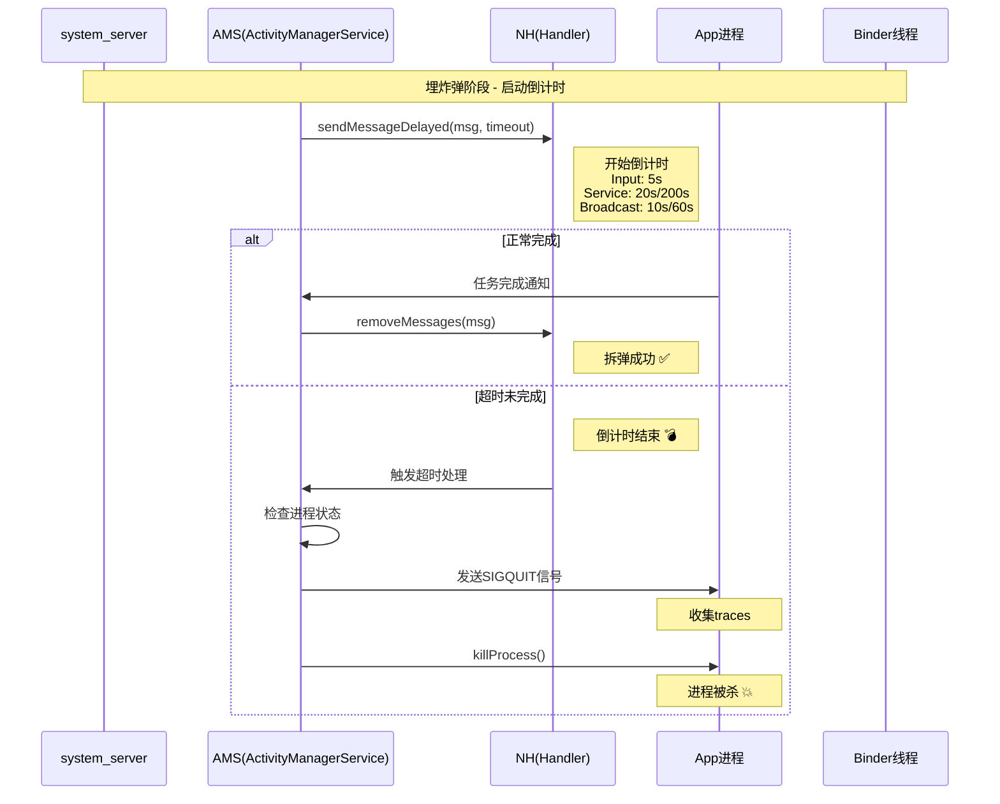
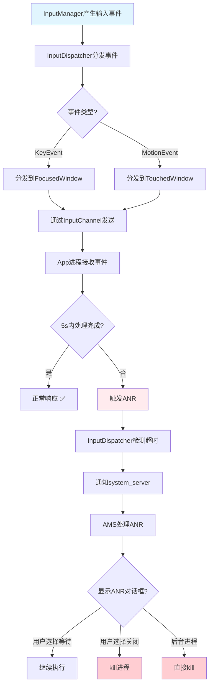
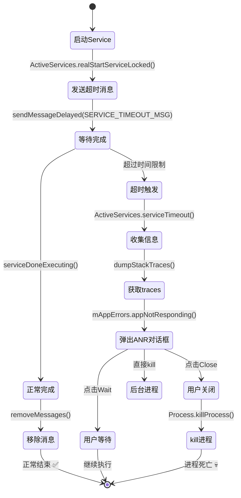
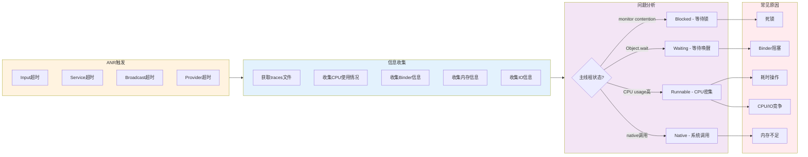
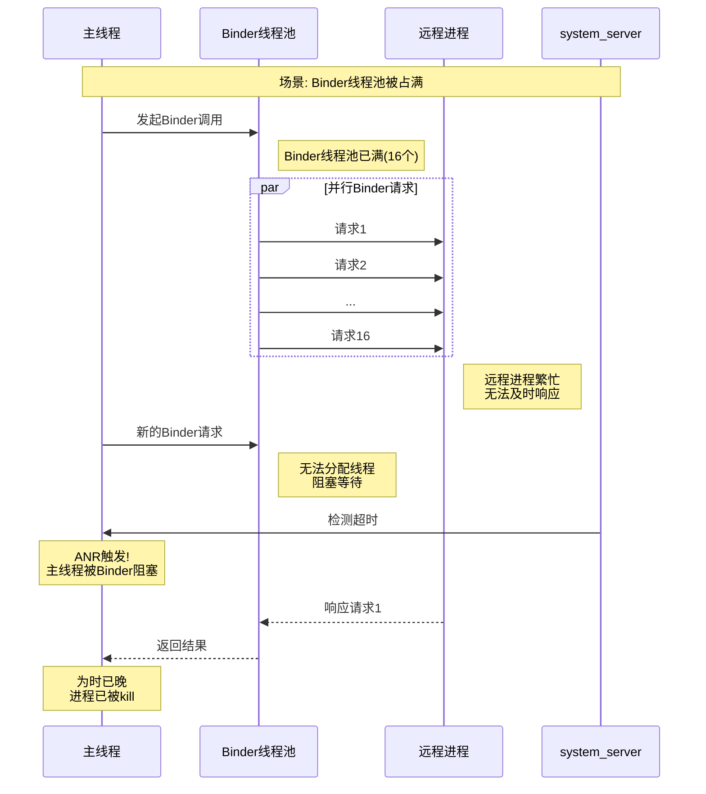

## 简介
ANR是一套监控Android应用响应是否及时的机制，可以把发生ANR比作是引爆炸弹，那么整个流程包含三部分组成：

1. 埋定时炸弹：中控系统(system_server进程)启动倒计时，在规定时间内如果目标(应用进程)没有干完所有的活，则中控系统会定向炸毁(杀进程)目标。
2. 拆炸弹：在规定的时间内干完工地的所有活，并及时向中控系统报告完成，请求解除定时炸弹，则幸免于难。
3. 引爆炸弹：中控系统立即封装现场，抓取快照，搜集目标执行慢的罪证(traces)，便于后续的案件侦破(调试分析)，最后是炸毁目标。

ANR（App Not Responding）基本上99%的App都有，即使是系统，也有system_anr，我相信虽然ANR问题这样的普遍，还是有很多人对ANR问题即熟悉又陌生的，ANR中log信息怎么看？发生的场景有哪些？广播会发生ANR吗？我的App啥事都没有干怎么发生了ANR了等等一些问题，今天通过三个案例总结一下ANR问题分析的一般套路，以做备忘。

### ANR触发机制整体流程

### Input事件ANR详细流程

### Service ANR处理流程

### ANR信息收集与分析流程

### Binder阻塞导致ANR的复杂场景

## 问题分析
一句话总结ANR原因：`没有在规定的时间内，干完要干的事情，就会发生ANR`，就是 `system server` 在指定时间内没有收到应用发送的 binder call。

### 场景分类
1. Input事件超过5s没有被处理完
2. Service处理超时，前台20s，后台200s
3. BroadcastReceiver处理超时，前台10S，后台60s
4. ContentProvider执行超时，比较少见

### 发生原因
1. 主线程有耗时操作，如有复杂的layout布局，IO操作等，导致。
2. 被Binder对端block
3. 被子线程同步锁block
4. Binder被占满导致主线程无法和 `System Server` 通信
5. 得不到系统资源（CPU/RAM/IO）

### 从进程的角度
#### 问题出在当前进程:
1. 主线程本身耗时, 或则主线程的消息队列存在耗时操作;
2. 主线程被本进程的其他子线程所blocked;
#### 问题出在远端进程
1. 一般是binder call或socket等通信方式问题

参考[Android 性能优化必知必会](https://www.androidperformance.com/2018/05/07/Android-performance-optimization-skills-and-tools/#/%E7%B3%BB%E7%BB%9F%E6%A1%86%E6%9E%B6)
参考[应用与系统稳定性第一篇---ANR问题分析的一般套路](https://www.jianshu.com/p/18f16aba79dd)
参考
参考
参考
