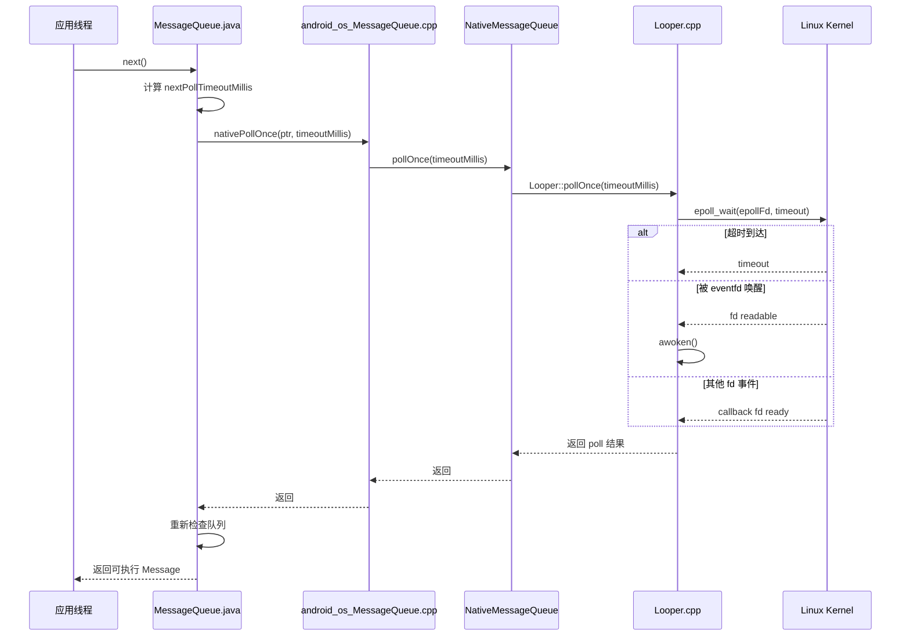
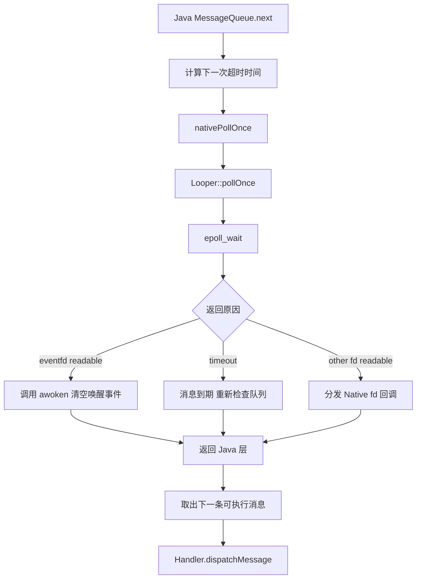

很多人分析 Android 消息机制时，重点都放在 Java 层的 `Handler`、`Looper`、`MessageQueue`。但如果只停在 Java 层，就很难回答两个关键问题：

1. 主线程没有消息时，为什么不会空转耗 CPU？
2. 另一个线程往消息队列插入新消息时，又是怎么把“睡着”的 Looper 叫醒的？

这两个问题的答案，都落在 Native 层的 `epoll` 与唤醒机制上。可以直接说：`Handler` 负责组织消息，真正让线程“阻塞等待/被精准唤醒”的，是 `Looper.cpp` 里的 I/O 多路复用逻辑。

## 1. 先看结论

Android 的消息循环并不是简单地 `while(true)` 死循环，它的核心工作方式是：

1. Java 层 `MessageQueue.next()` 计算下一条消息何时到期。
2. 如果暂时没有可执行消息，就调用 Native 层 `nativePollOnce()`。
3. Native 层进入 `epoll_wait()` 阻塞等待。
4. 当超时时间到达，或者有人写入唤醒 fd，`epoll_wait()` 返回。
5. Looper 线程回到 Java 层，再次检查消息队列并执行消息。

这套机制解决了两个目标：

- 没有消息时休眠，避免 CPU 空转。
- 有新消息时可被立即唤醒，避免响应延迟。

## 2. 整体调用链

先把整体调用链串起来：

这张图里最关键的点有两个：

- `MessageQueue.next()` 不是一直在 Java 层忙等，而是会下沉到 Native 层阻塞。
- Native 层不是只等消息超时，还会监听一个“专门用于唤醒 Looper 的 fd”。

## 3. `nativePollOnce` 为什么会阻塞

`nativePollOnce()` 本质上是在执行一次“带超时的等待”。

Java 层 `MessageQueue.next()` 在扫描消息队列后，会得到一个 `nextPollTimeoutMillis`：

- `0`：说明立刻有消息可执行，不需要阻塞。
- `> 0`：说明下一条消息还没到时间，可以先睡这么久。
- `-1`：说明当前没有可执行消息，也没有明确到期时间，可以无限等待。

然后这个超时时间会一路传到 Native 层，最终给到 `epoll_wait()`。因此 `nativePollOnce()` 会阻塞，不是因为它“卡住了”，而是它主动把线程挂起，等待下面三类事件之一发生：

1. 消息超时到达。
2. 唤醒 fd 可读。
3. Looper 额外监听的其他 fd 出现事件。

从线程调度的角度看，这是一种非常高效的设计：

- 没消息时线程让出 CPU。
- 有事时再被内核唤醒。
- 唤醒后只做必要检查，不做无意义轮询。

## 4. `nativeWake` 是怎么把线程叫醒的

理解阻塞之后，再看唤醒机制就清楚了。

当其他线程往 `MessageQueue` 插入一条“比当前等待时间更早执行”的消息时，原来睡眠中的 Looper 线程就不能继续等到旧的超时时间，否则会错过新消息。因此插入线程会调用 `nativeWake()`。

`nativeWake()` 的核心动作不是发信号，也不是直接操作线程状态，而是向一个专用的唤醒 fd 写入数据：

- 早期 Android 使用 `pipe`。
- 现代 Android 使用 `eventfd`。

由于这个唤醒 fd 早已通过 `epoll_ctl()` 注册进 `epoll` 监听集合，因此一旦有写入，内核就会把它标记为 readable，阻塞在 `epoll_wait()` 的 Looper 线程立刻返回。

可以把它理解成：

- `epoll_wait()` 是在门口等通知。
- `eventfd` 是门铃。
- `nativeWake()` 就是按门铃。

## 5. 从 `pipe` 到 `eventfd`

Android 早期用 `pipe` 做唤醒，后来切换到 `eventfd`。这个变化不只是“实现替换”，而是一次非常典型的 Linux 机制优化。

### 5.1 `pipe` 方案怎么工作

`pipe` 会创建一对 fd：

- 读端：注册到 `epoll`
- 写端：供其他线程写入唤醒字节

唤醒流程是：

1. Looper 线程阻塞在 `epoll_wait()`。
2. 其他线程向 pipe 写端写入一个字节。
3. pipe 读端变为可读。
4. `epoll_wait()` 返回。
5. Looper 把 pipe 中的数据读走，清掉可读状态。

这个方案可以工作，但它本质上是“用字节流模拟事件通知”，并不是最适配的原语。

### 5.2 `eventfd` 为什么更合适

`eventfd` 是 Linux 专门提供的事件通知 fd，内部维护一个 64 位计数器。

它有几个非常适合 Looper 唤醒场景的特点：

1. 语义更直接
   - 写入表示“发生了一次事件”。
   - 读取表示“消费事件并拿到计数值”。

2. 内核对象更轻量
   - 不需要维护 pipe 的双端缓冲语义。
   - 对“单纯通知一下”这种场景更贴切。

3. 聚合能力更好
   - 多次写入会累加到计数器。
   - 即使短时间连续唤醒多次，也不会丢事件语义。

4. 与 `epoll` 配合自然
   - 计数器大于 0 时 fd readable。
   - Looper 读取后恢复为未就绪状态。

所以从现代 Android 的实现看，`eventfd` 比 `pipe` 更省资源，也更符合“唤醒通知器”的职责。

## 6. `eventfd` 的计数器逻辑

`eventfd` 最容易被忽略的一点，是它并不是“写 1 次就必须读 1 次”的简单信号量，而是一个计数器。

### 6.1 写入逻辑

每次调用 `wake()`，通常都会向 `eventfd` 写入一个 64 位整数 `1`。内核会做累加：

- 第一次写入后，计数器变为 `1`
- 又写一次，计数器变为 `2`
- 再写一次，计数器变为 `3`

### 6.2 读取逻辑

Looper 被唤醒后会读取这个 `eventfd`。默认模式下，一次 `read()` 会取出当前整个计数值，并把计数器清零。

也就是说：

- 如果连续发生了 3 次唤醒，Looper 可能只读一次。
- 但这一次能把累计的唤醒事件全部消费掉。

这非常符合 Looper 的真实需求，因为 Looper 并不关心“究竟是第几次唤醒”，它只关心一件事：

- 现在应该立刻从阻塞态返回，重新检查消息队列。

## 7. `epoll` 在这里到底监听什么

很多人会把 Android Looper 误解成“只用来等 Java Message”。其实 Native Looper 的设计更通用，它监听的是一组 fd 事件，而消息队列唤醒只是其中一个特殊 fd。

常见会被 Looper 关注的对象包括：

- 唤醒用的 `eventfd`
- Binder/管道/socket 等其他 Native 事件源
- 某些系统组件注册到 Looper 的回调 fd

可以抽象成下面这张图：

这也解释了为什么 Android 的 Looper 既能服务 Java 消息机制，也能服务 Native 层事件循环。它本质上不是“消息数组遍历器”，而是“线程事件调度器”。

## 8. 关键源码路径分别负责什么

这三个文件是理解整个机制的主线：

### 8.1 `frameworks/base/core/java/android/os/MessageQueue.java`

这里负责 Java 层的消息调度策略，重点是：

- 按 `when` 时间排序管理消息。
- 在 `next()` 里决定是否需要阻塞等待。
- 在插入更早消息时决定是否调用 `nativeWake()`。

也就是说，Java 层负责“要不要睡、睡多久”。

### 8.2 `frameworks/base/core/jni/android_os_MessageQueue.cpp`

这是 Java 到 Native 的桥接层，重点是：

- 持有 `NativeMessageQueue` 指针。
- 把 `nativePollOnce()` / `nativeWake()` 这样的 JNI 调用转给 Native 实现。
- 负责 Java `MessageQueue` 与 Native `Looper` 的绑定关系。

它本身不是核心算法层，但没有它，Java 层到不了 `Looper.cpp`。

### 8.3 `system/core/libutils/Looper.cpp`

这是最核心的地方，重点是：

- 创建 `epoll` 实例。
- 创建并注册唤醒 fd。
- 在 `pollOnce()` / `pollInner()` 中调用 `epoll_wait()`。
- 在 `wake()` 中写入 `eventfd`。
- 在 `awoken()` 中读取并清理唤醒事件。

可以说，真正让线程“睡下去”和“醒过来”的逻辑，几乎都在这个文件里。

## 9. 一个典型场景串起来看

假设主线程当前没有任何可执行消息：

1. `MessageQueue.next()` 发现队列为空，计算得到 `timeout = -1`。
2. Java 层调用 `nativePollOnce(ptr, -1)`。
3. Native Looper 进入 `epoll_wait()` 无限阻塞。
4. 某个工作线程通过 `Handler.sendMessage()` 插入一条新消息。
5. 插入逻辑发现主线程正在睡眠，且需要立即重新检查队列。
6. 于是调用 `nativeWake()`。
7. `nativeWake()` 向 `eventfd` 写入 `1`。
8. `epoll_wait()` 立刻返回。
9. Looper 读取 `eventfd` 清理唤醒状态。
10. 回到 Java 层重新取消息并执行。

这就是 Android 消息机制“能睡、能醒、且唤醒延迟很低”的完整闭环。

## 10. 为什么这套设计很重要

如果没有这套 `epoll + eventfd` 机制，Android 主线程通常只会落入两个差方案：

1. 忙等轮询
   - 不断检查消息队列。
   - CPU 空转明显，功耗差。

2. 粗粒度 sleep
   - 线程 `sleep(x ms)` 后再检查。
   - 新消息到来时可能不能立刻响应。

而现在的实现具备两端优势：

- 空闲时几乎不耗 CPU。
- 有新任务时又能立即唤醒。

这正是事件驱动模型在系统框架中的典型价值。

## 11. 阅读源码时建议重点关注什么

如果你准备继续深入源码，建议重点盯这几个点：

1. `MessageQueue.next()` 如何计算 `nextPollTimeoutMillis`
2. `enqueueMessage()` 在什么条件下触发 `nativeWake()`
3. `Looper.cpp` 中 `wake()` 和 `awoken()` 的配合
4. `pollOnce()` 与 `pollInner()` 如何处理超时、回调与唤醒结果
5. `epoll_ctl()` 在初始化时向 `epoll` 注册了哪些 fd

把这几个点串起来，Android 消息循环的底层脉络就基本清楚了。

## 12. 总结

一句话概括下：

- Java `MessageQueue` 决定“什么时候该醒”。
- Native `Looper` 负责“怎么睡下去、怎么被叫醒”。
- `epoll_wait()` 负责高效阻塞。
- `eventfd` 负责低成本唤醒。

所以，Looper 的“心脏”并不是 `while (true)`，而是 `epoll` 驱动下的事件等待与唤醒机制。

下一篇如果继续往下拆，就应该进入 `MessageQueue.next()`、同步屏障、异步消息与 `IdleHandler` 这些更贴近 Java 调度策略的部分。
