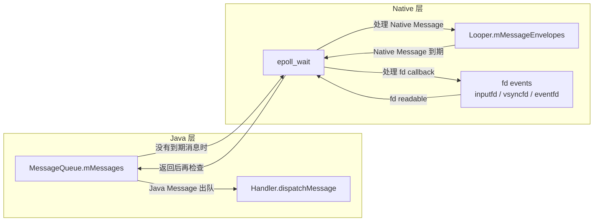
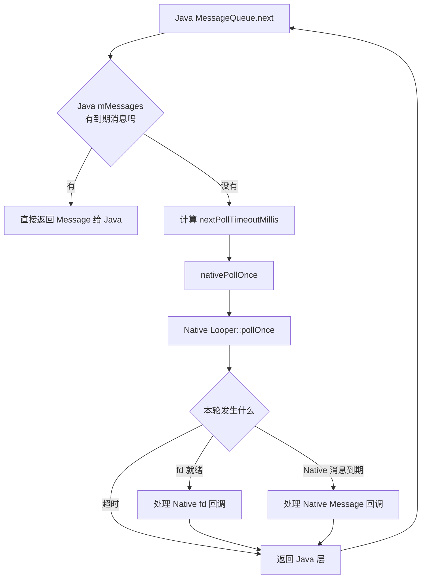
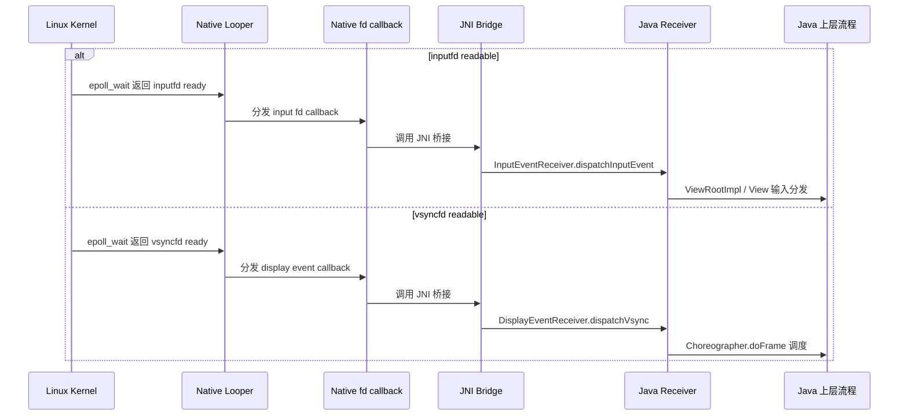
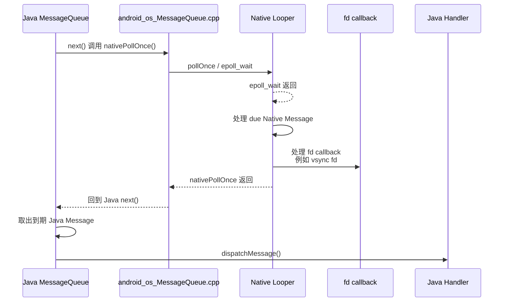

# Android消息机制(二)：Java 与 Native 双层队列如何协同调度

上一篇把 `epoll`、`eventfd`、`nativePollOnce()` 这条“能睡、能醒”的链路讲清了，但还留下一个更容易让人困惑的问题：

- Java 层已经有 `MessageQueue` 了，为什么 Native 层 `Looper` 里也有一套消息结构？
- `epoll_wait()` 返回后，到底先处理谁？
- Java 消息、Native 消息、fd 回调三者之间是什么关系？

如果不把这几个问题串起来，很多人就会误以为 Android 只有一条 Java 消息链，Native 层只是负责“帮忙睡一下”。实际上不是。Android 在线程事件循环上，采用的是 **Java 调度策略 + Native 事件分发** 的双层协作模型。

## 1. 先看结论

先把核心结论放前面：

1. Java 层确实有一套 `MessageQueue`，核心结构是 `mMessages` 单链表。
2. Native 层 `Looper` 里也确实有一套延时消息结构，核心容器是 `mMessageEnvelopes`。
3. 但这两套队列职责不同，并不是“同一批消息存两份”。
4. Java 层负责应用常见的 `Handler/Message/Runnable` 调度。
5. Native 层负责更底层的事件循环，包括：
   - `epoll` 监听的 fd 事件
   - Native 自己投递的延时消息
   - Java 层阻塞等待时依赖的唤醒基础设施
6. 对 Java 主线程来说，真正常走的主线仍然是：
   - 先看 Java `mMessages`
   - 没到时间就下沉到 `nativePollOnce`
   - Native 返回后再回 Java 层重新取消息

所以，“双层 MessageQueue”更准确的理解不是“两套队列抢着消费同一批消息”，而是：

- Java 队列解决 `Handler` 语义。
- Native 队列解决底层事件循环与 Native 延时任务。
- 两者共用同一个线程的 Looper 节拍。

## 2. 两套队列分别装的是什么

### 2.1 Java 层 `MessageQueue`

Java 层 `MessageQueue` 的核心成员是 `mMessages`，本质上是一条按 `when` 时间有序排列的单链表。

它存放的是开发者最熟悉的这些东西：

- `Handler.sendMessage`
- `Handler.post`
- `postDelayed`
- 同步屏障
- 异步消息
- `IdleHandler`

这里解决的是“Java 业务调度语义”：

- 哪条消息先执行
- 是否需要延迟
- 是否被同步屏障拦住
- 队列空闲时要不要跑 `IdleHandler`

### 2.2 Native 层 `Looper`

Native `Looper` 里有两类很重要的数据：

1. `mRequests` / `mResponses`
   - 用来管理 fd 监听请求与就绪响应。
   - 比如 `eventfd`、`socketpair`、Binder 相关 fd、显示事件 fd 等。

2. `mMessageEnvelopes`
   - 用来管理 Native 自己的延时消息。
   - 对应 `sendMessage()`、`sendMessageDelayed()`、`sendMessageAtTime()` 这套 Native API。

也就是说，Native 层并不只是“阻塞器”，它自己也能维护一套到期执行的消息表。

## 3. 三类东西一定要分开：Java Message、Native Message、fd event

很多讨论会把下面三类东西混在一起，结果越分析越乱。其实它们不是一回事。

### 3.1 Java Message

Java Message 指的是 Java `MessageQueue` 里的 `Message` 节点，典型来源包括：

- `Handler.sendMessage`
- `Handler.post`
- `postDelayed`
- `Choreographer` 往 Java 队列投递的帧回调消息

它的特点是：

- 存在于 Java `mMessages`
- 由 `MessageQueue.next()` 决定何时出队
- 最终走到 `Handler.dispatchMessage()`

### 3.2 Native Message

Native Message 指的是 Native `Looper` 里的延时消息，典型来源是：

- `Looper::sendMessage`
- `Looper::sendMessageDelayed`
- `Looper::sendMessageAtTime`

它的特点是：

- 存在于 Native `mMessageEnvelopes`
- 由 `Looper.cpp` 自己判断是否到期
- 最终走 Native 回调，而不是 Java `Handler`

### 3.3 fd event

`inputfd`、`vsyncfd`、`eventfd` 这一类，严格说都不是“消息对象”，而是 **文件描述符就绪事件**。

它的特点是：

- 先由 Native `epoll_wait()` 监听到
- 通过 `Looper.addFd` 对应的 callback 分发
- 后续可能继续停留在 Native，也可能再桥接到 Java

所以最容易记的一句话是：

- `Java Message` 是 Java 队列里的消息
- `Native Message` 是 Native 队列里的消息
- `inputfd/vsyncfd` 不是消息，它们是 Native Looper 监听的事件源

可以先看这张总览图：

## 4. 为什么要有 Native 消息队列

这个问题本质上是在问：既然 Java 已经有 `Handler` 了，Native 为什么不直接都发 Java 消息？

原因主要有三点。

### 4.1 Native 组件并不一定依赖 Java 世界

`Looper.cpp` 是一个通用事件循环，很多 Native 组件根本不想依赖 Java `Handler`。它们只需要：

- 某个时间点回调一次
- 某个 fd 可读时被唤醒
- 在当前线程的事件循环里执行回调

对这类场景来说，直接使用 Native `Looper` 的消息和 fd 回调更自然。

### 4.2 fd 事件和定时任务天然应该在同一套事件循环里

Native Looper 的一个设计目标，就是把“定时任务”和“fd 事件”放进同一条 `poll` 主循环中处理。

这样做的好处是：

- 不需要额外线程
- 不需要再桥接到 Java 层
- 到期时间可以直接参与 `epoll_wait()` 的超时计算

所以 `mMessageEnvelopes` 的存在，并不是重复造轮子，而是为了让 Native 事件循环本身闭环。

### 4.3 Java `MessageQueue` 不是 Native 世界的统一调度中心

Java `MessageQueue` 只能调度 Java `Message`。但系统里还有很多事情发生在：

- JNI 下方
- system/core
- Native UI / graphics / input 辅助链路

这些模块需要的是通用 Looper，而不是 Java `Handler`。

## 5. Java 与 Native 的关系不是“镜像”，而是“嵌套”

很多人会脑补出这样一种模型：

- Java 队列一份
- Native 队列一份
- 两边互相同步

这其实不对。真实情况更接近下面这样：

这里有两个关键点：

1. Java 队列不会把 `Message` 拷贝进 `mMessageEnvelopes`。
2. Native Looper 处理完自己的事件后，Java 层还会再检查一次 `mMessages`。

所以两层关系不是“双写”，而是：

- Java `next()` 把等待动作委托给 Native。
- Native `pollOnce()` 在等待期间顺手处理自己负责的事件。
- 返回后 Java 再决定是不是轮到某条 `Message` 出队。

## 6. `inputfd` 和 `vsyncfd` 算谁处理

这个问题最适合拆成两层来回答：

1. `fd` 的就绪，是谁先感知到的？
2. 事件后续的业务分发，最终落在哪一层？

答案是：

- `inputfd` / `vsyncfd` 的 **就绪事件**，先由 Native Looper 感知和分发。
- 但后续业务不一定停在 Native，很多情况下还会继续桥接到 Java。

### 6.1 `inputfd` 的典型路径

`InputChannel` 本质上是 `socketpair`。当输入事件到来时，主线程监听的那个 input fd 变为 readable：

1. Native `epoll_wait()` 先返回
2. Native `Looper` 识别这个 fd 就绪
3. 回调到输入接收侧的 Native 对象
4. 再通过 JNI 分发给 Java `InputEventReceiver`
5. 然后继续走 `ViewRootImpl`、`View` 那条 Java 输入分发链

所以：

- “输入到了”这件事，先是 Native 感知
- “应用怎么消费输入”，通常会进入 Java

### 6.2 `vsyncfd` 的典型路径

Vsync 也是类似思路，只是后续对接的是帧调度：

1. 显示事件 fd 就绪
2. Native `epoll_wait()` 返回
3. Native 接收器先拿到 vsync 节拍
4. 再桥接到 Java `DisplayEventReceiver`
5. Java `Choreographer` 收到后安排 `doFrame`
6. 后续进入 `Input -> Animation -> Traversal`

所以：

- “这一帧的节拍到了”先是 Native 接住
- “这一帧怎么驱动 UI 刷新”主要在 Java 调度

### 6.3 一张时序图看清楚

### 6.4 为什么这俩不能简单叫“Native 消息”

因为它们和 `mMessageEnvelopes` 里的 Native Message 根本不是同一种东西：

- Native Message：Native Looper 主动排队的延时任务
- inputfd / vsyncfd：外部事件源触发的 fd ready 事件

两者唯一的共同点只是：

- 都会在 Native Looper 这一层被统一调度

但它们的数据形态、触发方式、后续分发路径都不同。

## 7. Java 层 `mMessages` 到底怎么决定“现在该不该醒”

Java `MessageQueue.next()` 是整条链路的策略入口。

它每轮都会先看队头消息：

1. 如果队头消息已经到期，直接出队返回。
2. 如果队头消息还没到时间，算出还要等多久。
3. 如果当前没有可执行消息，就进入阻塞等待。
4. 如果前面有同步屏障，还要继续向后找第一条异步消息。

因此 Java 层真正决定的是：

- 当前线程要不要立刻执行一条 Java 消息
- 如果不执行，要阻塞多久

这个“阻塞多久”的结果，就是后面传给 `nativePollOnce()` 的 `nextPollTimeoutMillis`。

换句话说：

- Java `MessageQueue` 决定调度策略。
- Native `Looper` 负责把这个策略落成一次真正的休眠等待。

## 8. Native 层 `mMessageEnvelopes` 又是怎么参与调度的

Native `Looper` 自己也能被投递消息，这些消息会进入 `mMessageEnvelopes`，同样按执行时间排序。

当 `pollOnce()` / `pollInner()` 开始一轮等待前，Looper 会先看 Native 队头消息是否已经到期：

- 已到期：本轮无需继续阻塞，直接准备执行 Native 消息。
- 未到期：拿它和外部传入的 timeout 一起计算一个更小的等待时间。

这说明 Native Looper 的等待时间，其实受两部分共同约束：

1. Java 层告诉它“最晚等多久”
2. Native 层自己也可能有“更早到期的任务”

最终谁更早，`epoll_wait()` 就按谁的时间睡。

## 9. `pollOnce` 返回后，处理顺序到底是什么

这是最容易讲错的地方。

很多文章会简单写成：

1. 先处理 fd 回调
2. 再处理 Native 消息
3. 最后回 Java 消息

但如果按 AOSP14 的 `Looper.cpp` 看，至少在 `pollInner()` 这一轮内部，更接近下面这个顺序：

1. 处理 `epoll_wait()` 返回的事件，收集就绪 fd
2. 判断 Native 延时消息是否到期
3. 先分发已到期的 Native `mMessageEnvelopes`
4. 再处理本轮收集到的 fd `Response`
5. 最后返回上层

也就是说，**在同一轮 `pollInner()` 内，Native 自己的延时消息处理通常先于 fd 回调分发**。

但这还不是全部。因为 `pollOnce()` 外层还有一层逻辑，它可能先把上一轮遗留的 `Response` 返回掉，然后才进入新的 `pollInner()`。所以严格来说：

- `pollInner()` 内部顺序，和
- `pollOnce()` 对外暴露的整体行为

不是完全一回事。

对于 Java 主线程这条最常见路径，可以抓住一个足够稳定的结论：

- Java `nativePollOnce()` 返回前，Native Looper 可能已经把自己那边该执行的消息和 fd 回调处理掉了。
- Java 层恢复后，才会继续检查并分发 `mMessages`。

所以从线程观察视角看，确实经常会表现为：

- 先跑一部分 Native 事件
- 再回到 Java `Handler` 消息

## 10. 为什么很多人感觉“Native 事件优先级更高”

这是一种现象描述，但不能简单粗暴理解成“Native 永远比 Java 高优先级”。

更准确的原因有三层。

### 8.1 Java 消息要先经过一次 `nativePollOnce`

当 Java 当前没有可立即执行的 `Message` 时，线程会下沉到 Native 阻塞。等它醒来时，Native Looper 往往已经先把自己那边本轮该处理的事情处理了一部分。

所以从观感上就像：

- 线程先服务 Native 世界
- 再回 Java 世界

### 8.2 fd 事件是唤醒线程的直接原因

很多时候线程之所以从 `epoll_wait()` 里出来，不是因为 Java 消息天然“抢到了 CPU”，而是因为：

- 某个 fd 就绪了
- 或某个唤醒事件发生了

因此 Native 事件经常站在“唤醒入口”上，看起来更靠前。

### 8.3 Java 消息仍然有自己的强势路径

如果 Java 队头消息已经到期，`MessageQueue.next()` 其实可以直接返回，不必进入新的阻塞等待。

这时执行路径就是：

- 直接从 `mMessages` 出队
- 进入 `Handler.dispatchMessage`

所以不能说 Native 总是优先；更准确地说是：

- 当线程已经进入 Native poll 阶段时，Native 事件通常先被处理。
- 当 Java 本来就有现成可执行消息时，Java 也可以直接跑。

## 11. 一个完整场景串起来看

假设主线程此刻状态如下：

- Java 队列头部消息还要 20ms 才到期
- Native Looper 里 5ms 后有一个 Native 延时消息
- 同时 Looper 还监听着若干 fd

那么这一轮可能这样执行：

1. Java `next()` 发现 Java 消息还没到点，算出 `timeout = 20ms`
2. 进入 `nativePollOnce(20ms)`
3. Native Looper 检查自己的 `mMessageEnvelopes`，发现 5ms 后有更早任务
4. 实际传给 `epoll_wait()` 的等待时间变成 5ms
5. 5ms 到后，`epoll_wait()` 返回
6. Native Looper 先执行自己到期的 Native 消息
7. 如果还有 fd 回调，也在 Native 这层继续处理
8. 然后返回 Java 层
9. Java 再次检查 `mMessages`，发现那条 20ms 的消息还没到，因此继续下一轮等待

这个例子很直观地说明了两件事：

- Java 的 timeout 并不是线程等待的唯一依据。
- Native 自己也可能把等待节奏“截胡”到更早的时间点。

## 12. 这套设计解决了什么问题

双层协作的价值，主要体现在下面几点。

### 12.1 Java 语义与 Native 机制解耦

Java 层可以专注：

- `Handler`
- 同步屏障
- 异步消息
- `IdleHandler`

Native 层可以专注：

- `epoll`
- fd 回调
- 唤醒
- Native 延时任务

两边各干各的，但共享同一个线程节拍。

### 12.2 一个线程就能同时服务多类事件

同一条主线程既可以处理：

- Java Handler 消息
- Input / Display 等 fd 事件
- Native 内部定时任务

而不需要每类事件各养一个线程。

### 12.3 等待时间可以被更精细地裁剪

线程到底睡多久，不只是 Java 说了算，也不只是 Native 说了算，而是双方共同决定一个“最近到期点”。

这种设计让 Looper 在响应时延和资源利用率之间取得了较好的平衡。

## 13. 各类消息优先级问题

把 Java `MessageQueue`、JNI 桥接层和 Native `Looper` 串起来看，一次典型调度链路大致是这样：

1. Java `MessageQueue.next()`
2. `nativePollOnce()`
3. Native `Looper` 的 `epoll_wait` 返回
4. Native `Looper` 先处理到期的 Native Message
5. Native `Looper` 再处理 fd callback，例如 `vsync fd`
6. `nativePollOnce()` 返回 Java 层
7. Java `MessageQueue.next()` 继续取到期的 Java Message
8. Java `Handler.dispatchMessage()`

## 14. 对应到 AOSP14 的关键源码位置

如果你后续要继续顺着源码读，建议抓下面三个文件：

### 14.1 `frameworks/base/core/java/android/os/MessageQueue.java`

重点看：

- `next()`
- `enqueueMessage()`
- 同步屏障相关逻辑
- `IdleHandler` 执行条件

这个文件回答的是：

- Java 消息如何排队
- 什么时候需要唤醒
- 为什么有时会无限阻塞、有时只阻塞几毫秒

### 14.2 `frameworks/base/core/jni/android_os_MessageQueue.cpp`

重点看：

- `NativeMessageQueue`
- `pollOnce`
- `wake`

这个文件回答的是：

- Java `MessageQueue` 如何绑定到 Native `Looper`
- `nativePollOnce()` / `nativeWake()` 如何桥接到 C++

### 14.3 `system/core/libutils/Looper.cpp`

重点看：

- `pollOnce()`
- `pollInner()`
- `sendMessageAtTime()`
- `wake()`
- `awoken()`

这个文件回答的是：

- fd 事件怎么等
- Native 消息怎么排队
- 本轮到底先做什么、后做什么

## 14. 小结

Android 的消息机制并不是“一个 Java 队列 + 一个 Native 阻塞器”这么简单。

更完整的理解应该是：

- Java `MessageQueue` 负责应用层消息语义。
- Native `Looper` 负责底层事件循环与 Native 延时任务。
- `inputfd`、`vsyncfd` 这类东西不是 Java Message，也不是 Native Message，而是 fd 事件源。
- Java 把等待动作委托给 Native。
- Native 在等待期间顺带处理自己的消息和 fd 事件。
- 返回 Java 后，再继续消费 `mMessages`。

所以这套系统的本质不是“谁替代谁”，而是：

**Java 负责决策消息语义，Native 负责统一承接线程事件循环。**

下一篇再继续往下拆，就很自然会进入另一个问题：既然 Looper 能监听各种 fd，那 Input 事件到底是怎么接进这套循环里的？
