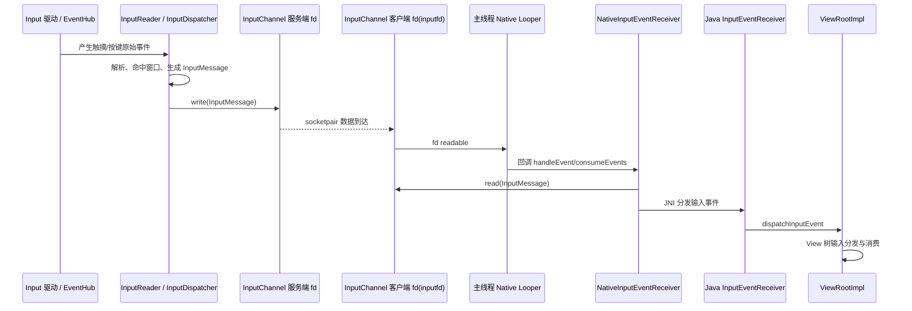
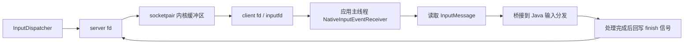
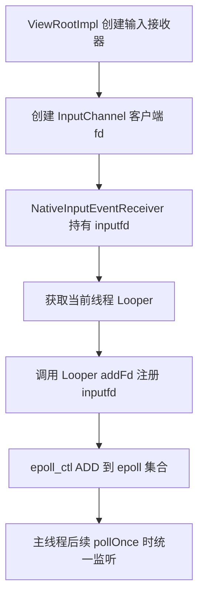
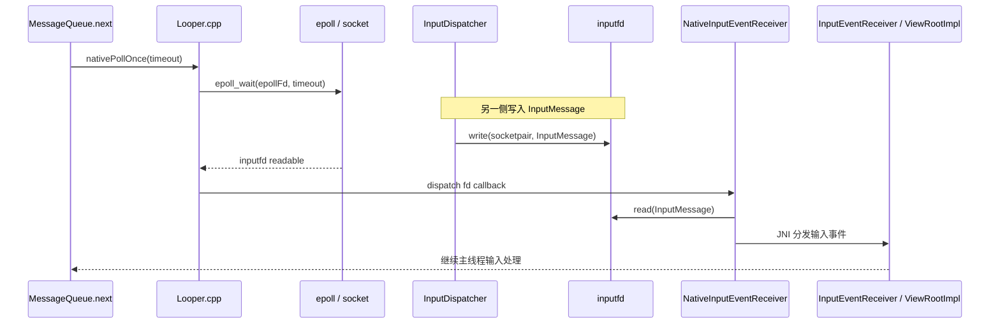
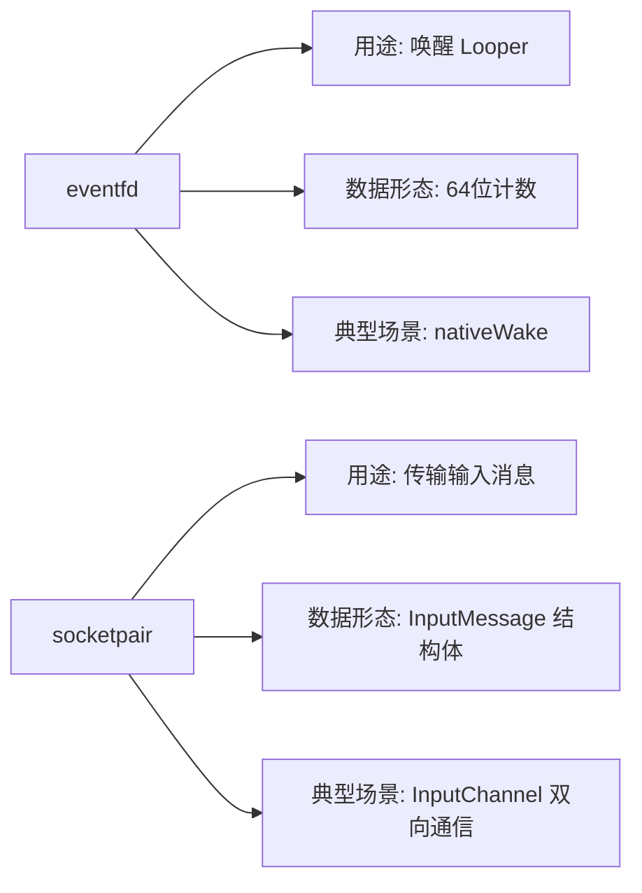
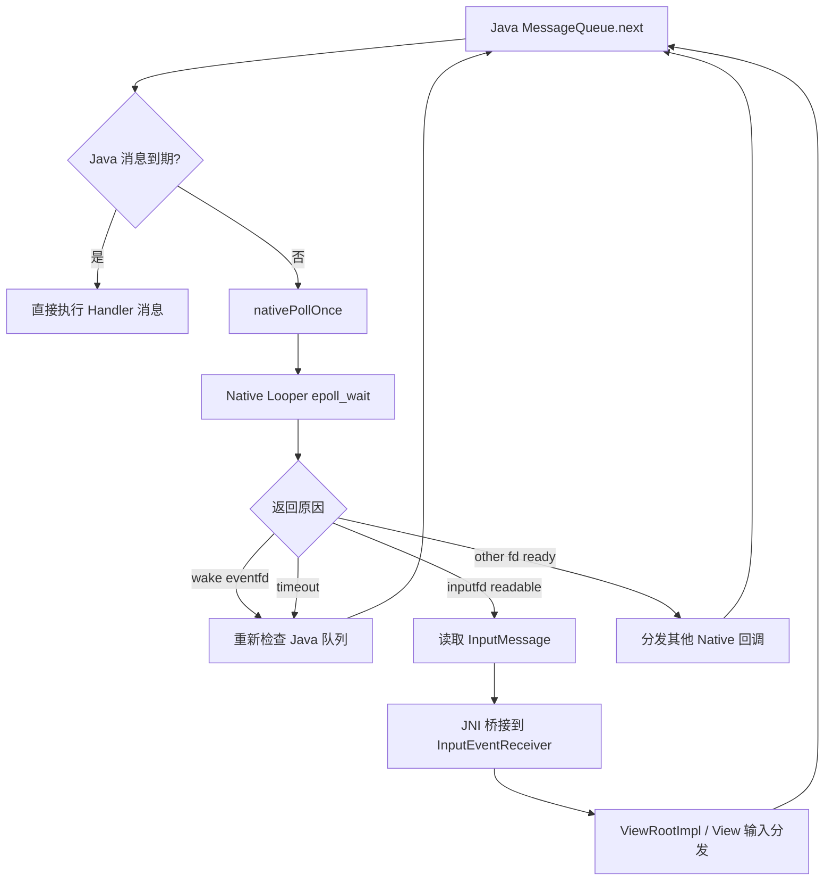

前两篇已经把 `Looper` 的两件基础能力讲清楚了：

1. 它能通过 `epoll_wait()` 把线程安全地睡下去。
2. 它能通过 `eventfd` 在需要时被立即叫醒。

但 Android 主线程上跑的不只有 Java `Message`。`Input`、`Vsync`、Binder 回调、Native 自定义 fd 事件，本质上都在争抢同一个线程事件循环。这里最典型、也最容易被忽略的一条链路，就是 `InputChannel`。

很多人看到触摸事件最终进入 `ViewRootImpl`、`DecorView`、`View`，就会下意识认为这还是一条普通 `Handler` 消息链。实际上不是。对主线程来说，输入事件最早不是以 `Message` 的形式到来的，而是先让一个 **input fd 变为 readable**，然后由 `Looper` 在 `epoll` 层感知到它，再触发后续输入分发。

这就是标题里说的“白嫖”：

- `Input` 自己不需要重新发明一套线程阻塞/唤醒机制。
- 它只要把自己的 fd 挂到 `Looper` 里。
- 剩下的等待、唤醒、回调分发，全部复用现成的 `Looper` 基建。

本文默认基于 `aosp14` 视角说明这条链路。

## 1. 先看结论

先把核心结论放前面：

1. `InputChannel` 的本质不是 Java 消息通道，而是一对 `socketpair` fd。
2. 应用主线程监听的是其中的接收端 fd，通常可以理解为 “inputfd”。
3. 这个 fd 会被注册进 Native `Looper` 的 `epoll` 集合，而不是注册进 Java `MessageQueue.mMessages`。
4. 当 InputDispatcher 把输入数据写进通道后，inputfd 变为 readable。
5. 主线程阻塞中的 `epoll_wait()` 立即返回，`Looper` 分发该 fd 对应的回调。
6. Native 输入接收侧读出 `InputMessage` 后，再通过 JNI/Java 桥接进入 `InputEventReceiver` 与 `ViewRootImpl`。

所以对主线程而言，输入事件的第一触发点不是：

- “消息队列里多了一条 Handler 消息”

而是：

- “Looper 监听到一个 fd 可读事件”

## 2. 整体链路图

先看完整链路，再拆每一层职责：

这张图里最关键的是两点：

- `InputDispatcher` 写的是一个 socket fd，不是往应用主线程投 Java `Message`。
- 主线程之所以能“第一时间”感知输入，是因为它本来就在 `epoll_wait()` 里顺手监听这个 fd。

## 3. `InputChannel` 的本质是什么

`InputChannel` 是输入系统在进程间传递事件的基础通道。它的核心并不是一个复杂框架对象，而是一对 Unix 域 `socketpair`。

可以把它理解成：

- 服务端 fd：通常由 system_server 一侧持有，对应 InputDispatcher 往窗口发事件的出口。
- 客户端 fd：通常由应用进程一侧持有，对应主线程接收输入的入口。

它之所以用 `socketpair`，本质原因是输入系统传的不是“有/无事件”这种单 bit 信号，而是一整包结构化数据，例如：

- 动作类型
- 时间戳
- 坐标
- pointer 信息
- 序列号
- finish/ack 所需字段

这决定了它需要的是 **可双向传输结构化消息的本地 socket 通道**，而不是只适合做通知计数器的 `eventfd`。

可以抽象成下面这样：

这也是 `InputChannel` 和普通 `Handler` 消息的根本区别：

- `Handler` 消息存在于进程内 Java 内存队列。
- `InputChannel` 消息存在于 socket 通道和内核缓冲区。

## 4. Input 为什么不直接发 Handler 消息

这个问题如果只从应用层看，很容易得出错误答案。真正原因至少有四层。

### 4.1 输入事件最初发生在系统进程，不在应用进程内

触摸事件先经过底层驱动、`EventHub`、`InputReader`、`InputDispatcher`，然后才被路由到目标窗口。输入源头根本不在应用主线程所在进程内，因此它首先需要的是：

- 进程间通信
- 可携带结构体数据
- 可关联 backpressure 与 finish/ack 语义

单纯塞一条 Java `Message` 并不能解决这些问题。

### 4.2 主线程已经有一套成熟的 fd 事件循环

主线程底层早就不是“只处理 Java Message”的模型，而是：

- Java `MessageQueue` 负责调度策略
- Native `Looper` 负责 `epoll` 等待和 fd 分发

既然 `Looper` 已经能监听 fd，那么输入系统最合理的做法就是：

- 直接把 `InputChannel` 客户端 fd 挂进去

这比“系统进程 -> JNI -> Java 消息投递 -> 再回调输入处理”更直，也更低成本。

### 4.3 输入链路需要双向确认

应用消费一个输入事件后，通常还要通过 finish 信号告诉 dispatcher：

- 这次事件已经处理完
- 是否被消费
- 后续是否可以继续投递下一个事件

这类“请求-应答”语义更适合走双向 socket，而不是单向消息投递。

### 4.4 输入系统需要与 Looper 的阻塞状态天然耦合

如果主线程当前没有 Java 消息，它通常会睡在 `epoll_wait()`。输入系统只要让 inputfd 变为 readable，就能把线程从阻塞态直接唤醒。这种设计天然满足两件事：

1. 没输入时主线程不会空转。
2. 一有输入，主线程会从内核等待点立即返回。

## 5. inputfd 是怎么注册进 Looper 的

这一步是理解“白嫖 Looper”的核心。

应用窗口在创建输入接收器时，会建立 `InputChannel`，随后在 Native 输入接收端把客户端 fd 注册到当前线程的 `Looper`。概念上等价于：

1. 拿到主线程对应的 `Looper`
2. 调用 `addFd(inputfd, ...)`
3. 指定当 `EVENT_INPUT` 到来时的回调对象

此后主线程每轮 `nativePollOnce()` 最终都会落到：

- `Looper::pollOnce()`
- `Looper::pollInner()`
- `epoll_wait()`

而 inputfd 已经在这个 `epoll` 监听集合里了。

可以把这一步画成下面这样：

这里非常关键的一点是：

- `addFd()` 注册的是 **文件描述符事件**
- 不是 Java `MessageQueue.enqueueMessage()`

也就是说，`Input` 和 `Handler` 在主线程上虽然最终都汇入同一个“事件循环节拍”，但它们进入循环的入口完全不同。

## 6. 输入来了以后，主线程第一时间做了什么

当 `InputDispatcher` 往服务端 fd 写入一包 `InputMessage` 后，客户端 inputfd 会在内核里变成 readable。此时如果应用主线程正阻塞在 `epoll_wait()`，内核就会立即让它返回。

后续动作可以分成三层：

### 6.1 `epoll` 层：发现 inputfd 就绪

Native `Looper` 这一轮 `epoll_wait()` 返回，拿到“哪个 fd ready 了”的结果。若命中的是 inputfd，对应 request 会被塞进响应列表，等待回调分发。

### 6.2 Native 输入接收层：读出 `InputMessage`

`NativeInputEventReceiver` 的 fd 回调执行后，会从 inputfd 中把数据包读出来，并按协议解析成输入消息结构。

### 6.3 Java 分发层：桥接进 `ViewRootImpl`

Native 层把数据桥接到 Java `InputEventReceiver` 后，主线程才开始进入大家熟悉的应用输入分发路径，例如：

- `ViewRootImpl`
- `DecorView`
- `ViewGroup.dispatchTouchEvent`
- `View.onTouchEvent`

这意味着“屏幕刚被触摸时主线程最早感知到的那个瞬间”，发生在：

- `epoll_wait()` 因 inputfd readable 而返回

而不是发生在：

- 某个 `Handler` 收到普通消息

## 7. 关键时序图：触摸事件如何驱动主线程返回

这张图可以直接回答一个常见疑问：

- 为什么主线程即使此刻没有任何 Java Message，也能立刻响应触摸？

答案是：

- 因为它并不是只在等 Java Message，而是在等 `epoll` 上的所有关键事件源，其中就包括 inputfd。

## 8. `socketpair` 和 `eventfd` 分工为什么不同

很多人学完上一篇后会继续问：既然 `Looper` 唤醒是 `eventfd`，那输入系统为什么不也用 `eventfd`？

答案并不复杂，因为这两者职责完全不同。

### 8.1 `eventfd` 负责“叫醒”

`eventfd` 适合表达的语义是：

- 有事了
- 快醒一下
- 不需要携带复杂载荷

它是一个计数器型通知器，最适合做：

- Looper 的 wake fd
- 跨线程唤醒信号

### 8.2 `socketpair` 负责“传数据”

`socketpair` 适合表达的语义是：

- 不只是通知有事
- 还要把结构化消息包一起带过去
- 还要支持另一侧回写完成状态

输入系统需要的正是这种能力，所以它选的是 `socketpair`。

### 8.3 一张图看清职责边界

一句话概括就是：

- `eventfd` 是门铃。
- `socketpair` 是快递通道。

门铃只能告诉你“有人来了”，但输入系统真正要送进来的，是一整包事件数据。

## 9. UI 线程为什么能做到“第一时间”响应触摸

这里的“第一时间”不是说主线程能绕开调度器，而是说它不需要额外等待一层转发机制。

主线程对输入事件的响应快，主要依赖下面三点：

1. 主线程本来就在 `epoll_wait()` 里睡眠
2. inputfd 已经预先注册进 `Looper`
3. InputDispatcher 一写入，内核立刻把 fd readable 事件反馈给 `epoll`

于是线程的唤醒路径非常短：

- 内核事件就绪
- `epoll_wait()` 返回
- Native callback 执行
- JNI 桥接
- Java 输入分发

如果把输入改造成“先到某个中转线程，再投递一条 Handler 消息给主线程”，就会平白多出一次线程切换或一次额外排队，这显然不是 Input 系统想要的设计。

## 10. 关键源码路径分别负责什么

如果你准备沿着 `aosp14` 自己跟代码，主线可以抓下面几处。

### 10.1 `frameworks/base/core/java/android/view/InputEventReceiver.java`

这里是 Java 输入接收器的入口，负责：

- 持有 Native 接收端桥接对象
- 接收 Native 分发上来的输入事件
- 把事件继续交给上层窗口/视图体系

### 10.2 `frameworks/base/core/jni/android_view_InputEventReceiver.cpp`

这里是 Java 与 Native 输入接收层的桥梁，负责：

- 创建 `NativeInputEventReceiver`
- 把 `InputChannel` 客户端 fd 注册进 `Looper`
- 在 fd 就绪时读取 `InputMessage`
- 再桥接回 Java `InputEventReceiver`

### 10.3 `frameworks/native/libs/input/InputTransport.cpp`

这里是 `InputChannel`、`InputPublisher`、`InputConsumer` 的核心实现，负责：

- 建立 channel
- 定义输入传输协议
- 读写 `InputMessage`
- 处理 finish/ack 等回传动作

### 10.4 `system/core/libutils/Looper.cpp`

这里是 Native `Looper` 的核心，负责：

- `addFd()` 注册 fd
- `pollOnce()` / `pollInner()` 等待事件
- `epoll_wait()` 返回后的 fd 分发
- `wake()` / `awoken()` 管理唤醒 fd

把这四处串起来，整条链路就比较完整了。

## 11. 这一篇和前两篇怎么连起来

如果把三篇文章放在一起看，逻辑其实很顺：

1. 第一篇解决的是：`Looper` 为什么能睡、又为什么能被唤醒。
2. 第二篇解决的是：Java `MessageQueue` 和 Native `Looper` 是怎么协同工作的。
3. 这一篇解决的是：`Input` 为什么不走普通 `Handler` 消息，而是把自己伪装成一个 fd 事件源接进 `Looper`。

可以用最后这张图把三篇串起来：

## 12. 总结

`Input` 系统并不是在主线程里“额外插了一套消息机制”，而是非常克制地复用了 `Looper` 现成的 fd 事件循环能力。

所以最值得记住的不是某个类名，而是这句抽象：

- Java `Handler` 靠的是内存消息队列。
- Input 事件靠的是 `socketpair + epoll + fd callback`。
- 它们最终共享同一个线程 Looper，只是进入 Looper 的入口不同。

理解了这一点，再回头看 `InputChannel`、`InputEventReceiver`、`ViewRootImpl`，整条输入链就不会再被误解成“只是又发了一条 Handler 消息”。
