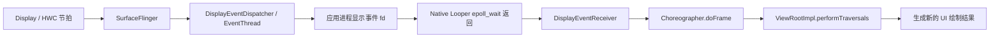
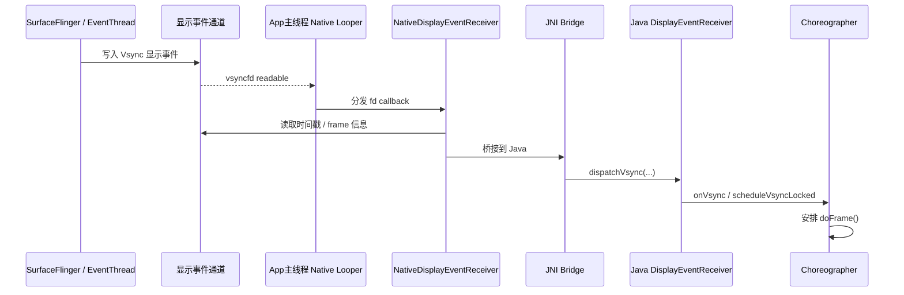
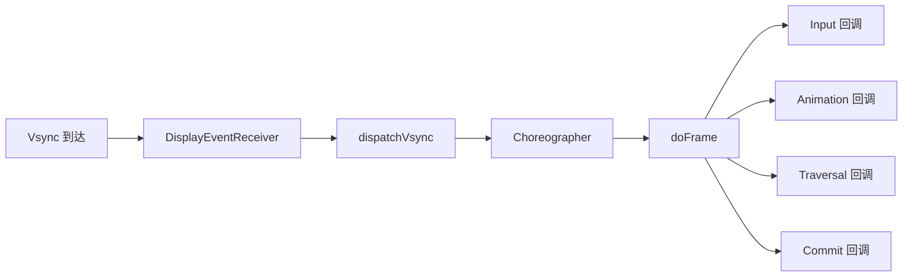
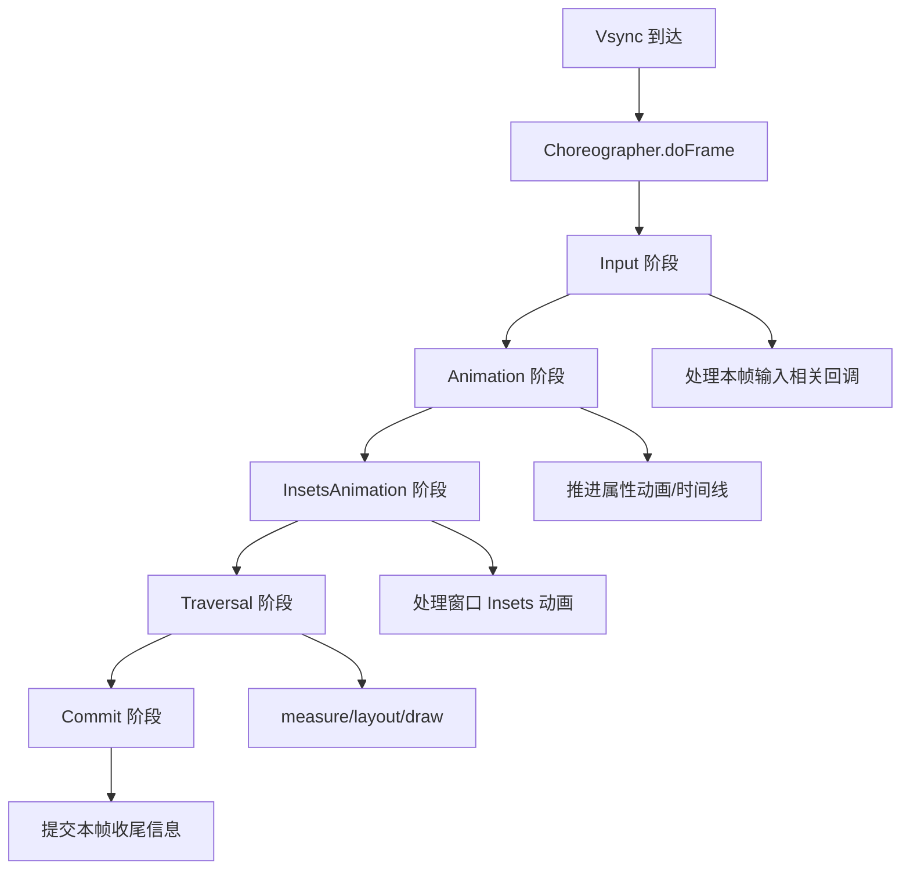
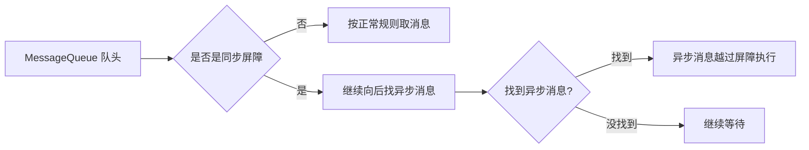
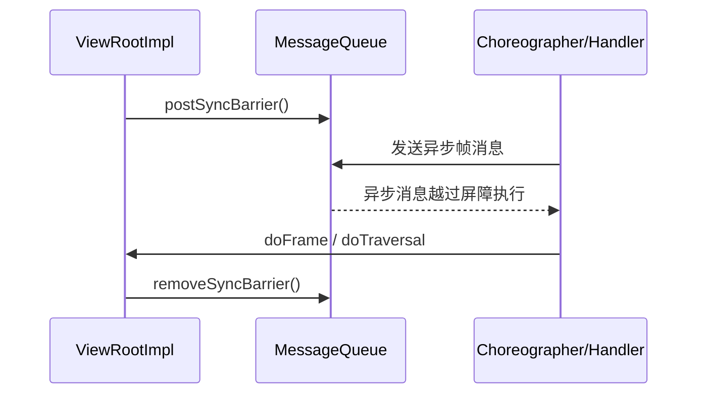
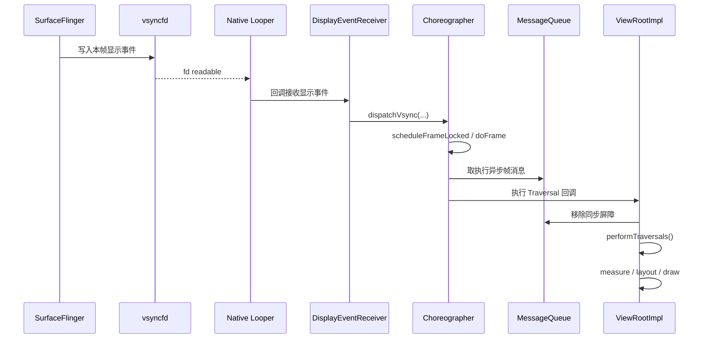

# Android消息机制(四)：Vsync 信号与 UI 刷新 (vsyncfd)

前面几篇已经把两件事拆开说明了：

1. 主线程真正睡眠/唤醒的位置，在 Native `Looper + epoll`。
2. `Input`、自定义 fd 事件，并不是通过普通 `Handler` 消息进入主线程。

`Vsync` 也是同一套思路。很多人会把 UI 刷新理解成“主线程每隔 16.6ms 自己发一条消息”，但在 `aosp14` 视角下，这个理解并不准确。应用并不是主动轮询时间片，而是被显示系统的节拍推着走：**Vsync 到来，fd 就绪，Native Looper 醒来，Java `Choreographer` 再接管这一帧的调度。**

所以这一篇要回答三个问题：

1. `Vsync` 为什么不是普通 `Handler` 消息？
2. `DisplayEventReceiver` 和 `Choreographer` 分别做什么？
3. 同步屏障为什么能让绘制相关消息“插队”？

## 1. 先看结论

先把最重要的结论放前面：

1. UI 刷新节拍并不是主线程自己定时轮询出来的，而是由显示系统发给应用。
2. 应用主线程底层监听的是一个显示事件 fd，本文为了便于理解，统一称为 `vsyncfd`。
3. 这个 fd 被注册进 Native `Looper`，因此 Vsync 到达时本质上是一次 fd readable 事件。
4. Native 层收到显示事件后，会桥接到 Java `DisplayEventReceiver`。
5. Java `Choreographer` 再基于这次 Vsync 执行 `doFrame()`，按顺序调度 Input、Animation、Traversal、Commit 等阶段。
6. 为了保证绘制相关任务不要被普通同步消息堵住，`ViewRootImpl` 会配合同步屏障和异步消息来确保这一帧及时执行。

所以站在主线程角度看，真正的第一现场不是：

- “消息队列里多了一条刷新 UI 的普通消息”

而是：

- “显示事件 fd 就绪了，`epoll_wait()` 返回了”

## 2. 为什么 UI 刷新必须由 Vsync 驱动

如果应用自己按定时器刷新，会有两个直接问题：

1. 它不知道屏幕真正的显示节拍，只能“猜”一个周期。
2. 即使猜中了大概周期，也可能和屏幕扫描时机错开，导致掉帧、抖动、撕裂感更明显。

`Vsync` 的价值就在这里：

- 它代表“显示系统准备开始下一帧”的节拍信号。
- 应用收到这个信号后，再去执行这一帧的输入处理、动画推进、布局绘制。
- 这样应用侧产出的 frame，更容易和 SurfaceFlinger / 显示管线对齐。

可以先把整体关系理解成下面这张图：

这里最关键的一点是：**应用不是自己决定“现在该不该画”，而是等显示系统通知“这一帧可以开始了”。**

## 3. `vsyncfd` 到底是什么

严格说，`aosp14` 里并没有一个源码变量名就叫 `vsyncfd`。这里的 `vsyncfd` 是为了帮助理解，指代“应用主线程监听的那个显示事件接收 fd”。

它的职责和上一篇的 `inputfd` 很像：

- `inputfd`：有输入数据到了，fd 变可读。
- `vsyncfd`：有显示事件到了，fd 变可读。

两者的共同点是：

- 都不是 Java `MessageQueue.mMessages` 里的普通消息。
- 都先经过 Native `Looper` 的 `epoll` 监听。
- 都是在 fd ready 之后，再桥接给 Java 上层处理。

差别在于后续语义不同：

- `inputfd` 对应的是输入分发。
- `vsyncfd` 对应的是帧调度。

## 4. 从 SurfaceFlinger 到 App 的 Vsync 传递路径

这一段如果只用文字说很容易绕，直接看时序图更清楚：

这条链路里有几个职责边界要分清：

### 4.1 SurfaceFlinger 负责“发节拍”

它是显示系统里的核心调度者。对应用来说，最重要的不是它内部怎么生成硬件节拍，而是：

- 它会把当前显示节拍转成应用可消费的显示事件。
- 这个事件最终通过通道送到应用进程。

### 4.2 Native `DisplayEventReceiver` 负责“接节拍”

它的定位类似上一篇里的 Native 输入接收侧：

- 先把显示事件 fd 注册进 Native `Looper`
- 等 fd readable
- 读出 Vsync 事件内容
- 再通过 JNI 往上抛给 Java

所以 Native 层解决的是“怎么接到 Vsync”。

### 4.3 Java `Choreographer` 负责“消费节拍”

`Choreographer` 不负责生成 Vsync，也不负责底层 fd 监听。它真正负责的是：

- 收到这次 Vsync 后，确定这一帧是否要执行
- 按固定顺序调度各类 frame callback
- 驱动 `ViewRootImpl` 进入 `performTraversals()`

所以 Java 层解决的是“收到 Vsync 后这一帧怎么跑”。

## 5. 为什么 Vsync 是“被动接收”，不是“主动轮询”

这是很多人第一次看这条链路时最容易问的问题。

如果用主动轮询，应用线程就得反复检查：

- 到没到下一帧时间？
- 现在该不该画？
- 屏幕节拍是不是已经变化了？

这样的问题有三个：

1. 空转浪费 CPU。
2. 定时精度和实际显示节拍未必一致。
3. 多个系统组件各自轮询，整体调度会变得更散、更难对齐。

而走 `epoll + fd` 的被动接收方式，主线程可以做到：

- 平时彻底睡下去
- 真正有 Vsync 事件时再被唤醒
- 输入、Vsync、Native 自定义 fd 统一复用一个事件循环

这也是 Android 主线程模型很重要的一点：**不是每类事件都重新发明一套等待机制，而是都尽量挂到同一个 `Looper` 基建上。**

## 6. `DisplayEventReceiver` 和 `Choreographer` 是什么关系

一句话概括：

- `DisplayEventReceiver` 是“Vsync 的接收器”。
- `Choreographer` 是“这一帧的调度器”。

两者的分工可以抽象成：

如果只记一个判断标准，可以这么记：

- 和“怎么监听显示事件 fd”相关，优先看 `DisplayEventReceiver`。
- 和“这一帧内部先做什么后做什么”相关，优先看 `Choreographer`。

## 7. `doFrame()` 到底做了什么

`doFrame()` 可以理解成“消费这一拍 Vsync，并把这一帧该做的事按顺序执行掉”。

在 `aosp14` 视角下，可以先抓住它的主干阶段：

1. `CALLBACK_INPUT`
2. `CALLBACK_ANIMATION`
3. `CALLBACK_INSETS_ANIMATION`
4. `CALLBACK_TRAVERSAL`
5. `CALLBACK_COMMIT`

关键不是把所有常量背下来，而是理解为什么要分阶段：不同类别的工作必须在一帧内按顺序完成，避免相互打架。

其中最值得关注的是 `Traversal`：

- `ViewRootImpl` 会在这里进入 `performTraversals()`
- 进一步触发 `measure` / `layout` / `draw`
- 最终把这一帧需要更新的 UI 内容准备出来

所以可以把前几个阶段理解为“为绘制做准备”，把 `Traversal` 理解为“真正进入 View 树刷新”。

## 8. 为什么还需要同步屏障

到这里还差最后一块拼图。

既然已经有 Vsync 了，为什么还需要同步屏障？原因是：**主线程的 Java 消息队列里，可能早就排着一堆普通同步消息。** 如果不做优先级控制，那么这一帧的绘制任务完全可能被前面的普通消息堵住。

举个最简单的场景：

1. 队列头部堆了很多普通同步消息。
2. 这时一拍新的 Vsync 到来。
3. `Choreographer` 想尽快执行本帧回调。
4. 如果还是老老实实排到队尾，那这一帧很可能直接错过。

所以 Android 引入了同步屏障：

- 屏障本身不是给你执行的消息。
- 它只是插在消息队列里，拦住后面的同步消息继续出队。
- 但异步消息可以越过它继续执行。

而 `Choreographer`/`ViewRootImpl` 正是利用这一点，让和帧刷新强相关的异步消息优先跑起来。

## 9. 同步屏障是怎么工作的

可以把同步屏障理解成“临时交通管制”：

这意味着在屏障存在期间：

- 普通同步消息会被挡住。
- 标记为异步的消息仍然可以被取出执行。

因此同步屏障并不是“提高所有消息优先级”，而是更精确地做到：

- 暂时压住不紧急的同步工作
- 先把当前帧最关键的异步调度跑完

## 10. `postSyncBarrier()`、异步消息、`removeSyncBarrier()` 如何配合

这三者是一整套机制，单看任何一个都容易误解。

### 10.1 `postSyncBarrier()`

它会在 `MessageQueue` 里插入一个屏障节点。这个节点没有可执行的 `target`，作用只是告诉队列：

- 从这里开始，后面的同步消息先别过

### 10.2 异步消息

异步消息的意义不是“更快一点”，而是“在屏障期间依然允许出队”。

`Choreographer` 依赖的内部 `Handler` 会把相关帧调度消息标记成异步，因此当屏障立起来后：

- 普通同步消息被卡住
- 帧相关异步消息还能继续执行

### 10.3 `removeSyncBarrier()`

一帧关键工作安排完成后，屏障不能一直留着，否则整个同步消息世界都会被饿死。因此在合适时机会把屏障移除，让消息队列恢复正常调度。

这套关系可以压缩成一张图：

所以同步屏障真正保证的不是“这一帧一定不卡”，而是：

- 在主线程已经很忙的时候
- 给绘制相关任务争取一个合理的执行优先级

## 11. 一帧从 Vsync 到 View 刷新的完整链路

把前面的内容串起来，应用侧一帧大致就是这样：

只要把这条线记住，很多零碎问题都会自然顺下来：

- 为什么 Vsync 不是普通 `Handler` 消息？
- 为什么主线程既能处理 Java 消息，又能接 fd 事件？
- 为什么绘制阶段需要同步屏障和异步消息配合？

## 12. 这一篇要记住什么

最后收敛成 5 句话：

1. Vsync 本质上是显示系统推给应用的帧节拍，不是应用自己定时轮询出来的。
2. 应用主线程监听的是显示事件 fd，因此 Vsync 先在 Native `Looper` 的 `epoll` 层被感知。
3. `DisplayEventReceiver` 负责接收和桥接 Vsync，`Choreographer` 负责消费这次 Vsync 并调度整帧工作。
4. `doFrame()` 会把一帧拆成多个阶段，`Traversal` 才是真正进入 `ViewRootImpl` 刷新 View 树的关键节点。
5. 同步屏障配合异步消息的意义，是在主线程繁忙时让这一帧的关键调度不要轻易被普通同步消息堵死。

下一步如果继续往下挖，最自然的方向就是：

- `ViewRootImpl.scheduleTraversals()` 为什么要先插同步屏障再申请 Vsync
- `performTraversals()` 里 `measure/layout/draw` 是怎么一步步串起来的
- 最终绘制结果又是怎么继续交给 RenderThread / Surface 去提交的
