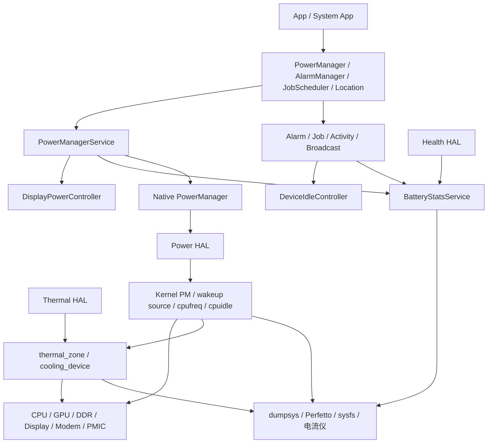
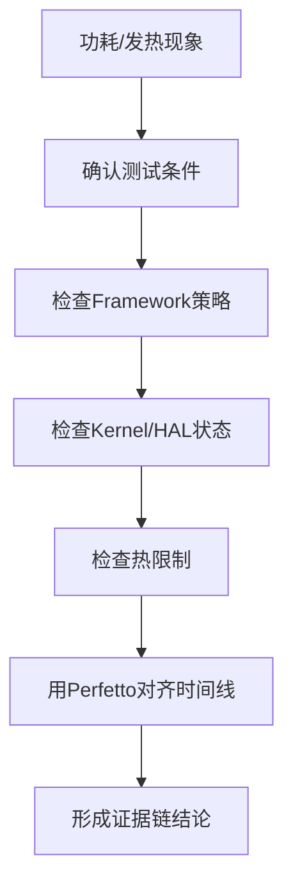
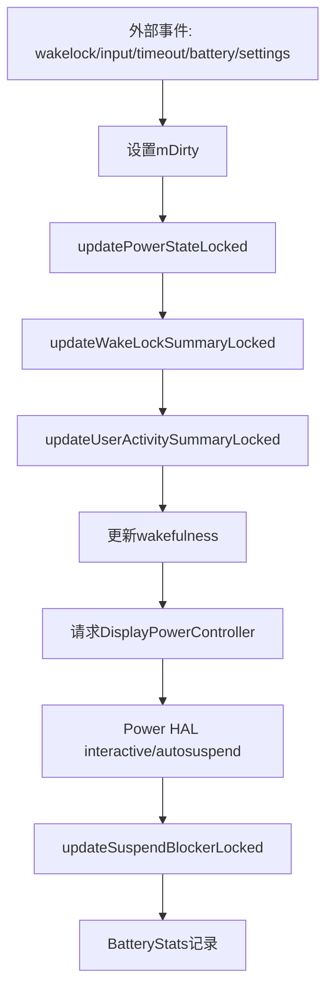
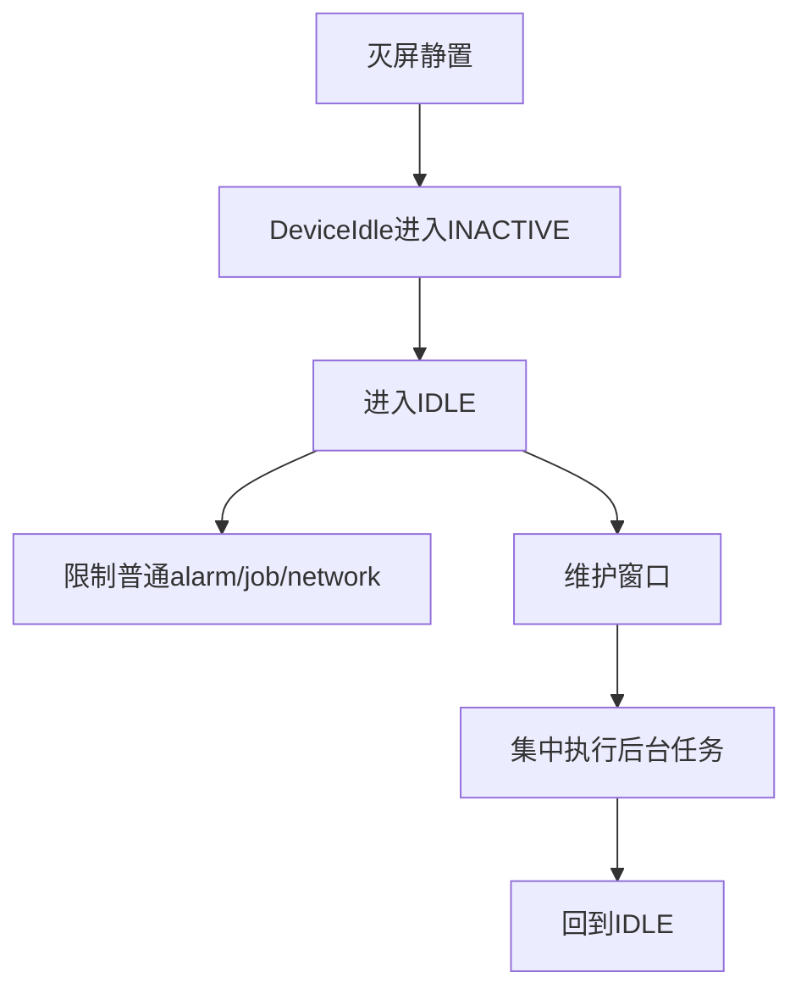
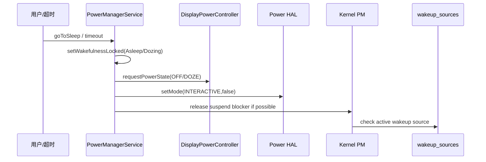
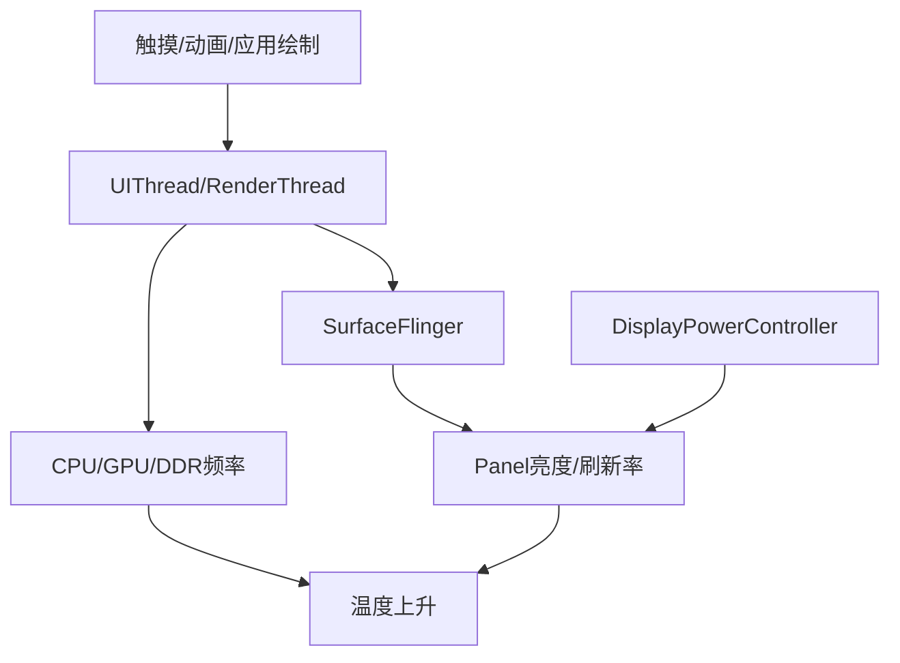
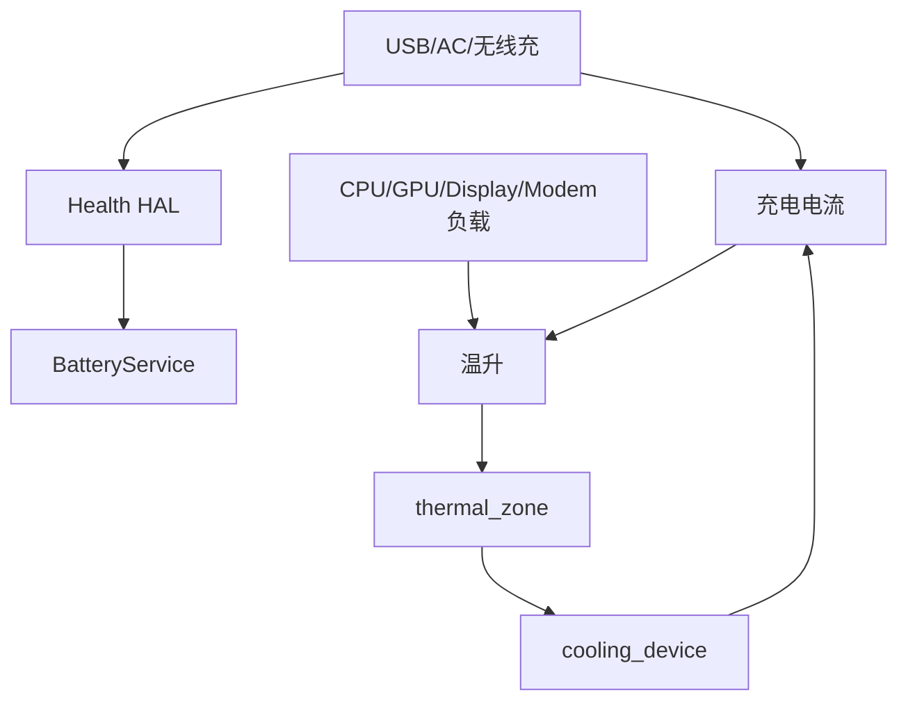

## 重新组织这组文章的原因

功耗不是一个服务、一个命令、一个 sysfs 节点能解释清楚的东西。真正的功耗问题通常长这样：

```text
现象：
    灭屏一夜掉电高、亮屏静置电流高、边充边玩发热、游戏十分钟后掉帧。

表象：
    dumpsys power 看起来没锁，或者 BatteryStats 里 system_server 靠前，
    或者 thermalservice 没有温度，或者 CPU 频率突然掉下来。

真正根因：
    可能是 App 周期唤醒、Framework wakelock、Kernel wakeup source、
    Power HAL boost、thermal cooling、modem 弱网、充电限流、显示持续刷新。
```

所以这组文章不再按“小模块百科”拆成二十多篇，而是按工程路径收束成 00-12。`00` 是总览，负责建立地图；后面每篇围绕一个真实排查主线展开。

```text
00 Android功耗与热管理学习总览
01 功耗-发热-性能三角关系
02 功耗调试环境与数据采集方法
03 PowerManagerService与唤醒锁机制
04 系统休眠链路与Kernel wakeup source
05 Doze、Alarm、JobScheduler与后台任务功耗
06 亮屏功耗：Display、亮度、刷新率与合成
07 CPU调频、调度、cpuidle与低功耗状态
08 电池统计与耗电归因：BatteryStats、PowerProfile、PowerStats
09 充电、Health HAL与充电发热分析
10 Thermal框架、thermal zone与限频限流机制
11 QCOM平台功耗实战：以Mi MIX 2 msm8998为例
12 真实功耗问题案例集与项目复盘
```

## 一张总图

Android 功耗分析要同时看四条链：

- **策略链**：Framework 决定屏幕、wakelock、Doze、后台任务是否允许。
- **执行链**：HAL/vendor/Kernel 把策略落到频率、电源域、外设和 suspend。
- **统计链**：BatteryStats/PowerStats 记录谁使用了资源。
- **热链**：thermal zone/cooling device/vendor thermal engine 约束功耗上限。



这张图有一个关键点：**Framework 说“我允许睡”不等于硬件真的睡了；BatteryStats 说“某 UID 高”也不等于硬件真实能耗一定由它产生；thermalservice 没温度也不等于没有热限制。**

## 功耗问题的四层判断法

遇到任何功耗问题，我建议先按四层问问题。

| 层级 | 关键问题 | 证据 |
|------|----------|------|
| 测试条件 | 这个场景是否真实？是否插 USB？是否满电？是否亮屏？ | `dumpsys battery`、`dumpsys power` |
| Framework | PMS/Doze/Alarm/Job 是否让系统保持活跃？ | `dumpsys power`、`dumpsys deviceidle`、`dumpsys alarm` |
| Kernel/HAL | suspend、wakeup source、cpufreq、cpuidle 是否正常？ | `wakeup_sources`、`cpufreq`、`cpuidle`、Perfetto |
| 热和硬件 | 是否因温度触发限频、限流、降亮度？ | `thermalservice`、`thermal_zone`、`cooling_device` |



## 核心源码地图

默认基于 AOSP14/LOS21：

```text
/home/suhui/workspace/aosp/los21/frameworks
```

### PowerManagerService

PMS 是电源策略的中心。阅读顺序建议不要从类头开始啃，而是直接看状态收敛主线。

| 入口 | 作用 |
|------|------|
| [PowerManagerService.java:170](vscode://file//home/suhui/workspace/aosp/los21/frameworks/base/services/core/java/com/android/server/power/PowerManagerService.java:170:1) | PMS 类定义 |
| [acquireWakeLockInternal:1709](vscode://file//home/suhui/workspace/aosp/los21/frameworks/base/services/core/java/com/android/server/power/PowerManagerService.java:1709:1) | 应用/系统申请 wakelock |
| [userActivityNoUpdateLocked:2177](vscode://file//home/suhui/workspace/aosp/los21/frameworks/base/services/core/java/com/android/server/power/PowerManagerService.java:2177:1) | 用户活动刷新亮屏超时 |
| [setWakefulnessLocked:2332](vscode://file//home/suhui/workspace/aosp/los21/frameworks/base/services/core/java/com/android/server/power/PowerManagerService.java:2332:1) | Awake/Dozing/Asleep 状态切换 |
| [updatePowerStateLocked:2600](vscode://file//home/suhui/workspace/aosp/los21/frameworks/base/services/core/java/com/android/server/power/PowerManagerService.java:2600:1) | PMS 状态收敛主循环 |
| [updateWakeLockSummaryLocked:2838](vscode://file//home/suhui/workspace/aosp/los21/frameworks/base/services/core/java/com/android/server/power/PowerManagerService.java:2838:1) | 汇总 wakelock 对系统的影响 |
| [updateUserActivitySummaryLocked:3029](vscode://file//home/suhui/workspace/aosp/los21/frameworks/base/services/core/java/com/android/server/power/PowerManagerService.java:3029:1) | 汇总用户活动状态 |
| [updateSuspendBlockerLocked:3961](vscode://file//home/suhui/workspace/aosp/los21/frameworks/base/services/core/java/com/android/server/power/PowerManagerService.java:3961:1) | 更新 suspend blocker |

PMS 可以用下面这张图理解：



### DeviceIdle、Alarm、Job

Doze 和后台任务不是“省电开关”，而是后台执行机会的调度系统。

| 入口 | 作用 |
|------|------|
| [DeviceIdleController.java:307](vscode://file//home/suhui/workspace/aosp/los21/frameworks/base/apex/jobscheduler/service/java/com/android/server/DeviceIdleController.java:307:1) | Doze 核心服务 |
| [becomeInactiveIfAppropriateLocked:3643](vscode://file//home/suhui/workspace/aosp/los21/frameworks/base/apex/jobscheduler/service/java/com/android/server/DeviceIdleController.java:3643:1) | 进入 inactive 判断 |
| [stepIdleStateLocked:3876](vscode://file//home/suhui/workspace/aosp/los21/frameworks/base/apex/jobscheduler/service/java/com/android/server/DeviceIdleController.java:3876:1) | Doze 状态推进 |
| [AlarmManagerService.java:1](vscode://file//home/suhui/workspace/aosp/los21/frameworks/base/apex/jobscheduler/service/java/com/android/server/alarm/AlarmManagerService.java:1:1) | Alarm 调度 |
| [JobSchedulerService.java:181](vscode://file//home/suhui/workspace/aosp/los21/frameworks/base/apex/jobscheduler/service/java/com/android/server/job/JobSchedulerService.java:181:1) | Job 调度 |



### Display、Battery、Thermal、Power HAL

| 模块 | 入口 | 作用 |
|------|------|------|
| DisplayPowerController | [DisplayPowerController.java:127](vscode://file//home/suhui/workspace/aosp/los21/frameworks/base/services/core/java/com/android/server/display/DisplayPowerController.java:127:1) | 屏幕状态和亮度 |
| requestPowerState | [DisplayPowerController.java:755](vscode://file//home/suhui/workspace/aosp/los21/frameworks/base/services/core/java/com/android/server/display/DisplayPowerController.java:755:1) | PMS 请求显示状态 |
| updatePowerState | [DisplayPowerController.java:1329](vscode://file//home/suhui/workspace/aosp/los21/frameworks/base/services/core/java/com/android/server/display/DisplayPowerController.java:1329:1) | 显示状态收敛 |
| BatteryService | [BatteryService.java:127](vscode://file//home/suhui/workspace/aosp/los21/frameworks/base/services/core/java/com/android/server/BatteryService.java:127:1) | 电池/充电状态 |
| processValuesLocked | [BatteryService.java:590](vscode://file//home/suhui/workspace/aosp/los21/frameworks/base/services/core/java/com/android/server/BatteryService.java:590:1) | HealthInfo 转 Framework 状态 |
| BatteryStatsService | [BatteryStatsService.java:164](vscode://file//home/suhui/workspace/aosp/los21/frameworks/base/services/core/java/com/android/server/am/BatteryStatsService.java:164:1) | 耗电统计入口 |
| noteStartWakelock | [BatteryStatsService.java:1190](vscode://file//home/suhui/workspace/aosp/los21/frameworks/base/services/core/java/com/android/server/am/BatteryStatsService.java:1190:1) | wakelock 归因 |
| setBatteryState | [BatteryStatsService.java:2510](vscode://file//home/suhui/workspace/aosp/los21/frameworks/base/services/core/java/com/android/server/am/BatteryStatsService.java:2510:1) | 电池状态更新 |
| ThermalManagerService | [ThermalManagerService.java:89](vscode://file//home/suhui/workspace/aosp/los21/frameworks/base/services/core/java/com/android/server/power/ThermalManagerService.java:89:1) | Framework thermal |
| onTemperatureChanged | [ThermalManagerService.java:323](vscode://file//home/suhui/workspace/aosp/los21/frameworks/base/services/core/java/com/android/server/power/ThermalManagerService.java:323:1) | 温度变化处理 |
| PowerHalController setMode | [PowerHalController.cpp:100](vscode://file//home/suhui/workspace/aosp/los21/frameworks/native/services/powermanager/PowerHalController.cpp:100:1) | Power HAL mode |
| PowerHalWrapper setBoost | [PowerHalWrapper.cpp:199](vscode://file//home/suhui/workspace/aosp/los21/frameworks/native/services/powermanager/PowerHalWrapper.cpp:199:1) | Power HAL boost |

## 从源码到现象的三条主线

### 主线1：灭屏待机



如果灭屏后电流不降，要先区分：

| 情况 | 判断 |
|------|------|
| PMS 仍 Awake | Framework 没进入睡眠策略 |
| PMS Asleep 但有 wakelock | Framework 锁阻塞 |
| PMS Asleep 且无锁，但 wakeup_sources active | Kernel/外设阻塞 |
| 能 sleep 但频繁 resume | 周期唤醒问题 |

### 主线2：亮屏功耗



亮屏问题不要只看背光。持续动画、SurfaceFlinger 合成、GPU、DDR、刷新率都可能让电流上升。

### 主线3：充电发热



充电发热通常不是“充电”一个热源。边充边玩、弱网、导航、相机都可能和充电路径叠加。

## 真机基线：Mi MIX 2 / msm8998

当前外接设备：

```text
model: Mi MIX 2
device: chiron
Android: 14
hardware: qcom
board: msm8998
soc: MSM8998
adb: root
```

第一次基线命令：

```bash
adb shell getprop ro.product.model
adb shell getprop ro.hardware
adb shell getprop ro.product.board
adb shell getprop ro.soc.model
adb shell dumpsys battery
adb shell dumpsys power
adb shell dumpsys thermalservice
adb shell cat /sys/devices/system/cpu/cpufreq/policy*/scaling_governor
adb shell cat /sys/class/thermal/thermal_zone*/type
adb shell cat /sys/class/thermal/thermal_zone*/temp
```

观察到的关键事实：

| 事实 | 原始含义 | 分析影响 |
|------|----------|----------|
| `USB powered: true` | 当前插 USB | 不能直接评估自然待机掉电 |
| `level: 100`、`status: Full` | 满电 | 充电电流、热状态受满电策略影响 |
| `mIsPowered=true`、`mPlugType=2` | PMS 认为插电 | 部分省电策略和超时策略会变化 |
| `mStayOn=true` | 插电保持唤醒 | 灭屏/suspend 测试前必须处理 |
| `Thermal HAL Ready=false` | Framework thermal HAL 不可用 | 要转向 `/sys/class/thermal` |
| `governor=interactive` | 老 QCOM 调频策略 | 不按现代 schedutil 思路硬套 |
| `thermal-cpufreq-0/1` | 有 CPU thermal cooling | 发热后可能直接限 CPU 频率 |

这个基线本身就能形成两个 case。

## Case 1：为什么插USB不能直接测待机功耗

现象：

```text
设备连着 USB，想观察灭屏待机功耗。
```

证据：

```text
dumpsys battery:
    USB powered: true
    level: 100
    status: Full

dumpsys power:
    mIsPowered=true
    mPlugType=2
    mStayOn=true
    mWakefulness=Awake
```

分析：

```text
USB 连接改变了供电状态；
满电状态改变 charging/battery 行为；
stay awake 使设备保持唤醒；
ADB 本身也可能带来日志、shell、USB 相关唤醒。
```

结论：

```text
这组数据只能作为“插USB调试状态基线”，不能作为自然待机功耗结论。
后续做待机 case 要明确测试方式，例如断开USB后用bugreport/本地脚本采集，
或者承认这是ADB调试条件下的相对对比实验。
```

## Case 2：Thermal HAL没有数据时怎么分析热

现象：

```text
dumpsys thermalservice:
    Thermal Status: 0
    Cached temperatures:
    HAL Ready: false
```

如果只看这条输出，很容易误判“没有温度”或者“没有热限制”。但 sysfs 里仍然有：

```text
/sys/class/thermal/thermal_zone0 battery
/sys/class/thermal/thermal_zone1 pm8998_tz
/sys/class/thermal/thermal_zone2 pmi8998_tz
/sys/class/thermal/thermal_zone3 pm8005_tz
/sys/class/thermal/thermal_zone4 msm_therm
/sys/class/thermal/thermal_zone10+ tsens_tz_sensor*
/sys/class/thermal/cooling_device0 thermal-cpufreq-0
/sys/class/thermal/cooling_device1 thermal-cpufreq-1
```

分析：

```text
Framework ThermalManagerService 依赖 Thermal HAL。
HAL Ready=false 说明 Framework 没拿到 thermal HAL 数据。
但 Kernel thermal framework 仍可能正常工作，vendor thermal engine 也可能直接操作 cooling device。
```

结论：

```text
热问题不能只看 dumpsys thermalservice。
在这台 msm8998 设备上，thermal_zone 和 cooling_device 才是更可靠的热分析入口。
```

## Case 3：wakeup_sources里看到QCOM链路，不能立刻下结论

初始 `wakeup_sources` 里能看到类似：

```text
hal_bluetooth_lock
Loc_hal
lowi-server
netmgrd
DataModule
qti
```

这些名字很诱人，但不能看到就说“蓝牙/定位/网络有问题”。正确做法是做 delta 实验：

```bash
adb shell cat /sys/kernel/debug/wakeup_sources > before.txt
# 只改变一个变量，例如关闭蓝牙，等待固定时间
adb shell cat /sys/kernel/debug/wakeup_sources > after.txt
```

对比：

| 变量 | 观察对象 |
|------|----------|
| 蓝牙开/关 | `hal_bluetooth_lock` |
| 定位开/关 | `Loc_hal`、`lowi-server` |
| 飞行模式开/关 | `netmgrd`、`DataModule`、modem相关项 |
| Wi-Fi开/关 | wlan/lowi/qti相关项 |

结论必须写成：

```text
关闭某变量后，某 wakeup source 的 event_count/total_time 增长明显下降，
并且电流或 idle 比例同步改善。
```

只写“wakeup_sources 里有 xxx”不是结论。

## 常用命令总表

### Framework状态

```bash
adb shell dumpsys power
adb shell dumpsys display
adb shell dumpsys deviceidle
adb shell dumpsys alarm
adb shell dumpsys jobscheduler
```

### 电池和统计

```bash
adb shell dumpsys battery
adb shell dumpsys batterystats --reset
adb shell dumpsys batterystats --charged > batterystats.txt
adb shell dumpsys batterystats --proto > batterystats.pb
```

### Kernel和CPU

```bash
adb shell cat /sys/kernel/debug/wakeup_sources
adb shell cat /sys/devices/system/cpu/cpufreq/policy*/scaling_cur_freq
adb shell cat /sys/devices/system/cpu/cpufreq/policy*/scaling_governor
adb shell cat /sys/devices/system/cpu/cpu0/cpuidle/state*/name
adb shell cat /sys/devices/system/cpu/cpu0/cpuidle/state*/time
```

### Thermal

```bash
adb shell dumpsys thermalservice
adb shell cat /sys/class/thermal/thermal_zone*/type
adb shell cat /sys/class/thermal/thermal_zone*/temp
adb shell cat /sys/class/thermal/cooling_device*/type
adb shell cat /sys/class/thermal/cooling_device*/cur_state
adb shell cat /sys/class/thermal/cooling_device*/max_state
```

### Perfetto

```bash
adb shell perfetto -o /data/misc/perfetto-traces/power.trace -t 60s sched freq idle power am wm binder_driver
adb pull /data/misc/perfetto-traces/power.trace
```

## 如何写一份可信功耗结论

可信结论应该像这样：

```text
测试条件：
    Mi MIX 2 / msm8998 / Android 14，固定亮度，关闭自动亮度，记录是否USB供电。

现象：
    灭屏后电流未下降，或亮屏静置温升明显。

Framework证据：
    dumpsys power 显示 mWakefulness、Wake Locks、Suspend Blockers 状态。

Kernel证据：
    wakeup_sources 中某项 total_time 或 event_count 增长。

热证据：
    thermal_zone 温度上升，cooling_device 状态变化。

时间线：
    Perfetto 中唤醒点、线程运行、CPU freq、idle 状态能对齐。

结论：
    某个后台任务/外设/显示刷新/thermal限制解释了现象。
```

不可信结论通常长这样：

```text
看到 system_server 耗电高，所以是系统问题。
看到 thermalservice 没温度，所以没有热问题。
看到 wakeup_sources 里有 bluetooth，所以蓝牙耗电。
看到 CPU 频率高，所以调度有 bug。
```

这些都缺少上下文和对比。

## 后续文章怎么读

建议按场景读，不必从 01 顺序读到 12：

| 你关心的问题 | 阅读路径 |
|--------------|----------|
| 待机掉电 | 02 -> 03 -> 04 -> 05 -> 08 -> 11 |
| 亮屏耗电 | 02 -> 06 -> 07 -> 10 -> 11 |
| 充电发热 | 01 -> 09 -> 10 -> 11 |
| 游戏掉帧发热 | 01 -> 07 -> 10 -> 12 |
| 项目复盘与经历沉淀 | 00 -> 12 |

真正掌握功耗，不是记住某个命令，而是看到现象后知道该沿哪条链路继续问下去。
