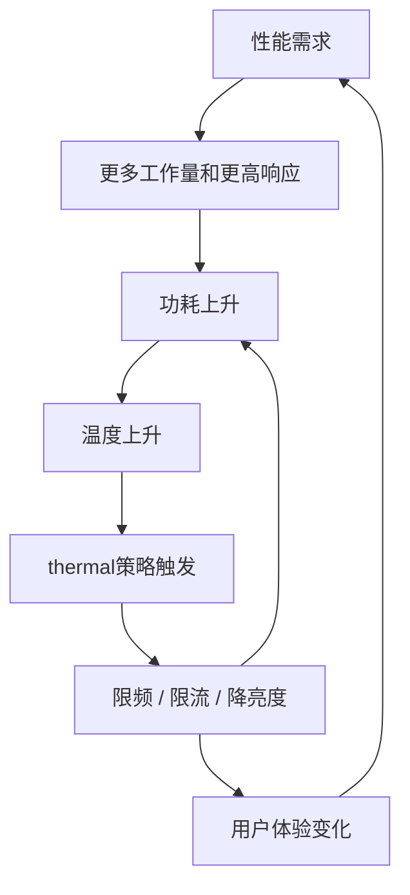
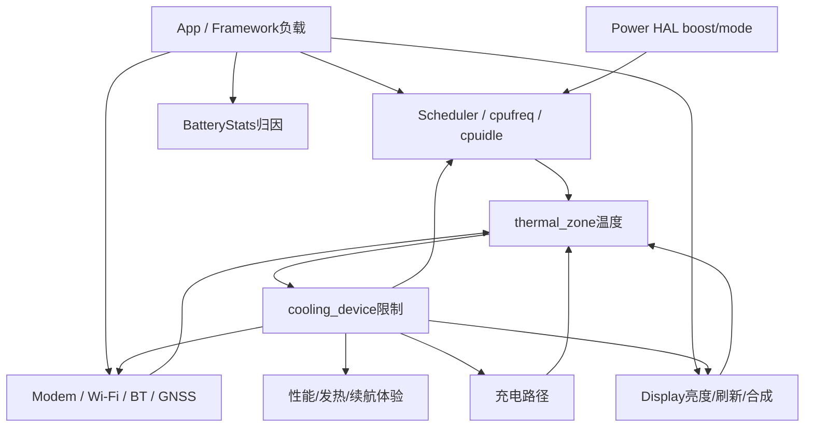
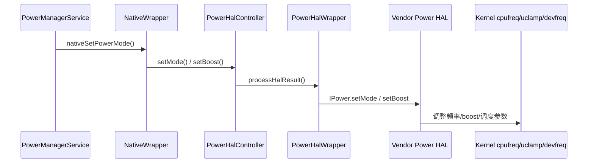
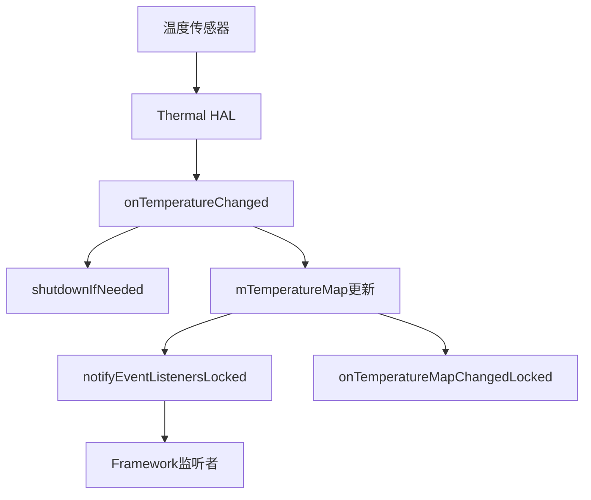
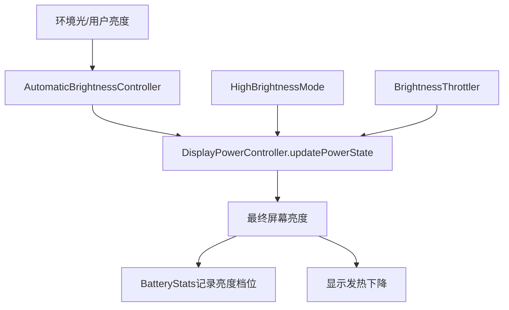
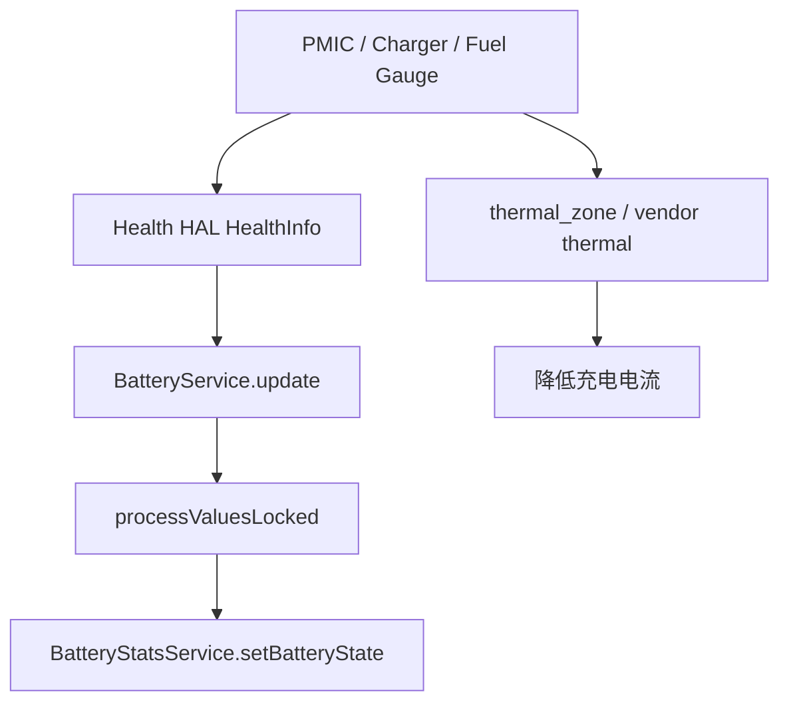
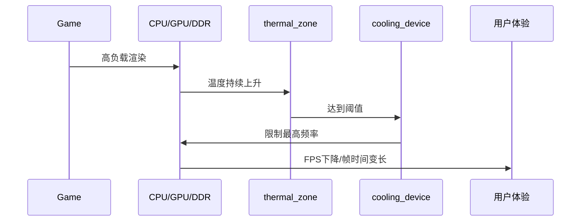
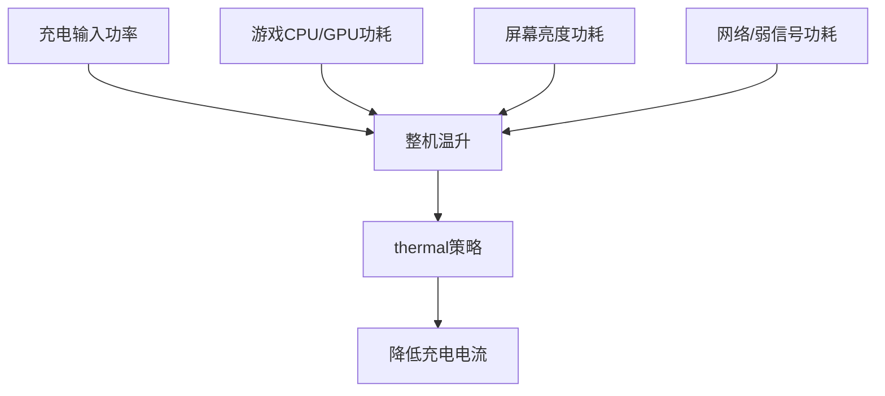

## 为什么要先讲三角关系

Android 功耗问题不能只盯着“省电”。一个真实设备同时被三件事拉扯：

```text
性能：
    App启动要快、滑动要稳、游戏帧率要高、相机预览不能卡。

功耗：
    待机要低、亮屏电流要低、后台不能频繁唤醒。

发热：
    皮肤温度不能烫、电池温度不能过高、PMIC/SoC不能超过保护阈值。
```

这三者不是并列指标，而是闭环。性能需求推动功耗上升，功耗上升带来温升，温升触发 thermal 限制，thermal 限制又反过来压性能和功耗。



所以功耗工程师做问题时，不能只问“谁耗电”，还要问：

- 这个功耗是不是为了满足性能需求？
- 温度是否已经触发限制？
- 限制动作是什么？
- 用户看到的是耗电、发热、卡顿，还是充电变慢？
- 修复后是降低了功耗，还是只是牺牲了性能？

## 基本物理直觉

CPU/GPU 这类数字电路的动态功耗可以粗略理解为：

```text
P_dynamic ~= C * V^2 * f * activity
```

其中：

| 变量 | 含义 | 工程含义 |
|------|------|----------|
| C | 等效电容 | 由硬件设计决定 |
| V | 电压 | 频率提高时通常要升压，影响非常大 |
| f | 频率 | CPU/GPU/DDR频率越高，动态功耗越高 |
| activity | 活跃度 | 线程运行、GPU绘制、内存访问、外设传输 |

这解释了几个常见现象：

- CPU 频率只高一点，但电压也跟着上升，功耗可能明显上升。
- 一个任务跑得慢不一定省电，如果拖长了高频时间，总能耗可能更高。
- 高频短跑和低频长跑谁省电，要看任务类型、idle 机会和平台能效曲线。
- 频繁短唤醒虽然平均 CPU 占用低，但会破坏 cpuidle 和系统 suspend。

## Android里的三角关系落点



从 Android 角度看，三角关系落在这些模块上：

| 方向 | Android模块 | 典型证据 |
|------|-------------|----------|
| 性能推动功耗 | Scheduler、cpufreq、Power HAL、SurfaceFlinger | Perfetto 的 sched/freq/gfx |
| 功耗推动温升 | thermal zone、battery temp、PMIC temp | `/sys/class/thermal` |
| 温升限制性能 | cooling device、thermal HAL、vendor thermal engine | cooling state、频率上限下降 |
| 温升限制充电 | BatteryService、Health HAL、charger driver | `current_now`、`dumpsys battery` |
| 温升限制显示 | DisplayPowerController、BrightnessThrottler | `dumpsys display`、亮度上限 |
| 软件归因 | BatteryStats、PowerProfile、PowerStats | `dumpsys batterystats` |

## 代码主线1：Power HAL如何参与性能和功耗

Power HAL 是 Framework 把“当前系统需要什么性能/功耗模式”告诉厂商平台的入口。它不直接发热，但它会影响调度、频率、boost、低功耗模式，最终影响功耗和温度。

源码入口：

| 入口 | 作用 |
|------|------|
| [PowerManagerService.java:4086](vscode://file//home/suhui/workspace/aosp/los21/frameworks/base/services/core/java/com/android/server/power/PowerManagerService.java:4086:1) | PMS 设置 interactive power mode |
| [PowerManagerService.java:4640](vscode://file//home/suhui/workspace/aosp/los21/frameworks/base/services/core/java/com/android/server/power/PowerManagerService.java:4640:1) | `setPowerModeInternal` |
| [PowerHalController.cpp:94](vscode://file//home/suhui/workspace/aosp/los21/frameworks/native/services/powermanager/PowerHalController.cpp:94:1) | `setBoost` 转发到 HAL wrapper |
| [PowerHalController.cpp:100](vscode://file//home/suhui/workspace/aosp/los21/frameworks/native/services/powermanager/PowerHalController.cpp:100:1) | `setMode` 转发到 HAL wrapper |
| [PowerHalWrapper.cpp:199](vscode://file//home/suhui/workspace/aosp/los21/frameworks/native/services/powermanager/PowerHalWrapper.cpp:199:1) | AIDL Power HAL `setBoost` |
| [PowerHalWrapper.cpp:231](vscode://file//home/suhui/workspace/aosp/los21/frameworks/native/services/powermanager/PowerHalWrapper.cpp:231:1) | AIDL Power HAL `setMode` |

可以按这个伪代码理解：

```text
亮屏/灭屏/省电/DeviceIdle等状态变化
    -> PowerManagerService.setPowerModeInternal(mode, enabled)
    -> NativeWrapper.nativeSetPowerMode()
    -> PowerHalController.setMode()
    -> PowerHalWrapper.setMode()
    -> vendor Power HAL
    -> 写调度/频率/boost/平台功耗参数
```



排查价值：

- 亮屏交互电流高，要看是否有长时间 boost 或 interactive mode 未退出。
- 灭屏后频率不降，要看 Power HAL 是否还处于 interactive/boost 状态。
- 游戏性能忽高忽低，要看 Power HAL、thermal 和调度是否互相打架。

## 代码主线2：ThermalManagerService如何处理温度

ThermalManagerService 是 Framework 侧的 thermal 入口。它从 Thermal HAL 获取温度、cooling device 和阈值，再把状态通知给监听者。

源码入口：

| 入口 | 作用 |
|------|------|
| [ThermalManagerService.java:89](vscode://file//home/suhui/workspace/aosp/los21/frameworks/base/services/core/java/com/android/server/power/ThermalManagerService.java:89:1) | ThermalManagerService 类定义 |
| [ThermalHalAidlWrapper:946](vscode://file//home/suhui/workspace/aosp/los21/frameworks/base/services/core/java/com/android/server/power/ThermalManagerService.java:946:1) | AIDL Thermal HAL 封装 |
| [onTemperatureChanged:323](vscode://file//home/suhui/workspace/aosp/los21/frameworks/base/services/core/java/com/android/server/power/ThermalManagerService.java:323:1) | 温度变化入口 |
| [onTemperatureMapChangedLocked:233](vscode://file//home/suhui/workspace/aosp/los21/frameworks/base/services/core/java/com/android/server/power/ThermalManagerService.java:233:1) | 汇总当前 thermal status |
| [notifyEventListenersLocked:285](vscode://file//home/suhui/workspace/aosp/los21/frameworks/base/services/core/java/com/android/server/power/ThermalManagerService.java:285:1) | 通知 thermal event listener |
| [shutdownIfNeeded:302](vscode://file//home/suhui/workspace/aosp/los21/frameworks/base/services/core/java/com/android/server/power/ThermalManagerService.java:302:1) | 极端温度保护 |
| [getCurrentCoolingDevices:508](vscode://file//home/suhui/workspace/aosp/los21/frameworks/base/services/core/java/com/android/server/power/ThermalManagerService.java:508:1) | 查询 cooling device |

核心逻辑可以这样读：

```text
Thermal HAL callback
    -> onTemperatureChanged()
    -> shutdownIfNeeded()
    -> 更新 mTemperatureMap
    -> notifyEventListenersLocked()
    -> onTemperatureMapChangedLocked()
    -> 根据 SKIN 等温度状态计算全局 Thermal Status
```



要注意：ThermalManagerService 能看到的是 HAL 上报的 Framework 视角。很多厂商平台还会有 vendor thermal engine 直接操作 Kernel cooling device，所以 `dumpsys thermalservice` 不是热问题的唯一证据。

## 代码主线3：显示亮度如何被热限制

亮屏功耗里，屏幕是大头。Android 显示链路里不仅有亮度，还有 HBM、高亮模式、热限制亮度上限。

源码入口：

| 入口 | 作用 |
|------|------|
| [DisplayPowerController.java:127](vscode://file//home/suhui/workspace/aosp/los21/frameworks/base/services/core/java/com/android/server/display/DisplayPowerController.java:127:1) | 显示电源控制核心类 |
| [requestPowerState:755](vscode://file//home/suhui/workspace/aosp/los21/frameworks/base/services/core/java/com/android/server/display/DisplayPowerController.java:755:1) | PMS 请求显示状态 |
| [updatePowerState:1329](vscode://file//home/suhui/workspace/aosp/los21/frameworks/base/services/core/java/com/android/server/display/DisplayPowerController.java:1329:1) | 显示状态收敛 |
| [createBrightnessThrottlerLocked:2035](vscode://file//home/suhui/workspace/aosp/los21/frameworks/base/services/core/java/com/android/server/display/DisplayPowerController.java:2035:1) | 创建亮度热限制器 |
| [setScreenState:2125](vscode://file//home/suhui/workspace/aosp/los21/frameworks/base/services/core/java/com/android/server/display/DisplayPowerController.java:2125:1) | 设置屏幕状态 |
| [animateScreenBrightness:2247](vscode://file//home/suhui/workspace/aosp/los21/frameworks/base/services/core/java/com/android/server/display/DisplayPowerController.java:2247:1) | 亮度渐变 |
| [noteScreenBrightness:2783](vscode://file//home/suhui/workspace/aosp/los21/frameworks/base/services/core/java/com/android/server/display/DisplayPowerController.java:2783:1) | 亮度写入 BatteryStats |

显示热限制可以这样理解：



这就是为什么“发热后屏幕变暗”也是功耗-热-性能三角的一部分：它不一定是显示 bug，而可能是 thermal brightness throttling 主动限制。

## 代码主线4：充电热如何进入Framework

充电热至少有两条链：

- Battery/Health 链：电池状态、电流、电压、温度。
- Thermal 链：PMIC、电池、USB、skin、SoC 温度触发限流。

源码入口：

| 入口 | 作用 |
|------|------|
| [BatteryService.java:127](vscode://file//home/suhui/workspace/aosp/los21/frameworks/base/services/core/java/com/android/server/BatteryService.java:127:1) | 电池服务 |
| [update:542](vscode://file//home/suhui/workspace/aosp/los21/frameworks/base/services/core/java/com/android/server/BatteryService.java:542:1) | HealthInfo 更新入口 |
| [processValuesLocked:590](vscode://file//home/suhui/workspace/aosp/los21/frameworks/base/services/core/java/com/android/server/BatteryService.java:590:1) | 处理电量、插电、温度、电流 |
| [sendBatteryChangedIntentLocked:845](vscode://file//home/suhui/workspace/aosp/los21/frameworks/base/services/core/java/com/android/server/BatteryService.java:845:1) | 发送电池广播 |
| [dumpInternal:1371](vscode://file//home/suhui/workspace/aosp/los21/frameworks/base/services/core/java/com/android/server/BatteryService.java:1371:1) | `dumpsys battery` 输出 |



充电发热分析时，`dumpsys battery` 只能告诉你 Framework 看到的电池状态；真正的充电限流可能发生在 charger driver、PMIC、vendor thermal engine 或 Health HAL 下方。

## 三角关系的常见场景

### 场景1：游戏十分钟后掉帧



排查证据：

```bash
adb shell perfetto -o /data/misc/perfetto-traces/game.trace -t 300s sched freq idle power thermal
adb shell cat /sys/class/thermal/thermal_zone*/temp
adb shell cat /sys/class/thermal/cooling_device*/cur_state
adb shell cat /sys/devices/system/cpu/cpufreq/policy*/scaling_cur_freq
```

结论要写成：

```text
不是“调度突然变差”，而是温度达到阈值后 cooling device 限制频率，
导致 GPU/CPU 可用算力下降，帧率下降。
```

### 场景2：亮屏静置电流高并伴随温升

可能链路：

```text
屏幕高亮度 / 高刷新率
    -> Display + HWC + SurfaceFlinger持续工作
    -> CPU/GPU/DDR不能降下来
    -> 温度上升
    -> 降亮度或限频
```

排查证据：

```bash
adb shell dumpsys display
adb shell dumpsys SurfaceFlinger
adb shell settings get system screen_brightness
adb shell perfetto -o /data/misc/perfetto-traces/display.trace -t 60s sched freq idle gfx view wm power
```

### 场景3：边充边玩发热，随后充电变慢



证据：

```bash
adb shell dumpsys battery
adb shell cat /sys/class/power_supply/battery/current_now
adb shell cat /sys/class/power_supply/battery/temp
adb shell cat /sys/class/thermal/thermal_zone*/temp
adb shell cat /sys/class/thermal/cooling_device*/cur_state
```

结论要区分：

- 是充电路径本身热。
- 是运行负载叠加。
- 是环境温度过高。
- 是 thermal 阈值或限流策略过激。

### 场景4：待机掉电高但手机也温热

待机温热常见不是 CPU 大负载，而是系统睡不深：

```text
周期 alarm / 定位 / 蓝牙 / modem / sensor
    -> 系统频繁 wakeup
    -> cpuidle/suspend比例低
    -> 平均功耗上升
    -> 温度比正常待机高
```

证据：

```bash
adb shell dumpsys batterystats --charged
adb shell cat /sys/kernel/debug/wakeup_sources
adb shell dumpsys alarm
adb shell dumpsys location
adb shell dumpsys bluetooth_manager
```

## 真机案例：Mi MIX 2 / msm8998 的三角关系入口

当前外接 QCOM 设备：

```text
model: Mi MIX 2
device: chiron
Android: 14
hardware: qcom
board: msm8998
soc: MSM8998
adb: root
```

### 观察1：interactive governor说明性能策略偏老平台

采集：

```bash
adb shell cat /sys/devices/system/cpu/cpufreq/policy*/scaling_governor
adb shell cat /sys/devices/system/cpu/cpufreq/policy*/scaling_cur_freq
adb shell cat /sys/devices/system/cpu/cpufreq/policy*/scaling_max_freq
```

观察：

```text
policy0: interactive
policy4: interactive
```

分析：

```text
现代平台常见 schedutil，但 msm8998 这类老 QCOM 平台仍可能使用 interactive。
这意味着亮屏交互、boost、频率保持策略，要结合 interactive governor 和 vendor 参数看。
如果发热后频率下降，还要同时看 thermal-cpufreq cooling。
```

### 观察2：Thermal HAL不可用，但Kernel thermal可用

采集：

```bash
adb shell dumpsys thermalservice
adb shell cat /sys/class/thermal/thermal_zone*/type
adb shell cat /sys/class/thermal/thermal_zone*/temp
adb shell cat /sys/class/thermal/cooling_device*/type
adb shell cat /sys/class/thermal/cooling_device*/cur_state
```

观察：

```text
dumpsys thermalservice:
    HAL Ready: false

thermal_zone:
    battery
    pm8998_tz
    pmi8998_tz
    pm8005_tz
    msm_therm
    tsens_tz_sensor*

cooling_device:
    thermal-cpufreq-0
    thermal-cpufreq-1
```

分析：

```text
Framework thermalservice没有HAL数据，不代表设备没有thermal。
Kernel thermal zone和cooling device仍然能观察热源和限制动作。
```

这个 case 非常适合说明：**功耗-发热-性能三角不能只看 Framework。**

### 观察3：USB满电状态不适合直接做待机热结论

采集：

```bash
adb shell dumpsys battery
adb shell dumpsys power
```

观察：

```text
USB powered: true
level: 100
status: Full
mIsPowered=true
mStayOn=true
```

分析：

```text
USB供电会改变电源策略；
满电会改变充电路径状态；
stay awake会影响灭屏和suspend；
因此这组状态只能作为“插USB调试基线”，不能直接代表自然待机。
```

这也是功耗测试最容易踩的坑：还没分析系统，测试条件先污染了。

## 数据采集矩阵

做三角关系问题，建议每次按这个矩阵采：

| 目标 | 命令 |
|------|------|
| Framework电源状态 | `adb shell dumpsys power` |
| 显示状态 | `adb shell dumpsys display`、`adb shell dumpsys SurfaceFlinger` |
| 电池/充电 | `adb shell dumpsys battery`、`cat /sys/class/power_supply/battery/current_now` |
| 频率 | `cat /sys/devices/system/cpu/cpufreq/policy*/scaling_cur_freq` |
| idle | `cat /sys/devices/system/cpu/cpu0/cpuidle/state*/time` |
| 唤醒 | `cat /sys/kernel/debug/wakeup_sources` |
| Framework thermal | `adb shell dumpsys thermalservice` |
| Kernel thermal | `cat /sys/class/thermal/thermal_zone*/temp` |
| 限制动作 | `cat /sys/class/thermal/cooling_device*/cur_state` |
| 时间线 | `adb shell perfetto ... sched freq idle power thermal gfx` |

## 我的分析口径：把三角关系写清楚

```text
现象：
    亮屏游戏10分钟后掉帧并发热。

测试条件：
    亮度固定，网络固定，环境温度记录，是否插USB明确。

性能证据：
    Perfetto显示帧时间变长，CPU/GPU频率在某时间点下降。

功耗证据：
    下降前CPU/GPU频率高，屏幕亮度高，电池电流或外接电流较高。

热证据：
    thermal_zone中skin/tsens/pmic温度持续上升；
    cooling_device cur_state在掉帧前后变化。

结论：
    这是高负载引起温升，thermal策略限制频率后导致性能下降。
```

## 常见错误结论

| 错误说法 | 为什么错 |
|----------|----------|
| CPU频率下降，所以调度坏了 | 可能是 thermal cooling 正常限频 |
| thermalservice 没温度，所以没热问题 | Thermal HAL 可能没接，Kernel thermal 仍有效 |
| 充电慢就是充电器问题 | 可能是边充边用触发 thermal 限流 |
| 待机 CPU 低就一定省电 | 频繁唤醒会破坏 suspend 和 cpuidle |
| 降低性能就是优化功耗 | 可能牺牲体验，必须看任务完成时间和温升 |

## 这篇结论

功耗、发热、性能是一条闭环，不是三张表：

```text
负载产生性能需求
    -> Power HAL / Scheduler / Display / Radio 提高活动度
    -> 功耗上升
    -> thermal zone 温度上升
    -> cooling device 或 vendor thermal engine 限制能力
    -> 性能、亮度、充电速度或网络能力下降
```

后续每个具体专题都应该回到这条闭环上解释。只讲 wakelock、只讲 thermal、只讲 cpufreq，都只能看到局部；把三角关系串起来，才是功耗工程分析。
