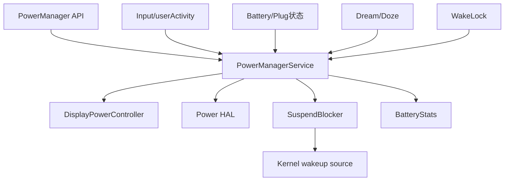
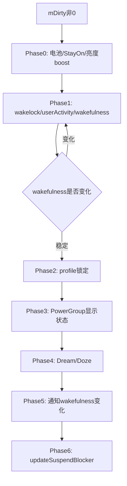
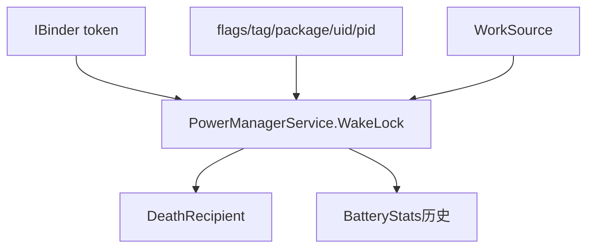
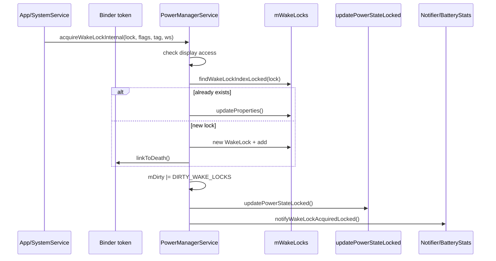
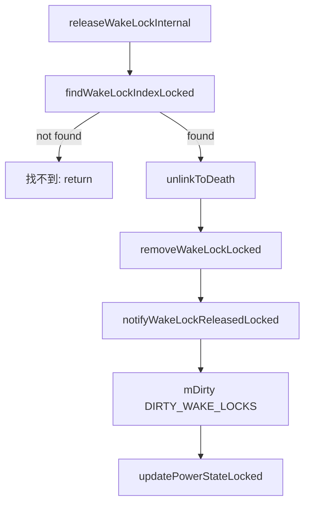
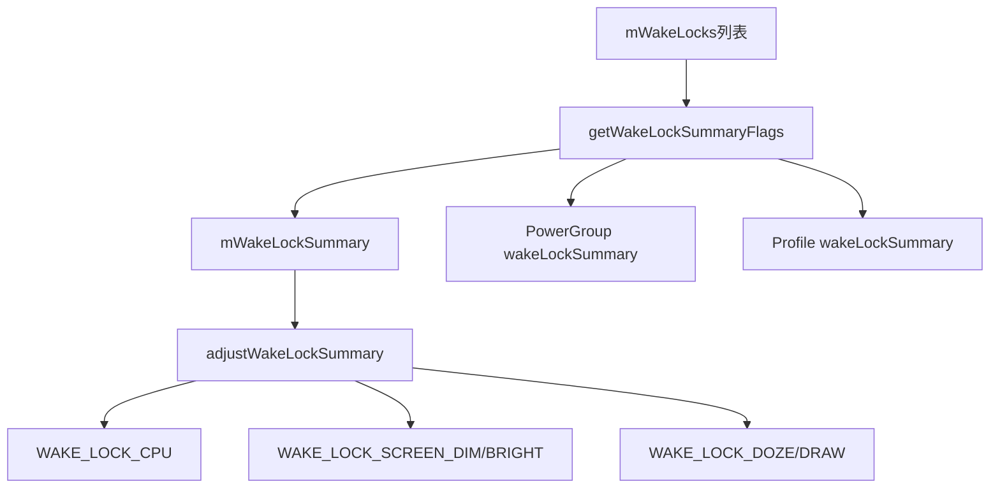
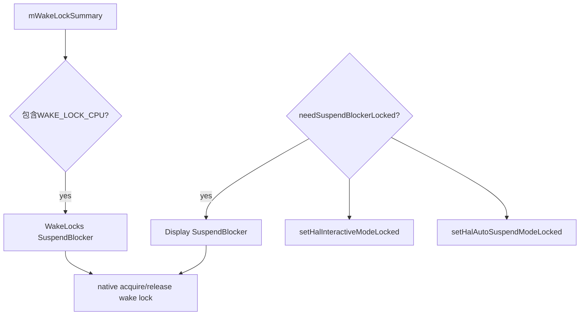
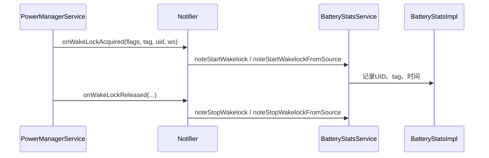
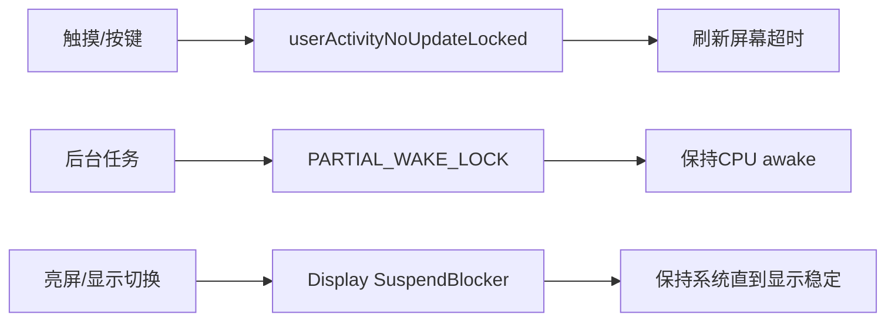
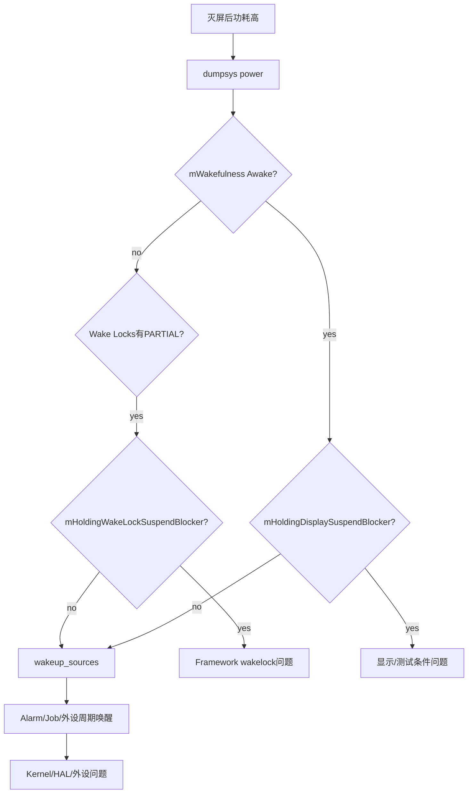

## PMS到底管什么

PowerManagerService，后面简称 PMS，是 Android Framework 电源策略的中枢。它不是“省电服务”，而是一个状态收敛器：把输入事件、屏幕状态、用户活动、wakelock、电池状态、Doze、Power HAL、suspend blocker 都合成一个当前系统应该处于的电源状态。

可以先用一句话建立直觉：

```text
PMS 决定 Framework 是否还需要保持系统 awake；
Kernel 决定硬件是否真的能 suspend；
BatteryStats 记录是谁让系统保持活跃。
```



## 先看源码地图

默认源码目录：

```text
/home/suhui/workspace/aosp/los21/frameworks
```

PMS 主线入口：

| 入口 | 作用 |
|------|------|
| [PowerManagerService.java:170](vscode://file//home/suhui/workspace/aosp/los21/frameworks/base/services/core/java/com/android/server/power/PowerManagerService.java:170:1) | PMS 类定义 |
| [acquireWakeLockInternal:1709](vscode://file//home/suhui/workspace/aosp/los21/frameworks/base/services/core/java/com/android/server/power/PowerManagerService.java:1709:1) | 申请 wakelock |
| [releaseWakeLockInternal:1880](vscode://file//home/suhui/workspace/aosp/los21/frameworks/base/services/core/java/com/android/server/power/PowerManagerService.java:1880:1) | 释放 wakelock |
| [findWakeLockIndexLocked:2008](vscode://file//home/suhui/workspace/aosp/los21/frameworks/base/services/core/java/com/android/server/power/PowerManagerService.java:2008:1) | 根据 Binder token 查找 wakelock |
| [notifyWakeLockAcquiredLocked:2029](vscode://file//home/suhui/workspace/aosp/los21/frameworks/base/services/core/java/com/android/server/power/PowerManagerService.java:2029:1) | 通知统计/监听 wakelock acquire |
| [notifyWakeLockReleasedLocked:2093](vscode://file//home/suhui/workspace/aosp/los21/frameworks/base/services/core/java/com/android/server/power/PowerManagerService.java:2093:1) | 通知统计/监听 wakelock release |
| [userActivityNoUpdateLocked:2177](vscode://file//home/suhui/workspace/aosp/los21/frameworks/base/services/core/java/com/android/server/power/PowerManagerService.java:2177:1) | 用户活动刷新亮屏超时 |
| [setWakefulnessLocked:2332](vscode://file//home/suhui/workspace/aosp/los21/frameworks/base/services/core/java/com/android/server/power/PowerManagerService.java:2332:1) | Awake/Dozing/Asleep 状态切换 |
| [updatePowerStateLocked:2600](vscode://file//home/suhui/workspace/aosp/los21/frameworks/base/services/core/java/com/android/server/power/PowerManagerService.java:2600:1) | 状态收敛主循环 |
| [updateWakeLockSummaryLocked:2838](vscode://file//home/suhui/workspace/aosp/los21/frameworks/base/services/core/java/com/android/server/power/PowerManagerService.java:2838:1) | 汇总 wakelock 影响 |
| [updateSuspendBlockerLocked:3961](vscode://file//home/suhui/workspace/aosp/los21/frameworks/base/services/core/java/com/android/server/power/PowerManagerService.java:3961:1) | 更新 suspend blocker |
| [WakeLock class:5526](vscode://file//home/suhui/workspace/aosp/los21/frameworks/base/services/core/java/com/android/server/power/PowerManagerService.java:5526:1) | PMS 内部 WakeLock 对象 |
| [SuspendBlockerImpl:5732](vscode://file//home/suhui/workspace/aosp/los21/frameworks/base/services/core/java/com/android/server/power/PowerManagerService.java:5732:1) | PMS 内部 suspend blocker |

Native suspend blocker：

| 入口 | 作用 |
|------|------|
| [nativeAcquireSuspendBlocker:214](vscode://file//home/suhui/workspace/aosp/los21/frameworks/base/services/core/jni/com_android_server_power_PowerManagerService.cpp:214:1) | Java 到 native acquire |
| [nativeReleaseSuspendBlocker:219](vscode://file//home/suhui/workspace/aosp/los21/frameworks/base/services/core/jni/com_android_server_power_PowerManagerService.cpp:219:1) | Java 到 native release |

BatteryStats：

| 入口 | 作用 |
|------|------|
| [noteStartWakelock:1190](vscode://file//home/suhui/workspace/aosp/los21/frameworks/base/services/core/java/com/android/server/am/BatteryStatsService.java:1190:1) | wakelock 开始归因 |
| [noteStopWakelock:1208](vscode://file//home/suhui/workspace/aosp/los21/frameworks/base/services/core/java/com/android/server/am/BatteryStatsService.java:1208:1) | wakelock 结束归因 |
| [noteStartWakelockFromSource:1226](vscode://file//home/suhui/workspace/aosp/los21/frameworks/base/services/core/java/com/android/server/am/BatteryStatsService.java:1226:1) | WorkSource wakelock 开始 |
| [noteStopWakelockFromSource:1268](vscode://file//home/suhui/workspace/aosp/los21/frameworks/base/services/core/java/com/android/server/am/BatteryStatsService.java:1268:1) | WorkSource wakelock 结束 |

## PMS状态收敛：updatePowerStateLocked

PMS 的核心不是某个单独 API，而是 `updatePowerStateLocked()`。很多入口只是改状态、设置 `mDirty`，然后进入这个方法重新计算系统状态。

源码里可以看到它分阶段执行：

```text
Phase 0: updateIsPowered / updateStayOn / brightness boost
Phase 1: updateWakeLockSummary / updateUserActivitySummary / updateWakefulness
Phase 2: updateProfiles
Phase 3: updatePowerGroups
Phase 4: updateDream
Phase 5: finishWakefulnessChange
Phase 6: updateSuspendBlocker
```



为什么 `updateSuspendBlockerLocked()` 放在最后？源码注释已经说得很直白：它可能释放最后一个 suspend blocker，所以必须等其他状态和通知都处理完，否则系统可能在 Framework 还没收尾时睡下去。

## WakeLock对象里有什么

PMS 内部的 `WakeLock` 不是一个简单 tag。它至少包含：

| 字段 | 含义 |
|------|------|
| `mLock` | Binder token，用于查找和死亡监听 |
| `mDisplayId` | 关联 display |
| `mFlags` | wakelock 类型和 flags |
| `mTag` | 调试 tag |
| `mPackageName` | 申请方包名 |
| `mWorkSource` | 耗电归因对象 |
| `mHistoryTag` | BatteryStats 历史 tag |
| `mOwnerUid / mOwnerPid` | 申请者 uid/pid |
| `mUidState` | UID 状态 |
| `mAcquireTime` | acquire 时间 |
| `mNotifiedAcquired` | 是否已经通知统计 |
| `mNotifiedLong` | 是否已经标记长 wakelock |
| `mDisabled` | 是否被策略禁用 |
| `mCallback` | wakelock callback |



两个细节很重要：

1. PMS 用 Binder token 查找 wakelock，所以重复 acquire 同一个 token 会更新已有对象，而不是简单追加。
2. `WakeLock` 实现 `IBinder.DeathRecipient`，调用方进程死掉时可以自动释放，避免锁永久泄漏。

## acquireWakeLockInternal解析

申请 wakelock 的主流程：

```text
acquireWakeLockInternal()
    -> 检查 display 权限
    -> findWakeLockIndexLocked(lock)
    -> 已存在：更新属性
    -> 不存在：创建 WakeLock，加入 mWakeLocks
    -> applyWakeLockFlagsOnAcquireLocked()
    -> mDirty |= DIRTY_WAKE_LOCKS
    -> updatePowerStateLocked()
    -> notifyWakeLockAcquiredLocked()
```



源码里有一个很关键的注释：`notifyWakeLockAcquiredLocked()` 要放到最后，确保已经 acquire kernel wake lock 后再开始 BatteryStats 计时，否则可能出现统计已经开始但系统还没真正被保持 awake 的竞态。

## releaseWakeLockInternal解析

释放 wakelock：

```text
releaseWakeLockInternal()
    -> findWakeLockIndexLocked(lock)
    -> 找不到就返回
    -> 可选处理 WAIT_FOR_NO_PROXIMITY
    -> unlinkToDeath()
    -> setDisabled(true)
    -> removeWakeLockLocked()
        -> mWakeLocks.remove()
        -> UID wakelock计数--
        -> notifyWakeLockReleasedLocked()
        -> applyWakeLockFlagsOnReleaseLocked()
        -> mDirty |= DIRTY_WAKE_LOCKS
        -> updatePowerStateLocked()
```



释放不是简单从列表删掉，还会影响 user activity。例如带 `ON_AFTER_RELEASE` 的屏幕类锁释放后，可能触发一次 user activity，避免屏幕立刻灭。

## WakeLockSummary如何决定是否阻止CPU睡眠

PMS 不会每次都直接拿 `mWakeLocks` 原始列表做判断，而是汇总成 `mWakeLockSummary`。

`updateWakeLockSummaryLocked()` 大致做：

```text
遍历 mWakeLocks
    -> getWakeLockSummaryFlags(wakeLock)
    -> 合并到 global mWakeLockSummary
    -> 合并到对应 PowerGroup
    -> 合并到 ProfilePowerState
    -> adjustWakeLockSummary(wakefulness, summary)
```



`adjustWakeLockSummary()` 会根据 wakefulness 过滤不合理的锁。例如系统不是 Dozing 时，Doze/Draw 相关锁没有意义；系统 Asleep 时，屏幕 bright/dim 相关 summary 也会被清掉。

工程意义：

- `Wake Locks: size > 0` 不代表一定阻止 suspend。
- 要看它最终是否汇总成 `WAKE_LOCK_CPU`。
- `PARTIAL_WAKE_LOCK` 才是待机 CPU 不能睡的核心嫌疑。

## SuspendBlocker如何落到Kernel

PMS 内部有几个 suspend blocker：

| 名称 | 作用 |
|------|------|
| `PowerManagerService.WakeLocks` | Framework wakelock 需要保持 CPU awake |
| `PowerManagerService.Display` | 显示状态切换/亮屏时保持系统 |
| `PowerManagerService.Broadcasts` | 电源状态广播未完成 |
| `PowerManagerService.Booting` | 启动阶段 |
| `PowerManagerService.WirelessChargerDetector` | 无线充电检测 |

`updateSuspendBlockerLocked()` 里最关键的判断：

```text
needWakeLockSuspendBlocker = (mWakeLockSummary & WAKE_LOCK_CPU) != 0
needDisplaySuspendBlocker = needSuspendBlockerLocked()
autoSuspend = !needDisplaySuspendBlocker
interactive = powerGroup.isBrightOrDimLocked()
```

然后：

```text
先 acquire 需要的 blocker
    -> inform Power HAL interactive mode
再 release 不需要的 blocker
    -> 需要时 enable autosuspend
```



SuspendBlockerImpl 最后会调用 JNI：

```text
SuspendBlockerImpl.acquire()
    -> mNativeWrapper.nativeAcquireSuspendBlocker(mName)
    -> nativeAcquireSuspendBlocker()
    -> acquire_wake_lock(PARTIAL_WAKE_LOCK, name)
```

```text
SuspendBlockerImpl.release()
    -> nativeReleaseSuspendBlocker()
    -> release_wake_lock(name)
```

对应源码：

| 入口 | 作用 |
|------|------|
| [SuspendBlockerImpl.acquire:5774](vscode://file//home/suhui/workspace/aosp/los21/frameworks/base/services/core/java/com/android/server/power/PowerManagerService.java:5774:1) | Java acquire |
| [SuspendBlockerImpl.release:5793](vscode://file//home/suhui/workspace/aosp/los21/frameworks/base/services/core/java/com/android/server/power/PowerManagerService.java:5793:1) | Java release |
| [nativeAcquireSuspendBlocker:214](vscode://file//home/suhui/workspace/aosp/los21/frameworks/base/services/core/jni/com_android_server_power_PowerManagerService.cpp:214:1) | native acquire |
| [nativeReleaseSuspendBlocker:219](vscode://file//home/suhui/workspace/aosp/los21/frameworks/base/services/core/jni/com_android_server_power_PowerManagerService.cpp:219:1) | native release |

## Notifier和BatteryStats归因

`notifyWakeLockAcquiredLocked()` 并不直接写 BatteryStats，而是通过 Notifier 这一层，把事件分发给统计、日志、回调等。



这也是为什么 WorkSource 很重要：

```text
系统服务替应用工作
    -> wakelock owner 可能是 system_server
    -> WorkSource 指向真实应用 UID
    -> BatteryStats 才能把耗电归因给正确对象
```

如果 WorkSource 缺失，耗电排行可能会把锅放到 system_server 上。

## userActivity和wakelock的区别

很多人会把 user activity 和 wakelock 混在一起。它们影响不同：

| 机制 | 影响 |
|------|------|
| userActivity | 刷新亮屏/Dim/Dream/睡眠超时 |
| PARTIAL_WAKE_LOCK | 屏幕可灭，但 CPU 不能 suspend |
| SCREEN类旧锁 | 影响屏幕保持亮，现代应用不推荐 |
| Display suspend blocker | 显示状态转换和亮屏期间保持系统 |



排查“屏幕不灭”优先看 userActivity、窗口 flag、stay awake；排查“灭屏不睡”优先看 PARTIAL_WAKE_LOCK 和 wakeup_sources。

## dumpsys power怎么看

命令：

```bash
adb shell dumpsys power
```

关键字段：

| 字段 | 含义 | 判断 |
|------|------|------|
| `mWakefulness` | Framework wakefulness | Awake/Dozing/Asleep |
| `mIsPowered`、`mPlugType` | 是否插电 | USB 会污染待机测试 |
| `mStayOn` | 插电保持唤醒 | true 时不要直接测自然待机 |
| `mWakeLockSummary` | wakelock 汇总 | 看是否有 CPU 相关 summary |
| `Wake Locks` | 当前 Java wakelock 列表 | 看 tag、uid、pid、WorkSource |
| `Suspend Blockers` | PMS suspend blocker | 看 WakeLocks/Display/Broadcasts |
| `mHoldingWakeLockSuspendBlocker` | 是否持有 wakelock blocker | true 时 Framework 阻止 suspend |
| `mHoldingDisplaySuspendBlocker` | 是否持有 display blocker | 亮屏或显示转换 |
| `mHalInteractiveModeEnabled` | Power HAL interactive | 影响平台性能/功耗 |

## 真机case：Mi MIX 2当前不是待机条件

当前 QCOM 真机基线：

```text
mWakefulness=Awake
mIsPowered=true
mPlugType=2
mStayOn=true
mHalInteractiveModeEnabled=true
mHoldingWakeLockSuspendBlocker=false
mHoldingDisplaySuspendBlocker=true
Wake Locks: size=0
```

这组数据怎么解？

```text
Wake Locks: size=0
    说明当前没有 Framework Java wakelock 列表项。

mHoldingWakeLockSuspendBlocker=false
    说明当前不是 wakelock summary 导致 PMS 持有 WakeLocks blocker。

mHoldingDisplaySuspendBlocker=true
    说明 Display 侧仍要求保持系统，当前不是低功耗待机。

mIsPowered=true + mStayOn=true
    说明 USB 插线和 stay awake 已经改变了测试条件。
```

结论：

```text
不能说“没有wakelock所以设备应该待机”。
当前设备 Awake、USB供电、stay awake、Display blocker持有，
它不是自然灭屏待机场景。
```

这个 case 很重要，因为它防止一个常见误判：只看 `Wake Locks: size=0` 就以为 PMS 没问题。

## Case 1：长时间PARTIAL_WAKE_LOCK

典型现象：

```text
灭屏后电流不降。
dumpsys power 中 Wake Locks 有 PARTIAL_WAKE_LOCK。
wakeup_sources 中 PowerManagerService.WakeLocks total_time 增长。
```

采集：

```bash
adb shell dumpsys power > power.txt
adb shell dumpsys batterystats --charged > batterystats.txt
adb shell cat /sys/kernel/debug/wakeup_sources > wakeup_sources.txt
```

判断：

```text
如果 mHoldingWakeLockSuspendBlocker=true，
并且 Wake Locks 中存在长时间 PARTIAL_WAKE_LOCK，
再加上 wakeup_sources 中 PowerManagerService.WakeLocks total_time 增长，
就可以判断 Framework wakelock 阻止 suspend。
```

修复方向：

- 检查应用是否释放锁。
- 给锁设置 timeout。
- 用 JobScheduler/WorkManager 合并后台任务。
- 系统服务检查 WorkSource 归因。

## Case 2：Wake Locks为空但仍不睡

现象：

```text
dumpsys power:
    Wake Locks: size=0
    mHoldingWakeLockSuspendBlocker=false
    mHoldingDisplaySuspendBlocker=true
```

可能原因：

- 屏幕仍亮。
- display power state 还没 ready。
- 插电 stay awake。
- proximity、dream、doze display、AOD 等显示策略。

下一步：

```bash
adb shell dumpsys display
adb shell dumpsys power
adb shell settings get global stay_on_while_plugged_in
```

结论不能写成 wakelock 问题，而要写：

```text
PMS 当前不是由 WakeLocks suspend blocker 阻止 suspend，
而是 Display suspend blocker 或测试条件导致设备保持 Awake。
```

## Case 3：system_server耗电高但可能是WorkSource缺失

现象：

```text
BatteryStats 显示 system_server wakelock 时间长。
```

分析：

```text
系统服务可能替应用做定位、网络、同步、传感器任务。
如果 WorkSource 设置正确，BatteryStats 可以归因到真实 UID；
如果 WorkSource 缺失，耗电就可能看起来像 system_server。
```

检查：

```bash
adb shell dumpsys batterystats --charged | grep -i "wake lock"
adb shell dumpsys power | sed -n '/Wake Locks/,/Suspend Blockers/p'
```

结论要谨慎：

```text
system_server 高不是根因，只是入口。
需要继续看 tag、WorkSource、调用链和具体服务。
```

## Case 4：频繁短wakelock

长锁容易看，短锁更麻烦。它可能表现为：

```text
单个 wakelock 时间不长；
但系统每隔几十秒醒一次；
cpuidle/suspend比例很差。
```

证据：

```bash
adb shell dumpsys batterystats --wakeups
adb shell dumpsys alarm
adb shell cat /sys/kernel/debug/wakeup_sources
adb shell perfetto -o /data/misc/perfetto-traces/wakeup.trace -t 180s sched freq idle power am binder_driver
```

判断：

```text
如果 alarmtimer 或某外设 wakeup_count 增长，
Perfetto 上周期 resume 后有短时间 wakelock，
那问题不是长锁，而是周期唤醒破坏低功耗。
```

## 排查决策树



## 常用命令

### Framework状态

```bash
adb shell dumpsys power
adb shell dumpsys power | sed -n '/Wake Locks/,/Suspend Blockers/p'
adb shell dumpsys power | grep -E "mWakefulness|mIsPowered|mStayOn|mHolding|mWakeLockSummary"
```

### BatteryStats

```bash
adb shell dumpsys batterystats --charged > batterystats.txt
adb shell dumpsys batterystats --wakeups > wakeups.txt
adb shell dumpsys batterystats --reset
```

### Kernel

```bash
adb shell cat /sys/kernel/debug/wakeup_sources
adb shell dmesg | grep -i "wakeup\\|suspend\\|resume"
```

### 时间线

```bash
adb shell perfetto -o /data/misc/perfetto-traces/power.trace -t 120s sched freq idle power am binder_driver
adb pull /data/misc/perfetto-traces/power.trace
```

## 结论模板

### Framework wakelock问题

```text
Framework:
    dumpsys power 中存在 PARTIAL_WAKE_LOCK xxx，uid=yyy。
    mHoldingWakeLockSuspendBlocker=true。

BatteryStats:
    UID yyy 的 wakelock xxx 累计 xx 分钟。

Kernel:
    wakeup_sources 中 PowerManagerService.WakeLocks total_time 增长。

结论:
    该 wakelock 阻止系统 suspend，是灭屏功耗高的主要原因。
```

### 非wakelock问题

```text
Framework:
    Wake Locks: size=0。
    mHoldingWakeLockSuspendBlocker=false。
    但 mHoldingDisplaySuspendBlocker=true / 或 mWakefulness=Awake。

判断:
    当前不是 PARTIAL_WAKE_LOCK 阻止 suspend。
    应继续排查显示状态、插电 stay awake、Doze/AOD 或 Kernel wakeup source。
```

## 本篇总结

PMS 和 wakelock 的核心不是“看到锁就怪锁”，而是看完整链路：

```text
PowerManager API
    -> acquireWakeLockInternal
    -> WakeLock对象进入mWakeLocks
    -> updateWakeLockSummaryLocked
    -> updatePowerStateLocked
    -> updateSuspendBlockerLocked
    -> nativeAcquireSuspendBlocker
    -> Kernel wakeup source
    -> BatteryStats归因
```

排查时要同时看：

- `Wake Locks` 列表。
- `mWakeLockSummary`。
- `mHoldingWakeLockSuspendBlocker`。
- `Suspend Blockers`。
- `wakeup_sources`。
- `BatteryStats`。

只有这些证据能互相对上，才能说 wakelock 是根因。
