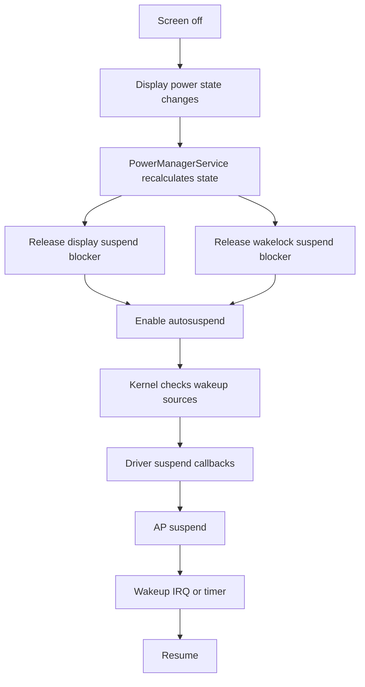
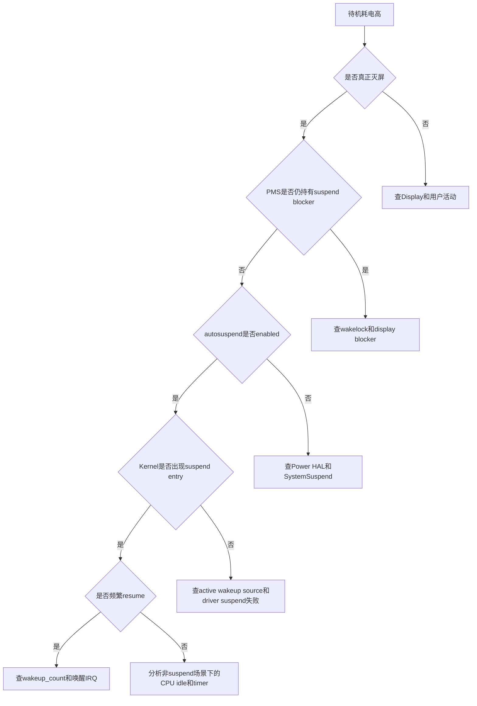
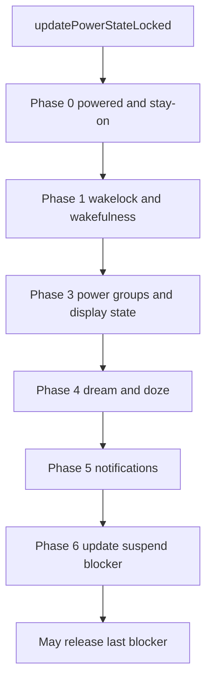
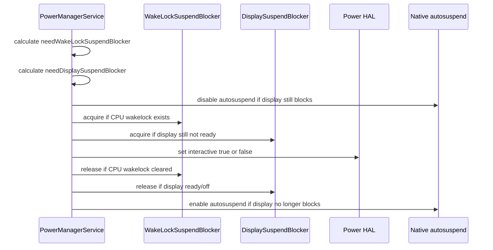
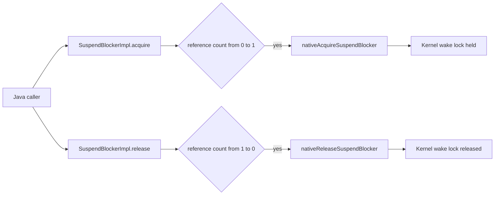
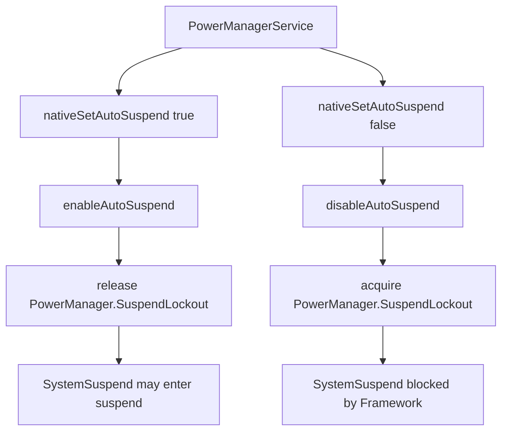
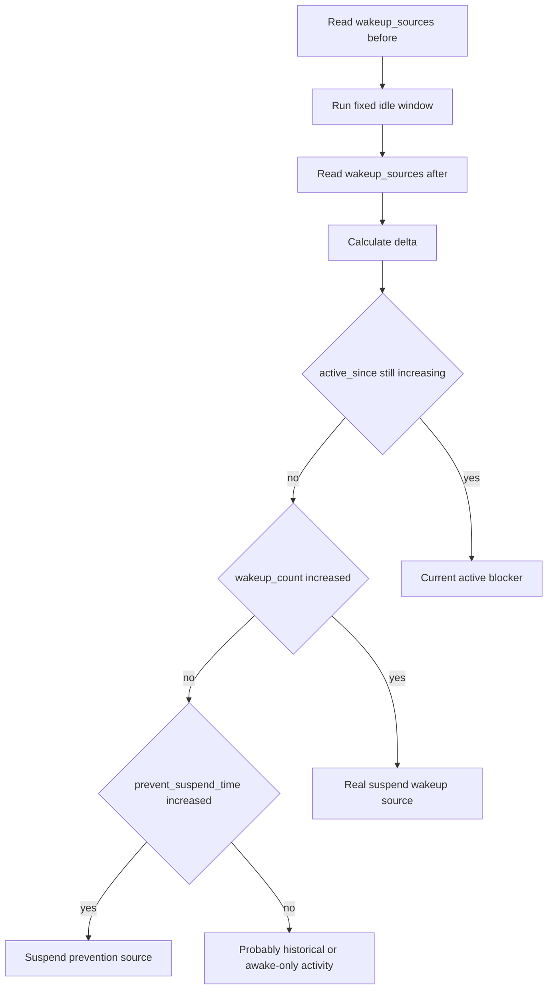
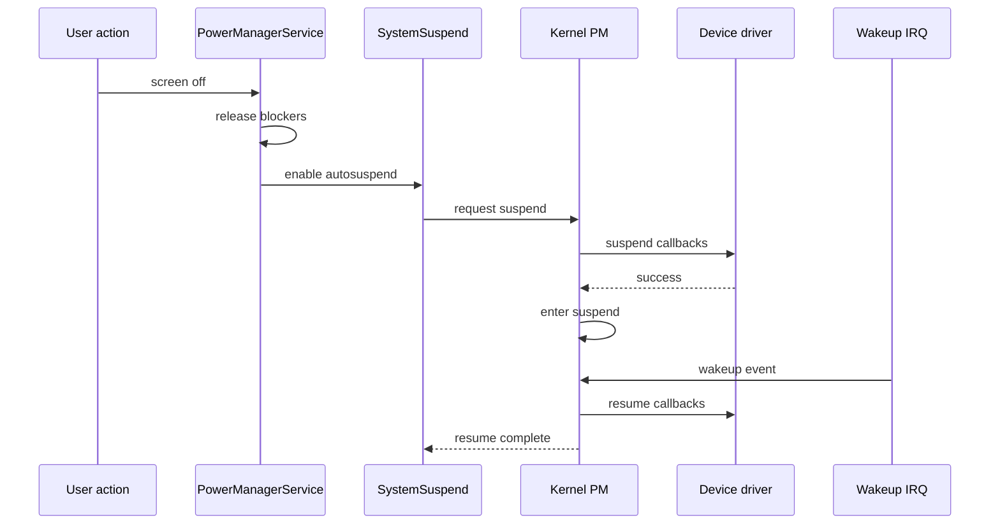

这篇记录只讲一个问题：**Android 灭屏之后，系统到底怎样从 Framework 走到 Kernel suspend？如果没睡下去，应该看哪一层？**

很多功耗问题会被一句“灭屏后耗电高”盖住，但这句话其实太粗。灭屏以后至少可能处在三种状态：

- Display 已经 off，但 AP 还在 awake。
- CPU 正在反复进入 cpuidle，但整机没有 suspend。
- AP 已经进入 suspend，只是被某个 wakeup source 周期性唤醒。

这三种状态的排查方向完全不一样。第一种要看 Framework wakelock、display suspend blocker、Power HAL interactive；第二种要看 scheduler、timer、IRQ、cpuidle residency；第三种才重点看 Kernel `wakeup_sources`、suspend/resume 日志和外设唤醒源。

## 先拆概念

| 概念 | 发生层级 | 代表含义 | 常见误判 |
|------|----------|----------|----------|
| 灭屏 | Framework / Display | 屏幕内容不再显示，背光和显示链路进入低功耗 | 灭屏不等于整机 suspend |
| interactive false | Framework / Power HAL | 告诉 HAL 系统不再处于交互态 | HAL 收到 false 不等于 Kernel 立刻 suspend |
| autosuspend enable | Native / SystemSuspend | 允许系统自动尝试 suspend | 允许尝试不等于尝试成功 |
| cpuidle | Kernel scheduler / cpuidle | 某些 CPU core 进入 idle state | cpuidle 是 CPU 空闲，不是整机 suspend |
| suspend | Kernel PM core | AP 暂停执行，等待唤醒事件 | suspend 后仍可能被 alarm、modem、wlan、sensor 唤醒 |
| wakeup source | Kernel / driver | 能阻止 suspend 或从 suspend 唤醒系统的对象 | 名字出现不等于它就是问题，要看 delta |

可以把它理解成一条门禁链：灭屏只是第一道门，Framework suspend blocker 是第二道门，autosuspend 是第三道门，Kernel wakeup source 和 driver suspend callback 是最后几道门。



## 这篇结论

排查待机功耗时，先不要急着对 `wakeup_sources` 某一行下结论。正确顺序是：

1. `dumpsys power` 确认 Framework 是否还持有 `mHoldingWakeLockSuspendBlocker`、`mHoldingDisplaySuspendBlocker`。
2. `dumpsys power` 确认 `mHalAutoSuspendModeEnabled`、`mHalInteractiveModeEnabled` 的状态是否符合灭屏预期。
3. `wakeup_sources` 做前后差值，看谁在测试窗口内增长，而不是只看绝对值。
4. `dmesg` 或 kernel log 看 suspend 是否真正发生，以及是否被立即唤醒。
5. 如果 suspend 根本没发生，先回头看 Framework、HAL、active wakeup source；如果 suspend 发生但很快 resume，再分析 wakeup IRQ、alarm、modem、wlan、sensor。



## Framework入口

AOSP14 / LOS21 的核心入口仍然是 `PowerManagerService`。

源码位置：

- [PowerManagerService.updatePowerStateLocked line 2600](vscode://file//home/suhui/workspace/aosp/los21/frameworks/base/services/core/java/com/android/server/power/PowerManagerService.java:2600:1)
- [PowerManagerService.updateSuspendBlockerLocked line 3961](vscode://file//home/suhui/workspace/aosp/los21/frameworks/base/services/core/java/com/android/server/power/PowerManagerService.java:3961:1)
- [PowerManagerService.needSuspendBlockerLocked line 4031](vscode://file//home/suhui/workspace/aosp/los21/frameworks/base/services/core/java/com/android/server/power/PowerManagerService.java:4031:1)
- [PowerManagerService.setHalAutoSuspendModeLocked line 4062](vscode://file//home/suhui/workspace/aosp/los21/frameworks/base/services/core/java/com/android/server/power/PowerManagerService.java:4062:1)
- [PowerManagerService.setHalInteractiveModeLocked line 4078](vscode://file//home/suhui/workspace/aosp/los21/frameworks/base/services/core/java/com/android/server/power/PowerManagerService.java:4078:1)

`updatePowerStateLocked()` 不是只做一件事，它是 PMS 的状态收敛函数。只要电源相关状态变脏，比如 wakelock 变化、插拔电、用户活动、display ready、wakefulness 切换，它就会重新计算一遍。

简化后的阶段如下：

```text
Phase 0: 更新是否插电、stay on、亮度boost
Phase 1: 更新wakelock summary、user activity、wakefulness
Phase 2: 更新profile活跃状态
Phase 3: 更新所有PowerGroup的display power state
Phase 4: 更新dream/doze
Phase 5: 发送wakefulness相关通知
Phase 6: 更新suspend blocker
```

这里最关键的是 Phase 6。源码注释已经点明：因为这里可能释放最后一个 suspend blocker，所以必须放到其他事情都完成之后。否则系统可能在通知没发完、display 状态没稳定、Doze 还没拿到锁的时候就睡下去。



所以看到“屏幕已经黑了”，不能直接说“系统应该 suspend”。PMS 可能还在等待 display ready，可能还在处理 Doze 切换，也可能有 PARTIAL_WAKE_LOCK 仍然要求 CPU 保持运行。

## suspend blocker是什么

Android Framework 里说的 suspend blocker，本质是 Framework 用来阻止系统进入 suspend 的对象。它不是普通 Java 锁，也不是 Linux mutex。它最终会通过 native 层变成 kernel/system suspend 侧能看懂的 wakelock。

在 PMS 里常见的 blocker 有三类：

| blocker | 典型名字 | 作用 |
|---------|----------|------|
| Booting suspend blocker | `PowerManagerService.Booting` | 开机未完成前阻止 suspend |
| WakeLock suspend blocker | `PowerManagerService.WakeLocks` | 有 CPU wakelock 时阻止 suspend |
| Display suspend blocker | `PowerManagerService.Display` | display 状态未准备好、亮屏、Doze 切换等场景阻止 suspend |

`updateSuspendBlockerLocked()` 的逻辑可以翻译成这段伪代码：

```text
needWakeLockSuspendBlocker = wakeLockSummary contains WAKE_LOCK_CPU
needDisplaySuspendBlocker = needSuspendBlockerLocked()
autoSuspend = not needDisplaySuspendBlocker
interactive = any power group is bright or dim

if autoSuspend is false:
    setHalAutoSuspend(false)

acquire booting blocker if boot not completed
acquire wakelock blocker if CPU wakelock exists
acquire display blocker if display still needs it

setHalInteractive(interactive)

release booting blocker when boot completed
release wakelock blocker when no CPU wakelock
release display blocker when display no longer needs it

if autoSuspend is true:
    setHalAutoSuspend(true)
```

源码里有一个细节非常重要：**先 acquire 需要的 blocker，再 release 不需要的 blocker**。这不是随手写的顺序，而是为了避免中间出现一个短暂窗口，让系统误以为已经没有任何 blocker，然后提前 suspend。



## needSuspendBlockerLocked

`needSuspendBlockerLocked()` 决定是否还需要 display suspend blocker。它主要看几个条件：

| 判断条件 | 为什么会阻止 suspend |
|----------|----------------------|
| PowerGroup 没有全部 ready | display 状态还没稳定，不能睡 |
| brightness boost 正在进行 | 临时亮度提升过程中不能睡 |
| 正在进入 Doze 且 Doze wakelock 还没接上 | 防止 Doze 切换过程中掉进 suspend |
| 某个 PowerGroup 仍要求 blocker | 例如亮屏、dim、近距离传感器等 display policy 场景 |

这也解释了一个常见现象：`dumpsys power` 里没有明显应用 wakelock，但设备还是不 suspend。原因可能不是 `PowerManagerService.WakeLocks`，而是 `PowerManagerService.Display`。

可以用下面的命令直接看 PMS 当前判断结果：

```bash
adb shell dumpsys power | sed -n '/Power Manager State:/,/Suspend Blockers:/p'
adb shell dumpsys power | grep -E "mWakefulness|mHolding.*SuspendBlocker|mHalAutoSuspend|mHalInteractive|mDisplayReady|mStayOn|mIsPowered|mPlugType"
```

典型输出的解释：

| 字段 | 正常待机倾向 | 异常线索 |
|------|--------------|----------|
| `mWakefulness` | `Asleep` 或 Doze 相关状态 | 一直 `Awake` 说明 Framework 还没进入待机语义 |
| `mHoldingWakeLockSuspendBlocker` | `false` | `true` 说明有 CPU wakelock 或 PMS 认为需要 CPU |
| `mHoldingDisplaySuspendBlocker` | 灭屏稳定后通常应为 `false` | `true` 说明 display/power group 还在挡 suspend |
| `mHalAutoSuspendModeEnabled` | 灭屏稳定后通常应为 `true` | `false` 说明 autosuspend 没放开 |
| `mHalInteractiveModeEnabled` | 灭屏后通常为 `false` | `true` 说明 HAL 仍按交互态处理 |
| `mStayOn` | 测试自然待机时应为 `false` | `true` 常见于插 USB + stay awake 设置 |
| `mIsPowered` / `mPlugType` | 自然待机应未充电 | 插 USB 会改变充电、热、调度、wakelock 条件 |

## Java到Native

`SuspendBlockerImpl` 是 PMS 里真正执行 acquire/release 的内部类。

源码位置：

- [PowerManagerService.SuspendBlockerImpl line 5741](vscode://file//home/suhui/workspace/aosp/los21/frameworks/base/services/core/java/com/android/server/power/PowerManagerService.java:5741:1)
- [SuspendBlockerImpl.acquire line 5774](vscode://file//home/suhui/workspace/aosp/los21/frameworks/base/services/core/java/com/android/server/power/PowerManagerService.java:5774:1)
- [SuspendBlockerImpl.release line 5793](vscode://file//home/suhui/workspace/aosp/los21/frameworks/base/services/core/java/com/android/server/power/PowerManagerService.java:5793:1)

这里要抓住两个点：

1. `mReferenceCount` 从 0 变成 1 时才会真正调用 native acquire。
2. `mReferenceCount` 从 1 变成 0 时才会真正调用 native release。

也就是说，同一个 suspend blocker 可以被多处引用。看问题时不能只问“有没有 acquire”，还要问“有没有完全 release 到 0”。



JNI 文件在这里：

- [com_android_server_power_PowerManagerService.cpp nativeAcquireSuspendBlocker line 214](vscode://file//home/suhui/workspace/aosp/los21/frameworks/base/services/core/jni/com_android_server_power_PowerManagerService.cpp:214:1)
- [com_android_server_power_PowerManagerService.cpp nativeSetAutoSuspend line 224](vscode://file//home/suhui/workspace/aosp/los21/frameworks/base/services/core/jni/com_android_server_power_PowerManagerService.cpp:224:1)

native suspend blocker 的核心动作很直接：

```text
nativeAcquireSuspendBlocker(name)
    acquire_wake_lock(PARTIAL_WAKE_LOCK, name)

nativeReleaseSuspendBlocker(name)
    release_wake_lock(name)
```

autosuspend 的逻辑则走 SystemSuspend：

```text
nativeSetAutoSuspend(true)
    enableAutoSuspend()
    release PowerManager.SuspendLockout

nativeSetAutoSuspend(false)
    disableAutoSuspend()
    acquire PowerManager.SuspendLockout
```

`PowerManager.SuspendLockout` 这个名字很关键。它表达的是“Framework 目前不允许系统 autosuspend”。如果你在 `wakeup_sources` 或相关日志里看到它，应该回到 `dumpsys power` 看 PMS 为什么还没 enable autosuspend。



## Kernel wakeup_source

Framework 把 blocker 放开以后，Kernel 还要看 `wakeup_sources`。常用路径是：

```bash
adb shell cat /sys/kernel/debug/wakeup_sources
adb shell cat /d/wakeup_sources
```

有些内核或 Android 版本也可能在：

```bash
adb shell cat /sys/kernel/tracing/../debug/wakeup_sources
```

实际工作时先判断哪个路径存在：

```bash
adb shell 'for p in /sys/kernel/debug/wakeup_sources /d/wakeup_sources; do [ -f "$p" ] && echo "$p"; done'
```

`wakeup_sources` 的字段很多，但功耗分析最常用的是这些：

| 字段 | 含义 | 排查价值 |
|------|------|----------|
| `name` | wakeup source 名字 | 关联 driver、HAL、daemon 或硬件模块 |
| `active_count` | 变成 active 的次数 | 看某个源是否频繁活动 |
| `event_count` | 记录到的事件次数 | 看事件输入是否密集 |
| `wakeup_count` | 真正把系统从 suspend 唤醒的次数 | 判断是不是 suspend 后的唤醒源 |
| `expire_count` | timeout 到期次数 | 常见于带超时的 wakeup source |
| `active_since` | 当前 active 持续时间 | 如果非 0 且一直增加，可能正阻止 suspend |
| `total_time` | 累计 active 时间 | 看长期占用 |
| `max_time` | 单次最长 active 时间 | 看是否有长时间卡住 |
| `last_change` | 最近变化时间 | 判断是否刚刚活动过 |
| `prevent_suspend_time` | 阻止 suspend 的累计时间 | 直接指向阻塞 suspend 的价值很高 |

不能只看绝对值，要看测试窗口内的增量：

```text
delta_active_count = after.active_count - before.active_count
delta_event_count = after.event_count - before.event_count
delta_wakeup_count = after.wakeup_count - before.wakeup_count
delta_total_time = after.total_time - before.total_time
delta_prevent_suspend_time = after.prevent_suspend_time - before.prevent_suspend_time
```

判断口径可以这样定：

| 现象 | 更可能的问题 |
|------|--------------|
| `active_since` 持续非 0 | 某个 wakeup source 当前 active，可能直接挡住 suspend |
| `prevent_suspend_time` 快速增加 | 它在测试窗口内持续阻止 suspend |
| `wakeup_count` 快速增加 | 设备已经能 suspend，但被它反复唤醒 |
| `event_count` 增加但 `wakeup_count` 不增加 | 事件发生在 awake 期间，不一定是 suspend 唤醒源 |
| `total_time` 很大但 delta 很小 | 历史累计高，不代表当前问题 |
| 名字很像某模块但 delta 没变化 | 先保留，不作为当前窗口根因 |



## USB命令悖论

功耗测试里有一个非常现实的问题：**USB 连接会破坏待机场景，但很多命令又需要 adb。**

这不矛盾，因为“调试观察”和“最终定量测试”本来就是两个阶段：

| 阶段 | 是否允许 USB | 目的 |
|------|--------------|------|
| 机制定位 | 可以连接 USB，但必须记录限制 | 快速抓 `dumpsys`、`wakeup_sources`、log，确认方向 |
| 造 case | 可以短时间连接，然后断开 | 推脚本、设置闹钟、准备日志落盘 |
| 定量待机 | 尽量断开 USB | 获取接近真实用户场景的数据 |
| 回收数据 | 重新连接 USB | 拉取落盘日志和统计结果 |

插 USB 时抓到的数据不能直接写成“自然待机”。插 USB 会影响：

- `mIsPowered` 和 `mPlugType`。
- 充电 IC、PMIC、battery thermal zone。
- stay awake 开发者选项。
- USB gadget、adbd、kernel wakelock。
- 设备温度和充电电流。
- 某些平台的 modem、USB PHY、Type-C/charger driver 状态。

更靠谱的做法是把采集脚本放到手机本地执行：

```bash
adb push collect_suspend_window.sh /data/local/tmp/
adb shell chmod 755 /data/local/tmp/collect_suspend_window.sh
adb shell 'nohup /data/local/tmp/collect_suspend_window.sh 600 >/data/local/tmp/collect_suspend_window.nohup 2>&1 &'
adb shell input keyevent 26
```

然后拔掉 USB，等待窗口结束后再插回 USB 拉数据。

脚本示例：

```bash
#!/system/bin/sh

OUT=/data/local/tmp/suspend_case_$(date +%Y%m%d_%H%M%S)
DURATION=${1:-600}
mkdir -p "$OUT"

WS=/sys/kernel/debug/wakeup_sources
if [ ! -f "$WS" ]; then
    WS=/d/wakeup_sources
fi

date > "$OUT/meta.txt"
getprop ro.product.device >> "$OUT/meta.txt"
getprop ro.board.platform >> "$OUT/meta.txt"
getprop ro.hardware >> "$OUT/meta.txt"

dumpsys power > "$OUT/power_before.txt"
dumpsys battery > "$OUT/battery_before.txt"
cat "$WS" > "$OUT/wakeup_sources_before.txt"
dmesg > "$OUT/dmesg_before.txt"

sleep "$DURATION"

date >> "$OUT/meta.txt"
dumpsys power > "$OUT/power_after.txt"
dumpsys battery > "$OUT/battery_after.txt"
cat "$WS" > "$OUT/wakeup_sources_after.txt"
dmesg > "$OUT/dmesg_after.txt"
logcat -b kernel -d > "$OUT/kernel_logcat_after.txt"

tar -czf "$OUT.tar.gz" -C "$(dirname "$OUT")" "$(basename "$OUT")"
echo "$OUT.tar.gz"
```

这个脚本不完美，因为 shell 自身和 `sleep` 也会引入一点活动，但比全程插 USB 盯着 adb 要干净得多。它适合做问题定位，不适合替代专业电源仪表的最终电流数据。

## 如何做delta

`wakeup_sources` 是列式文本，字段在不同内核上可能略有差异。简单分析可以先用 `awk` 做 top：

```bash
adb shell cat /sys/kernel/debug/wakeup_sources > ws_before.txt
sleep 300
adb shell cat /sys/kernel/debug/wakeup_sources > ws_after.txt
```

本地用 Python 做差值更稳：

```python
#!/usr/bin/env python3

import sys

def load(path):
    rows = {}
    with open(path, "r", encoding="utf-8", errors="ignore") as f:
        header = f.readline().split()
        for line in f:
            cols = line.split()
            if len(cols) < len(header):
                continue
            item = dict(zip(header, cols))
            rows[item["name"]] = item
    return rows

def to_int(value):
    try:
        return int(value)
    except ValueError:
        return 0

before = load(sys.argv[1])
after = load(sys.argv[2])
fields = ["active_count", "event_count", "wakeup_count", "total_time", "prevent_suspend_time"]

result = []
for name, a in after.items():
    b = before.get(name, {})
    delta = {field: to_int(a.get(field, "0")) - to_int(b.get(field, "0")) for field in fields}
    score = delta["wakeup_count"] * 1000000 + delta["prevent_suspend_time"] + delta["total_time"]
    if score > 0 or delta["active_count"] > 0 or delta["event_count"] > 0:
        result.append((score, name, delta))

for _, name, delta in sorted(result, reverse=True)[:30]:
    print(name, delta)
```

用法：

```bash
python3 diff_wakeup_sources.py ws_before.txt ws_after.txt
```

如果你要写报告，建议同时贴三类 top：

- 按 `delta_wakeup_count` 排序。
- 按 `delta_prevent_suspend_time` 排序。
- 按 `delta_total_time` 排序。

因为它们回答的是不同问题：谁唤醒了系统、谁阻止了 suspend、谁活跃时间最长。

## Kernel日志怎么看

只看 `wakeup_sources` 还不够。你还要确认 Kernel 是否真的进入过 suspend。

常用命令：

```bash
adb shell dmesg | grep -Ei "PM: suspend|PM: resume|suspend entry|suspend exit|wakeup|abort"
adb shell logcat -b kernel -d | grep -Ei "PM: suspend|PM: resume|wakeup|abort"
```

不同内核日志格式差别很大，但常见模式可以这样读：

| 日志现象 | 解释 |
|----------|------|
| 只有灭屏日志，没有 suspend entry | Framework/HAL/Kernel active source 可能还在阻止 suspend |
| 出现 suspend entry，马上 resume | 有唤醒源立即触发，查 IRQ/wakeup_count |
| 出现 suspend abort | driver suspend callback 失败或有 active wakeup source |
| suspend 时间长，resume 次数少 | 系统睡眠质量较好，再看静态电流和外设低功耗 |



如果日志中能看到 suspend/resume，但待机电流还是高，问题不一定在“睡不下去”，可能是：

- suspend 期间外设 rail 没掉。
- modem、wlan、sensor hub 保持高功耗工作。
- PMIC 配置或 regulator vote 没释放。
- 充电、热管理、USB 连接改变了场景。
- 设备频繁被唤醒，平均电流被拉高。

## Perfetto和ftrace

如果要把时间线讲清楚，`dumpsys` 和 `wakeup_sources` 是点状证据，Perfetto/ftrace 是时间线证据。

AOSP 里 atrace 已经包含一些与 suspend 相关的事件入口：

- [atrace.cpp suspend_resume line 179](vscode://file//home/suhui/workspace/aosp/los21/frameworks/native/cmds/atrace/atrace.cpp:179:1)
- [atrace.cpp cpu_idle line 188](vscode://file//home/suhui/workspace/aosp/los21/frameworks/native/cmds/atrace/atrace.cpp:188:1)
- [atrace.cpp cpu_frequency line 171](vscode://file//home/suhui/workspace/aosp/los21/frameworks/native/cmds/atrace/atrace.cpp:171:1)
- [atrace.cpp sched_switch line 135](vscode://file//home/suhui/workspace/aosp/los21/frameworks/native/cmds/atrace/atrace.cpp:135:1)

可以先看设备支持哪些 event：

```bash
adb shell 'ls /sys/kernel/debug/tracing/events/power 2>/dev/null'
adb shell 'ls /sys/kernel/tracing/events/power 2>/dev/null'
adb shell 'ls /sys/kernel/debug/tracing/events/sched 2>/dev/null | head'
```

短 trace 示例：

```bash
adb shell atrace --async_start -b 8192 power sched freq idle
adb shell input keyevent 26
sleep 60
adb shell atrace --async_stop -z -o /data/local/tmp/suspend_trace.html
adb pull /data/local/tmp/suspend_trace.html .
```

如果走 Perfetto，可以关注：

- `power/suspend_resume`
- `power/cpu_idle`
- `power/cpu_frequency`
- `sched/sched_switch`
- `irq/irq_handler_entry`
- `timer/timer_expire_entry`

trace 里要回答的问题是：

1. 灭屏点在哪里？
2. `setHalInteractive(false)` 或相关 power state 变化在哪里？
3. 是否出现 suspend entry？
4. suspend 后多久 resume？
5. resume 前后哪个 IRQ、哪个线程、哪个 daemon 活跃？

## QCOM设备现象

当前外接的 QCOM 设备是 msm8998 类平台，设备侧能看到类似 wakeup source 名字：

```text
hal_bluetooth_lock
Loc_hal
lowi-server
netmgrd
DataModule
qti
```

这些名字很有价值，但也很容易误判。

| 名字特征 | 可能关联 | 不能直接下的结论 |
|----------|----------|------------------|
| `hal_bluetooth_lock` | Bluetooth HAL 或 controller 交互 | 不能只因出现它就说蓝牙耗电 |
| `Loc_hal` | 定位 HAL、GNSS、融合定位 | 需要看定位开关和 delta |
| `lowi-server` | Wi-Fi location / scan 相关服务 | 要结合 Wi-Fi scan、定位、后台扫描 |
| `netmgrd` | modem data / 网络管理 | 要结合数据业务、IMS、信号环境 |
| `DataModule` | vendor data path | 要看飞行模式、SIM、移动数据对比 |
| `qti` | Qualcomm vendor 组件 | 名字太泛，必须回到日志和进程 |

对 QCOM 平台，建议用开关矩阵造 case：

| Case | Wi-Fi | Bluetooth | Location | Mobile data | USB | 目的 |
|------|-------|-----------|----------|-------------|-----|------|
| Baseline | off | off | off | airplane | disconnected | 看最干净待机 |
| Wi-Fi only | on | off | off | airplane | disconnected | 看 wlan/lowi 增量 |
| BT only | off | on | off | airplane | disconnected | 看 bluetooth lock 增量 |
| Location only | on | off | on | airplane | disconnected | 看 Loc_hal/lowi/GNSS 增量 |
| Modem only | off | off | off | mobile on | disconnected | 看 netmgrd/DataModule 增量 |
| USB debug | keep original | keep original | keep original | keep original | connected | 只用于机制观察 |

每个 case 至少记录：

```text
测试时间窗口
电量起止
电池温度起止
是否插USB
Wi-Fi/Bluetooth/Location/Mobile data状态
dumpsys power before/after
dumpsys battery before/after
wakeup_sources before/after
dmesg before/after
```

## 案例一：USB导致看不到自然待机

现象：

```text
dumpsys power:
    mWakefulness=Awake
    mIsPowered=true
    mPlugType=2
    mStayOn=true
    mHalInteractiveModeEnabled=true
    mHoldingDisplaySuspendBlocker=true
```

分析：

- `mIsPowered=true` 和 `mPlugType=2` 表示 USB 供电。
- `mStayOn=true` 说明开发者选项或系统策略可能要求插电保持唤醒。
- `mHoldingDisplaySuspendBlocker=true` 表示 display 侧仍然阻止 suspend。
- 这时看 `wakeup_sources` 里的 vendor 名字，意义有限，因为 Framework 根本还没放系统睡。

正确结论：

```text
当前不是自然待机场景。
先关闭Stay awake，断开USB，或者使用本地脚本落盘后拔线测试。
在Framework blocker释放之前，不应把wakeup_sources中的某个外设名字判为根因。
```

排查命令：

```bash
adb shell settings get global stay_on_while_plugged_in
adb shell dumpsys power | grep -E "mIsPowered|mPlugType|mStayOn|mWakefulness|mHolding.*SuspendBlocker|mHal"
```

如果只是为了临时造自然待机场景，可以关闭插电常亮：

```bash
adb shell settings put global stay_on_while_plugged_in 0
```

但报告里仍要写清楚 USB 是否连接，因为 USB 本身还会影响 charger/PMIC/adbd。

## 案例二：没有应用wakelock但仍不suspend

现象：

```text
dumpsys power:
    Wake Locks: size=0
    mHoldingWakeLockSuspendBlocker=false
    mHoldingDisplaySuspendBlocker=true
    mHalAutoSuspendModeEnabled=false
```

很多人看到 `Wake Locks: size=0` 就会说“Framework 没问题”。这不够严谨。`Wake Locks` 为空只说明没有普通应用或系统服务持有 PMS 统计里的 wakelock，但 display suspend blocker 仍可能挡住 suspend。

可能原因：

- 屏幕状态还没 ready。
- 正在 AWAKE 到 DOZING 的切换过程中。
- 近距离传感器策略要求暂时保持 blocker。
- brightness boost 或 display policy 未收敛。
- 多 PowerGroup 场景下某个 display group 仍为 bright/dim。

下一步：

```bash
adb shell dumpsys power > power.txt
adb shell dumpsys display > display.txt
adb shell dumpsys sensorservice > sensorservice.txt
adb shell logcat -d | grep -Ei "PowerManagerService|DisplayPowerController|DisplayManagerService|doze|proximity"
```

我的判断写法：

```text
本case中应用wakelock为空，但mHoldingDisplaySuspendBlocker=true。
因此根因暂不在第三方PARTIAL_WAKE_LOCK，而在display power state未收敛或Framework display blocker未释放。
后续需要结合DisplayPowerController、PowerGroup、Doze/proximity状态继续定位。
```

## 案例三：能suspend但被定位/Wi-Fi反复唤醒

现象：

```text
wakeup_sources delta:
    lowi-server: wakeup_count +25, event_count +80
    Loc_hal: wakeup_count +18, event_count +45
    PowerManagerService.WakeLocks: delta small

dmesg:
    suspend entry
    resume
    suspend entry
    resume
```

这类 case 和“睡不下去”不同。它已经能 suspend，但睡眠被频繁打断。平均电流高来自“睡一会儿就醒”，而不是一直 awake。

验证方式：

1. 关闭定位，保留 Wi-Fi，跑 10 分钟。
2. 打开定位，保留 Wi-Fi，跑 10 分钟。
3. 打开飞行模式并关闭 Wi-Fi/BT/定位，跑 10 分钟。
4. 对比 `wakeup_count` 和 `prevent_suspend_time` delta。

报告应该这样写：

```text
在定位开启场景，Loc_hal/lowi-server的delta_wakeup_count明显高于baseline。
Kernel日志显示系统能够进入suspend，但resume频率随定位开启显著增加。
因此该问题属于周期性唤醒导致的待机平均电流升高，不属于Framework blocker长期未释放。
```

这种写法不够：

```text
看到lowi-server，所以Wi-Fi有问题。
```

因为没有 delta、没有对照组、没有 suspend/resume 时间线，这个结论站不住。

## 案例四：wakeup source一直active

现象：

```text
wakeup_sources:
    some_vendor_lock active_since持续增加
    prevent_suspend_time持续增加

dmesg:
    no successful suspend entry
```

这时方向是“阻止 suspend”，不是“从 suspend 唤醒”。

排查方法：

```bash
adb shell 'cat /sys/kernel/debug/wakeup_sources | head -1'
adb shell 'cat /sys/kernel/debug/wakeup_sources | sort -k9 -nr | head -20'
adb shell 'cat /sys/kernel/debug/wakeup_sources | sort -k10 -nr | head -20'
```

字段列数可能因内核不同而变化，排序前先看 header。通常要重点看 `active_since` 和 `prevent_suspend_time`。

下一步按名字关联：

- 像 `PowerManagerService.*`：回到 `dumpsys power`。
- 像 `alarmtimer`：回到 `dumpsys alarm`、`cmd jobscheduler`、后台任务。
- 像 `wlan` / `lowi`：回到 Wi-Fi scan、网络保活、定位扫描。
- 像 `qcom_rx_wakelock` / data path：回到 modem、网络、信号环境。
- 像 `sensor`：回到 sensorservice、抬腕、计步、接近传感器。

## 案例五：suspend失败但wakeup_sources不明显

有时 `wakeup_sources` delta 看不出明显嫌疑，但内核日志里有 suspend abort 或 driver suspend failed。这类问题通常不在 Framework wakelock，而在 driver suspend callback、设备电源域、regulator、IRQ 配置。

排查方向：

```bash
adb shell dmesg | grep -Ei "failed to suspend|suspend abort|PM: Device|wakeup pending|Freezing of tasks"
adb shell logcat -b kernel -d | grep -Ei "failed to suspend|suspend abort|PM: Device|wakeup pending"
```

报告里要分清：

| 类型 | 证据 | 后续 owner |
|------|------|------------|
| Framework blocker | `dumpsys power` 显示 PMS blocker 未释放 | Framework / System service |
| active wakeup source | `active_since` 或 `prevent_suspend_time` 增长 | Driver / HAL / daemon |
| suspend callback fail | kernel log 指向具体 device suspend fail | Kernel driver |
| resume storm | suspend 成功但 `wakeup_count` 快速增长 | IRQ owner / modem / wlan / sensor |

## 一套完整排查命令

第一次定位可以这样抓：

```bash
mkdir -p suspend_case

adb shell dumpsys power > suspend_case/power_before.txt
adb shell dumpsys battery > suspend_case/battery_before.txt
adb shell dumpsys alarm > suspend_case/alarm_before.txt
adb shell dumpsys jobscheduler > suspend_case/jobs_before.txt
adb shell cat /sys/kernel/debug/wakeup_sources > suspend_case/ws_before.txt
adb shell dmesg > suspend_case/dmesg_before.txt

adb shell input keyevent 26
sleep 300

adb shell dumpsys power > suspend_case/power_after.txt
adb shell dumpsys battery > suspend_case/battery_after.txt
adb shell dumpsys alarm > suspend_case/alarm_after.txt
adb shell dumpsys jobscheduler > suspend_case/jobs_after.txt
adb shell cat /sys/kernel/debug/wakeup_sources > suspend_case/ws_after.txt
adb shell dmesg > suspend_case/dmesg_after.txt
adb shell logcat -b kernel -d > suspend_case/kernel_logcat_after.txt
```

如果 `/sys/kernel/debug/wakeup_sources` 不存在：

```bash
adb shell 'cat /d/wakeup_sources' > suspend_case/ws_before.txt
```

如果设备没有 root，很多 kernel 节点读不到，这时至少保留：

```bash
adb shell dumpsys power
adb shell dumpsys batterystats --history
adb shell dumpsys alarm
adb shell dumpsys jobscheduler
adb shell bugreport /sdcard/bugreport.zip
```

## 复盘报告写法

建议每个 suspend 问题都按这几个判断写，避免一上来就贴一堆日志：

```text
1. 场景
   设备：Mi MIX 2 / msm8998 / Android 14
   条件：USB断开/连接，Wi-Fi/BT/定位/移动数据状态
   时间窗口：10分钟
   电池温度：开始xx.xC，结束xx.xC

2. Framework状态
   mWakefulness=
   mHoldingWakeLockSuspendBlocker=
   mHoldingDisplaySuspendBlocker=
   mHalAutoSuspendModeEnabled=
   mHalInteractiveModeEnabled=
   Wake Locks size=

3. Kernel suspend状态
   是否出现suspend entry：
   是否出现resume：
   是否有suspend abort或driver failed：

4. wakeup_sources delta
   Top delta_wakeup_count:
   Top delta_prevent_suspend_time:
   Top delta_total_time:

5. 初步结论
   是Framework blocker未释放？
   是Kernel active wakeup source阻止suspend？
   是能suspend但被频繁唤醒？
   是driver suspend失败？

6. 下一步
   需要关闭哪个模块做AB对比？
   需要哪个owner看日志？
   是否需要电源仪表复测？
```

## 我会这样说明

如果被问到“Android 灭屏后怎么进入 suspend”，我会这样回答：

```text
灭屏只是 display policy 进入低功耗，不等于 AP suspend。
Framework 侧 PowerManagerService 会在 updatePowerStateLocked 的最后阶段更新 suspend blocker。
如果还有 CPU wakelock，会持有 PowerManagerService.WakeLocks；
如果 display 状态未 ready、Doze 切换未完成或 PowerGroup 仍需要保持唤醒，会持有 PowerManagerService.Display。
当这些 blocker 释放后，PMS 会通过 nativeSetAutoSuspend(true) 放开 autosuspend，同时通过 Power HAL 设置 interactive false。
Native 层再走 SystemSuspend，Kernel PM core 才有机会尝试 suspend。
Kernel 侧还要检查 wakeup_sources 和 driver suspend callback。
所以排查时要先看 dumpsys power 判断 Framework 是否放行，再看 wakeup_sources delta 和 kernel suspend/resume 日志判断 Kernel 是否睡下去以及被谁唤醒。
```

如果问“wakeup_sources 里看到某个名字很大，能不能说它是根因”，我会这样回答：

```text
不能只看绝对值。
wakeup_sources 是累计统计，必须做固定时间窗口的 before/after delta。
如果 wakeup_count 增长，说明它可能是 suspend 后的唤醒源；
如果 prevent_suspend_time 或 active_since 增长，说明它可能阻止 suspend；
如果只是 total_time 历史值大但当前 delta 不明显，不能判定为当前问题。
还要结合 dmesg 里的 suspend/resume/abort 日志和场景开关AB对比。
```

## 复盘

系统休眠链路可以压缩成我的判断口径：

```text
灭屏 -> PMS状态收敛 -> 释放Framework suspend blocker -> enable autosuspend -> Kernel检查wakeup source和driver -> suspend -> 被wakeup source唤醒resume
```

实际排查时按层推进：

- `mHoldingWakeLockSuspendBlocker=true`：先查 wakelock。
- `mHoldingDisplaySuspendBlocker=true`：先查 display power state、Doze、proximity、PowerGroup ready。
- `mHalAutoSuspendModeEnabled=false`：先查 PMS 为什么没放 autosuspend。
- Kernel 没有 suspend entry：查 active wakeup source 或 driver suspend abort。
- Kernel 有 suspend/resume 且 `wakeup_count` 增长：查频繁唤醒源。
- USB 连接场景：只能作为机制定位，不能直接当自然待机功耗结论。

这篇的重点不是背命令，而是建立判断顺序。顺序对了，`wakeup_sources` 是利器；顺序错了，它会变成一张很会骗人的名单。
