后台功耗最容易被误解。很多人看到后台任务 CPU 时间不长，就认为问题不严重；但待机功耗里真正可怕的往往不是“单次任务跑了多久”，而是它反复把系统从低功耗状态拉起来。

典型链路是：

```text
Alarm 到点 -> AP resume -> 进程启动/广播分发 -> Job 被调度 -> 网络/定位/蓝牙/传感器活动 -> wakelock 持有 -> 任务结束 -> 系统再次尝试 idle/suspend
```

如果这个循环每 30 秒或 1 分钟来一次，单次只跑 2 秒也会让平均电流非常难看。后台功耗分析的核心不是只看 CPU 总时间，而是要同时看：

- 唤醒次数。
- 唤醒后运行时长。
- 是否破坏 Doze。
- 是否使用 wakeup alarm。
- Job 是否被约束合并。
- 网络、定位、蓝牙、传感器是否被后台任务拉起。
- Kernel 是否真的进入 suspend，又被谁唤醒。

## 总览

Doze、Alarm、JobScheduler 不是三套互不相干的东西，它们是一组后台调度闸门。

| 模块 | 主要职责 | 功耗关键点 |
|------|----------|------------|
| `DeviceIdleController` | 管理 deep idle / light idle 状态机 | 决定系统什么时候进入 Doze，什么时候打开 maintenance window |
| `AlarmManagerService` | 管理定时器和 wakeup alarm | wakeup alarm 会把 AP 从 suspend 拉醒 |
| `JobSchedulerService` | 合并、约束、调度后台任务 | 网络、充电、idle、电量、quota、doze 都会影响 job 是否能跑 |
| `BatteryStats` | 统计 UID wakelock、alarm、job、网络等 | 用来归因“哪个 UID 触发后台活动” |
| Kernel `wakeup_sources` | 记录唤醒源和阻塞 suspend 的源 | 用来验证 alarmtimer、wlan、modem、sensor 等是否在唤醒系统 |

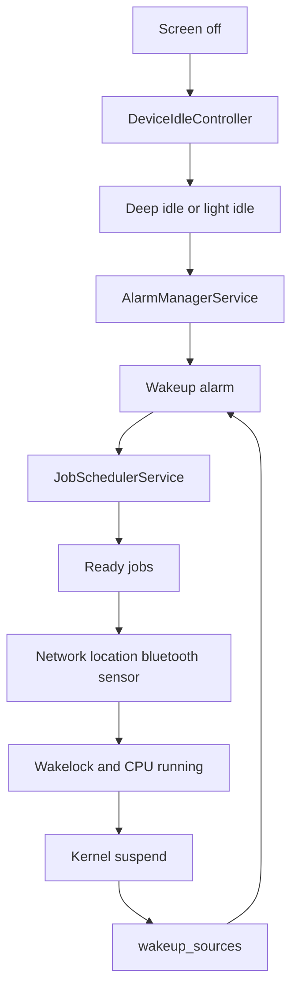

这张图里最重要的是闭环：系统不是“灭屏后就一直睡”，而是在 idle 和 maintenance 之间周期性切换。Android 允许后台任务在某些窗口内集中执行，目的是把零碎活动合并，减少频繁唤醒。

## 分析口径

后台功耗问题建议先分类：

| 类型 | 典型证据 | 主要方向 |
|------|----------|----------|
| 频繁 wakeup alarm | `dumpsys alarm` 中某 UID wakeup 次数高，`alarmtimer` 增长 | 查 Alarm 类型、周期、allow while idle |
| Doze 进不去 | `dumpsys deviceidle` 长期 ACTIVE/INACTIVE，或被 constraint 阻塞 | 查充电、屏幕、运动、定位、约束 |
| Doze 进去了但 maintenance 很频繁 | idle/maintenance 周期短，后台任务集中爆发 | 查 DeviceIdleController 参数和任务队列 |
| Job 频繁运行 | `dumpsys jobscheduler` 显示 job ready/run 次数高 | 查约束、deadline、quota、expedited/user-initiated |
| 网络/定位被任务拉起 | Perfetto 中 wakeup 后立刻出现 net/location 活动 | 查 Job/Alarm 后续动作 |
| Kernel 能睡但被唤醒 | `wakeup_sources` 的 `wakeup_count` 增长 | 查 alarmtimer/wlan/modem/sensor |

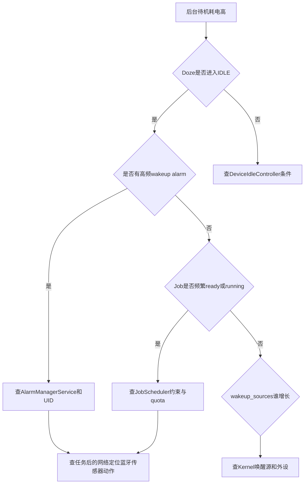

## 源码入口

AOSP14 / LOS21 中，Doze、Alarm、JobScheduler 相关服务位于 `frameworks/base/apex/jobscheduler/service/java`。

| 模块 | 源码入口 |
|------|----------|
| DeviceIdleController | [DeviceIdleController.java line 307](vscode://file//home/suhui/workspace/aosp/los21/frameworks/base/apex/jobscheduler/service/java/com/android/server/DeviceIdleController.java:307:1) |
| becomeInactiveIfAppropriateLocked | [DeviceIdleController.java line 3643](vscode://file//home/suhui/workspace/aosp/los21/frameworks/base/apex/jobscheduler/service/java/com/android/server/DeviceIdleController.java:3643:1) |
| stepIdleStateLocked | [DeviceIdleController.java line 3876](vscode://file//home/suhui/workspace/aosp/los21/frameworks/base/apex/jobscheduler/service/java/com/android/server/DeviceIdleController.java:3876:1) |
| AlarmManagerService | [AlarmManagerService.java line 209](vscode://file//home/suhui/workspace/aosp/los21/frameworks/base/apex/jobscheduler/service/java/com/android/server/alarm/AlarmManagerService.java:209:1) |
| AlarmManagerService.setImpl | [AlarmManagerService.java line 2258](vscode://file//home/suhui/workspace/aosp/los21/frameworks/base/apex/jobscheduler/service/java/com/android/server/alarm/AlarmManagerService.java:2258:1) |
| AlarmManagerService.triggerAlarmsLocked | [AlarmManagerService.java line 4324](vscode://file//home/suhui/workspace/aosp/los21/frameworks/base/apex/jobscheduler/service/java/com/android/server/alarm/AlarmManagerService.java:4324:1) |
| JobSchedulerService | [JobSchedulerService.java line 181](vscode://file//home/suhui/workspace/aosp/los21/frameworks/base/apex/jobscheduler/service/java/com/android/server/job/JobSchedulerService.java:181:1) |
| maybeQueueReadyJobsForExecutionLocked | [JobSchedulerService.java line 3970](vscode://file//home/suhui/workspace/aosp/los21/frameworks/base/apex/jobscheduler/service/java/com/android/server/job/JobSchedulerService.java:3970:1) |
| isReadyToBeExecutedLocked | [JobSchedulerService.java line 4041](vscode://file//home/suhui/workspace/aosp/los21/frameworks/base/apex/jobscheduler/service/java/com/android/server/job/JobSchedulerService.java:4041:1) |
| DeviceIdleJobsController | [DeviceIdleJobsController.java line 54](vscode://file//home/suhui/workspace/aosp/los21/frameworks/base/apex/jobscheduler/service/java/com/android/server/job/controllers/DeviceIdleJobsController.java:54:1) |
| JobStatus.isReady | [JobStatus.java line 2253](vscode://file//home/suhui/workspace/aosp/los21/frameworks/base/apex/jobscheduler/service/java/com/android/server/job/controllers/JobStatus.java:2253:1) |

## Doze不是一个状态

Doze 不是简单的“开/关”，而是一套状态机。大体可以分为 deep idle 和 light idle。

Deep idle 更接近用户理解的深度 Doze：设备静止、灭屏、未充电，经过一系列 sensing / locating 判断后进入 `IDLE`。Light idle 则更轻，屏幕灭后可以较快进入，用来约束一部分后台活动。

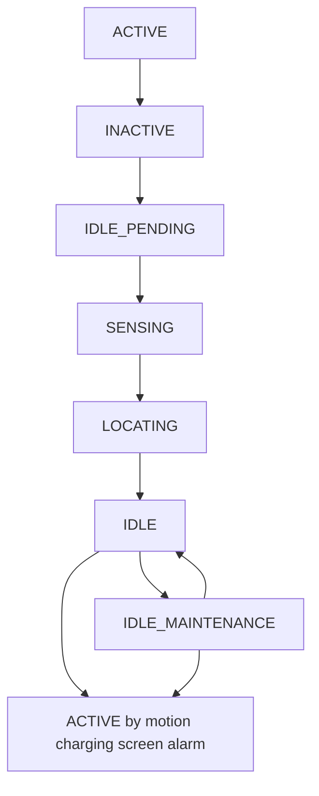

Light idle 的状态更轻：

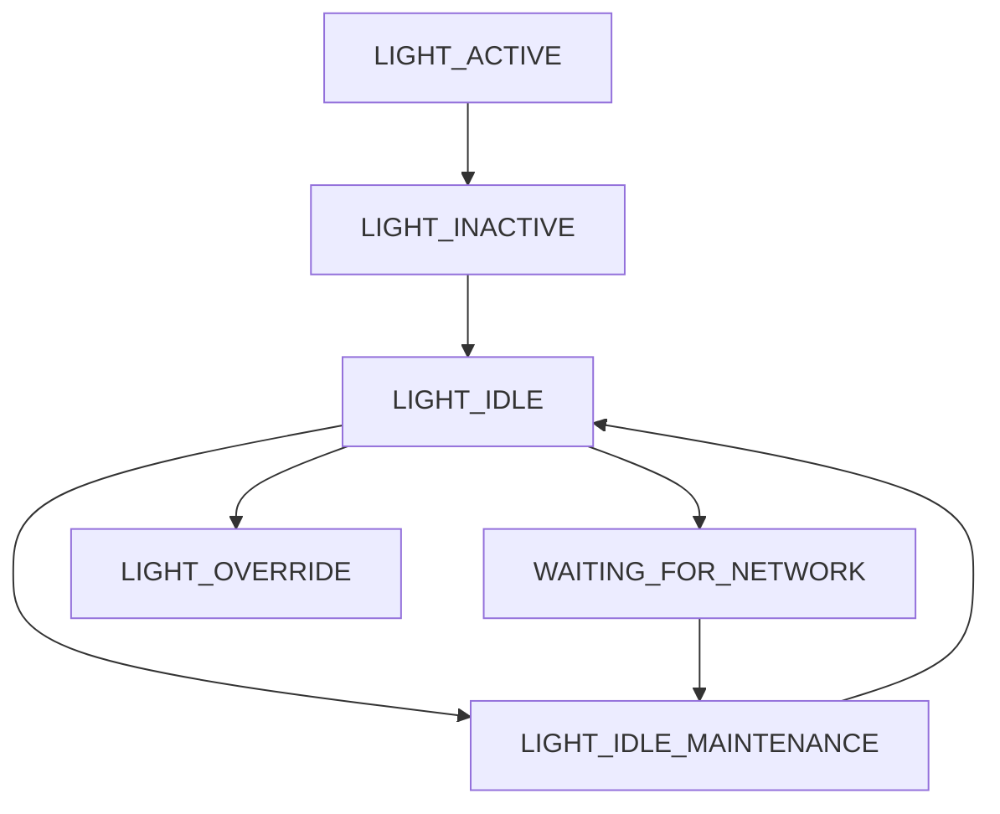

做功耗分析时要把这两个概念分开。`dumpsys deviceidle` 里可能出现 deep 还没 idle，但 light 已经 idle；也可能 deep idle 后 light 被 override。

## Doze进入条件

`becomeInactiveIfAppropriateLocked()` 是进入非活跃状态的关键入口。它不是无条件把系统推进 Doze，而是先检查一些硬条件。

源码里的判断可以翻译成：

```text
if not force idle:
    if charging:
        return
    if screen blocks inactive:
        return
    if emergency call active:
        return

if deep idle enabled:
    if quick doze enabled:
        move to QUICK_DOZE_DELAY
        schedule quick doze alarm
    else if current state is ACTIVE:
        move to INACTIVE
        schedule inactive timeout

if light idle enabled:
    move light state to LIGHT_INACTIVE
    schedule light idle alarm
```

这说明 Doze 进不去时，先不要看 Job，也不要看 Alarm，先看基础条件：

| 条件 | 检查命令 | 说明 |
|------|----------|------|
| 是否充电 | `adb shell dumpsys battery` | 充电会影响 DeviceIdleController 进入 idle |
| 屏幕是否真的 off/locked | `adb shell dumpsys power` | 屏幕亮或未锁可能阻止 inactive |
| 是否 force idle | `adb shell dumpsys deviceidle` | shell force-idle 是调试状态，不代表自然状态 |
| 是否有紧急通话 | radio/telecom 日志 | 紧急通话会阻止 idle |
| 是否有即将到来的 AlarmClock | `adb shell dumpsys alarm` | 即将响铃会让系统避免进入 idle |
| 是否有 idle constraint | `adb shell dumpsys deviceidle` | 其他系统组件可以注册约束阻止推进 |

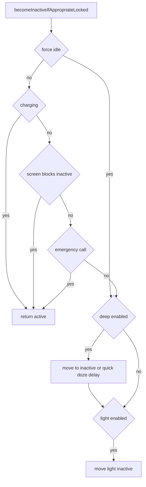

## Doze状态推进

`stepIdleStateLocked()` 负责 deep idle 状态推进。它做了几件很关键的事：

1. 如果有即将到来的 `AlarmClock`，系统会退出/避免 idle。
2. 如果有 blocking constraints 且不是 force idle，不继续推进。
3. `INACTIVE -> IDLE_PENDING`：开始监测运动。
4. `IDLE_PENDING -> SENSING`：等待传感器判断是否静止。
5. `SENSING -> LOCATING`：可选地做定位预取。
6. `LOCATING -> IDLE`：进入 deep idle。
7. `IDLE -> IDLE_MAINTENANCE`：打开维护窗口让任务集中执行。
8. `IDLE_MAINTENANCE -> IDLE`：维护结束后回到 idle，下一轮 idle 时间会拉长。

简化伪代码：

```text
stepIdleStateLocked(reason):
    if emergency call active:
        become active
        return

    if upcoming alarm clock:
        become active
        become inactive if appropriate
        return

    if blocking constraints exist and not force idle:
        return

    switch state:
        INACTIVE:
            start motion monitoring
            schedule IDLE_AFTER_INACTIVE_TIMEOUT
            move to IDLE_PENDING

        IDLE_PENDING:
            move to SENSING
            request motion sensor if available

        SENSING:
            move to LOCATING
            optionally request fused/GPS location

        LOCATING:
        QUICK_DOZE_DELAY:
        IDLE_MAINTENANCE:
            move to IDLE
            schedule next idle alarm
            increase next idle delay

        IDLE:
            acquire active idle wakelock
            move to IDLE_MAINTENANCE
            schedule maintenance budget
```

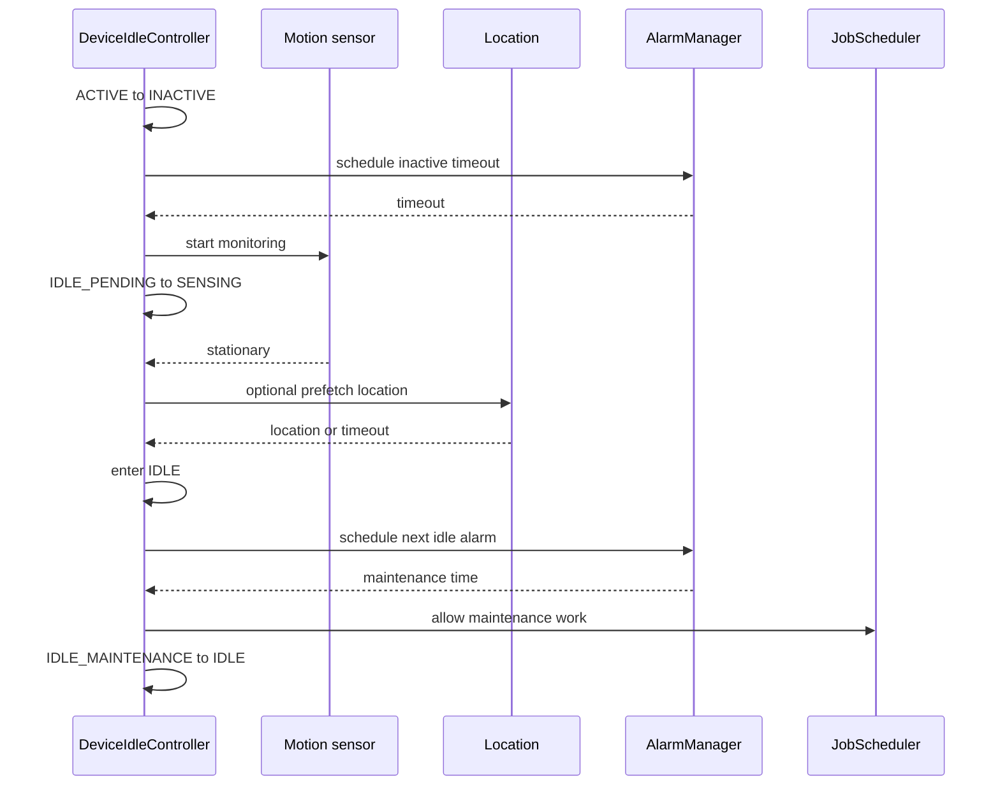

这里有一个功耗上的微妙点：Doze 自己也会设置 alarm 推进状态。也就是说，看到 alarmtimer 活动，不一定全是第三方应用，系统自己的 idle maintenance 也会触发。但第三方 wakeup alarm 如果太频繁，会打乱系统本来想合并执行的节奏。

## Doze调试命令

常用命令：

```bash
adb shell dumpsys deviceidle
adb shell dumpsys deviceidle step
adb shell dumpsys deviceidle force-idle
adb shell dumpsys deviceidle unforce
adb shell dumpsys deviceidle whitelist
adb shell dumpsys deviceidle tempwhitelist
```

测试前先看状态：

```bash
adb shell dumpsys battery
adb shell dumpsys power | grep -E "mWakefulness|mIsPowered|mPlugType|mStayOn|mHolding.*SuspendBlocker|mHal"
adb shell dumpsys deviceidle | sed -n '1,160p'
```

强制 Doze 用于验证机制，不等于真实待机：

```bash
adb shell dumpsys deviceidle force-idle
adb shell dumpsys deviceidle step
adb shell dumpsys deviceidle unforce
```

要注意：

- `force-idle` 会绕过一些自然进入条件。
- 插 USB 时 `charging`、`mIsPowered`、`mStayOn` 可能改变结果。
- `step` 是手动推进状态机，适合验证 Alarm/Job 在 Doze 下的行为。
- 真正的功耗报告要写清楚是自然 Doze 还是强制 Doze。

## Alarm功耗模型

Alarm 的功耗关键不在“定时”两个字，而在它是否会唤醒 AP，以及是否破坏任务合并。

Android Alarm 常见类型：

| 类型 | 基准时间 | 是否唤醒设备 | 功耗风险 |
|------|----------|--------------|----------|
| `RTC` | wall clock | 否 | 中 |
| `RTC_WAKEUP` | wall clock | 是 | 高 |
| `ELAPSED_REALTIME` | elapsed realtime | 否 | 中 |
| `ELAPSED_REALTIME_WAKEUP` | elapsed realtime | 是 | 高 |

常见 flag / 语义：

| 语义 | 功耗含义 |
|------|----------|
| exact alarm | 准点触发，合并空间小 |
| inexact alarm | 系统可调整窗口，便于批处理 |
| wakeup alarm | 可以把 suspend 中的 AP 唤醒 |
| allow while idle | Doze 期间也允许触发，风险更高 |
| alarm clock | 用户可感知闹钟，优先级高，会影响 idle |

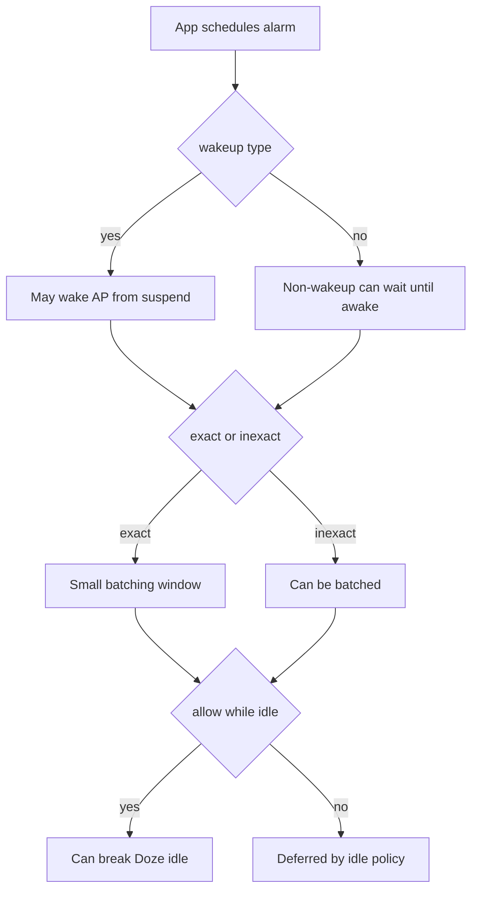

## Alarm set源码

`AlarmManagerService.setImpl()` 会先做一轮参数规范化和限制。

源码入口：

- [AlarmManagerService.setImpl line 2258](vscode://file//home/suhui/workspace/aosp/los21/frameworks/base/apex/jobscheduler/service/java/com/android/server/alarm/AlarmManagerService.java:2258:1)
- [AlarmManagerService.setImplLocked line 2363](vscode://file//home/suhui/workspace/aosp/los21/frameworks/base/apex/jobscheduler/service/java/com/android/server/alarm/AlarmManagerService.java:2363:1)

简化逻辑：

```text
setImpl(type, triggerAtTime, windowLength, interval, ...):
    validate PendingIntent or listener
    validate recurring interval
    validate alarm type
    fix negative trigger time
    convert wall clock time to elapsed realtime
    apply min futurity for non-core uid
    calculate triggerElapsed
    calculate maxElapsed by windowLength
    enforce minimum window for inexact alarms
    check max alarms per uid
    create Alarm object
    remove old matching alarm
    add to alarm store
```

这里有几个值得注意的功耗点：

| 源码行为 | 功耗含义 |
|----------|----------|
| 过短 repeat interval 会被拉长 | 系统防止应用用超短周期狂刷 alarm |
| 非 core uid 有 min futurity | 防止应用设置立即触发的 alarm spam |
| inexact window 太短会被扩展 | 给系统批处理空间 |
| 每个 UID 有 alarm 数量上限 | 防止大量并发 alarm 占用系统资源 |
| 新 alarm 会 remove 旧匹配项 | 重复设置同一个 PendingIntent 会覆盖 |

所以排查时不能只问“有没有 alarm”，还要问：

- 它是 wakeup 还是 non-wakeup？
- 它是 exact 还是 inexact？
- 它是否 repeating？
- 它是否 allow while idle？
- 它的触发窗口是否过小？
- 它是否来自后台受限 UID？

## Alarm trigger源码

`triggerAlarmsLocked()` 负责把到期 alarm 从 store 里取出来，决定是否投递。

源码入口：

- [AlarmManagerService.triggerAlarmsLocked line 4324](vscode://file//home/suhui/workspace/aosp/los21/frameworks/base/apex/jobscheduler/service/java/com/android/server/alarm/AlarmManagerService.java:4324:1)
- [AlarmManagerService.deliverAlarmsLocked line 4443](vscode://file//home/suhui/workspace/aosp/los21/frameworks/base/apex/jobscheduler/service/java/com/android/server/alarm/AlarmManagerService.java:4443:1)

简化逻辑：

```text
triggerAlarmsLocked(now):
    pendingAlarms = remove alarms whose delivery time has passed
    for alarm in pendingAlarms:
        if background restricted:
            move to mPendingBackgroundAlarms
            continue

        add to triggerList

        if FLAG_WAKE_FROM_IDLE:
            write device idle wake-from-idle event

        if alarm is pending idle until:
            end idle and adjust deliveries

        if repeating:
            calculate missed count
            schedule next recurrence

        if alarm.wakeup:
            wakeUps++

    calculate delivery priorities
    sort triggerList
    return wakeUps
```

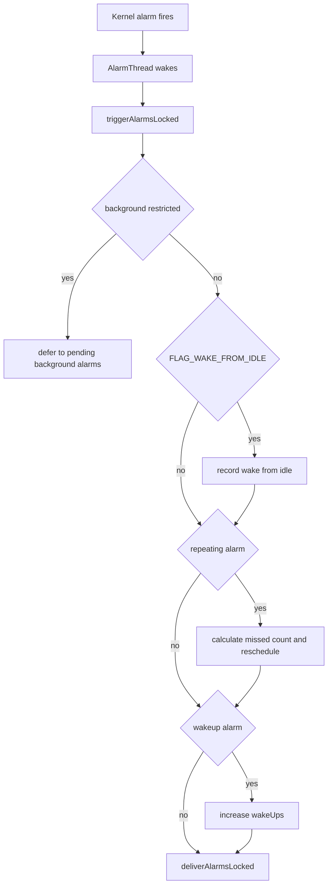

这里能解释很多现象：

1. 后台受限 UID 的 alarm 可能已经到期，但不会马上投递，而是进入 `mPendingBackgroundAlarms`。
2. repeating alarm 如果设备睡过头，会计算错过了几次，但不一定每次都逐个唤醒。
3. wakeup alarm 的次数会进入统计，最终在 `dumpsys alarm` 和 BatteryStats 中体现。
4. `FLAG_WAKE_FROM_IDLE` 会打穿 idle 语义，必须谨慎看待。

## Non-wakeup延迟

AlarmManagerService 还有一个很重要的优化：灭屏后可以延迟 non-wakeup alarm，让它们合并投递。

源码里 `currentNonWakeupFuzzLocked()` 的策略大意是：

| 灭屏后时间 | non-wakeup alarm 最多延迟 |
|------------|---------------------------|
| 小于 5 分钟 | 最多约 2 分钟 |
| 小于 30 分钟 | 最多约 15 分钟 |
| 更久 | 最多约 1 小时 |

这体现了 Android 的后台省电策略：灭屏越久，系统越倾向于把非唤醒任务攒起来批量执行。

所以应用如果把普通后台刷新写成 `ELAPSED_REALTIME_WAKEUP`，就是主动绕过这类合并优化。


## Alarm调试命令

基础命令：

```bash
adb shell dumpsys alarm > alarm.txt
adb shell dumpsys alarm | grep -i wakeup
adb shell dumpsys alarm | grep -i "allow while idle"
adb shell dumpsys alarm | grep -i "pending"
```

结合 BatteryStats：

```bash
adb shell dumpsys batterystats --charged > bs.txt
adb shell dumpsys batterystats --history > history.txt
adb shell dumpsys batterystats --history | grep -i "alarm"
```

结合 wakeup source：

```bash
adb shell cat /sys/kernel/debug/wakeup_sources | grep -i alarm
adb shell cat /sys/kernel/debug/wakeup_sources > ws_before.txt
sleep 600
adb shell cat /sys/kernel/debug/wakeup_sources > ws_after.txt
```

分析 `dumpsys alarm` 时重点看：

| 信息 | 意义 |
|------|------|
| UID / package | 谁设置的 alarm |
| wakeup count | 是否唤醒系统 |
| pending alarm | 是否到期但被限制 |
| allow while idle | 是否允许 Doze 期间触发 |
| alarm clock | 是否用户可见闹钟 |
| repeating interval | 是否周期触发 |
| last dispatch time | 最近是否频繁投递 |

## JobScheduler功耗模型

JobScheduler 的目标不是让后台任务立即执行，而是让任务在满足约束时合并执行。

常见约束：

| 约束 | 功耗意义 |
|------|----------|
| required network | 避免没网络时空跑，或等待合适网络 |
| charging | 大任务放到充电时执行 |
| battery not low | 电量低时避免后台任务 |
| idle | 等设备空闲时执行 |
| storage not low | 存储不足时避免任务失败重试 |
| timing delay | 最早执行时间 |
| deadline | 最晚执行时间，可能打破部分约束 |
| quota | 根据 standby bucket 限制后台执行预算 |
| device not dozing | Doze 中默认不让普通 job 跑 |

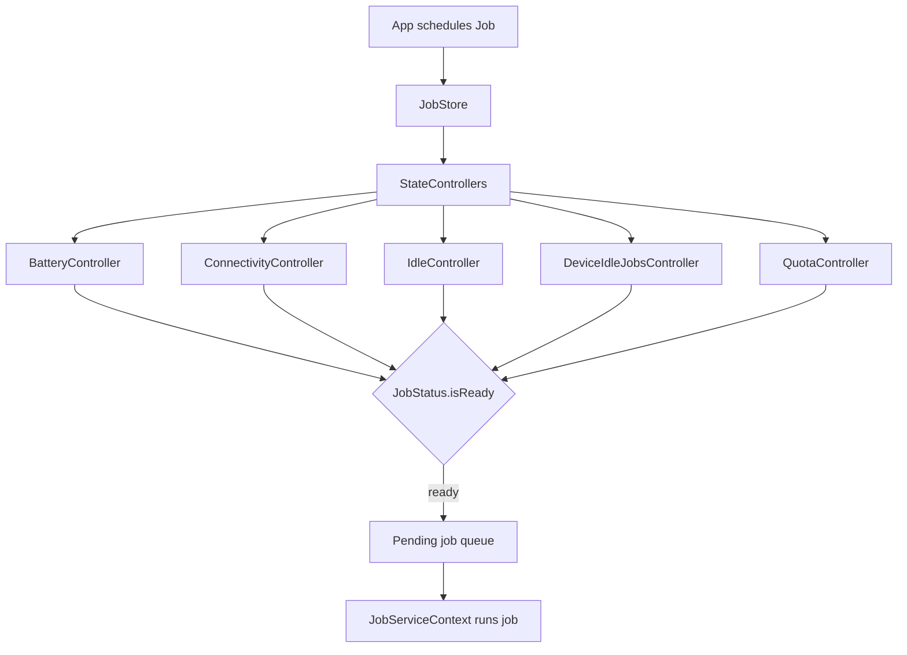

## Job ready源码

`maybeQueueReadyJobsForExecutionLocked()` 会重新评估所有 job，把 ready 的 job 放进待执行队列。

源码入口：

- [JobSchedulerService.maybeQueueReadyJobsForExecutionLocked line 3970](vscode://file//home/suhui/workspace/aosp/los21/frameworks/base/apex/jobscheduler/service/java/com/android/server/job/JobSchedulerService.java:3970:1)
- [JobSchedulerService.isReadyToBeExecutedLocked line 4041](vscode://file//home/suhui/workspace/aosp/los21/frameworks/base/apex/jobscheduler/service/java/com/android/server/job/JobSchedulerService.java:4041:1)
- [JobSchedulerService.evaluateControllerStatesLocked line 4119](vscode://file//home/suhui/workspace/aosp/los21/frameworks/base/apex/jobscheduler/service/java/com/android/server/job/JobSchedulerService.java:4119:1)

简化逻辑：

```text
maybeQueueReadyJobsForExecutionLocked:
    remove pending check messages
    clear changed job list
    clear pending job queue
    stop non-ready active jobs
    for each job:
        maybe queue if ready
    post process queue

isReadyToBeExecutedLocked(job):
    jobReady = job.isReady() or evaluate controller states
    if not jobReady:
        return false

    if job not in store:
        return false
    if user not started:
        return false
    if uid is backing up:
        return false
    if restricted:
        return false
    if already pending or active:
        return false

    return component usable
```

`JobStatus.isReady()` 还会继续看隐式约束：

源码入口：

- [JobStatus.isReady line 2253](vscode://file//home/suhui/workspace/aosp/los21/frameworks/base/apex/jobscheduler/service/java/com/android/server/job/controllers/JobStatus.java:2253:1)
- [JobStatus.private isReady line 2337](vscode://file//home/suhui/workspace/aosp/los21/frameworks/base/apex/jobscheduler/service/java/com/android/server/job/controllers/JobStatus.java:2337:1)

它的核心判断可以翻译成：

```text
if not within quota and not dynamic satisfied and not expedited:
    return false
if standby bucket is NEVER:
    return false

return readyNotDozing
    and readyNotRestrictedInBg
    and serviceProcessName exists
    and (deadline satisfied or normal constraints satisfied)
```

这几个隐式约束对功耗非常关键：

| 隐式约束 | 意义 |
|----------|------|
| `mReadyNotDozing` | Doze 中普通 job 不能随便跑 |
| `mReadyNotRestrictedInBg` | 后台受限时不能随便跑 |
| `mReadyWithinQuota` | standby bucket / quota 限制后台预算 |
| `mReadyTareWealth` | TARE 经济模型约束 |
| `deadline` | deadline 满足可能让 job 跑起来 |
| expedited job | 加急任务可绕过一部分等待，但仍受系统管理 |

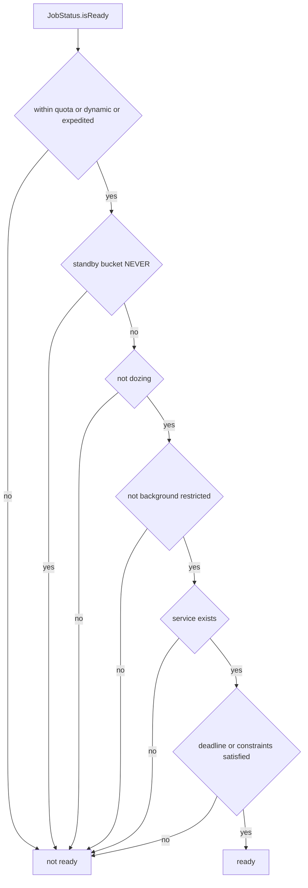

## Doze和JobScheduler交互

`DeviceIdleJobsController` 专门监听 Doze 状态变化。

源码入口：

- [DeviceIdleJobsController constructor line 129](vscode://file//home/suhui/workspace/aosp/los21/frameworks/base/apex/jobscheduler/service/java/com/android/server/job/controllers/DeviceIdleJobsController.java:129:1)
- [DeviceIdleJobsController.updateIdleMode line 153](vscode://file//home/suhui/workspace/aosp/los21/frameworks/base/apex/jobscheduler/service/java/com/android/server/job/controllers/DeviceIdleJobsController.java:153:1)

构造函数会注册这些广播：

```text
PowerManager.ACTION_DEVICE_IDLE_MODE_CHANGED
PowerManager.ACTION_LIGHT_DEVICE_IDLE_MODE_CHANGED
PowerManager.ACTION_POWER_SAVE_WHITELIST_CHANGED
PowerManager.ACTION_POWER_SAVE_TEMP_WHITELIST_CHANGED
```

`updateIdleMode(enabled)` 的核心行为：

```text
if device idle enabled:
    remove pending background job processing message
    evaluate all jobs under device idle restriction
else:
    evaluate foreground uid jobs and expedited jobs immediately
    delay background jobs processing by 3 seconds

notify JobSchedulerService that device idle state changed
```

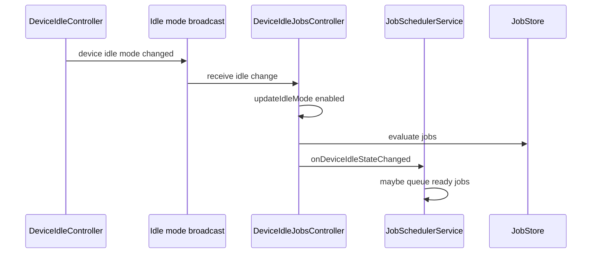

这就是为什么很多后台 job 在灭屏后不会马上跑，但在 maintenance window 或退出 Doze 后突然集中运行。系统不是漏调度，而是在合并和延迟。

## Job调试命令

基础命令：

```bash
adb shell dumpsys jobscheduler > jobs.txt
adb shell dumpsys jobscheduler <package>
adb shell cmd jobscheduler run -f <package> <jobId>
adb shell cmd jobscheduler timeout <package> <jobId>
```

看 UID / package：

```bash
adb shell dumpsys jobscheduler | grep -n "<package>"
adb shell dumpsys jobscheduler | grep -Ei "READY|RUNNING|WAITING|not ready|doz|quota|deadline|connectivity|charging|idle"
```

看 app standby：

```bash
adb shell am get-standby-bucket <package>
adb shell am set-standby-bucket <package> restricted
adb shell am set-standby-bucket <package> active
```

看电量和省电：

```bash
adb shell dumpsys battery
adb shell dumpsys power
adb shell settings get global low_power
```

强制 job 只用于验证 JobService 逻辑，不代表自然调度：

```bash
adb shell cmd jobscheduler run -f com.example.app 1001
```

如果强制运行正常，但自然待机下不运行，通常说明约束没有满足，不是 JobService 本身坏了。

## 后台任务和无线外设

Alarm 和 Job 本身通常只是“触发器”。真正耗电的大头经常在触发后的动作：

| 后续动作 | 常见功耗路径 | 观测命令 |
|----------|--------------|----------|
| 网络心跳 | AP resume、modem/wlan 活跃、弱网重传 | `dumpsys connectivity`、`dumpsys netstats`、Perfetto |
| Wi-Fi scan | wlan wakeup、lowi-server 活动 | `dumpsys wifi`、`wakeup_sources` |
| 定位 | GNSS、Fused location、Loc_hal | `dumpsys location`、`wakeup_sources` |
| BLE scan | bluetooth controller、HAL lock | `dumpsys bluetooth_manager` |
| sensor wakeup | sensor hub、AP wakeup | `dumpsys sensorservice` |
| Sync/backup | Job + network + wakelock | `dumpsys jobscheduler`、`dumpsys batterystats` |

完整链路经常长这样：

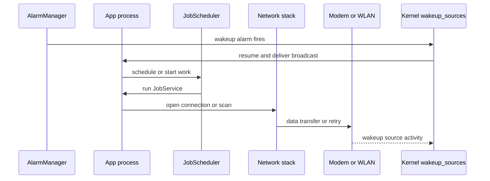

所以文章和报告里不能只写“Alarm 多”。更完整的表述是：

```text
UID xxx 每 60 秒触发一次 ELAPSED_REALTIME_WAKEUP。
每次触发后 1 秒内出现 JobService 运行，随后 Wi-Fi/移动网络发送数据。
wakeup_sources 中 alarmtimer 和 wlan/modem 相关项在测试窗口内同步增长。
因此它不是单纯 alarm 统计高，而是 alarm 驱动的后台网络轮询破坏待机。
```

## Perfetto时间线

后台功耗最好用时间线证明，因为 dumpsys 只能给你状态和累计值。

建议抓这些：

```bash
adb shell atrace --async_start -b 16384 power sched freq idle am wm binder_driver
adb shell input keyevent 26
sleep 300
adb shell atrace --async_stop -z -o /data/local/tmp/bg_power_trace.html
adb pull /data/local/tmp/bg_power_trace.html .
```

如果用 Perfetto config，关注：

- `power/suspend_resume`
- `power/cpu_idle`
- `sched/sched_switch`
- `irq/irq_handler_entry`
- `timer/timer_expire_entry`
- `binder/binder_transaction`
- `am` / system_server 相关 slices

时间线里要找：

| 时间点 | 看什么 |
|--------|--------|
| 灭屏点 | display off、interactive false |
| Doze 状态变化 | device idle on/off、maintenance |
| wakeup alarm | alarm dispatch、UID/package |
| job running | JobServiceContext、app process wake |
| 网络活动 | netd、system_server、app、modem/wlan 相关线程 |
| resume 来源 | suspend_resume、IRQ、wakeup_source |

## 采集脚本

同样要注意 USB 会破坏自然待机。后台任务 case 也建议本地落盘：

```bash
adb push collect_bg_power.sh /data/local/tmp/
adb shell chmod 755 /data/local/tmp/collect_bg_power.sh
adb shell 'nohup /data/local/tmp/collect_bg_power.sh 600 >/data/local/tmp/collect_bg_power.nohup 2>&1 &'
adb shell input keyevent 26
```

脚本示例：

```bash
#!/system/bin/sh

OUT=/data/local/tmp/bg_power_case_$(date +%Y%m%d_%H%M%S)
DURATION=${1:-600}
mkdir -p "$OUT"

WS=/sys/kernel/debug/wakeup_sources
if [ ! -f "$WS" ]; then
    WS=/d/wakeup_sources
fi

date > "$OUT/meta.txt"
getprop ro.product.device >> "$OUT/meta.txt"
getprop ro.board.platform >> "$OUT/meta.txt"
getprop ro.build.version.release >> "$OUT/meta.txt"

dumpsys power > "$OUT/power_before.txt"
dumpsys battery > "$OUT/battery_before.txt"
dumpsys deviceidle > "$OUT/deviceidle_before.txt"
dumpsys alarm > "$OUT/alarm_before.txt"
dumpsys jobscheduler > "$OUT/jobs_before.txt"
dumpsys batterystats --history > "$OUT/history_before.txt"
cat "$WS" > "$OUT/wakeup_sources_before.txt"
dmesg > "$OUT/dmesg_before.txt"

sleep "$DURATION"

date >> "$OUT/meta.txt"
dumpsys power > "$OUT/power_after.txt"
dumpsys battery > "$OUT/battery_after.txt"
dumpsys deviceidle > "$OUT/deviceidle_after.txt"
dumpsys alarm > "$OUT/alarm_after.txt"
dumpsys jobscheduler > "$OUT/jobs_after.txt"
dumpsys batterystats --history > "$OUT/history_after.txt"
cat "$WS" > "$OUT/wakeup_sources_after.txt"
dmesg > "$OUT/dmesg_after.txt"
logcat -b events -d > "$OUT/events_logcat_after.txt"
logcat -b system -d > "$OUT/system_logcat_after.txt"

tar -czf "$OUT.tar.gz" -C "$(dirname "$OUT")" "$(basename "$OUT")"
echo "$OUT.tar.gz"
```

## 案例一：每分钟wakeup alarm

现象：

```text
灭屏待机 30 分钟，设备能进入 suspend，但平均电流高。
wakeup_sources 中 alarmtimer wakeup_count 持续增长。
dumpsys alarm 中某 UID wakeup dispatch 次数高。
Perfetto 显示约每 60 秒 resume 一次。
```

分析路径：

1. `dumpsys power` 确认 PMS 没有长期持有 suspend blocker。
2. `dmesg` 确认系统能进入 suspend。
3. `wakeup_sources` 对比 before/after，确认 `alarmtimer` 或同类 alarm wake source 增长。
4. `dumpsys alarm` 找到 wakeup 次数增长的 UID/package。
5. `dumpsys jobscheduler` 看 alarm 后是否触发 job。
6. Perfetto 看 alarm dispatch 后是否出现网络、定位或 wakelock。

报告写法：

```text
该问题不是系统无法 suspend，而是 suspend 后被周期性 wakeup alarm 唤醒。
测试窗口 30 分钟内 alarmtimer wakeup_count 增长 xx 次，目标 UID 的 wakeup alarm dispatch 增长 xx 次。
每次唤醒后 app 触发网络请求，导致 AP 和 wlan/modem 活跃。
建议将该周期任务改为 inexact/non-wakeup，或迁移到带网络约束的 JobScheduler，并增加退避策略。
```

反例写法：

```text
alarmtimer 很高，所以 AlarmManager 有问题。
```

这不够。`alarmtimer` 是机制，不是 root cause。必须找到 UID、任务语义和后续动作。

## 案例二：Doze进不去

现象：

```text
dumpsys deviceidle:
    mState=ACTIVE 或 INACTIVE 长期不动

dumpsys battery:
    powered=true

dumpsys power:
    mIsPowered=true
    mStayOn=true
```

分析：

这不是 Alarm 或 Job 的第一现场。设备还没自然进入 Doze 条件，后台限制没有真正生效。常见原因：

- USB 连接导致充电状态。
- 开发者选项 stay awake。
- 屏幕没有真正锁定。
- 有 motion / location / constraint 阻止推进。
- 用了 `force-idle` 后忘记 `unforce`，状态被调试命令干扰。

命令：

```bash
adb shell dumpsys battery
adb shell dumpsys power | grep -E "mIsPowered|mPlugType|mStayOn|mWakefulness"
adb shell dumpsys deviceidle | sed -n '1,180p'
adb shell settings get global stay_on_while_plugged_in
```

报告写法：

```text
当前测试条件下设备未满足自然 Doze 前提。
由于 USB 供电和 stay awake，DeviceIdleController 长期停留在 ACTIVE/INACTIVE。
该数据只能用于机制观察，不能用于自然待机功耗结论。
需要改用本地脚本落盘并断开 USB 复测。
```

## 案例三：Job在maintenance窗口集中爆发

现象：

```text
设备进入 IDLE 后，周期性进入 IDLE_MAINTENANCE。
maintenance 窗口内多个 UID 的 Job 同时运行。
窗口内 CPU、网络、wlan/modem 活动明显。
```

这不一定是 bug。Doze 设计上就是允许维护窗口集中处理后台任务。问题在于：

- maintenance 是否过于频繁。
- 单个窗口内任务是否太重。
- 是否有 UID 借 deadline / expedited job / allowlist 过度运行。
- 任务是否触发大量网络/定位。

分析命令：

```bash
adb shell dumpsys deviceidle > deviceidle.txt
adb shell dumpsys jobscheduler > jobs.txt
adb shell dumpsys netstats > netstats.txt
adb shell dumpsys batterystats --history > history.txt
```

报告写法：

```text
后台任务主要集中在 Doze maintenance window 内运行，符合系统合并调度机制。
但 UID xxx 在每个 maintenance window 都触发网络同步，单次运行时长约 xx 秒，导致窗口内电流峰值明显。
建议减少同步频率、增加网络批处理、避免每个 maintenance window 都执行全量任务。
```

## 案例四：Job deadline打破等待

现象：

```text
Job 设置了较短 deadline。
即使网络/idle 等约束不理想，deadline 到期后仍被调度。
灭屏后出现规律性 JobService 运行。
```

源码依据：

`JobStatus.isReady()` 中 deadline 是一个强信号：在满足隐式约束后，`mReadyDeadlineSatisfied` 可以让 job ready，不必等所有普通约束都满足。

排查：

```bash
adb shell dumpsys jobscheduler <package> | grep -Ei "deadline|ready|constraints|RUNNING|WAITING"
```

报告写法：

```text
该 UID 后台 job 不是被 Alarm 直接唤醒，而是 JobScheduler 在 deadline 满足后调度。
由于 deadline 周期过短，任务在待机窗口内频繁运行。
建议拉长 deadline，或改为更宽松的 timing delay + network constraint，让系统有合并空间。
```

## 案例五：后台受限后的pending alarm

现象：

```text
应用处于 restricted bucket 或被用户限制后台。
dumpsys alarm 中能看到 pending background alarms。
退出限制或进入某个允许窗口后，多个 alarm 集中投递。
```

源码依据：

`triggerAlarmsLocked()` 中，如果 `isBackgroundRestricted(alarm)` 为 true，alarm 不会立即进 `triggerList`，而是进入 `mPendingBackgroundAlarms`。

分析：

- 这说明系统限制生效了。
- 集中投递不一定是系统异常，可能是之前被攒起来的 alarm 到了可投递窗口。
- 如果集中投递后又触发大量网络/Job，仍可能造成短时间电流峰值。

命令：

```bash
adb shell am get-standby-bucket <package>
adb shell dumpsys alarm | grep -n -i "pending background"
adb shell dumpsys jobscheduler <package>
```

报告写法：

```text
应用后台受限期间 alarm 被延迟进入 pending background alarms。
解除限制或进入允许窗口后，历史积压 alarm 被集中投递，随后触发多个后台任务。
建议应用侧合并积压任务，启动后只执行一次最新状态同步，不要按错过次数逐个补偿。
```

## 案例六：定位后台任务拉起lowi和Loc_hal

现象：

```text
wakeup_sources:
    lowi-server wakeup_count 增长
    Loc_hal event_count 增长

dumpsys alarm/jobscheduler:
    某 package 有周期任务

dumpsys location:
    后台存在 location request
```

分析：

这类问题不能只说“定位耗电”。要证明链路：

```text
Alarm/Job 触发 -> App 请求定位 -> Fused/GNSS/Wi-Fi location 活动 -> Loc_hal/lowi-server wakeup source 增长 -> AP 周期性 resume
```

命令：

```bash
adb shell dumpsys location > location.txt
adb shell dumpsys alarm > alarm.txt
adb shell dumpsys jobscheduler > jobs.txt
adb shell cat /sys/kernel/debug/wakeup_sources > ws.txt
```

AB 对比：

| Case | Wi-Fi | Location | 预期 |
|------|-------|----------|------|
| baseline | off | off | lowi/Loc_hal delta 低 |
| Wi-Fi only | on | off | lowi 可能有少量活动 |
| Location only | off/on | on | Loc_hal/GNSS 相关增长 |
| App disabled | 原状态 | 原状态 | UID 相关 alarm/job 消失 |

报告写法：

```text
定位开启后，UID xxx 的周期 Job 会触发 location request。
测试窗口内 Loc_hal 和 lowi-server 的 wakeup delta 明显高于 baseline。
该问题属于后台定位任务驱动的周期性唤醒，不是单纯 Kernel wakeup source 异常。
```

## 优化原则

对应用或系统服务来说，后台任务省电不是“不做事”，而是“少唤醒、可合并、有约束、有退避”。

| 错误做法 | 更好的做法 |
|----------|------------|
| 每分钟 `ELAPSED_REALTIME_WAKEUP` 轮询 | 使用 inexact alarm 或 JobScheduler |
| 后台任务无网络也启动 | 增加 network constraint |
| 失败后立即重试 | 指数退避，弱网下降低频率 |
| 每次唤醒都全量同步 | 增量同步，合并积压任务 |
| Doze 中频繁 allow while idle | 只给用户可感知或强时效任务使用 |
| 频繁 exact alarm | 放宽 window，让系统批处理 |
| deadline 设置过短 | 拉长 deadline，避免准周期唤醒 |
| 后台定位高精度常驻 | 降低精度、增加间隔、前台化用户可见场景 |

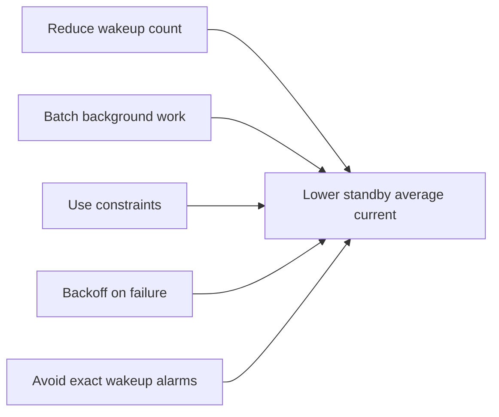

## 排查清单

拿到“灭屏后台耗电高”问题，可以按这个顺序：

1. 确认场景：USB、充电、屏幕、Wi-Fi、BT、定位、移动数据、温度。
2. `dumpsys power`：确认是否具备 suspend 前提。
3. `dumpsys deviceidle`：确认 deep/light idle 状态。
4. `dumpsys alarm`：找 wakeup alarm、allow while idle、pending background。
5. `dumpsys jobscheduler`：找 running/ready job、deadline、quota、doze restriction。
6. `dumpsys batterystats --history`：看 UID 的 alarm/job/wakelock 时间线。
7. `wakeup_sources` before/after：确认 alarmtimer、wlan、modem、sensor、location 相关 delta。
8. Perfetto：把 alarm dispatch、job running、网络/定位动作和 suspend/resume 串起来。
9. 做 AB：关闭定位、Wi-Fi、BT、移动数据，或禁用目标应用，对比 delta。
10. 写结论：区分“无法 Doze”“能 Doze 但被唤醒”“maintenance 内任务重”“外设唤醒”。

## 复盘报告写法

```text
1. 场景
   设备：
   Android版本：
   USB是否连接：
   Wi-Fi/BT/定位/移动数据：
   测试时长：
   电池温度变化：

2. Doze状态
   deep state：
   light state：
   是否force idle：
   是否charging：
   是否有blocking constraints：

3. Alarm证据
   Top wakeup UID/package：
   allow while idle：
   repeating interval：
   pending background alarms：

4. Job证据
   Top running/ready jobs：
   constraints：
   deadline：
   quota/standby bucket：
   doze restriction：

5. Kernel证据
   alarmtimer delta：
   wlan/modem/location/sensor delta：
   suspend/resume是否发生：

6. 时间线
   resume时间：
   alarm dispatch：
   job start：
   网络/定位/蓝牙/传感器动作：
   job finish：
   再次suspend：

7. 结论
   问题类型：
   责任UID/模块：
   优化建议：
```

## 我会这样说明

如果被问到“Doze 怎么限制后台功耗”，我会这样说：

```text
Doze 由 DeviceIdleController 管理，不是简单开关，而是 deep idle 和 light idle 两套状态机。
灭屏、未充电、静止等条件满足后，系统从 ACTIVE 进入 INACTIVE，再经过 sensing、locating 等阶段进入 IDLE。
IDLE 期间普通后台活动会被限制，Alarm 和 Job 不会随便执行。
系统会周期性打开 IDLE_MAINTENANCE 窗口，让延迟的后台任务集中运行，减少频繁唤醒。
```

如果问“Alarm 和 JobScheduler 的功耗差异”，我会这样说：

```text
Alarm 更像时间触发器，尤其是 RTC_WAKEUP 或 ELAPSED_REALTIME_WAKEUP，会把设备从 suspend 唤醒。
JobScheduler 更像约束调度器，它会综合网络、充电、idle、电量、quota、Doze 等条件，把任务合并到合适窗口运行。
所以普通后台同步不应该用高频 exact wakeup alarm 轮询，而应该尽量用 JobScheduler 加约束和退避。
```

如果问“后台待机耗电怎么查”，我会这样说：

```text
先看 dumpsys power 和 dumpsys deviceidle，确认系统是否进入 Doze 和 suspend 前提。
再看 dumpsys alarm 找 wakeup alarm 和 allow-while-idle，再看 dumpsys jobscheduler 找 ready/running job、deadline、quota 和 doze restriction。
同时用 batterystats history 串 UID 时间线，用 wakeup_sources before/after 验证 alarmtimer、wlan、modem、location 等唤醒源。
最后用 Perfetto 把 resume、alarm dispatch、job start、网络/定位动作和再次 suspend 串起来。
```

## 复盘

后台功耗的核心是唤醒频率和合并程度。

- Doze 负责限制后台活动，并用 maintenance window 集中处理。
- Alarm 如果是 wakeup/exact/allow-while-idle，就可能直接破坏待机。
- JobScheduler 通过约束、quota、Doze 状态来决定任务是否能跑。
- Alarm/Job 往往只是触发器，真正耗电可能发生在网络、定位、蓝牙、传感器。
- 分析时必须看时间线和 delta，不能只看单个 dumpsys 截图。

我的判断口径：

```text
后台功耗不是看任务有没有跑，而是看它有没有频繁把系统叫醒，以及叫醒后做了什么。
```
