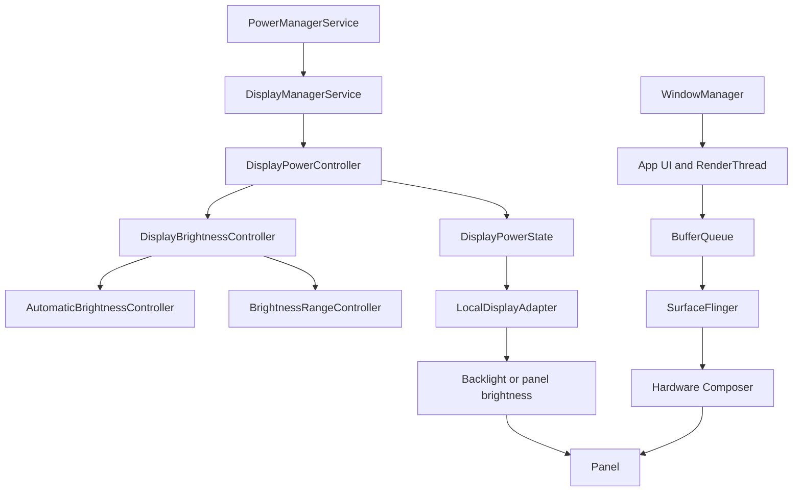
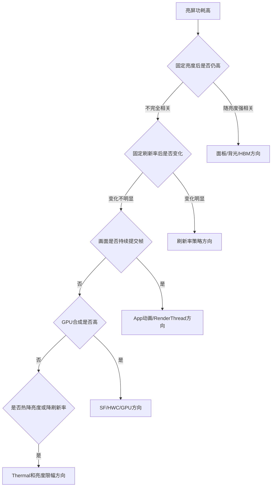
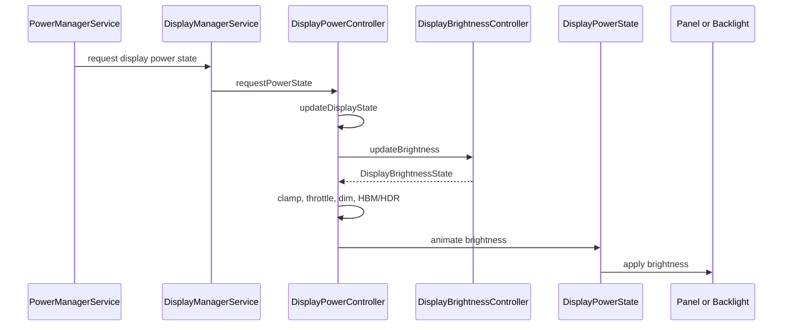
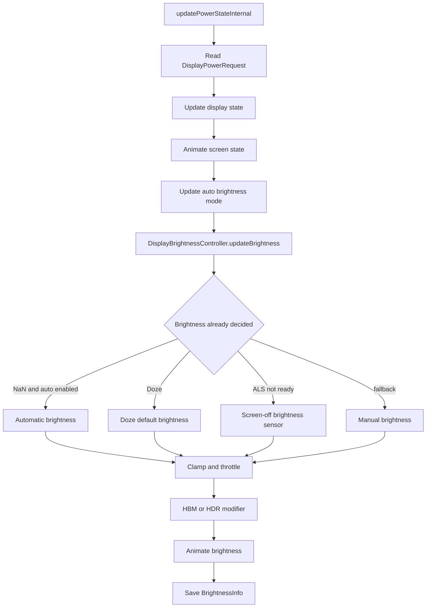
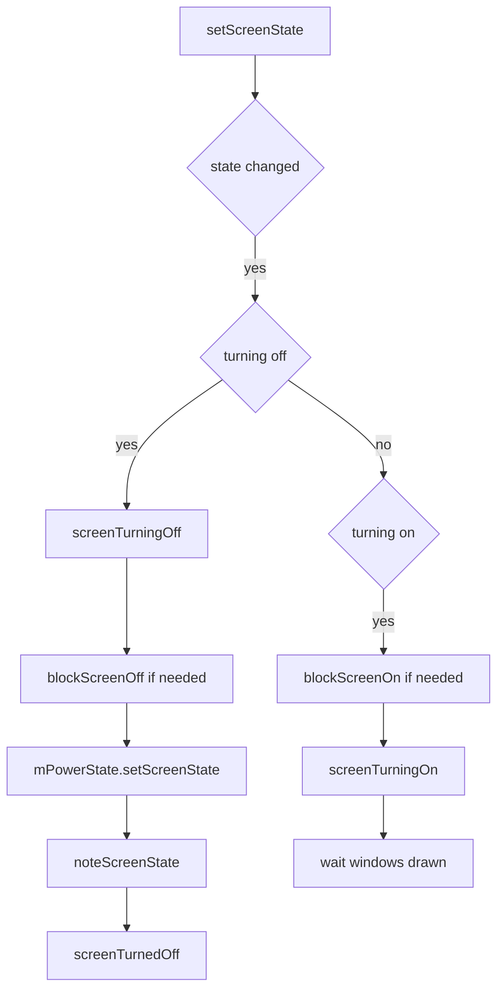
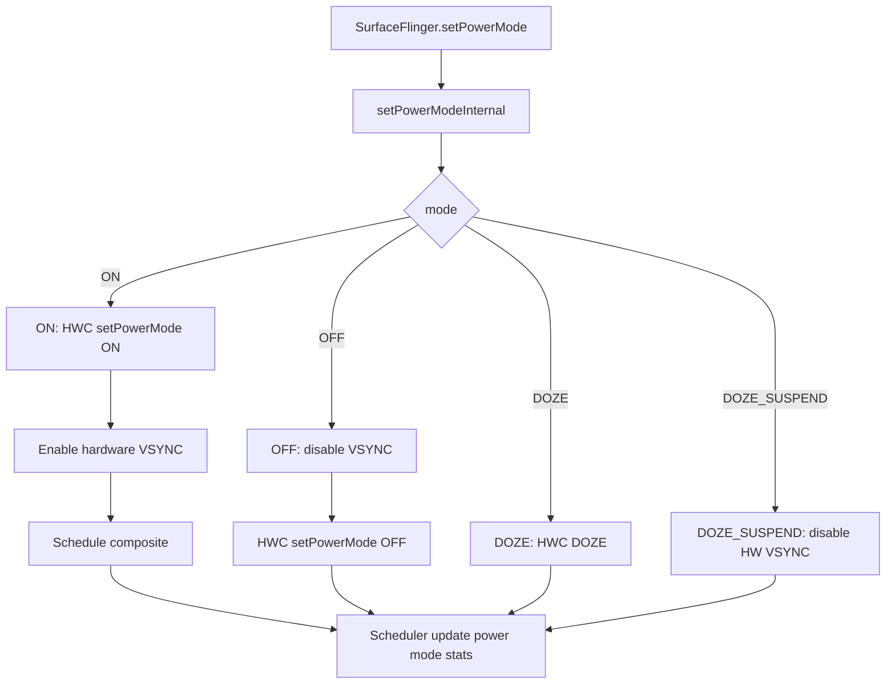
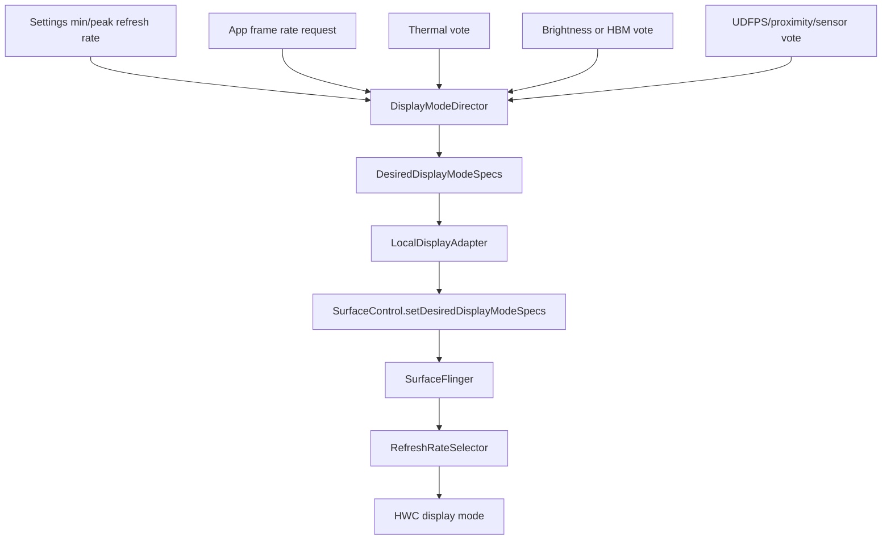
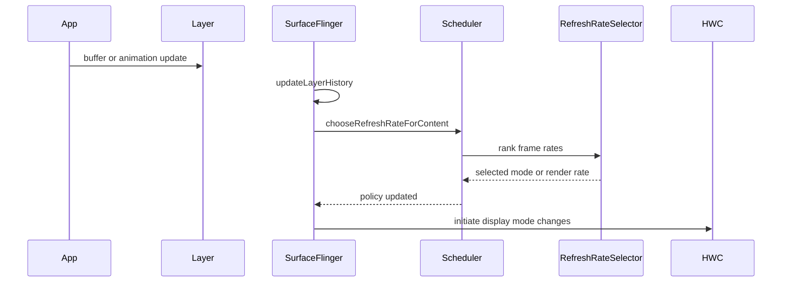
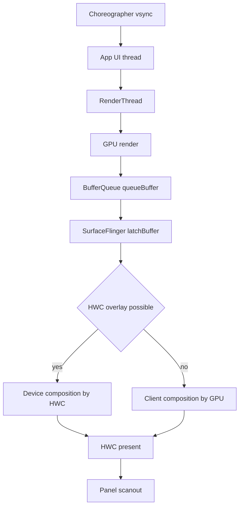
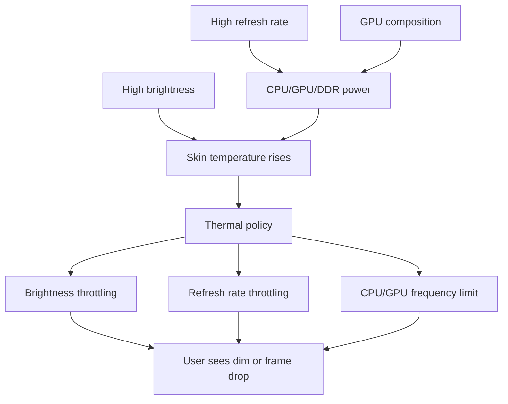

亮屏功耗比灭屏待机更“热闹”。灭屏问题经常围绕 suspend、wakeup source、后台任务；亮屏问题则同时牵涉屏幕面板、背光、亮度策略、刷新率、SurfaceFlinger 合成、GPU、DDR、CPU、网络和热管理。

所以亮屏功耗分析第一步不是抓日志，而是先把问题分成两类：

```text
屏幕本身耗电高：亮度高、HBM/HDR、面板刷新率高、背光/驱动IC功耗高
系统持续刷新耗电高：App/RenderThread/SF/HWC/GPU/DDR持续工作，导致平台无法降频或进idle
```

很多“亮屏静置电流高”并不是背光问题，而是页面看起来静止，底层却一直在提交 buffer。反过来，视频播放或白底高亮场景中，即使 CPU/GPU 很闲，屏幕和显示链路本身也可能是主要电流来源。

## 分析边界

亮屏功耗必须先固定条件，否则数据不可比。

| 条件 | 为什么重要 |
|------|------------|
| 亮度 | OLED/背光 LCD 都高度依赖亮度，自动亮度会让数据漂 |
| 刷新率 | 60/90/120Hz 会影响 panel、SF、App、CPU/GPU、DDR |
| 画面内容 | OLED 对白底、HDR、高 APL 更敏感；动画会拉起渲染链路 |
| 网络 | 弱网、导航、视频流会和显示功耗叠加 |
| 温度 | 热后会降亮度、降刷新率、限 CPU/GPU，数据前后不可比 |
| 插电/USB | 会影响热、电池、调度、adbd、充电 IC |
| 屏幕保护/壁纸 | 动态壁纸、AOD、SystemUI 动画会造成持续刷新 |

建议每个 case 报告都写清楚：

```text
亮度：手动/自动，设置值，nits或slider
刷新率：固定60/90/120，还是系统自适应
画面：白屏/黑屏/桌面/视频/目标App页面
网络：飞行模式/Wi-Fi/移动数据/弱网
温度：开始和结束电池温度、skin thermal状态
采样时间：预热多久，统计多久
是否USB：插线只用于调试，定量最好断开
```

## 总体链路

亮屏链路可以分为两条：一条是电源/亮度链路，一条是帧生产/合成链路。



亮屏功耗高时，要看是哪条链路在主导：

| 主导链路 | 典型现象 | 证据 |
|----------|----------|------|
| 背光/面板 | 电流随亮度明显变化，CPU/GPU 很闲 | 固定画面下亮度阶梯测试 |
| 自动亮度/HBM | 亮度被自动拉高或进入高亮模式 | `dumpsys display` 中 brightness reason/HBM |
| 刷新率 | 高刷场景电流高，降到 60Hz 明显下降 | `dumpsys display`、SF refresh rate |
| App 持续刷新 | 页面静止但 RenderThread 周期运行 | Perfetto 中 app frame 持续提交 |
| SF/HWC 合成 | SurfaceFlinger 每帧工作，HWC/GPU 负载高 | Perfetto、`dumpsys SurfaceFlinger` |
| GPU 合成 | Overlay 不满足，GPU 参与合成 | SF/HWC dump、GPU freq |
| 热反馈 | 开始电流高，随后亮度/帧率/频率下降 | thermal log、brightness throttle |



## 源码入口

AOSP14 / LOS21 中，本篇重点看这些入口：

| 模块 | 源码 |
|------|------|
| DisplayPowerController | [DisplayPowerController.java line 127](vscode://file//home/suhui/workspace/aosp/los21/frameworks/base/services/core/java/com/android/server/display/DisplayPowerController.java:127:1) |
| requestPowerState | [DisplayPowerController.java line 755](vscode://file//home/suhui/workspace/aosp/los21/frameworks/base/services/core/java/com/android/server/display/DisplayPowerController.java:755:1) |
| updatePowerStateInternal | [DisplayPowerController.java line 1336](vscode://file//home/suhui/workspace/aosp/los21/frameworks/base/services/core/java/com/android/server/display/DisplayPowerController.java:1336:1) |
| setScreenState | [DisplayPowerController.java line 2129](vscode://file//home/suhui/workspace/aosp/los21/frameworks/base/services/core/java/com/android/server/display/DisplayPowerController.java:2129:1) |
| animateScreenBrightness | [DisplayPowerController.java line 2247](vscode://file//home/suhui/workspace/aosp/los21/frameworks/base/services/core/java/com/android/server/display/DisplayPowerController.java:2247:1) |
| DisplayBrightnessController | [DisplayBrightnessController.java line 303](vscode://file//home/suhui/workspace/aosp/los21/frameworks/base/services/core/java/com/android/server/display/brightness/DisplayBrightnessController.java:303:1) |
| DisplayModeDirector | [DisplayModeDirector.java line 104](vscode://file//home/suhui/workspace/aosp/los21/frameworks/base/services/core/java/com/android/server/display/mode/DisplayModeDirector.java:104:1) |
| getDesiredDisplayModeSpecs | [DisplayModeDirector.java line 289](vscode://file//home/suhui/workspace/aosp/los21/frameworks/base/services/core/java/com/android/server/display/mode/DisplayModeDirector.java:289:1) |
| LocalDisplayAdapter.setDesiredDisplayModeSpecsLocked | [LocalDisplayAdapter.java line 1037](vscode://file//home/suhui/workspace/aosp/los21/frameworks/base/services/core/java/com/android/server/display/LocalDisplayAdapter.java:1037:1) |
| SurfaceFlinger.commit | [SurfaceFlinger.cpp line 2517](vscode://file//home/suhui/workspace/aosp/los21/frameworks/native/services/surfaceflinger/SurfaceFlinger.cpp:2517:1) |
| SurfaceFlinger.updateLayerHistory | [SurfaceFlinger.cpp line 2277](vscode://file//home/suhui/workspace/aosp/los21/frameworks/native/services/surfaceflinger/SurfaceFlinger.cpp:2277:1) |
| SurfaceFlinger.setPowerMode | [SurfaceFlinger.cpp line 6213](vscode://file//home/suhui/workspace/aosp/los21/frameworks/native/services/surfaceflinger/SurfaceFlinger.cpp:6213:1) |
| SurfaceFlinger.setDesiredDisplayModeSpecs | [SurfaceFlinger.cpp line 8617](vscode://file//home/suhui/workspace/aosp/los21/frameworks/native/services/surfaceflinger/SurfaceFlinger.cpp:8617:1) |
| Scheduler.chooseRefreshRateForContent | [Scheduler.cpp line 694](vscode://file//home/suhui/workspace/aosp/los21/frameworks/native/services/surfaceflinger/Scheduler/Scheduler.cpp:694:1) |
| RefreshRateSelector | [RefreshRateSelector.cpp line 476](vscode://file//home/suhui/workspace/aosp/los21/frameworks/native/services/surfaceflinger/Scheduler/RefreshRateSelector.cpp:476:1) |

## DisplayPowerController

`DisplayPowerController` 是显示电源状态和亮度策略的核心。PMS 决定系统 wakefulness，DMS/DisplayPowerController 决定 display 具体应该是什么状态：off、on、doze、doze suspend，以及亮度应该是多少。

简化链路：



`updatePowerStateInternal()` 里有几个很关键的阶段：

```text
1. 读取 pending DisplayPowerRequest
2. 根据 policy 计算目标 display state
3. 执行 screen on/off/doze 状态切换
4. 更新自动亮度模式
5. DisplayBrightnessController 计算基础亮度
6. 自动亮度、doze亮度、screen-off sensor、手动亮度兜底
7. brightness clamper / throttling / HBM / HDR 修正
8. 根据 ramp rate 动画到目标亮度
9. 保存 BrightnessInfo 并通知变化
```



这里有一个排查亮度问题的核心点：**最终写到屏幕的亮度，不一定等于设置里的 slider 值。**

可能改变最终亮度的因素包括：

| 因素 | 源码中的表现 | 典型影响 |
|------|--------------|----------|
| 自动亮度 | `BrightnessReason.REASON_AUTOMATIC` | 环境光变化会改变亮度 |
| 手动亮度 | `REASON_MANUAL` | slider 作为基础值 |
| Doze | `REASON_DOZE_DEFAULT` / `REASON_DOZE_INITIAL` | AOD/Doze 低亮策略 |
| HBM | brightness range / HBM controller | 高亮模式提高功耗，也可能限时 |
| HDR | `MODIFIER_HDR` | HDR layer 可触发更高亮度 |
| Low power | `MODIFIER_LOW_POWER` | 省电模式降低亮度 |
| Dim | `MODIFIER_DIMMED` | 临近休眠前 dim |
| Thermal throttling | brightness clamper | 温度高时降低最大亮度 |
| App override | override/temporary brightness | 某些窗口临时提高亮度 |

所以亮屏功耗报告里不能只写 `screen_brightness=80`。更严谨的是写：

```text
screen_brightness_mode=0
screen_brightness=80
dumpsys display 中实际 brightness/current/min/max
BrightnessReason=MANUAL 或 AUTOMATIC/HDR/LOW_POWER/THROTTLED
是否 HBM/HDR/thermal brightness throttling
```

## 亮度固定方法

基础命令：

```bash
adb shell settings get system screen_brightness_mode
adb shell settings get system screen_brightness
adb shell settings get system screen_auto_brightness_adj
adb shell dumpsys display > display.txt
adb shell dumpsys power > power.txt
```

固定手动亮度：

```bash
adb shell settings put system screen_brightness_mode 0
adb shell settings put system screen_brightness 80
```

有些 Android 版本亮度内部使用 float 或由 DisplayBrightnessController 管理，`screen_brightness` 只是用户设置值。真正分析仍然要看 `dumpsys display`。

建议做亮度阶梯测试：

```bash
for b in 20 60 100 160 220; do
    adb shell settings put system screen_brightness_mode 0
    adb shell settings put system screen_brightness "$b"
    sleep 60
    adb shell dumpsys display > "display_b${b}.txt"
    adb shell dumpsys battery > "battery_b${b}.txt"
done
```

如果接电源仪或电流计，记录每个亮度档位的稳定电流：

| 亮度档 | 电流 | 结论 |
|--------|------|------|
| 20 | baseline | 面板/背光低功耗 |
| 80 | +x mA | 近似线性或非线性增长 |
| 160 | +y mA | 高亮区开始明显上升 |
| 220 | +z mA | 可能接近 HBM/高亮策略 |

OLED 和 LCD 的曲线不同：

- LCD 背光功耗主要跟背光强度相关，画面黑白对背光影响小。
- OLED 每个像素自发光，白底、高 APL、HDR、高亮图像会明显更耗电。
- LTPO/高刷屏还要叠加刷新率和驱动策略。

## 屏幕状态切换

`setScreenState()` 负责把 display state 真正切过去，并通知 WindowManagerPolicy、BatteryStats 等。

源码中几个关键点：

```text
如果要 turn off：
    先通知 policy screenTurningOff
    可能 block screen off 等动画/策略完成
    mPowerState.setScreenState(state)
    noteScreenState(state)
    screenTurnedOff

如果要 turn on：
    可能 block screen on 等窗口绘制完成
    screenTurningOn
    等待 unblock 后继续
```



这解释了亮灭屏瞬间的功耗尖峰：亮屏不仅是背光打开，还可能包含 WMS 准备窗口、SF 恢复 VSYNC、HWC power mode 切换、app 重绘等动作。做“亮屏静置”测试时，要等过渡完成再统计，不要把点亮瞬间算进去。

## SurfaceFlinger电源模式

DisplayPowerController 负责 Framework display state，SurfaceFlinger 负责把 power mode 传到 HWC。

SurfaceFlinger 的 `setPowerModeInternal()` 里，ON/OFF/DOZE/DOZE_SUSPEND 对 VSYNC 和调度有不同处理：

| Power mode | 行为倾向 | 功耗意义 |
|------------|----------|----------|
| ON | 打开 HWC power mode，启用硬件 VSYNC，调度合成 | 正常亮屏 |
| OFF | 先关闭 VSYNC，再让 HWC display off | 停止该显示输出 |
| DOZE | AOD/Doze 显示，仍可更新 | 低频/低亮显示 |
| DOZE_SUSPEND | disable hardware VSYNC，synthetic VSYNC | 更省电的 doze suspend |



亮屏功耗高时，如果 display 已经 ON，那么重点不只是 panel，而是每个 VSYNC 周期有没有工作：

- App 是否每帧提交 buffer。
- SF 是否每帧 commit/composite。
- HWC 是否每帧 present。
- GPU 是否参与合成。
- CPU/GPU/DDR 是否因为帧率维持高频。

## 刷新率策略

Android 的刷新率不是一个简单 settings 值。Framework 侧由 `DisplayModeDirector` 汇总多方 vote，生成 `DesiredDisplayModeSpecs`；`LocalDisplayAdapter` 转成 SurfaceControl 的 specs；SurfaceFlinger 再用 `RefreshRateSelector` 和内容历史选择具体模式。



`DisplayModeDirector.getDesiredDisplayModeSpecs()` 的逻辑重点：

```text
读取 display votes
读取 supported modes 和 default mode
从最高/最低 priority 范围尝试生成 VoteSummary
如果过滤后没有可用 mode，逐步丢弃低优先级 vote
选择 base mode
根据 modeSwitchingType 决定是否允许 mode switching
生成 primary refresh range 和 app request refresh range
```

这意味着“为什么没有降到低刷新率”不能只看一个设置项，要看哪些 vote 把范围卡住了：

| vote 来源 | 可能影响 |
|-----------|----------|
| user peak/min refresh rate | 用户设置高刷或限制低刷 |
| app requested frame rate | App 通过 API 请求帧率 |
| touch/scroll/game | 交互场景偏向高刷 |
| thermal | 温度高时限制最大刷新率 |
| HBM/HDR | 高亮/HDR 场景可能限制刷新率 |
| UDFPS | 屏下指纹场景可能要求特定刷新率 |
| proximity/sensor | 某些传感器组合限制 |
| external display | 外接显示模式限制 |

## SurfaceFlinger内容帧率

Framework 给的是策略范围，SurfaceFlinger 还会根据 layer 内容历史选择刷新率。

`SurfaceFlinger.updateLayerHistory()` 会记录 layer 的变化：

- Visibility。
- Geometry。
- FrameRate vote。
- Buffer update。
- Animation transaction。
- Surface damage / small dirty area。

`SurfaceFlinger.commit()` 每帧处理 transaction 和 layer snapshot 后，会调用：

```text
mScheduler->chooseRefreshRateForContent(...)
initiateDisplayModeChanges()
```

Scheduler 中 `chooseRefreshRateForContent()` 会：

```text
LayerHistory.summarize(...)
applyPolicy(contentRequirements)
必要时 update attached Choreographer
```



这对功耗排查非常关键：

- 看起来静止的页面，如果一直有 buffer update，SF 会认为内容在变化。
- 动画 transaction 即使视觉上很小，也可能维持高刷新。
- 小面积脏区可能降低合成成本，但不等于不刷新。
- App 设置 frame rate 不当，可能让系统无法降到更低 refresh/render rate。

## 合成路径

Android 显示合成一般涉及 App、RenderThread、BufferQueue、SurfaceFlinger、HWC、GPU、Panel。



功耗上要分三类：

| 合成类型 | 说明 | 功耗风险 |
|----------|------|----------|
| Device composition | HWC/Display controller 直接合成或 overlay | 通常比 GPU 合成省 |
| Client composition | GPU 先合成到 framebuffer，再交 HWC | GPU/DDR 更忙 |
| Mixed composition | 部分 overlay，部分 GPU | 常见，需看比例和原因 |

常见导致 GPU 合成增加的原因：

- 图层过多。
- 透明/alpha 复杂。
- 圆角、模糊、阴影、实时滤镜。
- DRM protected layer 限制。
- HWC overlay 数量不足。
- Surface 尺寸/格式/变换不满足 overlay。
- HDR/SDR 混合带来额外处理。
- 小窗口、悬浮窗、录屏、投屏。

## 调试命令

基础信息：

```bash
adb shell dumpsys power > power.txt
adb shell dumpsys display > display.txt
adb shell dumpsys SurfaceFlinger > sf.txt
adb shell dumpsys window > window.txt
adb shell dumpsys gfxinfo <package> > gfxinfo.txt
adb shell dumpsys thermalservice > thermal.txt
adb shell dumpsys battery > battery.txt
```

亮度：

```bash
adb shell settings get system screen_brightness_mode
adb shell settings get system screen_brightness
adb shell dumpsys display | grep -Ei "brightness|BrightnessReason|HBM|HDR|throttl|nits|lux"
```

刷新率：

```bash
adb shell settings get system peak_refresh_rate
adb shell settings get system min_refresh_rate
adb shell dumpsys display | grep -Ei "DisplayModeDirector|RefreshRate|mode|vote|DesiredDisplayMode"
adb shell dumpsys SurfaceFlinger | grep -Ei "refresh|mode|fps|LayerHistory|Scheduler"
```

SurfaceFlinger 和图层：

```bash
adb shell dumpsys SurfaceFlinger --list
adb shell dumpsys SurfaceFlinger --latency
adb shell dumpsys SurfaceFlinger --latency-clear
adb shell dumpsys SurfaceFlinger > sf_full.txt
```

CPU/GPU/DDR 频率视平台而定：

```bash
adb shell 'for p in /sys/devices/system/cpu/cpufreq/policy*; do echo $p; cat $p/scaling_cur_freq; cat $p/scaling_governor; done'
adb shell 'find /sys/class/kgsl -maxdepth 3 -type f 2>/dev/null | grep -Ei "gpuclk|freq|busy|pwr"'
adb shell 'find /sys/class/devfreq -maxdepth 2 -type f 2>/dev/null | grep -Ei "cur_freq|governor|available_frequencies"'
```

QCOM 平台常见 GPU 路径可能在：

```bash
/sys/class/kgsl/kgsl-3d0/gpuclk
/sys/class/kgsl/kgsl-3d0/gpubusy
/sys/class/devfreq/*kgsl*/cur_freq
```

不要硬编码结论，先 `find` 再看节点是否存在。

## 固定刷新率

不同系统支持不同设置项，常见方法：

```bash
adb shell settings get system peak_refresh_rate
adb shell settings get system min_refresh_rate
adb shell settings put system peak_refresh_rate 60
adb shell settings put system min_refresh_rate 60
```

恢复时：

```bash
adb shell settings delete system peak_refresh_rate
adb shell settings delete system min_refresh_rate
```

如果设备本身只有 60Hz，例如某些老 QCOM 机型，那就不能造“高刷未降”的 case，但仍然可以分析：

- 60Hz 下是否持续满帧。
- App 是否持续提交 buffer。
- SF 是否每帧合成。
- GPU/DDR 是否因为合成保持活跃。
- Panel 亮度曲线是否异常。

## Perfetto采集

亮屏功耗强烈建议用 Perfetto，因为它能把 App 帧、SF 帧、CPU/GPU 频率、idle、thermal 放在同一时间线。

简单 atrace：

```bash
adb shell atrace --async_start -b 32768 gfx view wm am sched freq idle power
sleep 60
adb shell atrace --async_stop -z -o /data/local/tmp/display_power.html
adb pull /data/local/tmp/display_power.html .
```

Perfetto 命令：

```bash
adb shell perfetto \
    -o /data/misc/perfetto-traces/display_power.trace \
    -t 60s \
    sched freq idle gfx view wm power am
adb pull /data/misc/perfetto-traces/display_power.trace .
```

如果要更完整，可以加入 ftrace event：

```text
sched/sched_switch
sched/sched_wakeup
power/cpu_frequency
power/cpu_idle
power/suspend_resume
freq/gpu_frequency
kgsl/kgsl_pwrlevel
mdss/mdss_* 或 drm/drm_vblank_event
```

具体 event 以设备为准：

```bash
adb shell 'ls /sys/kernel/tracing/events 2>/dev/null || ls /sys/kernel/debug/tracing/events'
adb shell 'find /sys/kernel/tracing/events -maxdepth 2 -type d 2>/dev/null | grep -Ei "kgsl|gpu|mdss|drm|power|freq"'
```

Perfetto 里要看：

| 轨道 | 判断点 |
|------|--------|
| App UI thread | 是否每帧执行 traversal/input/animation |
| RenderThread | 是否每 VSYNC 都 drawFrame |
| SurfaceFlinger | 是否每帧 commit/composite |
| FrameTimeline | 是否持续产生 frame，是否 jank |
| CPU freq | 小核/大核是否降不下来 |
| CPU idle | 亮屏静置时是否还能进 shallow/deep idle |
| GPU freq | 是否持续高频 |
| IRQ/vsync | 是否固定周期唤醒 |
| thermal | 温升后是否限频/降亮度 |

## 亮屏静置排查法

做一个最小矩阵：

| Case | 亮度 | 刷新率 | 画面 | 网络 | 目的 |
|------|------|--------|------|------|------|
| A | 低 | 固定 60 | 黑图/暗图 | 飞行模式 | 看系统和面板低负载基线 |
| B | 中 | 固定 60 | 白图/亮图 | 飞行模式 | 看面板/背光增长 |
| C | 中 | 固定 60 | 桌面静置 | 飞行模式 | 看 SystemUI/壁纸是否刷新 |
| D | 中 | 固定 60 | 目标 App 静置 | 飞行模式 | 看 App 是否暗中刷新 |
| E | 中 | 自适应/高刷 | 目标 App 静置 | 飞行模式 | 看刷新率策略影响 |
| F | 中 | 固定 60 | 目标 App | 开网络 | 看网络叠加 |

每个 case 都记录：

```text
dumpsys power
dumpsys display
dumpsys SurfaceFlinger
dumpsys gfxinfo <package>
dumpsys thermalservice
Perfetto trace
电流或电量变化
电池温度开始/结束
```

## 案例一：亮度导致电流高

现象：

```text
同一静态页面，亮度从 20 提到 220，电流明显上升。
Perfetto 中 App、RenderThread、SurfaceFlinger 基本空闲。
CPU/GPU 频率可下降。
```

分析：

这种 case 主因是屏幕本身，不是系统持续刷新。尤其 OLED 白底、高 APL 或 LCD 高背光，亮度就是主要电流来源。

验证：

```bash
adb shell settings put system screen_brightness_mode 0
adb shell settings put system screen_brightness 20
sleep 60
adb shell settings put system screen_brightness 220
sleep 60
```

报告写法：

```text
固定刷新率和画面内容后，电流随亮度阶梯显著上升。
Perfetto 未显示持续 App/SF 合成负载，CPU/GPU 可进入低频。
因此该场景主导因素为面板/背光亮度，而不是 Framework 或 App 持续刷新。
```

## 案例二：页面看似静止但持续刷新

现象：

```text
目标 App 页面肉眼看起来静止。
Perfetto 中 UI thread/RenderThread 每 16.6ms 活跃。
SurfaceFlinger 每帧 commit/composite。
CPU/GPU 频率无法下降。
```

常见原因：

- 无限动画没有停止。
- Lottie/GIF/WebView 动画在屏幕上或屏幕外仍刷新。
- `invalidate()` 周期调用。
- 自定义 View 在 `onDraw()` 里触发下一帧。
- Compose/RecyclerView 状态变化导致重组/重绘。
- TextureView/SurfaceView 持续出帧。
- 视频/地图/相机预览没有暂停。

排查：

```bash
adb shell dumpsys gfxinfo <package> framestats > framestats.txt
adb shell dumpsys SurfaceFlinger --latency-clear
sleep 10
adb shell dumpsys SurfaceFlinger --latency > sf_latency.txt
```

报告写法：

```text
亮屏静置电流高不是背光单独导致。
Perfetto 显示目标页面在静置期间仍以约 60fps 提交 frame，RenderThread 和 SurfaceFlinger 周期性运行。
关闭页面动画后，SF composite 次数和 CPU/GPU 频率下降，电流回落。
建议 App 在不可见或静止状态停止动画/定时 invalidate，并避免后台 Surface 持续出帧。
```

## 案例三：动态壁纸或SystemUI刷新

现象：

```text
桌面静置电流高。
切到纯黑静态图片后电流下降。
Perfetto 中 SystemUI 或 launcher 仍在周期性绘制。
```

分析：

桌面不是天然静态。动态壁纸、时钟小组件、天气动效、充电动画、通知动效都可能持续刷新。

命令：

```bash
adb shell dumpsys window | grep -Ei "mCurrentFocus|Wallpaper|Launcher|SystemUI"
adb shell dumpsys SurfaceFlinger --list
adb shell dumpsys gfxinfo com.android.systemui
```

报告写法：

```text
问题发生在 launcher 桌面静置场景，但目标 App 未运行。
替换为静态壁纸后，SurfaceFlinger 周期合成减少，电流下降。
该问题应归类为 SystemUI/Launcher/Wallpaper 刷新导致的亮屏静置功耗，而不是普通后台任务功耗。
```

## 案例四：刷新率没有降下来

现象：

```text
静态页面仍保持 120Hz 或高 render rate。
固定 60Hz 后电流明显下降。
dumpsys display 中存在 high refresh 相关 vote。
```

分析：

要分清两件事：

- Physical refresh rate：panel/HWC 的物理刷新率。
- Render frame rate：App/SF 内容渲染帧率。

高物理刷新率会增加 panel/display pipeline 功耗；高 render frame rate 会增加 App/SF/GPU/CPU 工作。两者可能一致，也可能不同。

排查：

```bash
adb shell dumpsys display | grep -Ei "RefreshRate|DisplayModeDirector|vote|DesiredDisplayMode"
adb shell dumpsys SurfaceFlinger | grep -Ei "refresh|fps|mode|Scheduler"
adb shell settings get system peak_refresh_rate
adb shell settings get system min_refresh_rate
```

报告写法：

```text
目标页面静置时，DisplayModeDirector 的 vote 使显示保持高刷新率。
固定 60Hz 后，panel/display pipeline 电流下降，同时 SF/CPU 负载没有明显变化。
因此该 case 主因是刷新率策略未降，而不是 App 持续渲染。
```

如果固定 60Hz 后电流仍高，则要回到持续刷新、GPU 合成或亮度/HBM。

## 案例五：GPU合成比例高

现象：

```text
App 帧率正常，但 GPU 频率较高。
SurfaceFlinger/HWC dump 显示 client composition 增加。
复杂透明、模糊、圆角或多层 overlay 场景电流高。
```

分析：

GPU 合成会让 GPU 和 DDR 都更忙。尤其 1080p/2K 高刷下，每帧读写大 buffer，内存带宽和功耗会明显上升。

排查：

```bash
adb shell dumpsys SurfaceFlinger > sf_full.txt
adb shell 'find /sys/class/kgsl -maxdepth 3 -type f 2>/dev/null | grep -Ei "gpuclk|gpubusy|pwr"'
adb shell 'find /sys/class/devfreq -maxdepth 2 -type f 2>/dev/null | grep cur_freq'
```

报告写法：

```text
目标页面没有异常高帧率，但 HWC 无法将主要图层走 device composition，导致 GPU client composition 比例上升。
Perfetto 中 GPU 相关频率和 SF composite 时间增加。
优化方向是减少透明叠层、模糊/阴影，降低 overlay 冲突，避免不必要的全屏 GPU 合成。
```

## 案例六：HDR/HBM导致亮屏发热

现象：

```text
播放 HDR 视频或户外强光场景，屏幕亮度自动升高。
dumpsys display 中出现 HDR/HBM 或 brightness modifier。
几分钟后 thermal 触发，亮度下降或刷新率降低。
```

分析：

HDR/HBM 不是普通亮度。它可能提高 panel 峰值亮度，也可能改变刷新率限制和热策略。DPC 中 HDR layer 会让 brightness range controller 给出 HDR brightness value，并给 BrightnessReason 加上 HDR modifier。

排查：

```bash
adb shell dumpsys display | grep -Ei "HBM|HDR|brightness|BrightnessReason|throttl|thermal"
adb shell dumpsys SurfaceFlinger | grep -Ei "HDR|dataspace|color|layer"
adb shell dumpsys thermalservice
adb shell dumpsys battery | grep -i temperature
```

报告写法：

```text
该场景在 HDR/HBM 下复现，亮度实际值高于普通 SDR 手动亮度。
温度上升后出现 brightness throttling，随后屏幕亮度下降。
问题属于显示高亮/HDR 热功耗耦合，不应和普通 SDR 亮屏静置电流直接比较。
```

## 案例七：视频播放功耗

视频播放要分清解码、合成、刷新率、亮度：

| 场景 | 可能主因 |
|------|----------|
| 本地 SDR 视频 | decoder + display |
| 在线视频 | decoder + network + display |
| HDR 视频 | decoder + HDR/HBM + thermal |
| 弹幕/浮层视频 | decoder + GPU/SF 合成 |
| 高帧率视频 | decode fps + display refresh |

排查：

```bash
adb shell dumpsys media.codec
adb shell dumpsys SurfaceFlinger --list
adb shell dumpsys SurfaceFlinger > sf_video.txt
adb shell dumpsys netstats > netstats_video.txt
adb shell dumpsys display > display_video.txt
```

报告写法：

```text
关闭弹幕后，视频解码仍在，但 SF/GPU 合成压力下降，电流回落。
说明主因不是 decoder，而是视频上层浮层导致 overlay 失效或 GPU 合成增加。
```

## 案例八：导航亮屏发热

导航是亮屏功耗的叠加场景：

```text
高亮度 + GPS + 地图渲染 + 移动网络 + 语音 + 弱网重传 + 车内高温
```

分析时不要把所有电流都算给 Display。

拆解方法：

| Case | 设置 | 目的 |
|------|------|------|
| 地图静止 + 飞行模式 | 固定亮度 | 看地图渲染基础负载 |
| 地图导航 + GPS + Wi-Fi | 固定亮度 | 看定位和地图刷新 |
| 地图导航 + 移动数据 | 固定亮度 | 看网络叠加 |
| 同场景降低亮度 | 固定网络 | 看显示亮度贡献 |
| 同场景固定低刷新 | 固定亮度 | 看刷新率贡献 |

报告写法：

```text
导航场景功耗由显示、定位、网络和地图渲染叠加。
固定亮度后，移动数据弱网场景电流仍明显高于离线地图，说明网络/定位贡献较大。
降低亮度后电流下降 xx，说明显示仍是重要贡献项。
```

## Thermal反向影响Display

功耗和热在亮屏场景里是强耦合。



这会让亮屏功耗曲线出现“前高后低”：

```text
刚开始：亮度高、频率高、电流高
几分钟后：温度升高，thermal 降亮度/限频/降刷新率
后半段：电流下降，但体验变差
```

所以报告要同时给：

- 开始电流。
- 稳态电流。
- 温度曲线。
- 是否触发 brightness throttling。
- 是否触发 refresh rate thermal vote。
- 是否触发 CPU/GPU thermal limit。

## QCOM设备注意点

QCOM 平台亮屏功耗常见观察点：

| 模块 | 可能节点/命令 |
|------|---------------|
| CPU | `/sys/devices/system/cpu/cpufreq/policy*/scaling_cur_freq` |
| GPU | `/sys/class/kgsl/kgsl-3d0/gpuclk`、`gpubusy` |
| DDR/devfreq | `/sys/class/devfreq/*/cur_freq` |
| Display/DRM/MDSS trace | `/sys/kernel/tracing/events/*` 中 `mdss`、`drm`、`sde` |
| Thermal | `dumpsys thermalservice`、`/sys/class/thermal/thermal_zone*` |

先发现节点：

```bash
adb shell 'find /sys/class/kgsl /sys/class/devfreq /sys/class/thermal -maxdepth 3 -type f 2>/dev/null | head -200'
adb shell 'find /sys/kernel/tracing/events -maxdepth 2 -type d 2>/dev/null | grep -Ei "kgsl|mdss|sde|drm|thermal|power"'
```

不要把某个路径写死为所有 QCOM 设备通用。msm8998、sm8250、sm8550 的节点和 trace event 都可能不同。

## 完整采集脚本

亮屏测试可以本地落盘，避免一直连 USB 影响热和电流。

```bash
#!/system/bin/sh

OUT=/data/local/tmp/display_power_$(date +%Y%m%d_%H%M%S)
DURATION=${1:-300}
PKG=${2:-}
mkdir -p "$OUT"

date > "$OUT/meta.txt"
getprop ro.product.device >> "$OUT/meta.txt"
getprop ro.board.platform >> "$OUT/meta.txt"
getprop ro.build.version.release >> "$OUT/meta.txt"

dumpsys power > "$OUT/power_before.txt"
dumpsys display > "$OUT/display_before.txt"
dumpsys SurfaceFlinger > "$OUT/sf_before.txt"
dumpsys thermalservice > "$OUT/thermal_before.txt"
dumpsys battery > "$OUT/battery_before.txt"
settings get system screen_brightness_mode > "$OUT/brightness_mode.txt"
settings get system screen_brightness > "$OUT/brightness_value.txt"
settings get system peak_refresh_rate > "$OUT/peak_refresh_rate.txt"
settings get system min_refresh_rate > "$OUT/min_refresh_rate.txt"

if [ -n "$PKG" ]; then
    dumpsys gfxinfo "$PKG" > "$OUT/gfxinfo_before.txt"
fi

sleep "$DURATION"

dumpsys power > "$OUT/power_after.txt"
dumpsys display > "$OUT/display_after.txt"
dumpsys SurfaceFlinger > "$OUT/sf_after.txt"
dumpsys thermalservice > "$OUT/thermal_after.txt"
dumpsys battery > "$OUT/battery_after.txt"

if [ -n "$PKG" ]; then
    dumpsys gfxinfo "$PKG" > "$OUT/gfxinfo_after.txt"
fi

tar -czf "$OUT.tar.gz" -C "$(dirname "$OUT")" "$(basename "$OUT")"
echo "$OUT.tar.gz"
```

使用：

```bash
adb push collect_display_power.sh /data/local/tmp/
adb shell chmod 755 /data/local/tmp/collect_display_power.sh
adb shell 'nohup /data/local/tmp/collect_display_power.sh 300 com.example.app >/data/local/tmp/display_power.nohup 2>&1 &'
```

## 报告模板

```text
1. 场景
   设备：
   Android版本：
   面板刷新率能力：
   App/页面：
   画面内容：
   USB是否连接：

2. 控制变量
   亮度模式：
   亮度值：
   实际亮度/HBM/HDR：
   刷新率设置：
   网络：
   温度起止：

3. Display证据
   dumpsys display brightness reason：
   HBM/HDR/throttling：
   DisplayModeDirector votes：
   当前/期望 display mode：

4. SF/HWC证据
   SurfaceFlinger 是否持续 commit/composite：
   Layer 是否持续 buffer update：
   是否高刷新：
   device/client composition 比例：

5. App证据
   UI thread 是否持续工作：
   RenderThread 是否持续 drawFrame：
   gfxinfo framestats：
   是否有动画/视频/TextureView/SurfaceView：

6. 平台证据
   CPU/GPU/DDR频率：
   CPU idle：
   thermal状态：

7. 结论
   主因是亮度/面板？
   主因是刷新率？
   主因是持续刷新？
   主因是GPU合成？
   是否与热策略耦合？
```

## 面试表达

如果面试官问“亮屏功耗怎么分析”，可以这样回答：

```text
我会先固定亮度、刷新率、网络和温度，把变量收住。
然后把亮屏功耗拆成两条链路：一条是 DisplayPowerController 管的亮度和屏幕电源状态，另一条是 App 到 SurfaceFlinger 到 HWC 的帧生产和合成链路。
如果电流随亮度阶梯明显变化，而 CPU/GPU/SF 都比较闲，主因偏面板/背光。
如果页面静止但 Perfetto 看到 RenderThread 和 SurfaceFlinger 每帧工作，就偏持续刷新。
如果高刷固定 60Hz 后电流明显下降，就看 DisplayModeDirector vote 和 SF RefreshRateSelector。
如果 GPU 频率高，就看 HWC overlay 是否失败、client composition 是否多。
最后还要看 thermal，因为亮屏高功耗会反过来触发降亮度、降刷新率和限频。
```

如果问“为什么 screen_brightness 设置一样，功耗还不一样”，可以这样回答：

```text
screen_brightness 只是用户设置值，不一定等于最终 panel 亮度。
DisplayPowerController 里还会叠加自动亮度、doze亮度、HBM/HDR、low power、dim、thermal brightness throttling、app override 等策略。
所以要看 dumpsys display 里的实际 brightness、BrightnessReason、modifier、HBM/HDR 和 throttling 信息。
另外 OLED 还跟画面内容 APL 有关，同样亮度下白底和黑底功耗差异很大。
```

## 小结

亮屏功耗不要只说“屏幕耗电”。更准确的拆法是：

- 亮度/面板：亮度阶梯、HBM/HDR、OLED APL、背光。
- 刷新率：DisplayModeDirector vote、SF RefreshRateSelector、physical/render rate。
- 持续刷新：App UI thread、RenderThread、BufferQueue、SF commit/composite。
- 合成方式：HWC overlay 还是 GPU client composition。
- 平台负载：CPU/GPU/DDR 频率和 idle。
- 热反馈：降亮度、降刷新率、限频。

一句话记住：

```text
亮屏功耗 = 屏幕发光成本 + 每帧生产成本 + 每帧合成成本 + 热策略反馈。
```
