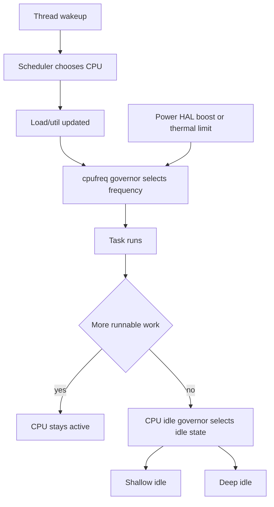
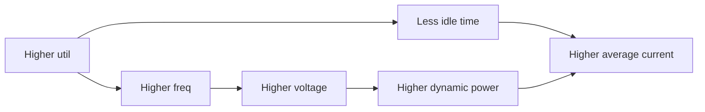
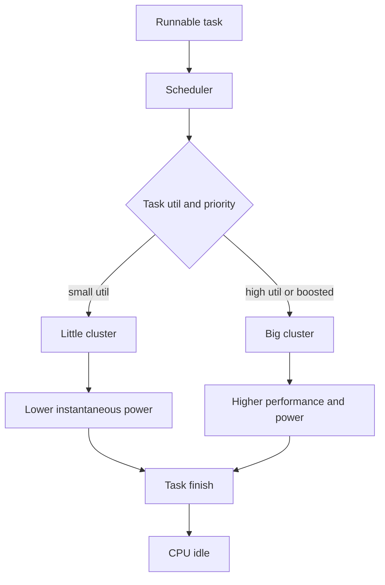
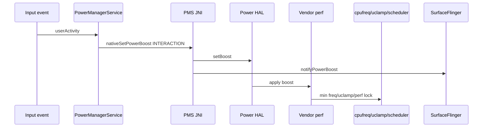
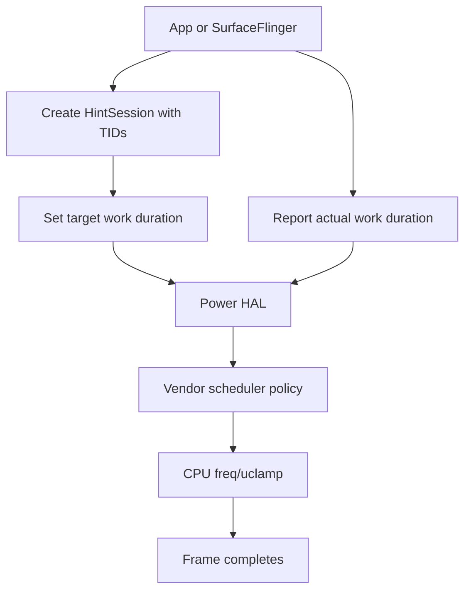
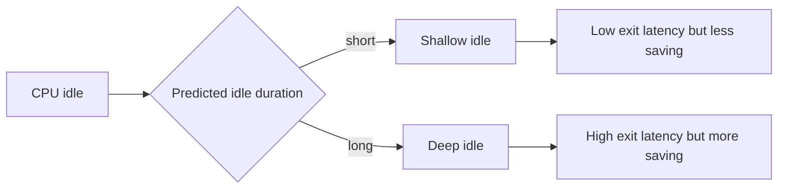
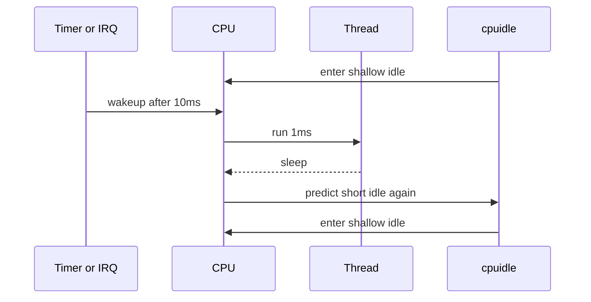
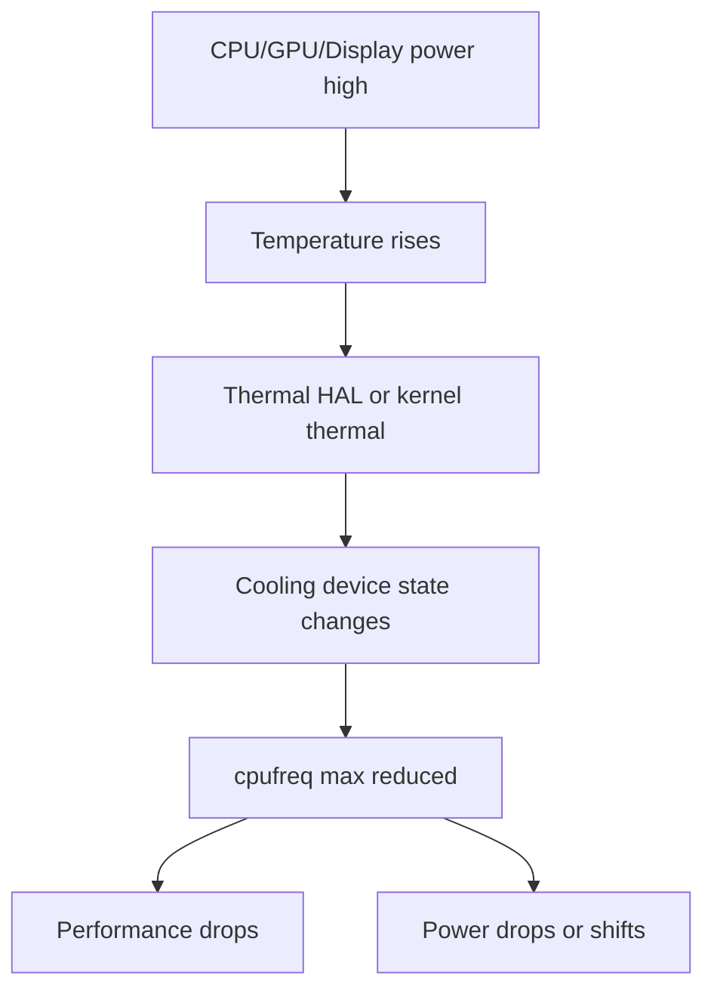

CPU 功耗最容易被“CPU 占用率”误导。占用率只是结果的一小部分，真正决定功耗的是一条链：

```text
线程为什么醒 -> 调度到哪个 CPU -> 跑了多久 -> 跑在什么频率 -> 是否被 boost -> 是否能降频 -> 空闲时能不能进深 cpuidle -> 是否被 thermal/省电影响
```

同样 5% CPU 占用，可能对应两种完全不同的功耗：

- 每 10ms 醒一次，每次跑很短：平均占用低，但 cpuidle 被打碎，功耗高。
- 连续跑一小段后长时间不醒：平均占用类似，但 CPU 可以进入深 idle，功耗低。

所以 CPU 功耗分析不能只问“top 里谁占用高”，要问“谁让 CPU 不能安静下来”。

## 总览

Android CPU 功耗涉及五层：

| 层级 | 关键词 | 功耗意义 |
|------|--------|----------|
| Thread | runnable、wakeups、binder、timer、IRQ | 谁在让 CPU 醒 |
| Scheduler | CFS、RT、cpuset、uclamp、EAS/WALT | 线程跑在哪个 cluster，负载如何估计 |
| cpufreq | governor、cur/min/max freq、boost | 跑的时候频率是多少 |
| cpuidle | idle state、latency、residency、usage/time | 不跑的时候能不能睡深 |
| thermal/power HAL | boost、mode、cooling、battery saver | 外部策略如何拉高或压低频率 |



CPU 功耗问题常见四类：

| 类型 | 表现 | 方向 |
|------|------|------|
| 持续忙 | 某线程长期 runnable，CPU 无法 idle | 查线程、binder、锁、循环 |
| 频繁短唤醒 | CPU 占用低但 idle residency 差 | 查 timer、alarm、IRQ、poll |
| 频率异常高 | 负载不高但 freq 高 | 查 boost、governor、uclamp、min_freq |
| 性能上不去 | 负载高但 freq 被压 | 查 thermal、battery saver、cooling、policy max |

## 源码入口

CPU 调频和 cpuidle 的核心在 Linux kernel，这篇主要用 AOSP Framework/Native 解释 Android 如何发出性能/功耗 hint，再用 sysfs/Perfetto 观察 kernel 行为。

| 模块 | 源码 |
|------|------|
| PMS userActivity interaction boost | [PowerManagerService.java line 2207](vscode://file//home/suhui/workspace/aosp/los21/frameworks/base/services/core/java/com/android/server/power/PowerManagerService.java:2207:1) |
| PMS setPowerBoostInternal | [PowerManagerService.java line 4635](vscode://file//home/suhui/workspace/aosp/los21/frameworks/base/services/core/java/com/android/server/power/PowerManagerService.java:4635:1) |
| PMS setPowerModeInternal | [PowerManagerService.java line 4640](vscode://file//home/suhui/workspace/aosp/los21/frameworks/base/services/core/java/com/android/server/power/PowerManagerService.java:4640:1) |
| PowerManagerService JNI setPowerBoost | [com_android_server_power_PowerManagerService.cpp line 87](vscode://file//home/suhui/workspace/aosp/los21/frameworks/base/services/core/jni/com_android_server_power_PowerManagerService.cpp:87:1) |
| PowerManagerService JNI setPowerMode | [com_android_server_power_PowerManagerService.cpp line 92](vscode://file//home/suhui/workspace/aosp/los21/frameworks/base/services/core/jni/com_android_server_power_PowerManagerService.cpp:92:1) |
| HintManagerService | [HintManagerService.java line 60](vscode://file//home/suhui/workspace/aosp/los21/frameworks/base/services/core/java/com/android/server/power/hint/HintManagerService.java:60:1) |
| createHintSession | [HintManagerService.java line 378](vscode://file//home/suhui/workspace/aosp/los21/frameworks/base/services/core/java/com/android/server/power/hint/HintManagerService.java:378:1) |
| updateTargetWorkDuration | [HintManagerService.java line 522](vscode://file//home/suhui/workspace/aosp/los21/frameworks/base/services/core/java/com/android/server/power/hint/HintManagerService.java:522:1) |
| reportActualWorkDuration | [HintManagerService.java line 535](vscode://file//home/suhui/workspace/aosp/los21/frameworks/base/services/core/java/com/android/server/power/hint/HintManagerService.java:535:1) |
| HintManager JNI session APIs | [com_android_server_hint_HintManagerService.cpp line 89](vscode://file//home/suhui/workspace/aosp/los21/frameworks/base/services/core/jni/com_android_server_hint_HintManagerService.cpp:89:1) |
| SurfaceFlinger starts power hint session | [SurfaceFlinger.cpp line 777](vscode://file//home/suhui/workspace/aosp/los21/frameworks/native/services/surfaceflinger/SurfaceFlinger.cpp:777:1) |
| SurfaceFlinger frame power hint | [SurfaceFlinger.cpp line 2576](vscode://file//home/suhui/workspace/aosp/los21/frameworks/native/services/surfaceflinger/SurfaceFlinger.cpp:2576:1) |
| SurfaceFlinger uclamp on display power | [SurfaceFlinger.cpp line 6106](vscode://file//home/suhui/workspace/aosp/los21/frameworks/native/services/surfaceflinger/SurfaceFlinger.cpp:6106:1) |

## CPU功耗公式感

CPU 动态功耗可以粗略理解为：

```text
P_dynamic ~= C * V^2 * f * activity
```

这不是让我们在 Android 调试里算电容，而是提醒三件事：

- 频率 `f` 高，功耗通常高。
- 电压 `V` 往往随频率档位上升，功耗不是线性增长。
- activity 低但唤醒频繁，会破坏 idle，平台平均功耗仍然高。



因此分析 CPU 功耗时要同时给出：

```text
线程运行证据 + CPU频率证据 + idle residency证据 + boost/thermal证据
```

单独贴一张 `top` 或一张 `scaling_cur_freq` 都不够。

## cpufreq基础

查看 CPU policy：

```bash
adb shell 'for p in /sys/devices/system/cpu/cpufreq/policy*; do echo "== $p =="; cat $p/related_cpus; cat $p/scaling_governor; cat $p/scaling_cur_freq; cat $p/scaling_min_freq; cat $p/scaling_max_freq; done'
```

常见文件：

| 文件 | 含义 |
|------|------|
| `related_cpus` | 这个 policy 管哪些 CPU，通常对应一个 cluster |
| `scaling_governor` | 当前 governor，例如 schedutil、interactive |
| `scaling_cur_freq` | 当前频率 |
| `scaling_min_freq` | policy 最小频率 |
| `scaling_max_freq` | policy 最大频率 |
| `cpuinfo_min_freq` | 硬件最小频率 |
| `cpuinfo_max_freq` | 硬件最大频率 |
| `scaling_available_frequencies` | 可选频点 |
| `time_in_state` | 各频点累计时间 |

看频率分布：

```bash
adb shell 'for p in /sys/devices/system/cpu/cpufreq/policy*; do echo "== $p =="; cat $p/stats/time_in_state 2>/dev/null; done'
```

如果没有 `stats/time_in_state`，可以用 Perfetto 的 `power/cpu_frequency`。

当前外接 QCOM msm8998 设备曾观察到：

```text
policy0 governor=interactive min=300000 max=1900800
policy4 governor=interactive min=300000 max=2361600
```

这说明它不是现代 Pixel 常见的 `schedutil` 路线，而是老一些的 QCOM interactive governor 体系。分析时要注意：

- interactive 参数会影响升频/降频。
- vendor boost/perflock 可能临时改 min freq。
- thermal cooling 可能压 max freq。
- 大小核 policy 分开，线程迁移会改变性能和功耗。

## schedutil和interactive

不同 governor 的分析口径不同。

| governor | 思路 | 排查重点 |
|----------|------|----------|
| `schedutil` | 根据 scheduler util 选频 | util、uclamp、EAS、RT、iowait boost |
| `interactive` | 根据负载采样和参数快速升降频 | target_loads、timer_rate、hispeed_freq、boost |
| `performance` | 长期高频 | 是否调试残留或 vendor 策略 |
| `powersave` | 长期低频 | 性能问题、卡顿 |
| `userspace` | 用户态指定频率 | vendor daemon 或测试脚本 |

interactive 常见参数路径：

```bash
adb shell 'find /sys/devices/system/cpu/cpufreq -path "*interactive*" -type f 2>/dev/null'
adb shell 'find /sys -path "*interactive*" -type f 2>/dev/null | head -80'
```

现代 `schedutil` 常见观察：

```bash
adb shell 'for p in /sys/devices/system/cpu/cpufreq/policy*; do echo $p; ls $p; done'
```

注意：不能把某个 governor 的结论套到所有设备。msm8998、sm8250、Tensor、MTK 平台会差很多。

## 调度与大小核

CPU 功耗不只看频率，还要看线程跑在哪个 cluster。big core 在同频下也可能比 little core 更耗电，但能更快完成任务；little core 更省，但长时间跑满也会拖慢任务和增加总能耗。



关键观察点：

| 现象 | 含义 |
|------|------|
| 小线程频繁跑 big core | 可能被 boost/uclamp/cpuset 影响 |
| 大任务被压在 little core | 可能性能差、任务时间长 |
| RT 线程频繁唤醒 | 可能打断 idle，影响交互和功耗 |
| binder 线程池频繁醒 | 可能系统服务或 App IPC 抖动 |
| kworker/irq 频繁跑 | 可能 driver、网络、display、storage 活动 |

命令：

```bash
adb shell top -H -o PID,TID,USER,PR,NI,%CPU,CPU,CMD -m 30
adb shell ps -AT -o PID,TID,PRI,NI,CPU,PCY,STAT,NAME | head -80
adb shell cat /proc/schedstat | head
adb shell cat /proc/interrupts | head -80
```

`top` 只能看瞬间，Perfetto 才能看线程迁移和唤醒原因。

## cpuset和uclamp

Android 会用 cpuset 和 uclamp 影响线程可跑 CPU 和频率倾向。

常见 cpuset：

```bash
adb shell 'find /dev/cpuset -maxdepth 3 -type f -name cpus -o -name tasks 2>/dev/null | head -80'
adb shell 'for f in /dev/cpuset/*/cpus; do echo "$f=$(cat $f)"; done'
```

常见 uclamp：

```bash
adb shell 'find /dev/stune /sys/fs/cgroup -maxdepth 4 -type f 2>/dev/null | grep -Ei "uclamp|schedtune|boost" | head -100'
```

概念：

| 机制 | 作用 |
|------|------|
| cpuset | 限制任务可以跑在哪些 CPU |
| uclamp.min | 给任务最低 util 夹紧，倾向更高频或更强 CPU |
| uclamp.max | 限制最高 util，倾向省电 |
| schedtune boost | 老 Android/QCOM 常见 boost 机制 |

SurfaceFlinger 在显示打开时也可能设置 uclamp 相关属性。AOSP 里 `SurfaceFlinger.setPowerModeInternal()` 在 active display power on 时有设置 uclamp/SCHED_FIFO 的逻辑，power off 时再恢复。这说明 display 交互链路不是“普通线程”，系统会给它特殊调度待遇。

## Power HAL mode和boost

Framework 通过 Power HAL 发 mode/boost，vendor 再映射到内核节点、perf lock、uclamp、cpufreq min/max、scheduler boost 等。

PMS 中用户活动会触发 interaction boost：

```text
userActivity
    if eventTime > mLastInteractivePowerHintTime:
        setPowerBoostInternal(Boost.INTERACTION, 0)
```

JNI 侧：

```text
setPowerBoost(boost, durationMs)
    gPowerHalController.setBoost(boost, durationMs)
    SurfaceComposerClient::notifyPowerBoost(boost)

setPowerMode(mode, enabled)
    gPowerHalController.setMode(mode, enabled)
```



常见 mode/boost：

| 名称 | 场景 | 功耗风险 |
|------|------|----------|
| `INTERACTIVE` mode | 亮屏交互态 | 亮屏保持更积极策略 |
| `LAUNCH` mode | App 启动 | 短时提高频率，启动后应释放 |
| `INTERACTION` boost | 触摸/滑动 | 高频短 boost，过多会耗电 |
| `LOW_POWER` mode | 省电模式 | 降频/限性能 |
| `DEVICE_IDLE` mode | Doze/idle | 更省电策略 |
| `DISPLAY_INACTIVE` mode | 显示非活跃 | 可降低显示/调度倾向 |

问题经常出在：

- boost 触发过于频繁。
- boost duration 太长。
- vendor perf lock 没释放。
- 省电/thermal 和 boost 冲突。
- App 用 PerformanceHintSession 不合理。

## ADPF和HintSession

Android Dynamic Performance Framework 通过 `HintManagerService` / `PerformanceHintManager` 提供 hint session。应用或系统服务可以把一组线程交给 Power HAL，周期性报告目标工作时长和实际工作时长，让系统动态调性能。

Java 服务入口：

```text
createHintSession(token, tids, durationNanos)
updateTargetWorkDuration(targetDurationNanos)
reportActualWorkDuration(actualDurationNanos, timeStampNanos)
sendHint(hint)
setThreads(tids)
```

JNI 侧对应：

```text
IPowerHintSession.updateTargetWorkDuration
IPowerHintSession.reportActualWorkDuration
IPowerHintSession.sendHint
IPowerHintSession.setThreads
```

SurfaceFlinger 也会创建 power hint session。启动后如果 `use_adpf_cpu_hint` 打开，会把 SF 主线程和 RenderEngine 线程加入 session；每帧 commit/composite 时，根据 expected present、frame delay、目标工作时长更新 hint。



排查时要注意：如果某个线程被 hint session 管理，它的频率行为可能不是简单 governor 负载决定的，而是被 ADPF 动态调整。

## cpuidle基础

cpufreq 关注“跑的时候多快”，cpuidle 关注“不跑的时候睡多深”。

查看 cpuidle：

```bash
adb shell 'for c in /sys/devices/system/cpu/cpu[0-9]*; do [ -d "$c/cpuidle" ] || continue; echo "== $c =="; for s in "$c"/cpuidle/state*; do echo "$(basename $s) $(cat $s/name 2>/dev/null) usage=$(cat $s/usage 2>/dev/null) time=$(cat $s/time 2>/dev/null) latency=$(cat $s/latency 2>/dev/null) residency=$(cat $s/residency 2>/dev/null)"; done; done'
```

字段：

| 字段 | 含义 |
|------|------|
| `name` | idle state 名字 |
| `usage` | 进入该 state 次数 |
| `time` | 该 state 累计时间，通常微秒 |
| `latency` | 进入/退出延迟成本 |
| `residency` | 进入该 state 值得的最小停留时间 |
| `disable` | 是否禁用 |
| `rejected` | 选择后被拒绝次数，部分内核有 |

浅 idle 延迟低、省电少；深 idle 延迟高、省电多。频繁短唤醒会让 idle governor 不敢选深 state。



## cpuidle delta分析

不能只看一次绝对值，要看窗口差值：

```bash
adb shell 'for c in /sys/devices/system/cpu/cpu0 /sys/devices/system/cpu/cpu4; do for s in $c/cpuidle/state*; do echo "$c $(basename $s) $(cat $s/name) $(cat $s/usage) $(cat $s/time)"; done; done' > idle_before.txt
sleep 300
adb shell 'for c in /sys/devices/system/cpu/cpu0 /sys/devices/system/cpu/cpu4; do for s in $c/cpuidle/state*; do echo "$c $(basename $s) $(cat $s/name) $(cat $s/usage) $(cat $s/time)"; done; done' > idle_after.txt
```

更实用的判断：

| 现象 | 解释 |
|------|------|
| deep state `time` 增长多 | CPU 有长时间安静窗口 |
| shallow state `usage` 很多但 time 少 | 频繁短睡短醒 |
| deep state usage/time 几乎不变 | 有线程/IRQ/timer 持续打断 |
| 某些 state disabled | vendor/thermal/debug 配置禁用 |
| rejected 增长多 | idle 预测或外部事件导致状态选择失败 |

亮屏和灭屏都能看 cpuidle，但结论不同：

- 灭屏待机：希望尽可能进入深 idle 或 suspend。
- 亮屏静置：因为 VSYNC/display 还在，未必能像灭屏那样深，但不应被无关线程打碎。
- 滑动/游戏：重点不是深 idle，而是任务是否按需完成、频率是否合理。

## 频繁唤醒

低 CPU 占用但耗电高，常常是频繁唤醒。



常见来源：

| 来源 | 证据 |
|------|------|
| Java Handler/Timer 轮询 | App/UI/SystemServer 周期 wake |
| native poll | 线程短周期 epoll_wait timeout |
| alarm | `dumpsys alarm` + alarmtimer |
| binder 抖动 | binder_driver trace + system_server/app |
| IRQ | `/proc/interrupts` delta |
| 网络 | wlan/modem IRQ、netd、lowi、DataModule |
| display vsync | 亮屏帧循环，SF/App 周期工作 |
| sensor | sensorservice、wake-up sensor |

命令：

```bash
adb shell cat /proc/interrupts > irq_before.txt
sleep 60
adb shell cat /proc/interrupts > irq_after.txt
adb shell dumpsys alarm > alarm.txt
adb shell dumpsys jobscheduler > jobs.txt
```

Perfetto 更直接：

```bash
adb shell perfetto -o /data/misc/perfetto-traces/cpu_wakeup.trace -t 60s sched freq idle power irq binder_driver
adb pull /data/misc/perfetto-traces/cpu_wakeup.trace .
```

## Perfetto看CPU

推荐抓：

```bash
adb shell perfetto \
    -o /data/misc/perfetto-traces/cpu_power.trace \
    -t 60s \
    sched freq idle power am wm gfx view binder_driver
adb pull /data/misc/perfetto-traces/cpu_power.trace .
```

如果用 config，关注 ftrace：

```text
sched/sched_switch
sched/sched_wakeup
sched/sched_waking
power/cpu_frequency
power/cpu_idle
power/suspend_resume
irq/irq_handler_entry
irq/irq_handler_exit
timer/timer_expire_entry
workqueue/workqueue_execute_start
binder/binder_transaction
```

Perfetto 上的读法：

| 轨道 | 看什么 |
|------|--------|
| CPU slices | 哪些线程占据 CPU |
| sched_wakeup | 谁唤醒了谁 |
| cpu_frequency | 频率是否跟负载同步 |
| cpu_idle | 是否进入深 idle，是否被频繁打断 |
| IRQ | 是否某个 IRQ 周期性触发 |
| binder | IPC 是否引发系统服务抖动 |
| FrameTimeline/SF | 是否显示帧导致 CPU 周期工作 |

分析句式：

```text
线程 A 每 16.6ms 被 VSYNC 唤醒 -> RenderThread 每帧运行 -> policy4 频率维持高位 -> cpu4/cpu5 深 idle time 增长很少 -> 亮屏静置电流升高。
```

或者：

```text
灭屏后 CPU 总占用低，但 timer 每 1s 唤醒 system_server 和目标进程 -> cpuidle state0 usage 增长高，深 state time 低 -> 平均待机电流高。
```

## Thermal和cooling

CPU 频率上不去，不一定是 scheduler 差，可能是 thermal 限制。

看 thermal：

```bash
adb shell dumpsys thermalservice
adb shell 'for z in /sys/class/thermal/thermal_zone*; do echo "== $z =="; cat $z/type; cat $z/temp; done'
adb shell 'for c in /sys/class/thermal/cooling_device*; do echo "== $c =="; cat $c/type; cat $c/cur_state; cat $c/max_state; done'
```

看 cpufreq max 是否被压：

```bash
adb shell 'for p in /sys/devices/system/cpu/cpufreq/policy*; do echo "== $p =="; cat $p/cpuinfo_max_freq; cat $p/scaling_max_freq; cat $p/scaling_cur_freq; done'
```

判断：

| 现象 | 可能原因 |
|------|----------|
| `scaling_max_freq < cpuinfo_max_freq` | thermal、省电、vendor 限频 |
| cooling device `cur_state` 增长 | thermal 正在干预 |
| 温度上升后频率下降 | 热限频 |
| 性能下降但电流下降 | thermal 牺牲性能换温控 |
| 性能下降但电流不降 | 可能非 CPU 主因，或外设仍高功耗 |



## QCOM msm8998实战观测

当前 QCOM msm8998 类设备可以围绕这些节点看：

```bash
adb shell 'for p in /sys/devices/system/cpu/cpufreq/policy*; do echo "== $p =="; cat $p/related_cpus; cat $p/scaling_governor; cat $p/scaling_cur_freq; cat $p/scaling_min_freq; cat $p/scaling_max_freq; done'
adb shell 'find /sys/class/kgsl /sys/class/devfreq /sys/class/thermal -maxdepth 3 -type f 2>/dev/null | head -200'
adb shell 'cat /proc/interrupts | head -100'
```

msm8998 常见特点：

- big.LITTLE policy 分开。
- 老内核可能用 interactive governor。
- QCOM vendor perf/thermal 节点较多。
- GPU 可能通过 KGSL 节点观察。
- thermal zones 可能包含 `battery`、`msm_therm`、`tsens`、PMIC 温度等。

case 设计：

| Case | 目标 |
|------|------|
| 亮屏静置桌面 | 看 display/vsync 下 CPU idle 基线 |
| 目标 App 静置 | 看是否有 App 线程持续醒 |
| 滑动列表 | 看 interaction boost、big core 迁移、频率响应 |
| App 启动 | 看 LAUNCH boost 和频率峰值 |
| 灭屏待机 | 看 timer/IRQ 是否打碎 cpuidle |
| 热机后重复滑动 | 看 thermal cooling 是否压频 |

## 案例一：CPU占用低但待机电流高

现象：

```text
top 中没有明显高 CPU 线程。
灭屏后电流仍高。
cpuidle deep state time 增长少，shallow state usage 增长多。
Perfetto 显示某线程每 1s 被 timer 唤醒。
```

分析：

这不是“CPU 忙”，而是“CPU 睡不好”。每次唤醒很短，平均 CPU 占用不高，但 idle governor 无法选择深 state。

报告写法：

```text
测试窗口内目标线程 CPU runtime 不高，但 wakeup 周期稳定为 1s。
cpu idle 统计显示浅 idle usage 快速增长，深 idle time 增长不足。
因此该问题属于频繁短唤醒破坏 cpuidle，而不是持续高 CPU 占用。
建议取消轮询或增大周期，并与 JobScheduler/Alarm 合并。
```

## 案例二：亮屏静置CPU频率降不下来

现象：

```text
亮屏静置页面，App 看起来没有动画。
policy4 cur_freq 长期高位。
Perfetto 显示 RenderThread/SF 周期性运行。
```

分析：

亮屏下 VSYNC 本身会周期性存在，但静态页面不应该每帧让 App 生产新 buffer。如果 App/RenderThread 每帧工作，cpufreq 会跟着维持高位。

排查：

```bash
adb shell dumpsys gfxinfo <package> framestats
adb shell dumpsys SurfaceFlinger --latency
adb shell perfetto -o /data/misc/perfetto-traces/display_cpu.trace -t 60s sched freq idle gfx view power
```

报告写法：

```text
CPU 频率高与显示帧链路相关。
Perfetto 中目标 App RenderThread 每 16.6ms 运行，SurfaceFlinger 每帧 composite。
关闭页面动画后，policy4 频率下降，cpuidle time 增加。
建议修复静置状态下持续 invalidate/动画。
```

## 案例三：滑动后boost不释放

现象：

```text
滑动停止后，CPU min freq 或 uclamp 仍保持高位。
policy cur_freq 长时间不降。
Power HAL / vendor perf 相关日志显示 interaction boost 频繁触发。
```

分析：

正常 interaction boost 应该短促，帮助触摸/滑动响应。如果持续不释放，会让亮屏静置电流升高。

检查：

```bash
adb shell dumpsys power | grep -i "LastInteractivePowerHint"
adb shell 'for p in /sys/devices/system/cpu/cpufreq/policy*; do echo $p; cat $p/scaling_min_freq; cat $p/scaling_cur_freq; done'
adb shell 'find /dev/stune /sys/fs/cgroup -maxdepth 4 -type f 2>/dev/null | grep -Ei "uclamp|boost|schedtune" | head'
```

报告写法：

```text
滑动结束后任务负载已下降，但 CPU policy min/cur freq 仍维持高位。
结合 PMS interaction boost 触发和 vendor boost 节点变化，怀疑 boost duration 或释放路径异常。
需要继续确认 Power HAL setBoost(INTERACTION) 对应 vendor perf lock 是否按期释放。
```

## 案例四：App启动慢但CPU频率上不去

现象：

```text
App 启动耗时长。
Perfetto 显示主线程/RenderThread 忙。
CPU freq 未达到预期高频。
thermal cooling cur_state 非 0，scaling_max_freq 低于 cpuinfo_max_freq。
```

分析：

这不是简单“调度没给性能”，可能是 thermal 或 battery saver 限制。PMS 中 LAUNCH mode 在省电策略下也可能被禁用。

源码点：

```text
setPowerModeInternal(Mode.LAUNCH, true)
    if battery saver disables launch boost:
        return false
```

报告写法：

```text
启动慢发生在热机状态。
policy scaling_max_freq 已被 thermal cooling 限低，LAUNCH boost 无法把频率拉到硬件上限。
因此主因是 thermal 限频，不是 App 单纯 CPU 代码变慢。
需要分别给冷机/热机启动数据。
```

## 案例五：kworker或IRQ导致CPU睡不深

现象：

```text
top 中 kworker 或 irq 相关线程周期活跃。
/proc/interrupts 中某 IRQ delta 很高。
cpuidle 深 state time 差。
```

常见来源：

- Wi-Fi/BT/modem 中断。
- touch/display/vsync 中断。
- storage I/O。
- sensor hub。
- PMIC/charger。
- driver workqueue 轮询。

排查：

```bash
adb shell cat /proc/interrupts > irq_before.txt
sleep 60
adb shell cat /proc/interrupts > irq_after.txt
adb shell ps -AT -o PID,TID,PRI,CPU,STAT,NAME | grep -Ei "kworker|irq"
adb shell dmesg | grep -Ei "irq|wakeup|workqueue"
```

报告写法：

```text
用户态 CPU 占用不高，但 kernel IRQ/workqueue 周期活跃。
IRQ xxx 在 60s 内增长 xx 次，Perfetto 中对应 kworker 每次唤醒后运行。
该问题应转向对应 driver/外设，而不是继续追 App CPU。
```

## 案例六：省电模式导致性能下降

现象：

```text
省电模式开启后，CPU max freq 或 uclamp max 被限制。
App 卡顿但温度不高。
```

排查：

```bash
adb shell settings get global low_power
adb shell dumpsys power | grep -i "Battery Saver"
adb shell 'for p in /sys/devices/system/cpu/cpufreq/policy*; do echo $p; cat $p/scaling_max_freq; cat $p/scaling_cur_freq; done'
```

报告写法：

```text
卡顿只在省电模式复现，thermal cooling 未触发。
CPU policy max freq 在省电模式下降，Perfetto 显示线程 runnable 时间变长。
该现象符合省电策略牺牲性能，不应归为 thermal 或 scheduler bug。
```

## 案例七：线程跑错cluster

现象：

```text
小任务频繁跑 big core，亮屏静置电流偏高。
或重任务长期在 little core，完成时间变长。
```

分析：

要结合 cpuset、uclamp、线程优先级、前后台状态看。前台交互线程跑 big core 不一定错；后台轮询线程频繁上 big core 就可疑。

Perfetto 看：

```text
线程在哪些 CPU 上运行
是否有迁移
迁移前后频率
是否伴随 boost/uclamp
```

报告写法：

```text
目标后台线程每次唤醒后被调度到 big cluster，单次 runtime 很短但唤醒频繁。
这导致 big cluster 频率和 idle residency 变差。
建议降低线程优先级、移除不必要 boost，或减少唤醒频率。
```

## 完整采集脚本

```bash
#!/system/bin/sh

OUT=/data/local/tmp/cpu_power_$(date +%Y%m%d_%H%M%S)
DURATION=${1:-300}
mkdir -p "$OUT"

date > "$OUT/meta.txt"
getprop ro.product.device >> "$OUT/meta.txt"
getprop ro.board.platform >> "$OUT/meta.txt"
getprop ro.hardware >> "$OUT/meta.txt"

dumpsys power > "$OUT/power_before.txt"
dumpsys thermalservice > "$OUT/thermal_before.txt"
dumpsys battery > "$OUT/battery_before.txt"
top -H -b -n 1 > "$OUT/top_before.txt"
cat /proc/interrupts > "$OUT/interrupts_before.txt"

for p in /sys/devices/system/cpu/cpufreq/policy*; do
    name=$(basename "$p")
    mkdir -p "$OUT/$name"
    cat "$p/related_cpus" > "$OUT/$name/related_cpus_before.txt" 2>/dev/null
    cat "$p/scaling_governor" > "$OUT/$name/governor_before.txt" 2>/dev/null
    cat "$p/scaling_cur_freq" > "$OUT/$name/cur_before.txt" 2>/dev/null
    cat "$p/scaling_min_freq" > "$OUT/$name/min_before.txt" 2>/dev/null
    cat "$p/scaling_max_freq" > "$OUT/$name/max_before.txt" 2>/dev/null
    cat "$p/stats/time_in_state" > "$OUT/$name/time_in_state_before.txt" 2>/dev/null
done

for c in /sys/devices/system/cpu/cpu[0-9]*; do
    [ -d "$c/cpuidle" ] || continue
    cpu=$(basename "$c")
    mkdir -p "$OUT/$cpu"
    for s in "$c"/cpuidle/state*; do
        st=$(basename "$s")
        echo "$(cat "$s/name" 2>/dev/null) $(cat "$s/usage" 2>/dev/null) $(cat "$s/time" 2>/dev/null)" >> "$OUT/$cpu/cpuidle_before.txt"
    done
done

sleep "$DURATION"

dumpsys power > "$OUT/power_after.txt"
dumpsys thermalservice > "$OUT/thermal_after.txt"
dumpsys battery > "$OUT/battery_after.txt"
top -H -b -n 1 > "$OUT/top_after.txt"
cat /proc/interrupts > "$OUT/interrupts_after.txt"

for p in /sys/devices/system/cpu/cpufreq/policy*; do
    name=$(basename "$p")
    cat "$p/scaling_cur_freq" > "$OUT/$name/cur_after.txt" 2>/dev/null
    cat "$p/scaling_min_freq" > "$OUT/$name/min_after.txt" 2>/dev/null
    cat "$p/scaling_max_freq" > "$OUT/$name/max_after.txt" 2>/dev/null
    cat "$p/stats/time_in_state" > "$OUT/$name/time_in_state_after.txt" 2>/dev/null
done

for c in /sys/devices/system/cpu/cpu[0-9]*; do
    [ -d "$c/cpuidle" ] || continue
    cpu=$(basename "$c")
    for s in "$c"/cpuidle/state*; do
        echo "$(cat "$s/name" 2>/dev/null) $(cat "$s/usage" 2>/dev/null) $(cat "$s/time" 2>/dev/null)" >> "$OUT/$cpu/cpuidle_after.txt"
    done
done

tar -czf "$OUT.tar.gz" -C "$(dirname "$OUT")" "$(basename "$OUT")"
echo "$OUT.tar.gz"
```

## 复盘报告写法

```text
1. 场景
   设备：
   平台：
   Android版本：
   亮屏/灭屏：
   是否插USB：
   温度起止：

2. 线程证据
   Top runnable线程：
   周期唤醒线程：
   binder/IRQ/timer来源：

3. 调度证据
   线程运行CPU：
   是否迁移到big/little：
   cpuset/uclamp/优先级：

4. cpufreq证据
   policy：
   governor：
   cur/min/max：
   time_in_state delta：
   是否boost：

5. cpuidle证据
   shallow/deep state usage delta：
   shallow/deep state time delta：
   是否频繁短唤醒：

6. thermal/power证据
   cooling device：
   thermal status：
   battery saver：
   Power HAL mode/boost：

7. 结论
   持续忙？
   频繁短唤醒？
   boost不释放？
   thermal限频？
   省电策略？
   driver/IRQ？
```

## 我会这样说明

如果被问到“CPU 功耗怎么分析”，我会这样回答：

```text
我不会只看 CPU 占用率，而是看线程运行、调度、频率和 idle 的闭环。
首先用 Perfetto 找哪个线程在什么时候被谁唤醒，运行在哪个 CPU 上。
然后看 cpufreq 的 policy、governor、cur/min/max 和 time_in_state，确认跑的时候频率是否合理。
再看 cpuidle 的 usage/time delta，判断空闲窗口是否能进入深 idle。
最后结合 Power HAL boost、uclamp/cpuset、省电模式和 thermal cooling，判断频率高或频率低到底是策略导致还是负载导致。
```

如果问“低 CPU 占用为什么还耗电”，我会这样回答：

```text
因为平均占用低不代表 CPU 睡得好。
如果线程或 IRQ 每几十毫秒唤醒一次，每次只跑很短，top 看到的 CPU 占用可能不高，但 cpuidle governor 会预测空闲时间很短，只能进浅 idle。
深 idle residency 上不去，平台平均电流就会高。
所以要看 wakeup 频率和 cpuidle state delta，而不是只看 CPU 百分比。
```

## 复盘

CPU 功耗分析要建立因果链：

```text
线程/IRQ/timer 唤醒 -> scheduler 放到某个 CPU -> governor 选频 -> Power HAL/boost/uclamp 修正 -> 任务运行 -> idle governor 选择 idle state -> thermal/省电策略反馈
```

排查优先级：

- 先用 Perfetto 找线程和唤醒来源。
- 再看 cpufreq policy 和频率分布。
- 再看 cpuidle delta，判断是否睡得深。
- 再看 boost/uclamp/cpuset，判断是否被人为拉高。
- 最后看 thermal/cooling/battery saver，判断是否被压频。

我的判断口径：

```text
CPU 功耗不是“占用率”一个数字，而是运行时间、运行位置、运行频率和睡眠质量共同决定的。
```
