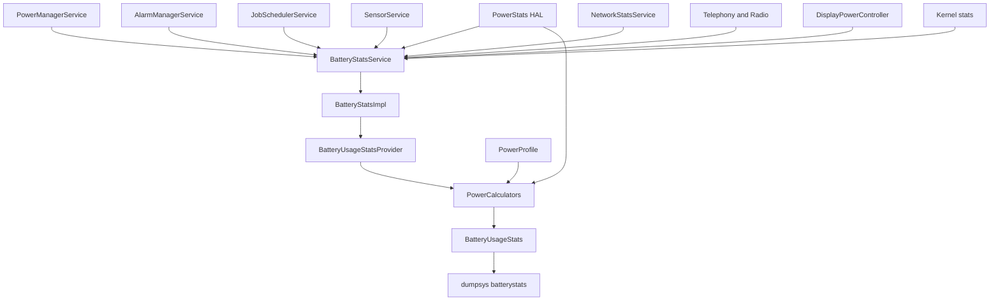
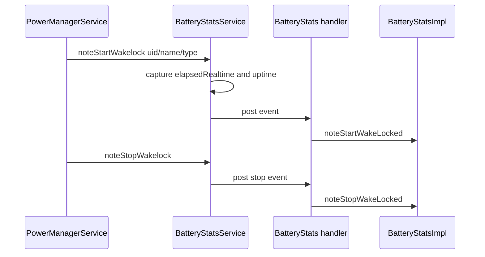
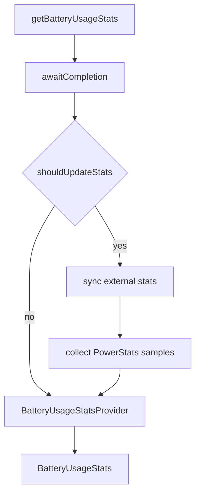
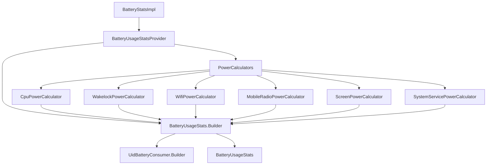
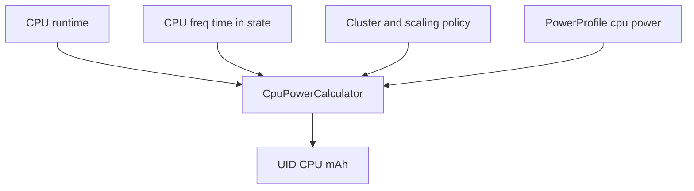
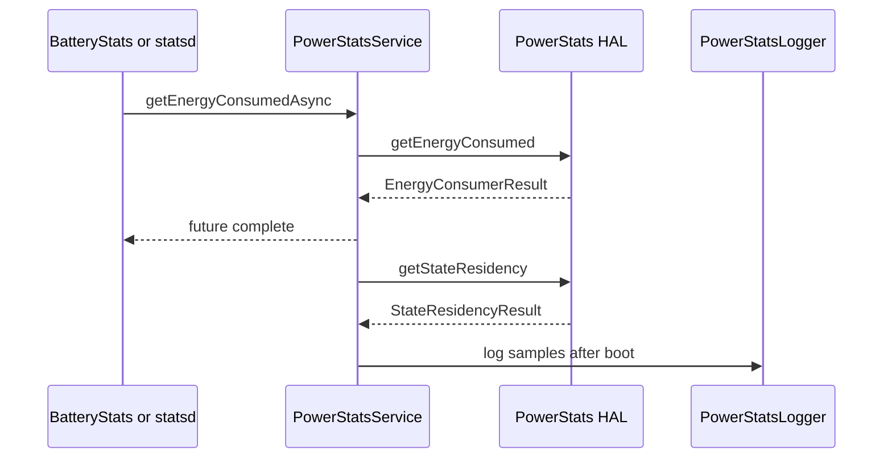
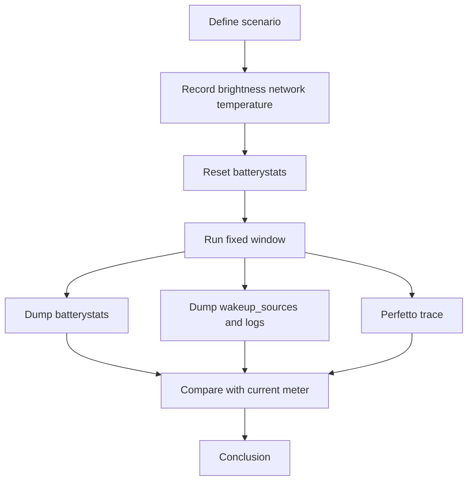
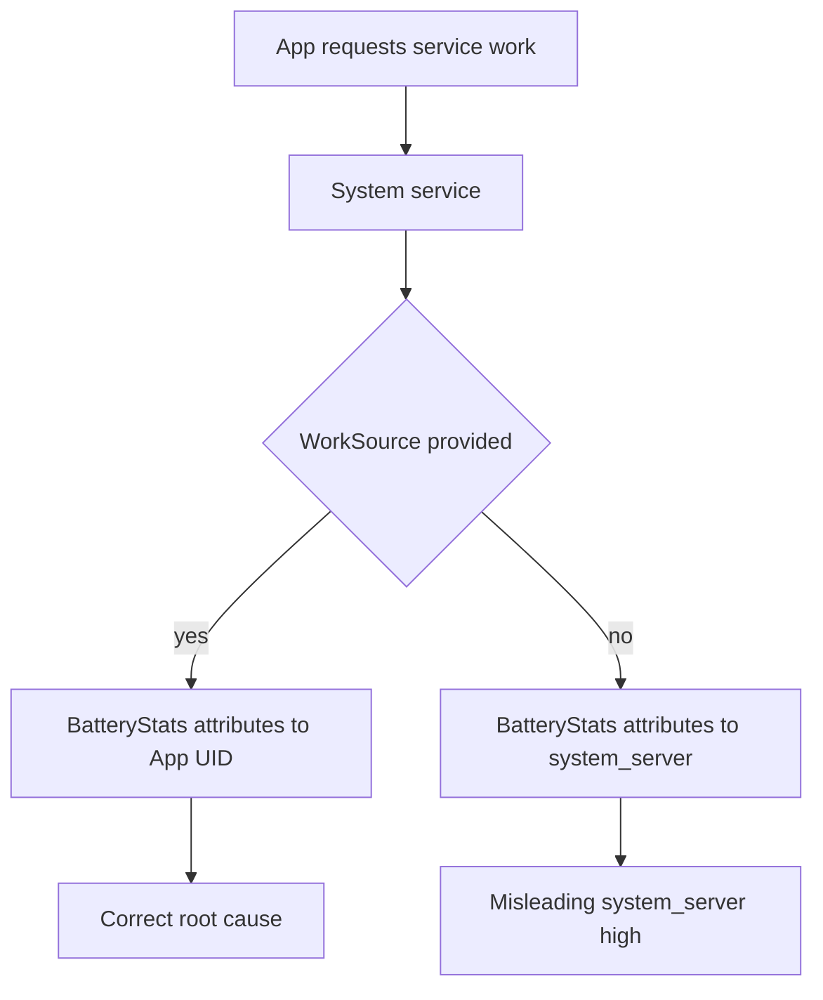
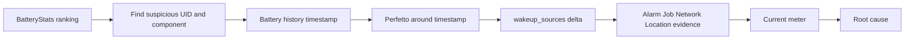
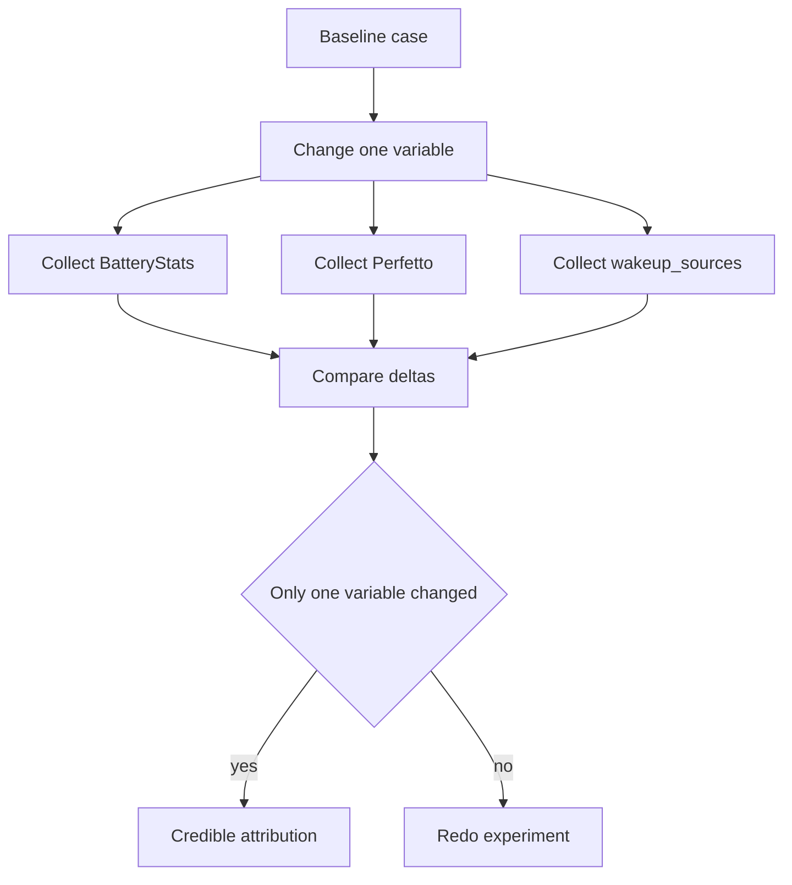

BatteryStats 是 Android 功耗分析里最常用、也最容易被误读的系统。它很重要，但它不是电流仪，也不是“真相本身”。它是一套**活动统计 + 能耗模型 + 归因规则**。

先概括一下：

```text
BatteryStats 记录谁在什么时候做了什么；
BatteryUsageStats 把这些活动转换成各 UID / 各组件的耗电估算；
PowerProfile 或 PowerStats HAL 提供能耗模型或硬件能量数据；
最终排行只是线索，根因还要靠时间线和交叉证据确认。
```

如果只看“耗电排行第一”，很容易误判。比如 `system_server` 高，不一定是 system_server 自己在耗电，可能是它替 App 工作而 WorkSource 不完整；比如 Screen 高，不一定是显示驱动 bug，可能只是亮度和白底画面；比如 Mobile radio 高，不一定是 modem bug，可能是某 UID 弱网轮询。

## 总览

BatteryStats 的数据链路可以分成四段：

| 阶段 | 作用 | 典型数据 |
|------|------|----------|
| 事件记录 | 系统服务把活动事件记入 BatteryStatsImpl | wakelock、alarm、job、sensor、network、screen、radio |
| 外部同步 | 从 kernel/HAL/network stats 拉取统计 | CPU time、controller activity、network bytes、energy |
| 功耗估算 | PowerCalculator 按组件计算 mAh | CPU、screen、wakelock、wifi、mobile、sensor、idle |
| 展示/归因 | BatteryUsageStats / dumpsys 输出 | UID 排行、组件耗电、history 时间线 |



这张图里最关键的是：**BatteryStats 的输入来自很多模块，输出经过模型计算，不是单一原始数据。**

## 源码入口

AOSP14 / LOS21 相关核心入口：

| 模块 | 源码 |
|------|------|
| BatteryStatsService | [BatteryStatsService.java line 164](vscode://file//home/suhui/workspace/aosp/los21/frameworks/base/services/core/java/com/android/server/am/BatteryStatsService.java:164:1) |
| getBatteryUsageStats | [BatteryStatsService.java line 892](vscode://file//home/suhui/workspace/aosp/los21/frameworks/base/services/core/java/com/android/server/am/BatteryStatsService.java:892:1) |
| noteStartWakelock | [BatteryStatsService.java line 1190](vscode://file//home/suhui/workspace/aosp/los21/frameworks/base/services/core/java/com/android/server/am/BatteryStatsService.java:1190:1) |
| noteStartWakelockFromSource | [BatteryStatsService.java line 1226](vscode://file//home/suhui/workspace/aosp/los21/frameworks/base/services/core/java/com/android/server/am/BatteryStatsService.java:1226:1) |
| BatteryStatsImpl | [BatteryStatsImpl.java](vscode://file//home/suhui/workspace/aosp/los21/frameworks/base/services/core/java/com/android/server/power/stats/BatteryStatsImpl.java:1:1) |
| BatteryUsageStatsProvider | [BatteryUsageStatsProvider.java line 43](vscode://file//home/suhui/workspace/aosp/los21/frameworks/base/services/core/java/com/android/server/power/stats/BatteryUsageStatsProvider.java:43:1) |
| getPowerCalculators | [BatteryUsageStatsProvider.java line 67](vscode://file//home/suhui/workspace/aosp/los21/frameworks/base/services/core/java/com/android/server/power/stats/BatteryUsageStatsProvider.java:67:1) |
| getCurrentBatteryUsageStats | [BatteryUsageStatsProvider.java line 151](vscode://file//home/suhui/workspace/aosp/los21/frameworks/base/services/core/java/com/android/server/power/stats/BatteryUsageStatsProvider.java:151:1) |
| PowerProfile | [PowerProfile.java line 54](vscode://file//home/suhui/workspace/aosp/los21/frameworks/base/core/java/com/android/internal/os/PowerProfile.java:54:1) |
| PowerProfile.getAveragePower | [PowerProfile.java line 881](vscode://file//home/suhui/workspace/aosp/los21/frameworks/base/core/java/com/android/internal/os/PowerProfile.java:881:1) |
| PowerStatsService | [PowerStatsService.java line 73](vscode://file//home/suhui/workspace/aosp/los21/frameworks/base/services/core/java/com/android/server/powerstats/PowerStatsService.java:73:1) |
| PowerStatsService.onStart | [PowerStatsService.java line 290](vscode://file//home/suhui/workspace/aosp/los21/frameworks/base/services/core/java/com/android/server/powerstats/PowerStatsService.java:290:1) |
| getEnergyConsumedAsync | [PowerStatsService.java line 405](vscode://file//home/suhui/workspace/aosp/los21/frameworks/base/services/core/java/com/android/server/powerstats/PowerStatsService.java:405:1) |
| getStateResidencyAsync | [PowerStatsService.java line 419](vscode://file//home/suhui/workspace/aosp/los21/frameworks/base/services/core/java/com/android/server/powerstats/PowerStatsService.java:419:1) |
| CpuPowerCalculator | [CpuPowerCalculator.java](vscode://file//home/suhui/workspace/aosp/los21/frameworks/base/services/core/java/com/android/server/power/stats/CpuPowerCalculator.java:1:1) |
| WakelockPowerCalculator | [WakelockPowerCalculator.java](vscode://file//home/suhui/workspace/aosp/los21/frameworks/base/services/core/java/com/android/server/power/stats/WakelockPowerCalculator.java:1:1) |
| ScreenPowerCalculator | [ScreenPowerCalculator.java](vscode://file//home/suhui/workspace/aosp/los21/frameworks/base/services/core/java/com/android/server/power/stats/ScreenPowerCalculator.java:1:1) |
| SystemServicePowerCalculator | [SystemServicePowerCalculator.java](vscode://file//home/suhui/workspace/aosp/los21/frameworks/base/services/core/java/com/android/server/power/stats/SystemServicePowerCalculator.java:1:1) |

## BatteryStatsService

`BatteryStatsService` 是 system_server 中对外提供 `IBatteryStats` 的服务。其他系统服务通过它把事件写进 `BatteryStatsImpl`。

例如 wakelock：

```text
noteStartWakelock(uid, pid, name, historyName, type)
    enforce UPDATE_DEVICE_STATS
    record elapsedRealtime and uptime
    post to BatteryStats handler
    mStats.noteStartWakeLocked(...)

noteStopWakelock(...)
    record elapsedRealtime and uptime
    post to BatteryStats handler
    mStats.noteStopWakeLocked(...)
```

如果带 WorkSource：

```text
noteStartWakelockFromSource(WorkSource ws, ...)
    copy WorkSource
    post to BatteryStats handler
    mStats.noteStartWakeFromSourceLocked(...)
```



这里有两个细节：

1. 事件记录用的是 `elapsedRealtime` 和 `uptime`，不是 wall clock。
2. 很多事件通过 Handler 异步写入，所以 `getBatteryUsageStats()` 前会 `awaitCompletion()`，必要时还会 `syncStats()`。

`getBatteryUsageStats()` 的流程：

```text
getBatteryUsageStats(queries)
    enforce permission
    await pending writes
    if stats should update:
        sync external stats
        collect PowerStats samples if enabled
    return BatteryUsageStatsProvider.getBatteryUsageStats(mStats, queries)
```



## BatteryUsageStatsProvider

`BatteryUsageStatsProvider` 把 BatteryStatsImpl 中的活动统计转换成 BatteryUsageStats。

它会创建一组 `PowerCalculator`：

```text
BatteryChargeCalculator
CpuPowerCalculator
MemoryPowerCalculator
WakelockPowerCalculator
MobileRadioPowerCalculator
WifiPowerCalculator
BluetoothPowerCalculator
SensorPowerCalculator
GnssPowerCalculator
CameraPowerCalculator
FlashlightPowerCalculator
AudioPowerCalculator
VideoPowerCalculator
PhonePowerCalculator
ScreenPowerCalculator
AmbientDisplayPowerCalculator
IdlePowerCalculator
CustomEnergyConsumerPowerCalculator
UserPowerCalculator
SystemServicePowerCalculator
```

源码里还特别写了一个重要注释：`SystemServicePowerCalculator` 要最后执行，因为它会对其他 calculator 估出来的一部分功耗做重新归因。



构建过程大致是：

```text
getCurrentBatteryUsageStats(stats, query):
    realtimeUs = elapsedRealtime * 1000
    uptimeUs = uptime * 1000
    create BatteryUsageStats.Builder
    for each BatteryStats.Uid:
        create UidBatteryConsumer.Builder
        fill foreground/background/fg-service time
    for each PowerCalculator:
        if requested component matches:
            calculator.calculate(...)
    return builder.build()
```

因此 BatteryUsageStats 的结果不是简单“把 UID 的 CPU time 排序”，而是多个组件加总后得到的估算。

## PowerProfile

`PowerProfile` 是设备功耗模型。它从资源 XML 读取各种组件的平均电流，单位通常是 mA，然后 PowerCalculator 用它把“时间/次数/字节”换算成 mAh。

典型字段：

| 字段 | 含义 |
|------|------|
| `cpu.suspend` | CPU power collapse 时的功耗 |
| `cpu.idle` | CPU awake 但 idle 的功耗 |
| `cpu.active` | CPU active 基础功耗 |
| CPU cluster/core power | 不同 cluster / 频点的功耗 |
| `screen.on` | 屏幕点亮基础功耗，旧字段 |
| `screen.full` | 满亮度屏幕功耗，旧字段 |
| display screen on/full | 多显示设备的新 display power group |
| `wifi.on` / `wifi.active` | Wi-Fi 基础和活跃功耗 |
| `wifi.controller.*` | Wi-Fi controller RX/TX/idle 电流 |
| `modem.controller.*` | modem sleep/idle/RX/TX 电流 |
| `battery.capacity` | 电池容量，mAh |

PowerProfile 源码里对 CPU 的模型有清楚说明：

```text
Total CPU power =
    cpu.suspend
  + cpu.idle
  + cpu.active
  + cluster power
  + core power * running cores
```

这也是为什么 BatteryStats 的 CPU 耗电依赖：

- CPU time。
- 频点 time in state。
- cluster/policy 映射。
- PowerProfile 中每个档位的平均电流。



PowerProfile 的局限：

| 局限 | 影响 |
|------|------|
| 平均电流来自配置 | 配错会导致估算整体偏 |
| 不一定覆盖所有 vendor 外设 | 某些耗电无法精确归因 |
| CPU/GPU/DDR耦合复杂 | 模型可能简化 |
| 屏幕与内容相关 | OLED 白底/HDR/HBM 可能难准确 |
| 弱网/射频环境复杂 | modem 功耗估算会有偏差 |

所以 PowerProfile 适合做相对归因和趋势分析，不适合替代电源仪。

## PowerStats

PowerStats 是更接近硬件侧的能量/驻留统计接口。`PowerStatsService` 通过 PowerStats HAL 读取：

- energy consumer。
- energy meter。
- power entity。
- state residency。

`PowerStatsService.onStart()` 会在 HAL 初始化后发布本地服务和 binder 服务；boot completed 后启动 logger 和 trigger，把 meter/model/residency 数据落盘。

核心接口：

```text
getEnergyConsumedAsync(ids)
getPowerEntityInfo()
getStateResidencyAsync(powerEntityIds)
getEnergyMeterInfo()
readEnergyMeterAsync(channelIds)
```



PowerStats 和 PowerProfile 的区别：

| 模型 | 来源 | 优点 | 缺点 |
|------|------|------|------|
| PowerProfile | 静态平均电流配置 | 所有设备都能有基础估算 | 精度依赖配置 |
| PowerStats HAL | 硬件/平台报告能量或驻留 | 更贴近真实硬件 | 平台支持程度不一，归因仍可能粗 |
| 电源仪 | 外部测量整机电流 | 真实整机电流 | 不知道 UID，需要日志归因 |

正确姿势是：

```text
PowerStats/PowerProfile 给软件归因；
电源仪给整机真实电流；
Perfetto/wakeup_sources 给时间线和 kernel 证据；
三者互相校验。
```

## 命令体系

重置统计：

```bash
adb shell dumpsys batterystats --reset
adb shell dumpsys batterystats --enable full-wake-history
```

抓文本：

```bash
adb shell dumpsys batterystats --charged > batterystats_charged.txt
adb shell dumpsys batterystats > batterystats.txt
adb shell dumpsys batterystats --history > batterystats_history.txt
adb shell dumpsys batterystats --history-start 0 > history_start0.txt
```

抓 proto：

```bash
adb shell dumpsys batterystats --proto > batterystats.pb
adb shell dumpsys batterystats --checkin > batterystats_checkin.txt
```

看模型和能量：

```bash
adb shell dumpsys batterystats --power-profile > power_profile.txt
adb shell dumpsys batterystats --measured-energy > measured_energy.txt
adb shell dumpsys batterystats --cpu > cpu_stats.txt
adb shell dumpsys batterystats --wakeups > wakeups.txt
```

看 PowerStats：

```bash
adb shell dumpsys powerstats > powerstats.txt
adb shell dumpsys powerstats --help
```

补充上下文：

```bash
adb shell dumpsys power > power.txt
adb shell dumpsys alarm > alarm.txt
adb shell dumpsys jobscheduler > jobs.txt
adb shell dumpsys deviceidle > deviceidle.txt
adb shell dumpsys thermalservice > thermal.txt
adb shell dumpsys display > display.txt
adb shell cat /sys/kernel/debug/wakeup_sources > wakeup_sources.txt
```

## 统计窗口

做 BatteryStats 分析，窗口非常重要。

| 方式 | 适用场景 | 风险 |
|------|----------|------|
| `--charged` | 从上次满电/重置以来 | 时间太长，噪声多 |
| `--reset` 后跑固定 case | 复现实验 | 重置本身改变历史上下文 |
| bugreport | 现场问题保全 | 文件大，分析慢 |
| history 时间线 | 找异常发生时刻 | 需要结合其他日志 |
| proto + Historian | 长周期可视化 | 需要工具 |

推荐 case 流程：

```text
1. 记录初始状态和测试条件
2. dumpsys batterystats --reset
3. 运行固定场景 10/30/60 分钟
4. 抓 batterystats --charged / --history / --proto
5. 同时抓 Perfetto 或 kernel wakeup_sources delta
6. 对照电源仪或电量变化
```



## 读BatteryStats

读 BatteryStats 不要从“排行”直接跳结论，要按组件拆。

常见关注项：

| 项 | 问题方向 |
|----|----------|
| CPU | 线程运行、频率、后台计算 |
| Wakelock | 阻止 suspend 或让 CPU 保持 awake |
| Alarm | 周期唤醒 |
| Job | 后台任务 |
| Network | Wi-Fi/mobile 流量和 radio active |
| Sensor/GNSS | 定位、传感器 |
| Screen | 亮度、亮屏时长、显示内容 |
| Idle | 设备基础待机 |
| System service | system_server 代理工作或归因问题 |

建议先看：

```bash
adb shell dumpsys batterystats --charged | grep -Ei "Estimated power use|Uid|Wake lock|Job|Alarm|Network|Sensor|Gnss|Wifi|Mobile|Screen|Idle"
```

但 grep 只是入口，最终要回到完整文件。

## WorkSource

WorkSource 是耗电归因里绕不开的点。

系统服务经常替 App 干活：

- LocationManager 替 App 做定位。
- AlarmManager 替 App 投递 alarm。
- JobScheduler 替 App 跑 job。
- Connectivity/Wi-Fi 替 App 建网络。
- Media/Audio/Camera 服务替 App 使用硬件。

如果系统服务持有 wakelock 时没有传 WorkSource，BatteryStats 可能把耗电记到 system_server 或服务进程，而不是实际请求者。



BatteryStatsService 中 `noteStartWakelockFromSource(WorkSource ws, ...)` 会复制 WorkSource，然后写入 `noteStartWakeFromSourceLocked()`。这就是系统服务替应用工作时正确归因的入口。

排查 system_server 高耗电时，要问：

| 问题 | 证据 |
|------|------|
| system_server 自己忙？ | Perfetto 中 system_server 线程长期运行 |
| system_server 代理 App？ | BatteryStats 中 WorkSource/UID 关联 |
| WorkSource 缺失？ | 系统服务 wakelock 名字高，但无对应 UID |
| 归因被 SystemServicePowerCalculator 调整？ | BatteryUsageStatsProvider 中 system service calculator 最后执行 |

## BatteryStats与Perfetto

BatteryStats 擅长长时间统计，Perfetto 擅长短时间真相。

| 工具 | 回答 |
|------|------|
| BatteryStats | 谁在这个窗口内累计多 |
| BatteryStats history | 异常在什么时候发生 |
| Perfetto | 那一刻哪个线程在跑、频率和 idle 怎样 |
| wakeup_sources | Kernel 谁阻止 suspend 或唤醒 |
| dumpsys alarm/jobscheduler | 哪个后台任务触发 |
| 电流仪 | 整机电流是否真实升高 |



结论必须写成证据链，而不是“排行第一所以它有问题”。

## Battery Historian

Battery Historian 通常用 bugreport 或 batterystats proto 来看长周期：

```bash
adb bugreport bugreport.zip
adb shell dumpsys batterystats --proto > batterystats.pb
```

Historian 适合看：

- 屏幕开关。
- charging / unplugged。
- wakelock。
- wakeup alarm。
- job。
- Doze 状态。
- network / radio active。
- top UID。
- temperature。

它不适合替代 Perfetto，因为 Historian 不能告诉你某 200ms 内线程调度、CPU 频率、IRQ、binder 的细节。

## Power model判断

Android 的耗电可以来自不同 power model：

| 模型 | 说明 |
|------|------|
| Power Profile | 用活动时间/次数/字节乘以平均电流 |
| Energy Consumption | 使用硬件报告的能量消费者数据 |
| Measured Energy | 使用 measured energy 数据 |
| Smearing | 某些无法准确归因的耗电按规则摊到 UID |

例如 ScreenPowerCalculator 里，屏幕耗电可能被按前台时间等方式摊到应用。移动网络也可能把一部分 radio active power 按 UID 网络活动摊分。

所以看到某 UID 的 screen 或 mobile radio 高时，要理解：

- 它不一定是该 UID 直接控制硬件的全部电流。
- 可能是系统根据前台时间/流量/活动比例摊分。
- 排行越靠前，越值得查，但不等于已经证明根因。

## 案例一：UID wakeup alarm高

现象：

```text
BatteryStats 显示 UID xxx wakeup alarm 次数高。
wakeup_sources 中 alarmtimer wakeup_count 增长。
Perfetto 显示每 60s resume 后目标进程运行。
```

排查：

```bash
adb shell dumpsys batterystats --charged > bs.txt
adb shell dumpsys batterystats --history > history.txt
adb shell dumpsys alarm > alarm.txt
adb shell cat /sys/kernel/debug/wakeup_sources > ws.txt
```

报告写法：

```text
BatteryStats 中 UID xxx 的 wakeup alarm 次数在 30 分钟窗口内增长 xx 次。
dumpsys alarm 显示该 UID 存在周期性 ELAPSED_REALTIME_WAKEUP。
wakeup_sources 中 alarmtimer wakeup_count 同步增长。
Perfetto 显示每次 alarm 后目标进程运行并发起网络请求。
因此该问题属于高频 wakeup alarm 驱动的后台任务耗电。
```

不要写：

```text
AlarmManager 耗电高。
```

AlarmManager 是机制，目标 UID 和任务语义才是根因。

## 案例二：system_server耗电高

现象：

```text
BatteryStats 排行 system_server 靠前。
system_server CPU 或 wakelock 高。
```

分析要分三种：

| 类型 | 证据 | 结论 |
|------|------|------|
| system_server 自己忙 | Perfetto 中 system_server 线程高 CPU | 查具体服务线程 |
| 代理 App 工作 | WorkSource 指向 App UID | 继续查 App 请求 |
| 归因缺失 | 服务 wakelock 高但无 UID | 查 WorkSource 传递 |

命令：

```bash
adb shell dumpsys batterystats --charged > bs.txt
adb shell top -H -p $(adb shell pidof system_server) -n 1
adb shell perfetto -o /data/misc/perfetto-traces/system_server_power.trace -t 60s sched freq idle binder_driver power am
```

报告写法：

```text
system_server 在 BatteryStats 中靠前，但 Perfetto 显示主要 runtime 来自 xxx service 线程。
该线程活动与 UID yyy 的请求时间一致，且相关 wakelock 使用 WorkSource 归因到 UID yyy。
因此应继续分析 UID yyy 的业务触发，而不是简单归咎 system_server。
```

## 案例三：Screen耗电第一

现象：

```text
BatteryStats 中 Screen 是最大组件。
用户反馈亮屏掉电快。
```

这很常见，不一定是 bug。要看：

- 亮屏时长。
- 亮度。
- HDR/HBM。
- OLED 画面内容。
- 刷新率。
- 是否持续合成。
- 温度和降亮度策略。

命令：

```bash
adb shell dumpsys batterystats --charged > bs.txt
adb shell dumpsys display > display.txt
adb shell dumpsys SurfaceFlinger > sf.txt
adb shell dumpsys thermalservice > thermal.txt
```

报告写法：

```text
Screen 排名第一与测试场景一致：亮屏 xx 分钟、手动亮度 xxx、白底页面。
Perfetto 未显示异常持续刷新，CPU/GPU 可降频。
因此该数据更像正常显示发光成本，不是后台异常耗电。
如需优化，应降低亮度、减少白底/HDR/HBM 或降低刷新率。
```

## 案例四：Mobile radio高

现象：

```text
BatteryStats 中 Mobile radio / Network 高。
弱网场景掉电明显。
```

分析：

Mobile radio 高通常要结合信号、流量、radio active、重传和 UID 网络行为。弱网下即使数据量不大，radio active time 也可能很高。

命令：

```bash
adb shell dumpsys batterystats --charged > bs.txt
adb shell dumpsys netstats > netstats.txt
adb shell dumpsys connectivity > connectivity.txt
adb shell dumpsys telephony.registry > telephony_registry.txt
adb shell dumpsys telephony > telephony.txt 2>/dev/null
```

报告写法：

```text
UID xxx 在测试窗口内移动网络流量不大，但 radio active time 高。
现场信号弱，Perfetto 中网络请求失败重试频繁。
因此耗电主因不是单次大流量，而是弱网下后台轮询/重试导致 modem 长时间保持活跃。
```

## 案例五：Wakelock高但CPU不高

现象：

```text
BatteryStats partial wakelock 时间长。
CPU runtime 不高。
待机电流高。
```

分析：

partial wakelock 高说明系统被要求保持 CPU awake，但不等于 CPU 一直忙。可能是：

- 持锁等待 I/O。
- 持锁等待网络。
- 持锁期间线程睡眠。
- 系统不能 suspend，但 CPU 只浅 idle。

命令：

```bash
adb shell dumpsys batterystats --charged | grep -i "wake lock"
adb shell dumpsys power | grep -i "Wake Locks" -A80
adb shell cat /sys/kernel/debug/wakeup_sources > ws.txt
```

报告写法：

```text
UID xxx 的 partial wakelock 累计长，但 CPU runtime 不高。
这说明问题主要是阻止 suspend，而不是持续计算。
wakeup_sources 中 PowerManagerService.WakeLocks / 对应 kernel wakelock 在窗口内 prevent_suspend_time 增长。
建议检查该 wakelock 的 acquire/release 生命周期。
```

## 案例六：Wi-Fi耗电高

现象：

```text
BatteryStats Wi-Fi 组件高。
低流量场景仍掉电。
```

可能原因：

- Wi-Fi scan 频繁。
- Wi-Fi location / lowi-server 活跃。
- 弱网重连。
- 后台网络心跳。
- Wi-Fi controller active 时间高。

命令：

```bash
adb shell dumpsys wifi > wifi.txt
adb shell dumpsys netstats > netstats.txt
adb shell dumpsys batterystats --charged > bs.txt
adb shell cat /sys/kernel/debug/wakeup_sources | grep -Ei "wlan|wifi|lowi"
```

报告写法：

```text
Wi-Fi 耗电高不是由大流量造成，netstats 显示数据量较小。
但 wakeup_sources 中 lowi/wlan 相关项增长，dumpsys wifi 显示扫描频繁。
结合定位开启 AB 对比，问题指向 Wi-Fi scan/location 场景。
```

## 案例七：BatteryStats和电流仪不一致

现象：

```text
电源仪显示整机电流高。
BatteryStats 没有明显异常 UID。
```

可能原因：

| 原因 | 说明 |
|------|------|
| 外设功耗未细分 | PMIC、display、modem、sensor hub 可能无法准确 UID 归因 |
| PowerProfile 配置偏差 | 模型估算低估 |
| PowerStats HAL 不支持 | 缺少 measured energy |
| 测试窗口不一致 | BatteryStats 窗口和电流仪窗口没对齐 |
| 充电/USB/温度影响 | 整机电流包含额外因素 |
| kernel/driver 常驻 | 用户态 UID 不明显 |

处理：

```text
先相信电源仪说明“整机确实高”；
再用 BatteryStats 找软件嫌疑；
如果 BatteryStats 无嫌疑，转向 Perfetto、wakeup_sources、thermal、display、modem、kernel IRQ。
```

报告写法：

```text
电源仪确认整机平均电流高，但 BatteryStats 未显示单一 UID 异常。
因此该问题可能不是可准确 UID 归因的软件活动，后续转向外设/Kernel/Display/Radio 层排查。
```

## AB对比方法

耗电归因最怕没有对照组。

常用 AB：

| A | B | 看什么 |
|---|---|--------|
| App 安装 | App 卸载/禁用 | UID 是否消失，电流是否下降 |
| 定位开 | 定位关 | GNSS/Loc_hal/lowi 是否下降 |
| Wi-Fi 开 | Wi-Fi 关 | wlan/scan 是否下降 |
| 移动数据开 | 飞行模式 | modem/radio active 是否下降 |
| 自动亮度 | 固定亮度 | screen 估算是否稳定 |
| 高刷 | 60Hz | display/SF/CPU 是否下降 |
| 冷机 | 热机 | thermal 是否改变归因 |



## 采集脚本

```bash
#!/system/bin/sh

OUT=/data/local/tmp/battery_attr_$(date +%Y%m%d_%H%M%S)
DURATION=${1:-1800}
mkdir -p "$OUT"

date > "$OUT/meta.txt"
getprop ro.product.device >> "$OUT/meta.txt"
getprop ro.board.platform >> "$OUT/meta.txt"
getprop ro.build.version.release >> "$OUT/meta.txt"

dumpsys battery > "$OUT/battery_before.txt"
dumpsys power > "$OUT/power_before.txt"
dumpsys deviceidle > "$OUT/deviceidle_before.txt"
dumpsys display > "$OUT/display_before.txt"
dumpsys alarm > "$OUT/alarm_before.txt"
dumpsys jobscheduler > "$OUT/jobs_before.txt"
dumpsys netstats > "$OUT/netstats_before.txt"
dumpsys thermalservice > "$OUT/thermal_before.txt"
dumpsys batterystats --charged > "$OUT/batterystats_before.txt"
dumpsys batterystats --history > "$OUT/history_before.txt"
dumpsys powerstats > "$OUT/powerstats_before.txt"

WS=/sys/kernel/debug/wakeup_sources
if [ ! -f "$WS" ]; then
    WS=/d/wakeup_sources
fi
cat "$WS" > "$OUT/wakeup_sources_before.txt" 2>/dev/null

sleep "$DURATION"

date >> "$OUT/meta.txt"
dumpsys battery > "$OUT/battery_after.txt"
dumpsys power > "$OUT/power_after.txt"
dumpsys deviceidle > "$OUT/deviceidle_after.txt"
dumpsys display > "$OUT/display_after.txt"
dumpsys alarm > "$OUT/alarm_after.txt"
dumpsys jobscheduler > "$OUT/jobs_after.txt"
dumpsys netstats > "$OUT/netstats_after.txt"
dumpsys thermalservice > "$OUT/thermal_after.txt"
dumpsys batterystats --charged > "$OUT/batterystats_after.txt"
dumpsys batterystats --history > "$OUT/history_after.txt"
dumpsys batterystats --proto > "$OUT/batterystats.pb"
dumpsys powerstats > "$OUT/powerstats_after.txt"
cat "$WS" > "$OUT/wakeup_sources_after.txt" 2>/dev/null
logcat -b events -d > "$OUT/events_logcat.txt"
logcat -b system -d > "$OUT/system_logcat.txt"

tar -czf "$OUT.tar.gz" -C "$(dirname "$OUT")" "$(basename "$OUT")"
echo "$OUT.tar.gz"
```

## 复盘报告写法

```text
1. 场景
   设备：
   平台：
   Android版本：
   测试时长：
   USB/充电状态：
   网络/定位/蓝牙：
   亮度/刷新率：
   温度起止：

2. BatteryStats窗口
   是否reset：
   stats start/end：
   电量变化：
   估算总耗电：

3. UID/组件排行
   Top UID：
   Top component：
   power model：PowerProfile / measured energy：

4. 关键活动
   wakelock：
   alarm：
   job：
   network：
   sensor/GNSS：
   screen：

5. 交叉证据
   Perfetto：
   wakeup_sources：
   dumpsys alarm/jobscheduler：
   netstats：
   thermal：
   电源仪：

6. 结论
   根因 UID/模块：
   是直接耗电还是代理归因：
   是模型估算还是硬件能量：
   优化建议：
```

## 我会这样说明

如果被问到“BatteryStats 是怎么做耗电归因的”，我会这样回答：

```text
BatteryStats 首先记录系统活动事件，比如 wakelock、alarm、job、network、sensor、screen、radio 等。
这些事件由 PowerManagerService、AlarmManagerService、JobSchedulerService 等系统服务通过 BatteryStatsService 写入 BatteryStatsImpl。
当查询 BatteryUsageStats 时，BatteryUsageStatsProvider 会创建 UidBatteryConsumer 和 AggregateBatteryConsumer，并依次调用 Cpu/Wakelock/Wifi/MobileRadio/Screen 等 PowerCalculator。
PowerCalculator 会结合 BatteryStats 中的活动时间、次数、流量，以及 PowerProfile 或 PowerStats HAL 的能量数据，估算每个 UID 和组件的 mAh。
所以 BatteryStats 是软件统计和模型估算系统，不是电流仪。结论需要结合 Perfetto、wakeup_sources 和电源仪验证。
```

如果问“system_server 耗电高怎么办”，我会这样回答：

```text
我会先区分 system_server 自己忙、系统服务代理 App 工作、以及 WorkSource 缺失导致归因错误。
如果 Perfetto 显示 system_server 某服务线程长期运行，那就查该服务逻辑。
如果 BatteryStats 中有 WorkSource 指向某 UID，则继续查实际请求方。
如果 wakelock 或网络活动集中在系统服务但没有合理 WorkSource，就要检查调用链是否正确传递 WorkSource。
不能看到 system_server 排名高就直接认为 system_server 是根因。
```

## 复盘

BatteryStats 的正确用法：

- 把排行当入口，不当结论。
- 明确统计窗口和测试条件。
- 区分活动统计、模型估算、硬件能量和真实电流。
- 关注 WorkSource 和 system_server 代理归因。
- 用 Perfetto 验证时间线。
- 用 wakeup_sources 验证 Kernel 唤醒/阻塞。
- 用电源仪确认整机电流。

我的判断口径：

```text
BatteryStats 告诉你“谁像嫌疑人”，Perfetto 和 kernel 证据告诉你“案发过程”，电源仪告诉你“损失是否真实”。
```
