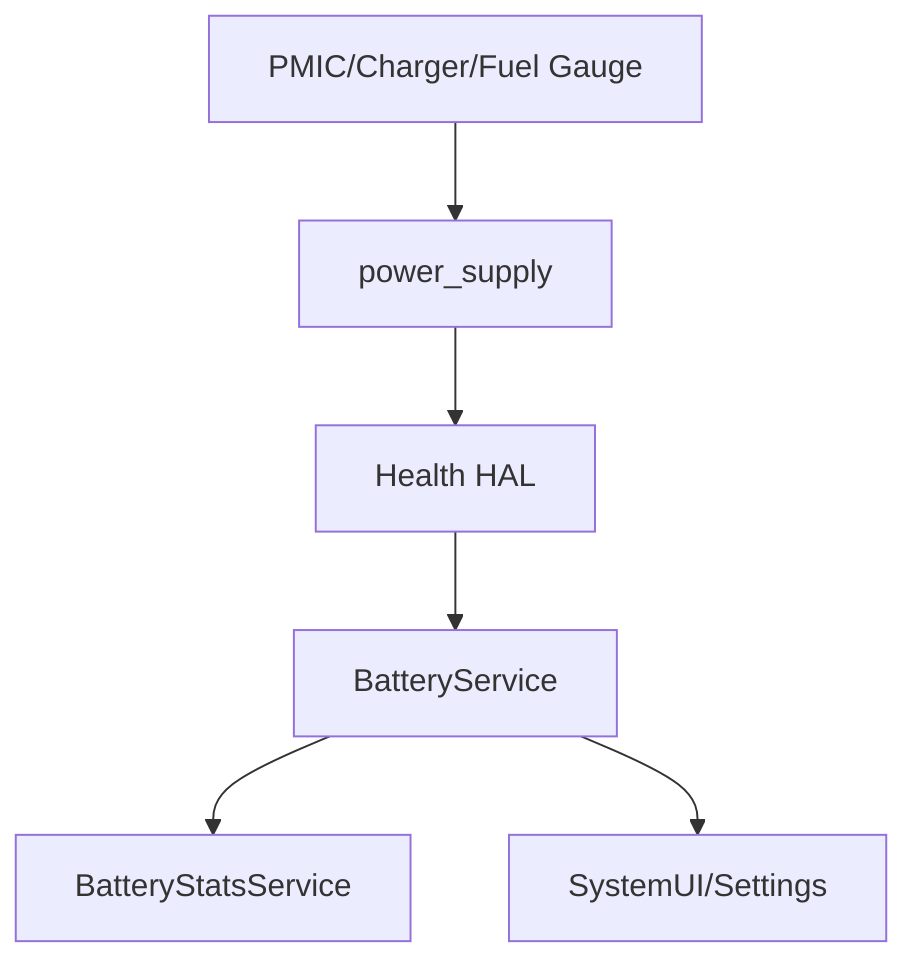

## 架构



源码：

| 模块 | 源码 |
|------|------|
| BatteryService | [BatteryService.java:127](vscode://file//home/suhui/workspace/aosp/los21/frameworks/base/services/core/java/com/android/server/BatteryService.java:127:1) |
| processValuesLocked | [BatteryService.java:590](vscode://file//home/suhui/workspace/aosp/los21/frameworks/base/services/core/java/com/android/server/BatteryService.java:590:1) |
| ACTION_BATTERY_CHANGED | [BatteryService.java:847](vscode://file//home/suhui/workspace/aosp/los21/frameworks/base/services/core/java/com/android/server/BatteryService.java:847:1) |
| BatteryStats setBatteryState | [BatteryStatsService.java:2510](vscode://file//home/suhui/workspace/aosp/los21/frameworks/base/services/core/java/com/android/server/am/BatteryStatsService.java:2510:1) |

## 命令

```bash
adb shell dumpsys battery
adb shell ls /sys/class/power_supply
adb shell cat /sys/class/power_supply/battery/status
adb shell cat /sys/class/power_supply/battery/capacity
adb shell cat /sys/class/power_supply/battery/temp
adb shell cat /sys/class/power_supply/battery/current_now
```

模拟状态只用于测试 UI/策略：

```bash
adb shell dumpsys battery set level 15
adb shell dumpsys battery set ac 1
adb shell dumpsys battery reset
```

## 当前真机观察

```text
USB powered: true
level: 100
status: Full
voltage: 4282 mV
temperature: 370 = 37.0 C
max charging current: 500000 uA
```

这说明当前更适合写“插 USB 满电状态的分析限制”，不适合直接作为自然待机耗电基线。

## 充电发热怎么拆

| 热源 | 说明 |
|------|------|
| 充电路径 | PMIC、charger、电池内阻 |
| 运行负载 | CPU/GPU/display/modem |
| 环境 | 室温、散热条件、手机壳 |
| 策略 | thermal限流、电池保护、满电策略 |

## 充电慢和发热case

```text
现象：
    插快充后温度上升，充电电流下降。

证据：
    battery temp上升；
    current_now下降；
    thermal cooling状态变化；
    Perfetto显示亮屏负载或modem负载叠加。

结论：
    充电热和运行负载叠加触发限流。
```

充电发热不能只看 BatteryService。真正限流可能发生在 charger driver、Health HAL、thermal engine 或 PMIC 策略里。
