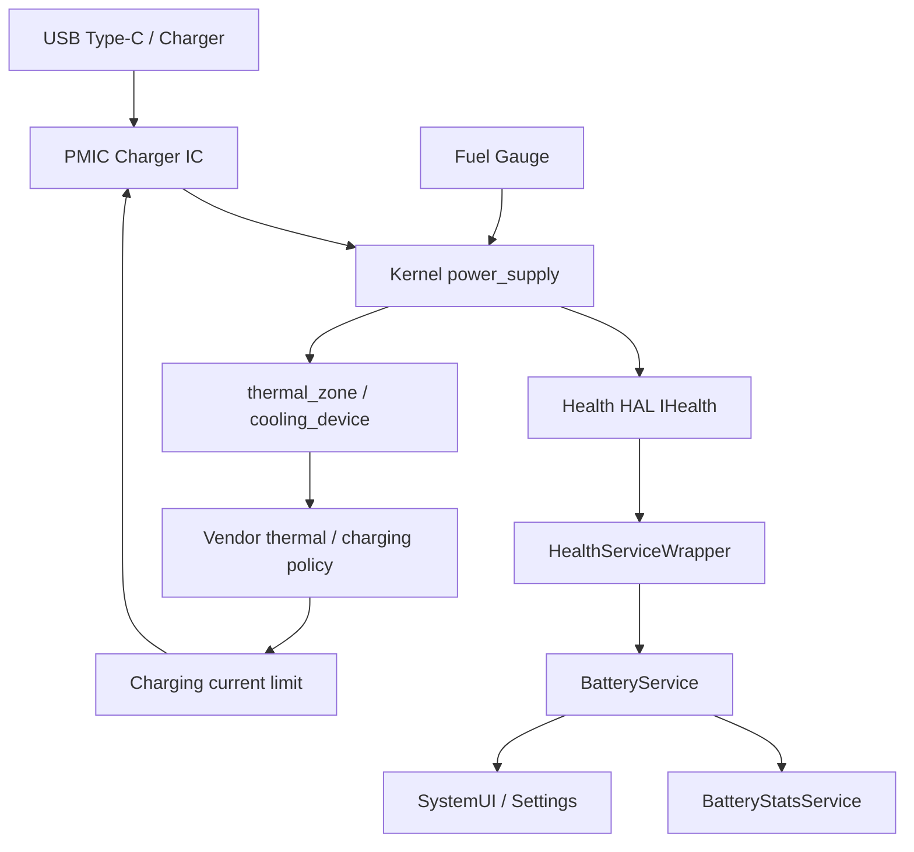
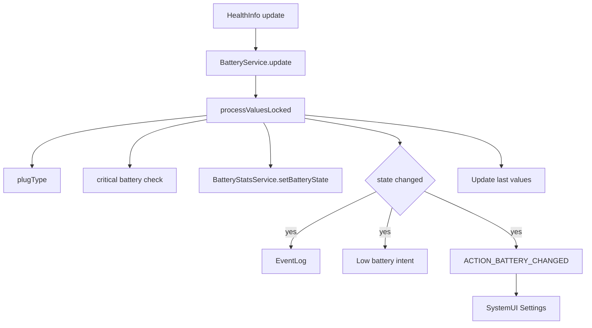
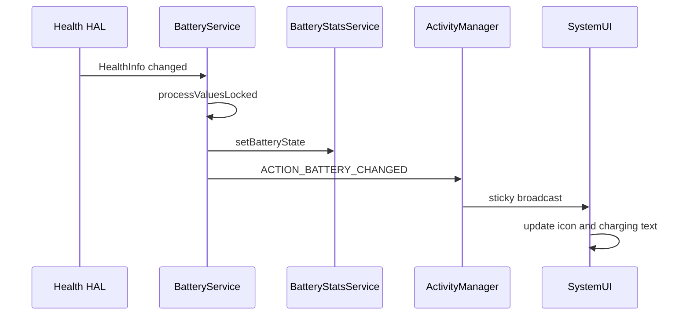
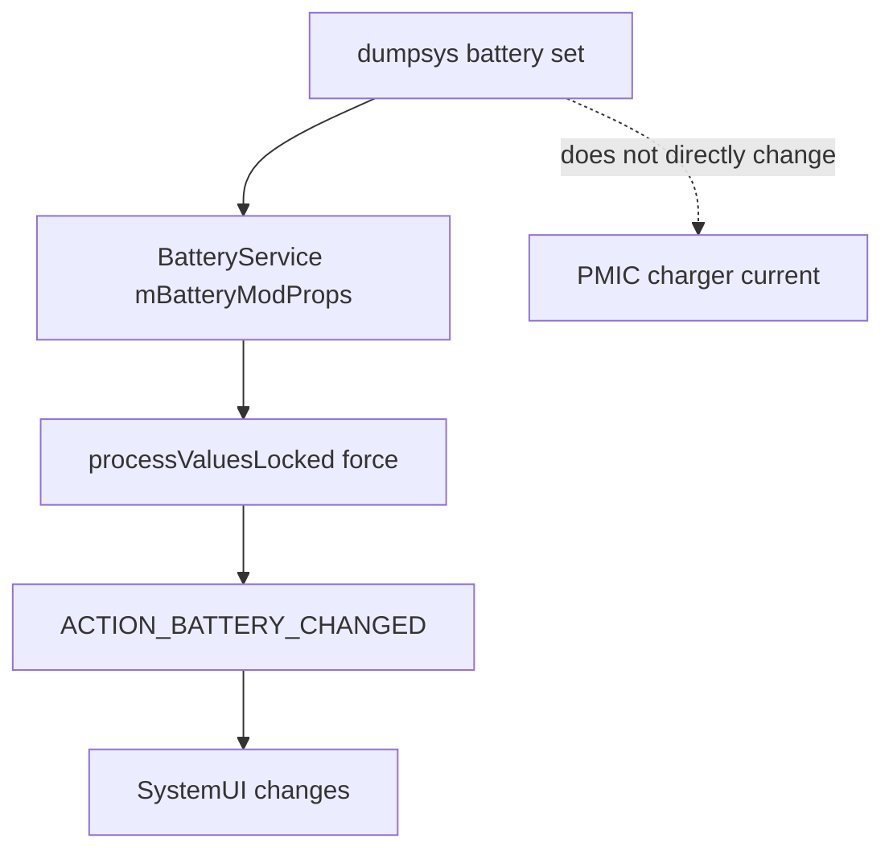
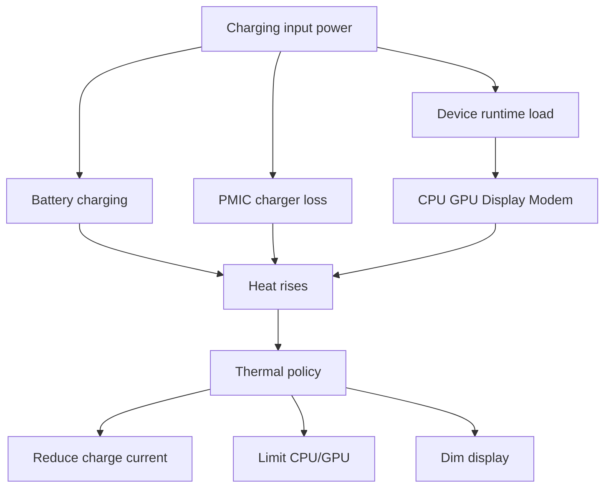
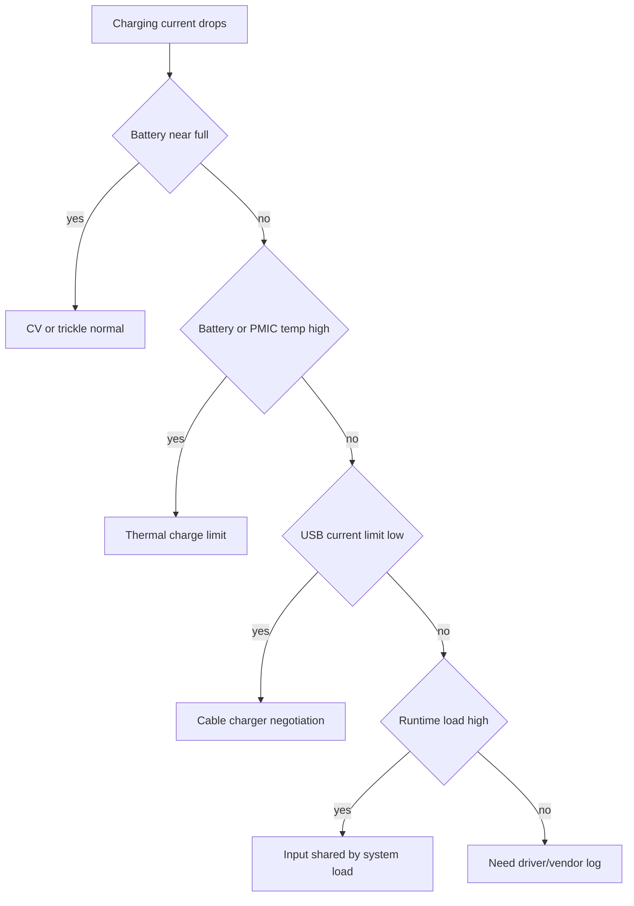

充电问题不要只看“电量有没有涨”。Android 里充电链路横跨 PMIC/charger/fuel gauge、kernel `power_supply`、Health HAL、BatteryService、BatteryStats、SystemUI、Thermal 策略和厂商限流逻辑。一个“充电慢”可能是充电器协商问题，也可能是电池温度高，也可能是亮屏导航叠加负载，也可能是 USB 只拿到 500mA。

这篇记录重点回答四个问题：

- Android 从哪里拿到电池和充电状态？
- BatteryService 拿到 HealthInfo 后做了什么？
- 充电发热和限流应该怎么拆？
- 如何写一个能站住的充电问题 case？

## 总览



关键分层：

| 层级 | 作用 | 典型证据 |
|------|------|----------|
| Charger/PMIC | 协商电压电流、实际充电路径 | USB/PD/QC 日志、charger 节点 |
| Fuel gauge | 电量、容量、电压、电流、温度估算 | `capacity`、`charge_counter`、`voltage_now` |
| Kernel `power_supply` | 向用户态暴露电池/USB/charger 属性 | `/sys/class/power_supply/*` |
| Health HAL | 把 kernel 电池信息封装成 `HealthInfo` | IHealth / health service |
| BatteryService | 处理状态变化、广播、低电、关机、BatteryStats | `dumpsys battery` |
| Thermal/Vendor | 根据温度限制充电/CPU/GPU/亮度 | thermal zone、cooling device |

## 源码入口

| 模块 | 源码 |
|------|------|
| BatteryService | [BatteryService.java line 127](vscode://file//home/suhui/workspace/aosp/los21/frameworks/base/services/core/java/com/android/server/BatteryService.java:127:1) |
| HealthInfo 字段 | [BatteryService.java line 157](vscode://file//home/suhui/workspace/aosp/los21/frameworks/base/services/core/java/com/android/server/BatteryService.java:157:1) |
| BatteryPropertiesRegistrar | [BatteryService.java line 318](vscode://file//home/suhui/workspace/aosp/los21/frameworks/base/services/core/java/com/android/server/BatteryService.java:318:1) |
| BatteryService.update | [BatteryService.java line 542](vscode://file//home/suhui/workspace/aosp/los21/frameworks/base/services/core/java/com/android/server/BatteryService.java:542:1) |
| processValuesLocked | [BatteryService.java line 590](vscode://file//home/suhui/workspace/aosp/los21/frameworks/base/services/core/java/com/android/server/BatteryService.java:590:1) |
| sendBatteryChangedIntentLocked | [BatteryService.java line 845](vscode://file//home/suhui/workspace/aosp/los21/frameworks/base/services/core/java/com/android/server/BatteryService.java:845:1) |
| dumpsys battery | [BatteryService.java line 1371](vscode://file//home/suhui/workspace/aosp/los21/frameworks/base/services/core/java/com/android/server/BatteryService.java:1371:1) |
| BatteryStatsService.setBatteryState | [BatteryStatsService.java line 2510](vscode://file//home/suhui/workspace/aosp/los21/frameworks/base/services/core/java/com/android/server/am/BatteryStatsService.java:2510:1) |
| HealthServiceWrapper | [HealthServiceWrapper.java line 43](vscode://file//home/suhui/workspace/aosp/los21/frameworks/base/services/core/java/com/android/server/health/HealthServiceWrapper.java:43:1) |
| HealthServiceWrapperAidl | [HealthServiceWrapperAidl.java line 49](vscode://file//home/suhui/workspace/aosp/los21/frameworks/base/services/core/java/com/android/server/health/HealthServiceWrapperAidl.java:49:1) |
| HealthRegCallbackAidl | [HealthRegCallbackAidl.java line 32](vscode://file//home/suhui/workspace/aosp/los21/frameworks/base/services/core/java/com/android/server/health/HealthRegCallbackAidl.java:32:1) |

## HealthInfo是什么

BatteryService 的核心输入是 `android.hardware.health.HealthInfo`。里面包含：

| 字段 | 含义 |
|------|------|
| `chargerAcOnline` | AC 是否在线 |
| `chargerUsbOnline` | USB 是否在线 |
| `chargerWirelessOnline` | 无线充是否在线 |
| `chargerDockOnline` | Dock 供电是否在线 |
| `batteryStatus` | Charging / Discharging / Full / Not charging |
| `batteryHealth` | Good / Overheat / Dead / Over voltage 等 |
| `batteryPresent` | 电池是否存在 |
| `batteryLevel` | 电量百分比 |
| `batteryVoltageMillivolts` | 电池电压，mV |
| `batteryTemperatureTenthsCelsius` | 电池温度，0.1 摄氏度 |
| `batteryCurrentMicroamps` | 当前电流，uA |
| `batteryCurrentAverageMicroamps` | 平均电流，uA |
| `maxChargingCurrentMicroamps` | 最大充电电流，uA |
| `maxChargingVoltageMicrovolts` | 最大充电电压，uV |
| `batteryChargeCounterUah` | 剩余容量，uAh |
| `batteryFullChargeUah` | 满充容量，uAh |
| `batteryCycleCount` | 循环次数 |
| `chargingState` | 充电状态 |
| `chargingPolicy` | 充电策略 |

注意单位：

```text
temperature: 370  -> 37.0 C
voltage: 4282     -> 4282 mV
current_now: uA   -> 正负号因平台定义不同
charge_counter: uAh
```

## BatteryService处理流程

`BatteryService.update(HealthInfo info)` 收到 HAL 更新后会：

```text
保存 mHealthInfo
应用 dumpsys battery set 注入值
processValuesLocked(false)
保存 last HealthInfo
```

`processValuesLocked()` 是重点，它会：

```text
计算是否 critical battery
计算 mPlugType
调用 BatteryStatsService.setBatteryState
处理 chargingPolicy 变化
判断电池状态、电量、电压、温度、最大充电电流等是否变化
记录 EventLog
发送低电/电量变化广播
发送 ACTION_BATTERY_CHANGED
更新 LED / UI 相关状态
保存 last 状态
```



这里的关键是：BatteryService 不是负责“实际限流”的地方。它主要负责接收、判断、广播、统计。真正充电电流怎么调，更多在 charger driver、PMIC、vendor thermal、Health HAL 或厂商充电策略里。

## ACTION_BATTERY_CHANGED

`sendBatteryChangedIntentLocked()` 会向系统广播电池状态。常见 extras：

| Extra | 来源 |
|-------|------|
| `EXTRA_STATUS` | `batteryStatus` |
| `EXTRA_HEALTH` | `batteryHealth` |
| `EXTRA_LEVEL` | `batteryLevel` |
| `EXTRA_SCALE` | 100 |
| `EXTRA_PLUGGED` | `mPlugType` |
| `EXTRA_VOLTAGE` | `batteryVoltageMillivolts` |
| `EXTRA_TEMPERATURE` | `batteryTemperatureTenthsCelsius` |
| `EXTRA_MAX_CHARGING_CURRENT` | `maxChargingCurrentMicroamps` |
| `EXTRA_MAX_CHARGING_VOLTAGE` | `maxChargingVoltageMicrovolts` |
| `EXTRA_CHARGE_COUNTER` | `batteryChargeCounterUah` |
| `EXTRA_CHARGING_STATUS` | `chargingState` |



所以如果 UI 显示不对，要看：

- HealthInfo 是否正确。
- BatteryService `dumpsys battery` 是否正确。
- Broadcast 是否被发送。
- SystemUI 是否正确解释。

如果 sysfs 已经不对，优先回到底层节点和驱动链路确认。

## power_supply节点

常用命令：

```bash
adb shell ls -al /sys/class/power_supply
adb shell 'for d in /sys/class/power_supply/*; do echo "== $d =="; ls "$d"; done'
```

电池：

```bash
adb shell cat /sys/class/power_supply/battery/status
adb shell cat /sys/class/power_supply/battery/capacity
adb shell cat /sys/class/power_supply/battery/temp
adb shell cat /sys/class/power_supply/battery/voltage_now
adb shell cat /sys/class/power_supply/battery/current_now
adb shell cat /sys/class/power_supply/battery/charge_counter
adb shell cat /sys/class/power_supply/battery/health
```

USB/charger 节点要先发现：

```bash
adb shell 'for d in /sys/class/power_supply/*; do echo "== $d =="; cat "$d/type" 2>/dev/null; cat "$d/online" 2>/dev/null; cat "$d/current_max" 2>/dev/null; cat "$d/voltage_max" 2>/dev/null; done'
```

不同平台节点名可能是：

```text
battery
usb
usb_main
dc
wireless
bms
parallel
main
pc_port
```

不要固定假设节点名，先 `ls /sys/class/power_supply`。

## dumpsys battery

基础命令：

```bash
adb shell dumpsys battery
adb shell dumpsys battery unplug
adb shell dumpsys battery reset
adb shell dumpsys battery set level 15
adb shell dumpsys battery set usb 1
adb shell dumpsys battery set ac 1
adb shell dumpsys battery set status 2
adb shell dumpsys battery set temp 450
```

注意：`dumpsys battery set ...` 是 BatteryService 层模拟，主要用于 UI/策略测试，不代表 PMIC 真变了。



也就是说，用它可以测试低电广播、充电 UI、策略分支，但不能用它证明真实充电电流变化。

## 充电电流怎么看

常见字段：

| 字段 | 含义 | 注意 |
|------|------|------|
| `current_now` | 当前电池电流 | 正负号平台定义不同 |
| `current_avg` | 平均电流 | 不是所有设备有 |
| `constant_charge_current` | 充电恒流目标 | 可能是配置目标 |
| `input_current_limit` | 输入电流限制 | 节点名平台差异大 |
| `voltage_now` | 当前电池电压 | uV 或 mV 看节点 |
| `capacity` | 电量百分比 | fuel gauge 估算 |
| `charge_counter` | 剩余容量 | uAh |
| `status` | Charging / Full / Discharging | 满电后可能 current 接近 0 |

采样脚本：

```bash
adb shell 'while true; do date; for f in status capacity temp voltage_now current_now charge_counter; do [ -f /sys/class/power_supply/battery/$f ] && echo "$f=$(cat /sys/class/power_supply/battery/$f)"; done; sleep 5; done'
```

充电功率粗略估算：

```text
P_battery ~= voltage_now * current_now
```

但要小心：

- `current_now` 可能是电池端电流，不是 USB 输入电流。
- 输入功率、系统负载和电池充入功率不是一回事。
- 充电时整机运行负载会分走输入功率。
- 满电或涓流阶段电流自然下降。

## 充电发热拆解

充电发热至少四个热源：

| 热源 | 说明 | 证据 |
|------|------|------|
| 充电路径 | PMIC、charger IC、电池内阻发热 | 电流高、电池/PMIC 温度上升 |
| 系统负载 | CPU/GPU/display/modem 同时耗电 | Perfetto、频率、亮屏、网络 |
| 环境散热 | 室温、手机壳、握持、车载 | 环境记录 |
| 策略行为 | thermal 限流、充电保护、满电保护 | cooling device、current 下降 |



充电发热不要只看 `battery temp`。至少同时看：

```bash
adb shell dumpsys battery
adb shell dumpsys thermalservice
adb shell 'for z in /sys/class/thermal/thermal_zone*; do echo "== $z =="; cat $z/type; cat $z/temp; done'
adb shell 'for c in /sys/class/thermal/cooling_device*; do echo "== $c =="; cat $c/type; cat $c/cur_state; cat $c/max_state; done'
adb shell 'for p in /sys/devices/system/cpu/cpufreq/policy*; do echo "== $p =="; cat $p/scaling_cur_freq; cat $p/scaling_max_freq; done'
```

## 充电限流判断

充电电流下降不一定是异常：

| 场景 | 是否正常 | 说明 |
|------|----------|------|
| 电量接近满电 | 正常 | 从恒流进入恒压/涓流 |
| 电池温度升高 | 正常策略 | 保护电池和外壳温度 |
| USB 只协商 500mA | 条件限制 | 线材/口/协议问题 |
| 亮屏高负载 | 条件叠加 | 输入功率被系统负载分走 |
| thermal cooling 触发 | 正常策略或阈值问题 | 要看阈值和体验 |
| 电流突然掉 0 再恢复 | 可能异常 | 充电器、接触、PMIC、温控抖动 |



## 当前QCOM设备观察

当前外接设备曾观察到：

```text
USB powered: true
level: 100
status: Full
voltage: 4282 mV
temperature: 370 = 37.0 C
max charging current: 500000 uA
```

这组数据的第一结论不是“功耗正常”，而是：

```text
当前是 USB 供电 + 满电 + 调试状态。
它不适合作为自然待机基线，也不适合作为快充发热分析样本。
最多能说明 BatteryService 能看到 USB powered、满电、电压、温度、最大充电电流等状态。
```

如果要做充电发热，需要换成：

- 电量 20%~60% 区间。
- 固定充电器和线材。
- 记录室温。
- 尽量断开 adb 或本地脚本落盘。
- 固定亮度/灭屏状态。
- 至少跑 10~30 分钟。

## Case 1：USB只拿到500mA

现象：

```text
插 USB 后显示 charging，但电流低，充电慢。
dumpsys battery: Max charging current: 500000 uA
```

排查：

```bash
adb shell dumpsys battery
adb shell 'for d in /sys/class/power_supply/*; do echo "== $d =="; cat $d/type 2>/dev/null; cat $d/online 2>/dev/null; cat $d/current_max 2>/dev/null; done'
```

我会这样写结论：

```text
当前设备通过 USB 供电，最大充电电流约 500mA。
这是 USB 默认/低电流供电场景，不是快充场景。
该条件下充电慢不能直接判定为 charger driver 异常，需要更换支持快充的适配器和线材复测。
```

## Case 2：充电发热后电流下降

现象：

```text
开始充电电流高。
几分钟后 battery/pmic/skin 温度上升。
随后 current_now 或 input current limit 下降。
```

证据：

```text
battery temp: 35C -> 43C
pmic thermal_zone: 上升
cooling_device cur_state: 0 -> 2
current_now: 高位 -> 下降
```

我会这样写结论：

```text
充电电流下降与温度上升同步，thermal cooling 状态发生变化。
该问题属于温升触发充电限流，而不是 BatteryService UI 显示问题。
需要继续确认限流阈值是否合理，以及亮屏/网络/CPU 负载是否叠加导致过热。
```

## Case 3：亮屏导航边充边热

现象：

```text
边充电边导航，温度快速上升，充电变慢。
```

拆解：

| 贡献 | 证据 |
|------|------|
| 充电路径发热 | 电池电流/PMIC 温度 |
| 亮屏显示 | dumpsys display、亮度 |
| GPS/定位 | dumpsys location、Loc_hal |
| 移动网络 | netstats、modem/radio |
| CPU/GPU | Perfetto、频率 |

我会这样写报告：

```text
该场景不是单一充电问题，而是充电功耗与导航运行负载叠加。
降低亮度或切换离线地图后温升下降，说明显示/网络/定位负载参与了热累积。
充电电流下降是 thermal 保护结果。
```

## Case 4：满电不进电或电流接近0

现象：

```text
level=100
status=Full
current_now 接近 0 或方向变化
```

结论：

```text
满电后进入截止/维持/涓流策略，电流下降是正常现象。
此状态不能用于评估快充速度，也不能用于评估自然待机功耗，因为 USB powered 改变了设备策略。
```

## 采集脚本

```bash
#!/system/bin/sh

OUT=/data/local/tmp/charging_case_$(date +%Y%m%d_%H%M%S)
DURATION=${1:-1800}
mkdir -p "$OUT"

date > "$OUT/meta.txt"
getprop ro.product.device >> "$OUT/meta.txt"
getprop ro.board.platform >> "$OUT/meta.txt"

dumpsys battery > "$OUT/battery_before.txt"
dumpsys power > "$OUT/power_before.txt"
dumpsys thermalservice > "$OUT/thermal_before.txt"

for d in /sys/class/power_supply/*; do
    name=$(basename "$d")
    mkdir -p "$OUT/power_supply_$name"
    for f in type online status capacity temp voltage_now current_now current_avg charge_counter current_max voltage_max input_current_limit constant_charge_current health; do
        [ -f "$d/$f" ] && cat "$d/$f" > "$OUT/power_supply_$name/${f}_before.txt"
    done
done

for z in /sys/class/thermal/thermal_zone*; do
    echo "$(basename "$z") $(cat "$z/type" 2>/dev/null) $(cat "$z/temp" 2>/dev/null)" >> "$OUT/thermal_zones_before.txt"
done

sleep "$DURATION"

dumpsys battery > "$OUT/battery_after.txt"
dumpsys power > "$OUT/power_after.txt"
dumpsys thermalservice > "$OUT/thermal_after.txt"

for d in /sys/class/power_supply/*; do
    name=$(basename "$d")
    for f in type online status capacity temp voltage_now current_now current_avg charge_counter current_max voltage_max input_current_limit constant_charge_current health; do
        [ -f "$d/$f" ] && cat "$d/$f" > "$OUT/power_supply_$name/${f}_after.txt"
    done
done

for z in /sys/class/thermal/thermal_zone*; do
    echo "$(basename "$z") $(cat "$z/type" 2>/dev/null) $(cat "$z/temp" 2>/dev/null)" >> "$OUT/thermal_zones_after.txt"
done

tar -czf "$OUT.tar.gz" -C "$(dirname "$OUT")" "$(basename "$OUT")"
echo "$OUT.tar.gz"
```

## 我会这样说明

```text
充电问题我会先分层：充电器/线材协商、PMIC/charger driver、fuel gauge、Health HAL、BatteryService、thermal/vendor策略。
BatteryService 主要消费 Health HAL 的 HealthInfo，并把状态同步给 BatteryStats、SystemUI 和 ACTION_BATTERY_CHANGED；它一般不是实际限流的执行点。
如果充电慢，我会同时看 power_supply 节点、电池温度、PMIC/skin thermal zone、cooling device、电流变化和系统运行负载。
如果电流下降和温度/cooling 同步，那就是温控限流；如果一开始 max charging current 就只有 500mA，就先查 USB/线材/协议。
```

## 复盘

充电分析要记住：

- `dumpsys battery` 是 BatteryService 视角。
- `/sys/class/power_supply` 是 kernel/driver 视角。
- Health HAL 把 kernel 信息传给 Framework。
- 充电限流多半在 driver/vendor thermal/PMIC 策略里。
- 充电发热是充电路径和运行负载叠加。
- 满电/USB 调试状态不能当快充或自然待机基线。

我的判断口径：

```text
BatteryService 告诉你系统看到的电池状态；真正的充电电流和限流原因，要回到 charger、thermal 和运行负载一起看。
```
