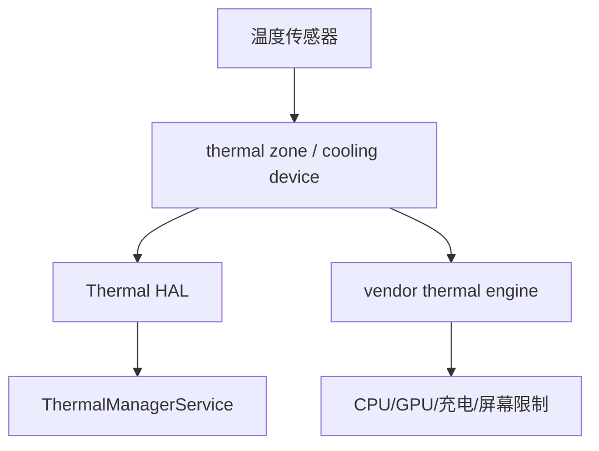

## Thermal不是孤立模块

Thermal 是功耗预算的保护系统。功耗升高造成温升，温升达到阈值后 thermal 通过限频、限流、降亮度等方式把功耗压下来。

## 架构



源码：

| 入口 | 源码 |
|------|------|
| ThermalManagerService | [ThermalManagerService.java:89](vscode://file//home/suhui/workspace/aosp/los21/frameworks/base/services/core/java/com/android/server/power/ThermalManagerService.java:89:1) |
| onTemperatureMapChangedLocked | [ThermalManagerService.java:233](vscode://file//home/suhui/workspace/aosp/los21/frameworks/base/services/core/java/com/android/server/power/ThermalManagerService.java:233:1) |
| onTemperatureChanged | [ThermalManagerService.java:323](vscode://file//home/suhui/workspace/aosp/los21/frameworks/base/services/core/java/com/android/server/power/ThermalManagerService.java:323:1) |
| dumpInternal | [ThermalManagerService.java:652](vscode://file//home/suhui/workspace/aosp/los21/frameworks/base/services/core/java/com/android/server/power/ThermalManagerService.java:652:1) |

## Framework侧

```bash
adb shell dumpsys thermalservice
```

如果输出 `HAL Ready: false`，说明 Framework Thermal HAL 链路不可用或未接好，此时不能说“没有热问题”，只能说 Framework thermalservice 没拿到 HAL 数据。

当前 QCOM 真机就是这种情况：

```text
Thermal Status: 0
Cached temperatures:
HAL Ready: false
```

## Kernel sysfs侧

```bash
adb shell cat /sys/class/thermal/thermal_zone*/type
adb shell cat /sys/class/thermal/thermal_zone*/temp
adb shell cat /sys/class/thermal/cooling_device*/type
adb shell cat /sys/class/thermal/cooling_device*/cur_state
adb shell cat /sys/class/thermal/cooling_device*/max_state
```

当前真机可见：

```text
battery: 37000
pm8998_tz: 33999
pmi8998_tz: 37000
pm8005_tz: 37000
msm_therm: 36
thermal-cpufreq-0
thermal-cpufreq-1
```

这说明即使 Thermal HAL 不工作，Kernel thermal zone 和 cooling device 仍然可以作为热分析入口。

## throttling等级

Android 状态：

```text
NONE
LIGHT
MODERATE
SEVERE
CRITICAL
EMERGENCY
SHUTDOWN
```

厂商策略不一定完全通过 Framework 暴露。很多平台会由 vendor thermal engine 直接操作 cooling device 或频率节点。

## 分析模板

```text
温度：
    thermal_zone中skin/battery/pmic/tsens持续上升。

限制：
    cooling_device cur_state变化，CPU/GPU max freq下降。

体验：
    FPS下降、充电电流下降或亮度下降。

结论：
    thermal策略触发功耗限制。
```

热问题一定要写“温度 + 限制动作 + 体验结果”，三者缺一就不完整。
