前面 00 到 11 篇把 Android 功耗与热管理的主线基本过了一遍：PowerManagerService、WakeLock、Doze、显示、电池统计、Health HAL、Thermal、CPU 调频、JobScheduler、QCOM 实战等。

真正做项目复盘时，问题通常不会停在“某个类有哪些方法”。更常见的是这些更落地的追问：

```text
你有没有分析过真实功耗问题？
你怎么判断一个功耗问题是应用、Framework、Kernel、Modem还是硬件？
你怎么证明修复真的有效？
USB连接会影响待机，那你怎么抓日志？
thermalservice不可用时你怎么分析温控？
为什么BatteryStats显示某个UID耗电高，但电流仪没有明显变化？
```

所以这篇不继续铺概念，主要整理我自己处理功耗问题时的 case 记录方式。后面每个案例都尽量按“条件、证据、根因、修复、验证”来写。

一个能站得住的功耗 case，必须包含四件事：

```text
条件干净：
    版本、环境温度、亮度、网络、SIM、USB、充电状态、测试时长都要说明。

证据闭环：
    不能只说“怀疑是wakelock”，要有BatteryStats、Perfetto、wakeup_sources、电流或温度曲线互相印证。

根因可落地：
    要能落到应用行为、Framework策略、HAL状态、Kernel节点、vendor服务、硬件条件之一。

收益可复测：
    修复前后必须同条件对比，最好有电流、掉电、温升、唤醒次数、持锁时长等量化指标。
```

只写概念很容易失焦。把一个混乱的问题拆成条件、证据、根因、修复和验证，后面无论写周报、做项目总结，还是现场解释，都更稳。

## 一、功耗案例的统一分析框架

功耗问题一上来把所有日志都抓一遍，最后很容易在日志里迷路。我现在更习惯先给场景归类，再决定抓哪些证据。

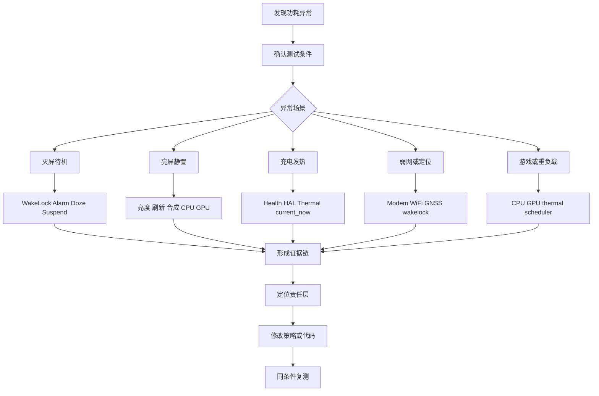

我通常把功耗问题拆成下面几类。

| 类型 | 典型现象 | 关键证据 | 常见责任层 |
| --- | --- | --- | --- |
| 灭屏待机高耗电 | 一晚上掉电多、电流下不去 | BatteryStats、wakeup_sources、Perfetto、Doze状态 | App、Framework、Kernel、Modem |
| 亮屏静置高耗电 | 只是停在桌面或页面，电流仍高 | SurfaceFlinger、RenderThread、CPU/GPU频率、刷新率 | App、Display、SF、GPU |
| 充电发热慢充 | 充电电流下降、温度升高 | dumpsys battery、current_now、thermal_zone、cooling_device | Battery、Thermal、PMIC、充电策略 |
| 弱网高耗电 | 低信号或移动数据下掉电明显 | radio日志、modem服务、netmgrd、wakeup_sources | Modem、RIL、网络策略 |
| 定位高耗电 | 灭屏后仍有GNSS或Wi-Fi扫描 | location dumpsys、wakelock、wakeup_sources | App、Location、GNSS HAL |
| Alarm周期唤醒 | 每隔固定时间唤醒 | dumpsys alarm、BatteryStats wakeup alarm、alarmtimer | App、AlarmManager |
| Job频繁执行 | 后台任务不收敛 | dumpsys jobscheduler、BatteryStats、Perfetto | App、JobScheduler |
| 温控触发限频 | CPU频率降、亮度降、充电降流 | thermalservice、thermal_zone、cooling_device | Thermal HAL、Kernel thermal |
| 归因不准 | system_server或android耗电异常 | BatteryStats、WorkSource、调用链 | Framework、App归因 |

## 二、我记录 case 的固定结构

我不会把 case 写成“看了一下 dumpsys，发现有 wakelock”。这种写法证据不够，复盘时至少要把条件、证据和验证写完整。

```text
标题：
    灭屏待机电流偏高，定位到第三方应用周期性wakeup alarm和partial wakelock叠加。

背景：
    版本、设备、芯片平台、测试场景、测试时长、环境温度、网络状态。

现象：
    电流、掉电、温度、唤醒次数、CPU频率、充电电流等指标异常。

条件确认：
    是否插USB、是否充电、是否stay awake、是否固定亮度、是否开启飞行模式、是否满电。

第一层证据：
    BatteryStats或dumpsys确认长周期归因，例如UID耗电、wakelock时间、alarm次数。

第二层证据：
    Perfetto确认时间线，例如灭屏后仍周期唤醒、线程运行、Suspend失败。

第三层证据：
    Kernel节点确认底层事实，例如wakeup_sources、thermal_zone、cooling_device、cpuidle。

根因：
    具体到包名、服务、Framework策略、HAL状态、Kernel驱动或平台配置。

修复：
    合并任务、改用inexact alarm、释放wakelock、调整thermal阈值、修正WorkSource、优化刷新。

验证：
    同条件复测，给出修复前后对比数据。

风险：
    对功能、实时性、稳定性、充电速度、温控安全的影响。
```

我写 case 时不堆工具名，重点看证据能不能一层一层收敛。


## 三、源码理解应该怎么嵌入 case

源码部分我尽量不写成背 API，而是解释为什么这些证据能支撑判断。

比如分析待机高耗电时，可以这样连起来：

```text
PowerManagerService根据当前wakefulness、WakeLock和显示状态决定是否持有SuspendBlocker。
如果存在partial wakelock，即使屏幕灭了，也可能让AP无法稳定进入suspend。
所以我会把dumpsys power里的WakeLock、BatteryStats里的UID持锁时间、
kernel wakeup_sources里的PowerManagerService.WakeLocks增长放在一起看。
```

对应 AOSP 源码入口可以看：

- [PowerManagerService.updateSuspendBlockerLocked line 3961](vscode://file//home/suhui/workspace/aosp/los21/frameworks/base/services/core/java/com/android/server/power/PowerManagerService.java:3961:1)
- [PowerManagerService.needSuspendBlockerLocked line 4031](vscode://file//home/suhui/workspace/aosp/los21/frameworks/base/services/core/java/com/android/server/power/PowerManagerService.java:4031:1)
- [DeviceIdleController.stepIdleStateLocked line 3876](vscode://file//home/suhui/workspace/aosp/los21/frameworks/base/apex/jobscheduler/service/java/com/android/server/DeviceIdleController.java:3876:1)
- [AlarmManagerService.triggerAlarmsLocked line 4324](vscode://file//home/suhui/workspace/aosp/los21/frameworks/base/apex/jobscheduler/service/java/com/android/server/alarm/AlarmManagerService.java:4324:1)
- [JobSchedulerService.isReadyToBeExecutedLocked line 4041](vscode://file//home/suhui/workspace/aosp/los21/frameworks/base/apex/jobscheduler/service/java/com/android/server/job/JobSchedulerService.java:4041:1)
- [BatteryService.processValuesLocked line 590](vscode://file//home/suhui/workspace/aosp/los21/frameworks/base/services/core/java/com/android/server/BatteryService.java:590:1)
- [ThermalManagerService.onTemperatureMapChangedLocked line 233](vscode://file//home/suhui/workspace/aosp/los21/frameworks/base/services/core/java/com/android/server/power/ThermalManagerService.java:233:1)
- [BatteryStatsService.getBatteryUsageStats line 892](vscode://file//home/suhui/workspace/aosp/los21/frameworks/base/services/core/java/com/android/server/am/BatteryStatsService.java:892:1)
- [DisplayPowerController.updatePowerStateInternal line 1336](vscode://file//home/suhui/workspace/aosp/los21/frameworks/base/services/core/java/com/android/server/display/DisplayPowerController.java:1336:1)
- [SurfaceFlinger.commit line 2517](vscode://file//home/suhui/workspace/aosp/los21/frameworks/native/services/surfaceflinger/SurfaceFlinger.cpp:2517:1)

这些源码入口的作用，是把日志现象和 Framework 行为对上。

## 四、Case 1：USB 连接导致灭屏待机测试失真

这是功耗测试里最容易踩的坑。用户想测自然待机，但设备通过 USB 连着电脑抓 adb。这样做不是完全不能调试，而是要明确：插 USB 会改变测试条件。

### 现象

```text
目标：
    分析灭屏待机功耗。

实际条件：
    手机通过USB连接电脑，adb在线。

异常：
    dumpsys power里显示供电状态改变；
    dumpsys battery里显示USB powered；
    部分设备还会因为开发者选项Stay awake导致灭屏策略变化。
```

常见命令：

```bash
adb shell dumpsys battery
adb shell dumpsys power | sed -n '1,160p'
adb shell settings get global stay_on_while_plugged_in
```

你可能看到：

```text
AC powered: false
USB powered: true
Wireless powered: false
status: 2

mIsPowered=true
mPlugType=2
mStayOn=true
```

### 分析链路

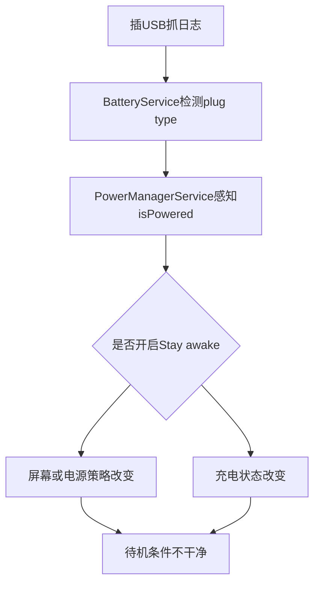

这时不能直接说“设备待机功耗高”。因为你测到的是“USB 连接条件下的功耗”，不是自然灭屏待机。

### 正确做法

```text
方案一：
    USB只用于测试前准备，开始测试前拔线。
    测试结束后再插线抓取历史日志，例如bugreport、BatteryStats、kernel节点快照。

方案二：
    使用无线ADB，但要说明Wi-Fi连接本身也会引入网络功耗。

方案三：
    用本地脚本在设备上采样/sys节点，测试结束后再pull日志。

方案四：
    使用电流仪或电源分析仪记录真实电流，adb只作为辅助证据。
```

一个本地采样脚本可以这样写：

```bash
adb shell 'cat > /data/local/tmp/power_idle_collect.sh << "EOF"
#!/system/bin/sh
OUT=/data/local/tmp/power_idle_$(date +%Y%m%d_%H%M%S)
mkdir -p "$OUT"
echo "start: $(date)" > "$OUT/meta.txt"
while true; do
  TS=$(date +%s)
  {
    echo "===== $TS ====="
    cat /sys/kernel/debug/wakeup_sources 2>/dev/null
    cat /sys/class/power_supply/battery/capacity 2>/dev/null
    cat /sys/class/power_supply/battery/current_now 2>/dev/null
    cat /sys/class/power_supply/battery/temp 2>/dev/null
  } >> "$OUT/sample.txt"
  sleep 60
done
EOF
chmod 755 /data/local/tmp/power_idle_collect.sh'

adb shell nohup /data/local/tmp/power_idle_collect.sh >/dev/null 2>&1 &
adb shell input keyevent 26
```

然后拔 USB，等待测试完成后再插线：

```bash
adb pull /data/local/tmp/power_idle_20260531_120000 ./
adb bugreport bugreport_after_idle.zip
```

### 我会这样说明

```text
我会先确认功耗测试条件是否干净。比如灭屏待机测试中，如果USB还连着电脑，
BatteryService会感知到plug type，PowerManagerService也会看到isPowered状态。
如果开发者选项里打开了Stay awake，屏幕和休眠策略还会进一步变化。
所以我不会直接拿插线状态下的数据判断自然待机功耗，而是用本地脚本或电流仪采样，
测试后再拉日志，或者明确说明这是USB连接场景下的功耗。
```

## 五、Case 2：长时间 partial wakelock 阻止 suspend

灭屏高耗电最经典的根因之一，就是应用或系统服务持有 partial wakelock，导致 AP 不能稳定进入 suspend。

### 现象

```text
场景：
    灭屏待机8小时。

现象：
    掉电超过预期；
    电流基线偏高；
    wakeup_sources里PowerManagerService.WakeLocks增长明显；
    BatteryStats里某个UID wakelock时间接近测试时长。
```

### 证据命令

```bash
adb shell dumpsys power
adb shell dumpsys batterystats --charged
adb shell cat /sys/kernel/debug/wakeup_sources
adb shell cmd deviceidle get deep
```

重点看：

```text
dumpsys power:
    PARTIAL_WAKE_LOCK 'xxx' ACQ=-...

batterystats:
    Wake lock xxx: 2h 31m 10s partial

wakeup_sources:
    PowerManagerService.WakeLocks active_count total_time prevent_suspend_time
```

### 代码理解

在 Framework 层，PowerManagerService 会根据当前 WakeLock、显示状态、wakefulness 等信息更新 SuspendBlocker。partial wakelock 的关键点是：它不一定点亮屏幕，但可以保持 CPU 运行。

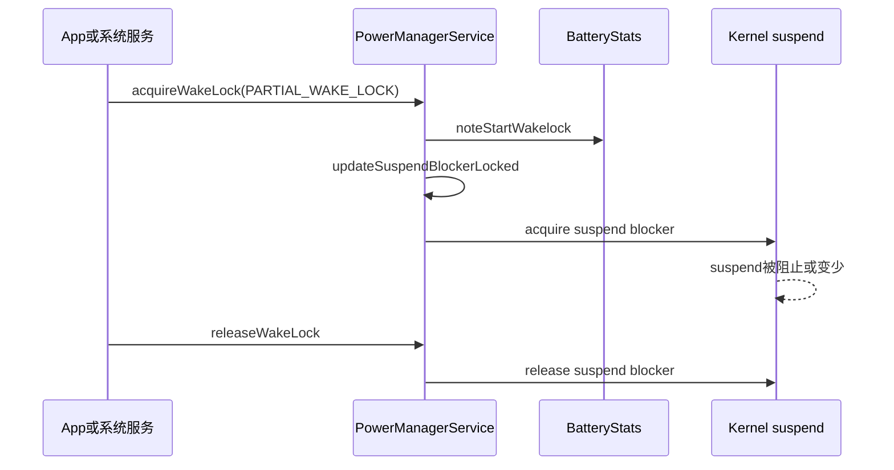

### 错误结论

```text
错误：
    CPU占用不高，所以不是功耗问题。

问题：
    待机功耗不只看CPU平均占用。长时间持锁会减少suspend时间，
    即使每次运行负载不高，也会让设备无法进入更深低功耗状态。
```

### 修复方向

```text
应用侧：
    缩短持锁范围，确保异常路径释放wakelock；
    能不用wakelock就不用；
    使用WorkManager/JobScheduler承接可延后任务。

Framework侧：
    检查系统服务是否在异常状态下未释放锁；
    增加超时保护和日志。

验证：
    partial wakelock总时长下降；
    wakeup_sources中对应项增长下降；
    电流基线或掉电改善。
```

### 我会这样说明

```text
我遇到灭屏功耗问题时，会先看设备是否真的进入了待机条件，
然后把BatteryStats的partial wakelock、dumpsys power里的锁、
Perfetto时间线和kernel wakeup_sources放在一起看。
如果一个锁的持有时间接近测试时长，并且PowerManagerService.WakeLocks的prevent_suspend_time持续增加，
基本就可以判断它在破坏suspend。
```

## 六、Case 3：周期 wakeup alarm 导致待机被反复打断

第二类常见问题是周期 alarm。它和长 wakelock 不一样：wakelock 是“长时间不睡”，alarm 是“睡一会儿就被叫醒”。

### 现象

```text
灭屏后每隔几分钟唤醒一次；
电流曲线呈周期性尖峰；
BatteryStats中wakeup alarm次数异常；
wakeup_sources里alarmtimer增长明显。
```

### 证据命令

```bash
adb shell dumpsys alarm
adb shell dumpsys batterystats --charged
adb shell cat /sys/kernel/debug/wakeup_sources
adb shell cmd deviceidle step deep
```

关注：

```text
dumpsys alarm:
    wakeup=true
    type=RTC_WAKEUP / ELAPSED_REALTIME_WAKEUP
    package=xxx

BatteryStats:
    Wakeup alarms: xxx

wakeup_sources:
    alarmtimer
```

### 流程

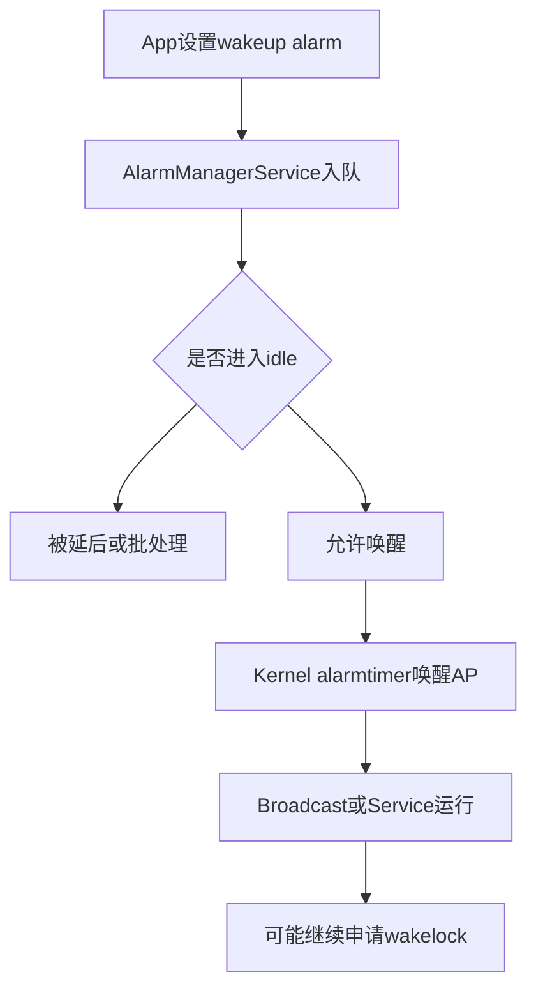

### 源码理解

AlarmManagerService 会管理 alarm 的触发与投递。功耗分析里重点不是背完整实现，而是知道 wakeup alarm 可以从 Kernel alarmtimer 把系统唤醒，再把广播或回调投递给应用。

当你在 `dumpsys alarm` 里看到某个包大量 wakeup alarm，同时 `wakeup_sources` 中 `alarmtimer` 增长，就可以把它作为强证据。

### 修复方向

```text
低实时性任务：
    使用inexact alarm；
    使用JobScheduler或WorkManager；
    合并周期任务；
    增加退避策略。

高实时性任务：
    说明业务必要性；
    控制频率；
    避免唤醒后继续持有长wakelock。
```

### 我会这样说明

```text
周期alarm问题我会看三个点：dumpsys alarm定位谁设置了wakeup alarm，
BatteryStats看wakeup alarm次数，kernel wakeup_sources看alarmtimer是否同步增长。
如果电流曲线也呈周期尖峰，这个证据链就比较完整。
```

## 七、Case 4：Doze 进不去或频繁退出

Doze 不是“灭屏就一定进入”。设备需要满足一组条件，例如静止、未充电、屏幕关闭、没有特定活动等。如果测试条件不满足，Doze 进不去不是 bug。

### 现象

```text
灭屏很久后仍然没有进入IDLE；
cmd deviceidle get deep显示状态停在INACTIVE或IDLE_PENDING；
后台网络和任务仍然比较活跃。
```

### 命令

```bash
adb shell dumpsys deviceidle
adb shell cmd deviceidle get deep
adb shell cmd deviceidle step deep
adb shell dumpsys jobscheduler
adb shell dumpsys alarm
```

### 判断逻辑

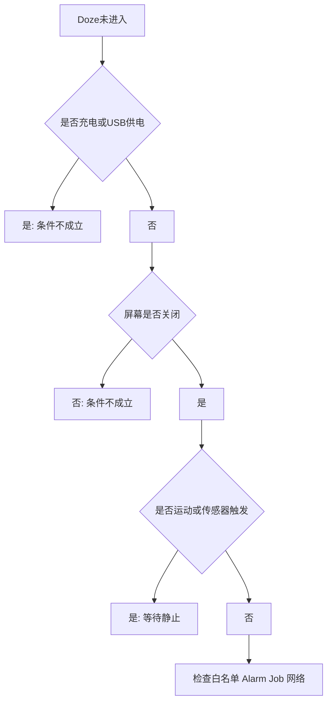

### 常见误判

```text
误判一：
    灭屏5分钟没进Doze，所以Doze坏了。

纠正：
    Doze有状态机和延迟，不是灭屏立即进入。

误判二：
    插USB用cmd deviceidle强制step，所以可以代表真实Doze。

纠正：
    强制step适合验证策略，不等同于自然测试条件。

误判三：
    App在白名单里仍可运行，所以系统Doze无效。

纠正：
    白名单、本地通知、FCM高优先级、厂商策略都会影响结果，需要单独说明。
```

### 我会这样说明

```text
Doze问题我不会只看是否灭屏，而是看DeviceIdleController状态机。
我会先确认未充电、屏幕关闭、设备静止，然后用dumpsys deviceidle看deep idle状态，
再结合alarm和jobscheduler判断是否有任务在维护窗口外频繁运行。
```

## 八、Case 5：定位或 Wi-Fi 扫描导致灭屏唤醒

定位类问题常见于地图、运动、天气、系统服务或厂商组件。它不一定表现为一个很长的 wakelock，有时是 GNSS、Wi-Fi scan、sensor、network location 组合导致的间歇唤醒。

### 现象

```text
灭屏后仍有定位请求；
Wi-Fi扫描次数多；
GNSS或location相关服务活跃；
wakeup_sources中存在qcom_rx_wakelock、wlan、IPA、location相关增长。
```

### 命令

```bash
adb shell dumpsys location
adb shell dumpsys wifi
adb shell dumpsys batterystats --charged
adb shell cat /sys/kernel/debug/wakeup_sources
adb shell ps -A | grep -Ei 'loc|gnss|gps|wifi|wpa|lowi'
```

### 分析链路


### 判断重点

```text
第一：
    是否有前台服务、运动记录、导航、天气刷新这类业务合理性。

第二：
    是否灭屏后仍保持高频定位，没有根据前后台状态降频。

第三：
    是否使用高精度定位但实际只需要粗定位。

第四：
    Wi-Fi扫描是否被App或系统策略频繁触发。
```

### 修复方向

```text
降低定位精度：
    高精度切换为粗定位或网络定位。

降低频率：
    根据前后台、灭屏、低电量、Doze状态动态调整。

合并请求：
    多业务共享定位结果，不重复启动扫描。

清理异常路径：
    页面退出、服务停止、任务取消时释放定位监听。
```

### 我会这样说明

```text
定位功耗我会先区分业务合理性和异常行为。
如果是导航，灭屏持续定位可能合理；如果是普通天气或推荐业务，
灭屏后仍高频定位就不合理。证据上我会结合dumpsys location、BatteryStats、
Perfetto和wakeup_sources，确认请求方、频率和底层唤醒是否一致。
```

## 九、Case 6：弱网或移动数据导致 Modem 侧功耗高

弱网问题经常被误判成 App 或 Framework 问题。实际上，信号差、频繁重选、数据重传、IMS保活、网络切换都会让 Modem 侧功耗上升。

### 现象

```text
同样灭屏待机，Wi-Fi下掉电正常，移动数据弱网下掉电明显；
radio日志活跃；
netmgrd、qcrild、DataModule等进程有唤醒；
wakeup_sources中IPA、modem、rmnet、qcom_rx_wakelock相关项增长。
```

### 命令

```bash
adb shell dumpsys telephony.registry
adb shell dumpsys connectivity
adb shell dumpsys netstats
adb logcat -b radio -d | tail -n 300
adb shell cat /sys/kernel/debug/wakeup_sources
adb shell ps -A | grep -Ei 'ril|qcril|netmgr|data|ims|modem'
```

### 判断链路

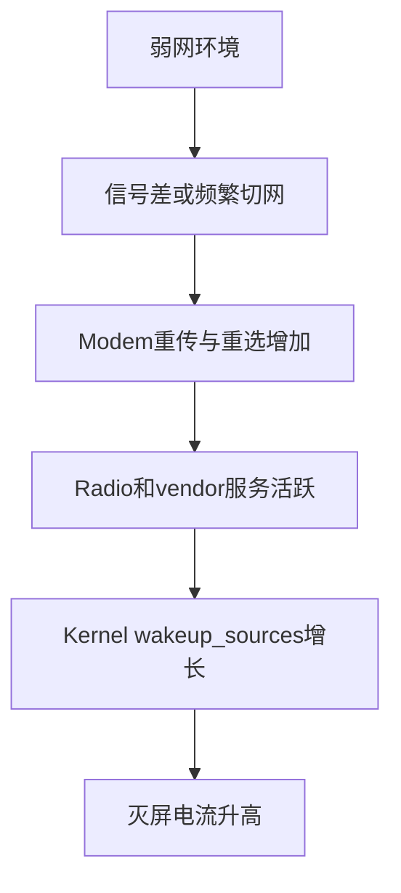

### 错误结论

```text
错误：
    BatteryStats里看到某App有网络流量，所以一定是App问题。

纠正：
    App触发网络是一个因素，但弱网下每一次网络请求的底层代价会变大。
    需要对比Wi-Fi、强信号移动数据、弱信号移动数据三个条件。
```

### 验证方式

```text
对照组一：
    飞行模式待机。

对照组二：
    Wi-Fi待机。

对照组三：
    移动数据强信号待机。

对照组四：
    移动数据弱信号待机。
```

如果只有弱网移动数据异常，就不要把结论简单写成“某 App 耗电”，而要说明网络条件对 Modem 侧功耗的影响。

### 我会这样说明

```text
移动网络功耗我会做条件对照。因为同样的App请求，在强信号和弱信号下功耗完全不同。
我会把telephony状态、radio log、connectivity、wakeup_sources和电流曲线放在一起看，
确认是应用请求太频繁，还是弱网导致Modem侧代价放大。
```

## 十、Case 7：亮屏静置仍然高耗电

亮屏功耗和灭屏待机不同。亮屏时显示、触控、SurfaceFlinger、RenderThread、GPU、CPU、刷新率、亮度都会参与。不能拿待机思路直接套。

### 现象

```text
固定亮度和网络后，停在某个页面不操作，电流仍明显偏高；
Perfetto里RenderThread或SurfaceFlinger持续活跃；
CPU/GPU频率下不去；
帧率或刷新率维持高档位。
```

### 命令

```bash
adb shell dumpsys SurfaceFlinger
adb shell dumpsys gfxinfo <package>
adb shell dumpsys display
adb shell dumpsys power
adb shell dumpsys thermalservice
adb shell cat /sys/class/thermal/thermal_zone*/temp 2>/dev/null
```

抓 Perfetto：

```bash
adb shell perfetto -o /data/misc/perfetto-traces/screen_idle.pftrace -t 60s \
  sched freq idle am wm gfx view binder_driver hal power
adb pull /data/misc/perfetto-traces/screen_idle.pftrace .
```

### 分析链路

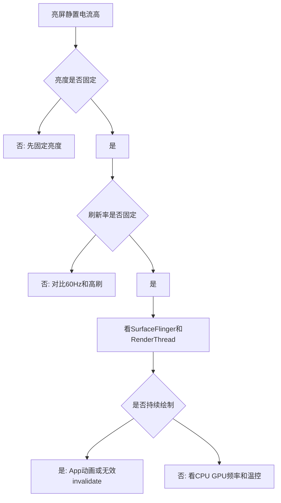

### 常见根因

```text
App层：
    不可见动画仍在跑；
    定时器持续invalidate；
    视频、地图、WebView页面没有暂停；
    Compose或View状态变化导致重复重绘。

Framework/显示：
    刷新率策略没有降档；
    DisplayPowerController亮度策略异常；
    SurfaceFlinger持续合成；
    HWC没有走低功耗路径。

平台层：
    GPU频率保持高档；
    thermal状态导致策略变化；
    vendor display服务异常。
```

### 我会这样说明

```text
亮屏静置高耗电我不会先看wakelock，而是先固定变量：亮度、刷新率、网络和温度。
然后用Perfetto看RenderThread、SurfaceFlinger、CPU/GPU频率是否持续活跃。
如果页面静止但仍持续绘制，就从App动画、invalidate、视频/WebView/地图这些方向收敛。
```

## 十一、Case 8：高亮、HDR 或 HBM 导致发热和降亮度

有些用户反馈是“手机发热、亮度突然变暗”。这不一定是显示 bug，可能是热管理在保护设备。

### 现象

```text
户外高亮或HDR视频场景下温度快速上升；
亮度自动下降；
thermal_zone温度升高；
cooling_device状态变化；
dumpsys display中亮度策略发生变化。
```

### 命令

```bash
adb shell dumpsys display
adb shell dumpsys power
adb shell dumpsys thermalservice
adb shell 'for z in /sys/class/thermal/thermal_zone*; do echo $z; cat $z/type; cat $z/temp; done'
adb shell 'for c in /sys/class/thermal/cooling_device*; do echo $c; cat $c/type; cat $c/cur_state; done'
```

### 分析链路


### 判断重点

```text
要先确认是不是热保护：
    如果温度达到阈值，同时cooling_device状态变化，亮度下降可能是预期策略。

再判断策略是否合理：
    是否过早触发；
    是否恢复太慢；
    是否温度采样错误；
    是否某个thermal_zone映射错；
    是否用户场景需要更平滑的降亮度曲线。
```

### 我会这样说明

```text
亮度下降不一定是DisplayPowerController单点问题。
我会把display状态、thermalservice、thermal_zone和cooling_device串起来看。
如果温度上升后cooling device触发，再出现亮度下降，就更像热策略生效。
后续才会评估阈值、恢复曲线和用户体验是否合理。
```

## 十二、Case 9：CPU 平均占用不高，但待机功耗仍然偏高

这是很考验功耗理解的一类问题。很多人只看 top，发现 CPU 占用不高，就说不是 CPU 问题。但待机功耗更怕“频繁短唤醒”。

### 现象

```text
top里没有明显高CPU进程；
但电流曲线有密集小尖峰；
Perfetto显示系统频繁从idle中醒来；
cpuidle深睡时间占比低；
wakeup_sources多个小项增长。
```

### 命令

```bash
adb shell top -b -n 1
adb shell cat /sys/kernel/debug/wakeup_sources
adb shell 'for c in /sys/devices/system/cpu/cpu*/cpuidle/state*/time; do echo $c; cat $c; done'
adb shell 'cat /sys/devices/system/cpu/cpu*/cpufreq/scaling_cur_freq 2>/dev/null'
```

### 分析链路

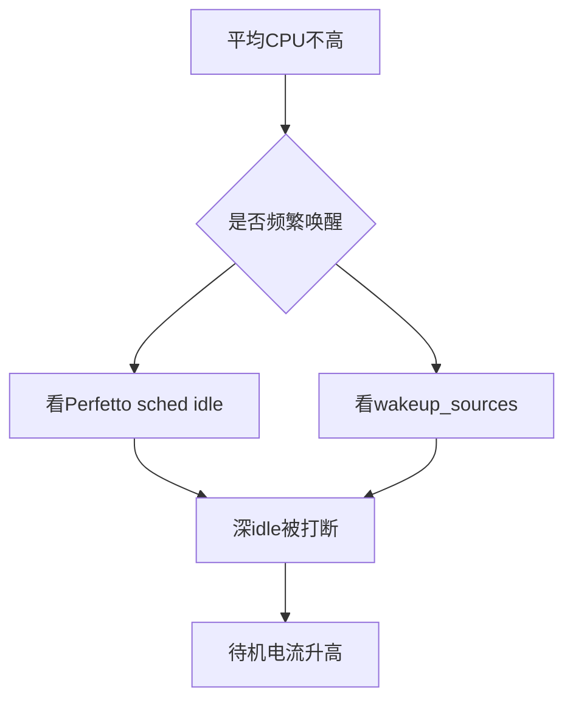

### 关键理解

```text
CPU占用率：
    描述一段时间内CPU忙的比例。

低功耗状态：
    关注CPU和SoC能不能进入更深idle或suspend。

问题点：
    很多短任务平均占用不高，但会频繁唤醒系统，
    让设备一直停留在较浅低功耗状态。
```

### 我会这样说明

```text
我不会只用top判断待机功耗。因为待机场景里，频繁短唤醒可能比持续高CPU更隐蔽。
我会看Perfetto里的sched/idle轨迹、cpuidle驻留时间和wakeup_sources增长，
判断系统是睡不深，还是睡着后被频繁叫醒。
```

## 十三、Case 10：thermalservice 显示 HAL Ready=false，但设备仍然在限频

这类问题在真实项目里很常见。Framework 的 thermalservice 不可用，不代表 Kernel 没有 thermal，也不代表设备不会限频。

### 现象

```text
adb shell dumpsys thermalservice:
    HAL Ready: false
    Cached temperatures为空

同时：
    CPU频率被限制；
    thermal_zone温度变化；
    cooling_device cur_state变化。
```

### 命令

```bash
adb shell dumpsys thermalservice
adb shell 'for z in /sys/class/thermal/thermal_zone*; do echo $z; cat $z/type; cat $z/temp; done'
adb shell 'for c in /sys/class/thermal/cooling_device*; do echo $c; cat $c/type; cat $c/cur_state; done'
adb shell 'cat /sys/devices/system/cpu/cpu*/cpufreq/scaling_cur_freq 2>/dev/null'
```

### 分析链路

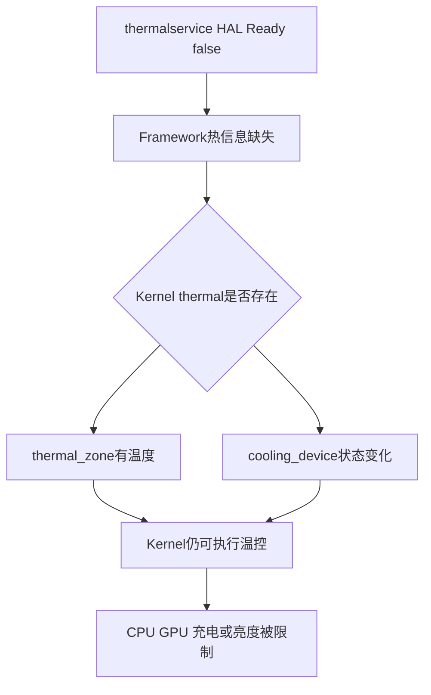

### 正确结论

```text
Framework thermal链路不可用：
    App和Framework可能拿不到完整热状态；
    dumpsys thermalservice不能代表全部热管理事实。

Kernel thermal仍然可用：
    thermal_zone和cooling_device可能继续工作；
    CPU/GPU/充电/display限制仍可能发生。
```

### 我会这样说明

```text
如果thermalservice显示HAL Ready=false，我不会直接说设备没有温控。
我会继续看/sys/class/thermal下的thermal_zone和cooling_device。
如果温度上升时cooling_device状态变化，同时CPU频率或充电电流下降，
说明Kernel或vendor热策略仍在生效，只是Framework thermal HAL链路不可用。
```

## 十四、Case 11：充电发热触发限流，用户感知为“充电慢”

充电慢不一定是充电器、线材或电池坏了。充电是功耗和热管理交汇最明显的场景。

### 现象

```text
刚插入时充电电流较高；
使用一段时间后电池温度上升；
current_now绝对值下降；
充电速度变慢；
thermal_zone和cooling_device状态变化。
```

### 命令

```bash
adb shell dumpsys battery
adb shell dumpsys thermalservice
adb shell cat /sys/class/power_supply/battery/current_now
adb shell cat /sys/class/power_supply/battery/voltage_now
adb shell cat /sys/class/power_supply/battery/temp
adb shell 'for z in /sys/class/thermal/thermal_zone*; do echo $z; cat $z/type; cat $z/temp; done'
adb shell 'for c in /sys/class/thermal/cooling_device*; do echo $c; cat $c/type; cat $c/cur_state; done'
```

### 分析链路

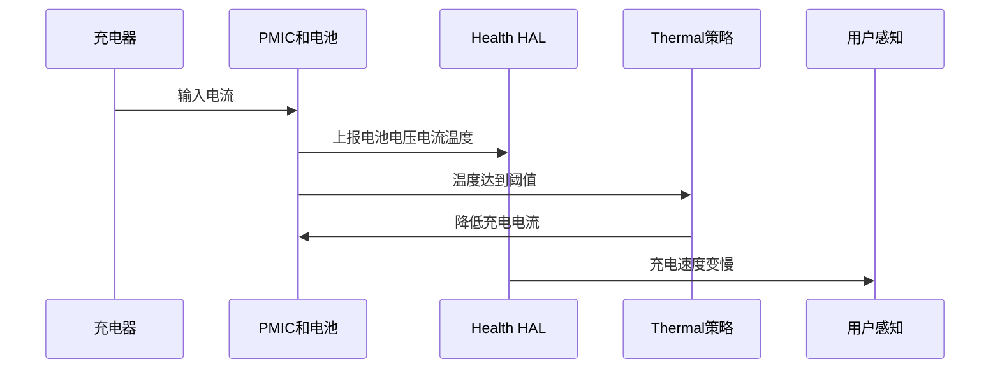

### 判断重点

```text
先排除条件：
    充电器规格；
    线材；
    电池电量区间；
    环境温度；
    是否边充边玩；
    是否手机壳影响散热。

再看证据：
    temp是否持续上升；
    current_now是否下降；
    cooling_device是否变化；
    CPU/GPU负载是否叠加；
    屏幕亮度是否高。
```

### 修复方向

```text
如果是业务负载叠加：
    降低后台任务；
    降低亮屏期间的刷新和计算；
    避免充电时跑重任务。

如果是策略问题：
    检查thermal阈值；
    检查charge cooling映射；
    检查恢复曲线；
    检查Health HAL上报是否准确。

如果是硬件条件：
    说明充电器、线材、环境温度和散热条件。
```

### 我会这样说明

```text
充电慢我会先区分供电能力、电池状态和热限流。
如果current_now在温度上升后下降，并且cooling_device状态同步变化，
我会倾向判断是热策略限制充电电流，而不是单纯充电器问题。
同时还要看是否边充边用导致CPU、GPU、屏幕和充电热叠加。
```

## 十五、Case 12：BatteryStats 显示 system_server 耗电高，真正根因却在 App

BatteryStats 是功耗归因工具，但它不是万能真相。尤其是很多系统服务代 App 工作时，如果 WorkSource 或归因链不清晰，容易看到 system_server 或 Android OS 耗电高。

### 现象

```text
电池页面显示Android系统或system_server耗电高；
但用户实际是在某个App场景后出现掉电；
Perfetto里能看到系统服务线程替App处理任务；
BatteryStats归因不够细。
```

### 命令

```bash
adb shell dumpsys batterystats --charged
adb shell dumpsys batterystats --history
adb shell dumpsys power
adb shell dumpsys alarm
adb shell dumpsys jobscheduler
adb shell dumpsys location
```

### 分析链路

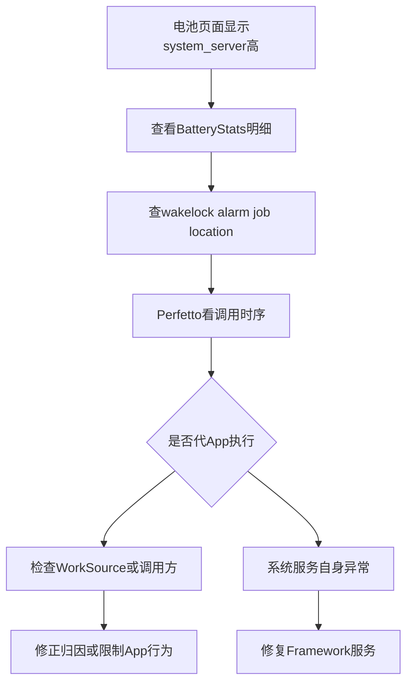

### 关键理解

```text
BatteryStats适合做长周期归因：
    可以发现哪个UID、哪类资源、哪个时间段异常。

但它不是电流仪：
    不能直接等价于真实瞬时功耗。

它也依赖归因：
    如果系统服务替App执行任务，归因可能集中到system_server或Android OS。
```

### 修复方向

```text
归因问题：
    补WorkSource；
    让系统服务记录调用方；
    优化BatteryStats note接口使用。

真实系统服务问题：
    定位服务内部循环、锁、异常重试；
    修复状态机；
    增加限频和退避。

App触发问题：
    限制频率；
    合并请求；
    前后台差异化策略。
```

### 我会这样说明

```text
BatteryStats显示system_server高时，我不会马上判断Framework有bug。
我会继续看是哪类资源高，比如wakelock、alarm、job、location还是network。
很多时候系统服务是在代App执行任务，需要结合WorkSource、dumpsys明细和Perfetto时序，
区分是真正system_server内部异常，还是App请求通过系统服务放大了功耗。
```

## 十六、Case 13：QCOM 平台上 vendor 服务或节点导致功耗异常

QCOM 平台分析时，除了 AOSP Framework，还要看 vendor 服务、kernel节点和平台特有唤醒源。

### 常见线索

```text
进程：
    qcrild、netmgrd、imsdatadaemon、loc_launcher、vendor.qti.hardware相关服务。

wakeup_sources：
    qcom_rx_wakelock、IPA_WS、wlan、alarmtimer、PowerManagerService.WakeLocks。

thermal：
    tsens、pm8998、battery、xo_therm、quiet_therm、cpu相关zone。

power_supply：
    battery、usb、dc、bms、parallel。
```

### 命令

```bash
adb shell getprop | grep -Ei 'ro.board|soc|platform|qcom|vendor'
adb shell ps -A | grep -Ei 'qcril|netmgr|ims|loc|qti|vendor'
adb shell cat /sys/kernel/debug/wakeup_sources
adb shell ls /sys/class/power_supply
adb shell ls /sys/class/thermal
```

### 判断链路


### 我会这样说明

```text
在QCOM平台上，我不会只停留在AOSP Framework。
如果Framework侧只能看到结果，比如wakelock、网络请求、thermal状态，
我会继续往vendor服务和kernel节点下钻，结合qcrild、netmgrd、loc服务、
wakeup_sources、thermal_zone和power_supply节点确认底层事实。
```

## 十七、通用抓取命令包

实际处理问题时，我不想每次临时翻命令，所以整理了一个基础抓取包，再按场景补充。

```bash
OUT=/data/local/tmp/power_case_$(date +%Y%m%d_%H%M%S)
mkdir -p "$OUT"

getprop > "$OUT/getprop.txt"
dumpsys power > "$OUT/dumpsys_power.txt"
dumpsys battery > "$OUT/dumpsys_battery.txt"
dumpsys batterystats --charged > "$OUT/batterystats_charged.txt"
dumpsys batterystats --history > "$OUT/batterystats_history.txt"
dumpsys alarm > "$OUT/dumpsys_alarm.txt"
dumpsys jobscheduler > "$OUT/dumpsys_jobscheduler.txt"
dumpsys deviceidle > "$OUT/dumpsys_deviceidle.txt"
dumpsys thermalservice > "$OUT/dumpsys_thermalservice.txt"
dumpsys display > "$OUT/dumpsys_display.txt"
dumpsys SurfaceFlinger > "$OUT/dumpsys_surfaceflinger.txt"

cat /sys/kernel/debug/wakeup_sources > "$OUT/wakeup_sources.txt" 2>/dev/null
ls -R /sys/class/power_supply > "$OUT/power_supply_ls.txt" 2>/dev/null
ls -R /sys/class/thermal > "$OUT/thermal_ls.txt" 2>/dev/null

for z in /sys/class/thermal/thermal_zone*; do
  echo "===== $z =====" >> "$OUT/thermal_zones.txt"
  cat "$z/type" >> "$OUT/thermal_zones.txt" 2>/dev/null
  cat "$z/temp" >> "$OUT/thermal_zones.txt" 2>/dev/null
done

for c in /sys/class/thermal/cooling_device*; do
  echo "===== $c =====" >> "$OUT/cooling_devices.txt"
  cat "$c/type" >> "$OUT/cooling_devices.txt" 2>/dev/null
  cat "$c/cur_state" >> "$OUT/cooling_devices.txt" 2>/dev/null
done

logcat -d > "$OUT/logcat.txt"
logcat -b events -d > "$OUT/logcat_events.txt"
logcat -b radio -d > "$OUT/logcat_radio.txt"

echo "$OUT"
```

拉取：

```bash
adb shell sh /data/local/tmp/collect_power_case.sh
adb pull /data/local/tmp/power_case_20260531_120000 ./
adb bugreport bugreport_power_case.zip
```

按场景补充：

| 场景 | 额外抓取 |
| --- | --- |
| 灭屏待机 | wakeup_sources 前后快照、BatteryStats history、deviceidle |
| 亮屏静置 | Perfetto gfx/view/sched/freq、SurfaceFlinger、gfxinfo |
| 充电发热 | power_supply、thermal_zone、cooling_device、电池温度电流 |
| 弱网 | radio log、telephony.registry、connectivity、netstats |
| 定位 | dumpsys location、GNSS日志、Wi-Fi scan信息 |
| Job/Alarm | dumpsys jobscheduler、dumpsys alarm、BatteryStats wakeup alarm |

## 十八、case 复盘报告写法

我自己复盘问题时基本按这个结构写，周报、复盘和现场解释都能直接复用。

```text
问题标题：
    灭屏待机掉电异常，定位到xxx周期唤醒。

影响范围：
    设备型号、版本、芯片平台、是否量产版本、复现概率。

测试条件：
    环境温度：
    电量区间：
    网络状态：
    亮度/刷新率：
    是否插USB：
    是否充电：
    测试时长：

现象数据：
    修复前掉电：
    修复前平均电流：
    修复前温度：
    异常唤醒次数：

证据链：
    1. BatteryStats显示xxx；
    2. Perfetto显示xxx；
    3. wakeup_sources显示xxx；
    4. sysfs或thermal节点显示xxx；
    5. 电流仪显示xxx。

根因：
    xxx模块在xxx场景下没有xxx，导致xxx。

修复：
    xxx。

验证结果：
    修复后掉电：
    修复后平均电流：
    修复后温度：
    修复后唤醒次数：

风险与回归：
    是否影响功能实时性；
    是否影响通知；
    是否影响充电速度；
    是否影响温控安全。
```

## 十九、项目经历沉淀

功耗经历不能只写“熟悉 Android 功耗优化”。我更倾向于写清楚处理过什么场景、用了哪些证据、最后拿到了什么收益。

### 灭屏待机方向

```text
负责Android设备灭屏待机功耗分析，建立BatteryStats、Perfetto、
kernel wakeup_sources和电流仪联合分析流程，定位并推动修复
partial wakelock长时间持锁、wakeup alarm周期唤醒、Doze状态异常等问题，
将典型待机场景掉电从xx%降低到xx%。
```

### 充电与热方向

```text
负责充电发热和thermal限流问题分析，结合Health HAL、BatteryService、
power_supply节点、thermal_zone和cooling_device状态，定位充电电流下降、
CPU限频和亮度热限制等问题，优化边充边用场景下的温升和充电体验。
```

### 亮屏功耗方向

```text
负责亮屏静置和高刷场景功耗优化，通过Perfetto分析RenderThread、
SurfaceFlinger、CPU/GPU频率和刷新率策略，定位页面持续重绘、
刷新率不降档和显示合成异常等问题，降低典型页面静置功耗。
```

### 平台实战方向

```text
基于QCOM平台进行功耗问题实战分析，熟悉wakeup_sources、thermal_zone、
power_supply、qcrild、netmgrd、location等vendor链路，能够从AOSP Framework
下钻到HAL、Kernel和平台节点完成问题闭环。
```

## 二十、常见追问

### 1. 你怎么分析灭屏待机高耗电？

```text
我会先确认测试条件，比如是否插USB、是否充电、是否开启Stay awake、
网络和SIM状态是否一致。条件确认后，先用BatteryStats看长周期归因，
比如wakelock、wakeup alarm、network、job等；再用Perfetto看时间线，
确认灭屏后是否频繁唤醒或线程持续运行；最后用kernel wakeup_sources
确认底层唤醒源。如果有电流仪，会把电流曲线和日志时间点对齐。
```

### 2. USB 连接会破坏待机测试，但命令又要 adb，怎么办？

```text
这不矛盾，但要区分准备阶段、测试阶段和取证阶段。
准备阶段可以用USB下发脚本、清日志、设置条件；真正待机测试时拔掉USB，
让设备处于自然状态；测试结束后再插USB拉取日志。
如果必须在线观察，可以用无线ADB或本地脚本，但要说明Wi-Fi或脚本本身也会引入影响。
```

### 3. BatteryStats 能不能代表真实功耗？

```text
BatteryStats适合做归因，不等于电流仪。它可以告诉我哪个UID或哪类资源使用异常，
比如wakelock、alarm、network、sensor等，但真实功耗还受硬件状态、
温度、信号、亮度、刷新率和平台策略影响。所以我会把BatteryStats作为入口，
再结合Perfetto、kernel节点和电流数据验证。
```

### 4. thermalservice 没数据是不是没有温控？

```text
不是。thermalservice依赖Framework到Thermal HAL的链路。
如果HAL Ready=false，只能说明Framework thermal信息不完整。
Kernel thermal_zone和cooling_device仍可能正常工作，CPU限频、充电降流、
亮度限制也可能继续发生。因此要继续看/sys/class/thermal下的节点。
```

### 5. system_server 耗电高怎么查？

```text
我会先判断是真正system_server内部异常，还是系统服务代App执行任务导致归因集中。
具体会看BatteryStats里的wakelock、alarm、job、location、network明细，
再结合dumpsys power、alarm、jobscheduler、location和Perfetto时序。
如果是代App执行，还要看WorkSource或调用方记录是否准确。
```

### 6. 亮屏静置功耗高怎么查？

```text
亮屏问题先固定变量：亮度、刷新率、网络、温度。
然后看Perfetto里的RenderThread、SurfaceFlinger、CPU/GPU频率，
确认页面是否持续绘制或刷新率不降档。亮屏场景不能只套灭屏wakelock思路，
显示链路和GPU通常更关键。
```

### 7. 充电慢怎么判断是不是热限流？

```text
我会同时看battery temp、current_now、thermal_zone和cooling_device。
如果温度上升后current_now下降，并且相关cooling_device状态变化，
就说明很可能是thermal策略限制了充电电流。还需要排除充电器、线材、
电量区间、环境温度和边充边用负载。
```

### 8. 你怎么证明一个修复有效？

```text
必须同条件复测。比如同样版本、同样环境温度、同样网络、同样亮度、
同样测试时长，比较修复前后的掉电、电流、温升、wakelock时间、
wakeup次数、CPU idle占比等指标。只说“感觉好多了”不算功耗验证。
```

### 9. App 说自己没有高 CPU，为什么还可能耗电？

```text
因为功耗不只看CPU平均占用。App可能通过alarm、定位、网络、wakelock
频繁唤醒系统，导致设备进不了深睡。平均CPU不高，但suspend和cpuidle状态被破坏，
待机电流仍然会上升。
```

### 10. 你做 QCOM 平台功耗会看什么？

```text
我会先用AOSP工具确认Framework层现象，再看QCOM平台相关的vendor服务和kernel节点。
比如qcrild、netmgrd、ims、loc相关进程，wakeup_sources里的qcom_rx_wakelock、
IPA、wlan等项，thermal_zone里的tsens、pmic、电池温度，以及power_supply下的电池和USB节点。
```

## 二十一、收尾

功耗 case 的核心不是“命令大全”，而是证据链。

```text
灭屏待机：
    看WakeLock、Alarm、Doze、Suspend、wakeup_sources。

亮屏静置：
    看亮度、刷新率、SurfaceFlinger、RenderThread、CPU/GPU频率。

充电发热：
    看Health HAL、BatteryService、power_supply、thermal_zone、cooling_device。

弱网定位：
    看radio、modem、location、Wi-Fi scan、vendor wakeup。

归因问题：
    看BatteryStats、WorkSource、系统服务代执行关系。
```

我最后会把整套方法收成这句话：

```text
我先确认测试条件，再用BatteryStats做长周期归因，
用Perfetto看时间线，用kernel节点确认底层唤醒或热限制，
最后用同条件电流、掉电、温升数据验证修复收益。
```

这句话后面只要能接上两三个具体 case，就比单独写“熟悉 Android 功耗”更有说服力。
