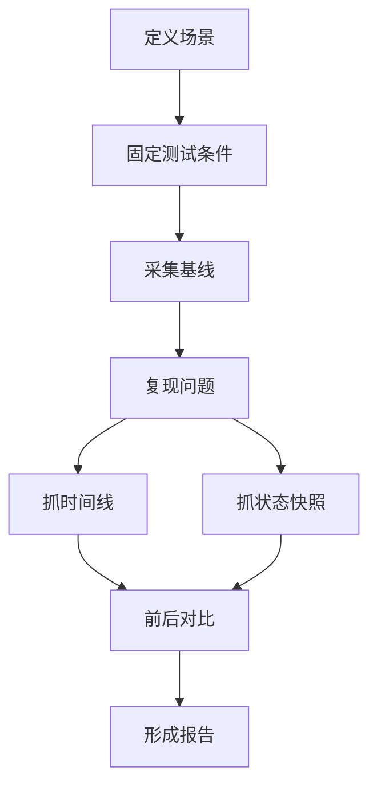
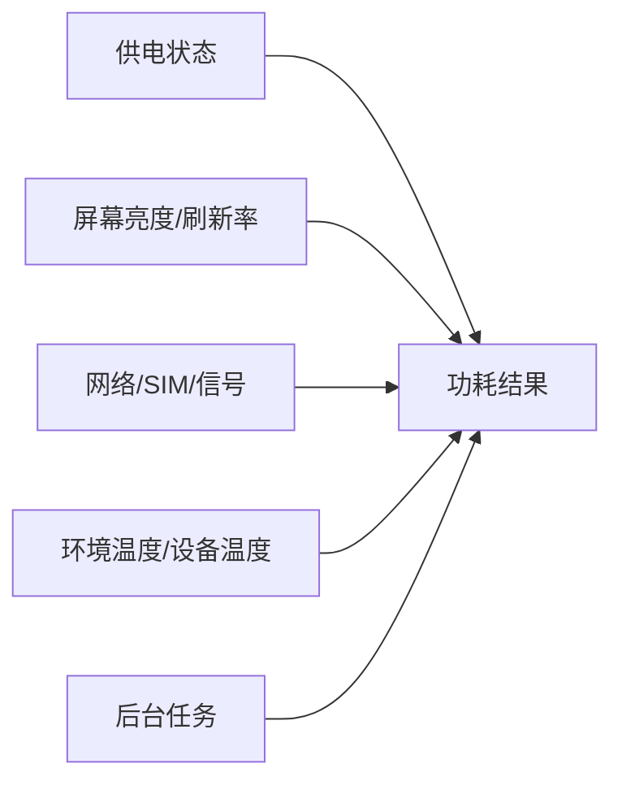
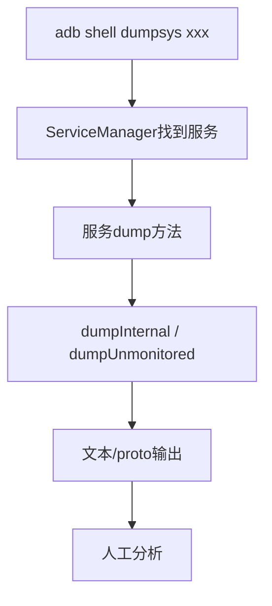
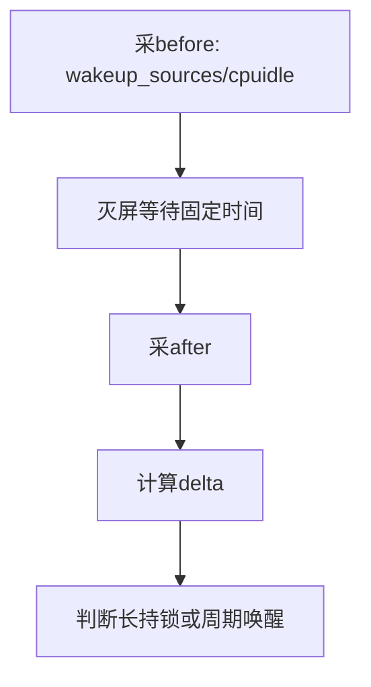
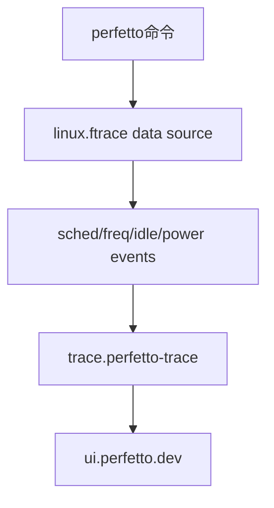

## 为什么采集方法要单独成篇

功耗问题的定位质量，往往不是输在源码，而是输在采集。很多报告看起来命令很多，实际不可用：

```text
没有记录是否插USB。
没有记录亮度、网络、温度、起止时间。
只有 dumpsys power，没有 wakeup_sources。
只有 BatteryStats，没有 Perfetto 时间线。
看到 thermalservice 空，就认为没有热问题。
看到某 wakeup source 名字，就直接下结论。
```

功耗采集的目标不是“把所有命令都跑一遍”，而是让后续分析能回答三个问题：

1. 这个场景是否真实？
2. Framework、Kernel、Thermal、BatteryStats 的证据能否互相解释？
3. 修复前后是否能在同条件下复测？



## 采集前先定义场景

先不用急着抓 bugreport。先定义你到底在测什么。

| 场景 | 目标指标 | 关键变量 |
|------|----------|----------|
| 灭屏待机 | 掉电、电流、deep sleep比例、wakeup次数 | USB、Doze、网络、SIM、蓝牙、定位 |
| 亮屏静置 | 平均电流、温升、CPU/GPU频率 | 亮度、刷新率、壁纸、后台动画 |
| 游戏/高负载 | FPS、温度、频率、thermal限制 | 画质、网络、亮度、环境温度 |
| 充电发热 | 充电电流、电池温度、PMIC温度 | 充电器、线材、亮灭屏、负载 |
| 后台任务 | 唤醒次数、wakelock、alarm/job | Doze、白名单、网络 |

错误示例：

```text
“手机有点耗电，抓个日志看看。”
```

正确示例：

```text
“Mi MIX 2，Android 14，飞行模式关闭，Wi-Fi连接，
断开USB后灭屏30分钟，观察wakeup_sources delta和BatteryStats。”
```

## 测试条件清单

每次采集前写一段条件，不然后面谁也复现不了：

| 条件 | 记录内容 |
|------|----------|
| 设备 | model、device、SoC、Android版本、build fingerprint |
| 供电 | 电池/USB/AC/无线充，是否满电 |
| 屏幕 | 亮灭屏、亮度、自动亮度、刷新率 |
| 网络 | Wi-Fi、移动网络、SIM数量、信号强度、飞行模式 |
| 外设 | 蓝牙、定位、NFC、传感器 |
| 温度 | 环境温度、电池温度、thermal zone |
| 后台 | 是否清后台、是否登录账号、是否同步 |
| 时间 | 起止时间、持续多久、是否跨整点 |



## 真机基线：Mi MIX 2 / msm8998

当前外接 QCOM 设备：

```bash
adb devices -l
adb shell getprop ro.product.model
adb shell getprop ro.product.device
adb shell getprop ro.build.version.release
adb shell getprop ro.hardware
adb shell getprop ro.product.board
adb shell getprop ro.soc.model
adb shell id
```

当前采集到：

```text
model=Mi MIX 2
device=chiron
release=14
hardware=qcom
board=msm8998
soc=MSM8998
adb uid=0(root)
```

这说明：

- 可以读 `/sys/kernel/debug/wakeup_sources`。
- 可以读 tracefs。
- 可以读 thermal/cpufreq/cpuidle sysfs。
- 适合做 QCOM 平台 case。

但当前也有明显限制：

```text
dumpsys battery:
    USB powered: true
    level: 99
    status: Full
    temperature: 390 = 39.0 C

dumpsys power:
    mIsPowered=true
    mPlugType=2
    mStayOn=true
    mWakefulness=Awake
    mHoldingDisplaySuspendBlocker=true

dumpsys thermalservice:
    HAL Ready=false
```

结论：

```text
这台设备当前适合做“插USB调试基线”和“sysfs thermal分析”；
不适合直接作为自然灭屏待机功耗结论。
```

## dumpsys背后的源码入口

命令不是魔法。每个 `dumpsys` 都对应系统服务的 dump 逻辑，读源码可以知道输出字段的含义和局限。

| 命令 | 源码入口 | 说明 |
|------|----------|------|
| `dumpsys power` | [PowerManagerService.dump:7103](vscode://file//home/suhui/workspace/aosp/los21/frameworks/base/services/core/java/com/android/server/power/PowerManagerService.java:7103:1) | BinderService dump |
| `dumpsys power`主体 | [PowerManagerService.dumpInternal:4792](vscode://file//home/suhui/workspace/aosp/los21/frameworks/base/services/core/java/com/android/server/power/PowerManagerService.java:4792:1) | PMS字段输出 |
| `dumpsys batterystats` | [BatteryStatsService.dump:2799](vscode://file//home/suhui/workspace/aosp/los21/frameworks/base/services/core/java/com/android/server/am/BatteryStatsService.java:2799:1) | BatteryStats dump入口 |
| `dumpsys batterystats`参数解析 | [BatteryStatsService.dumpUnmonitored:2812](vscode://file//home/suhui/workspace/aosp/los21/frameworks/base/services/core/java/com/android/server/am/BatteryStatsService.java:2812:1) | `--charged`、`--proto` 等 |
| `dumpsys battery` | [BatteryService.dumpInternal:1371](vscode://file//home/suhui/workspace/aosp/los21/frameworks/base/services/core/java/com/android/server/BatteryService.java:1371:1) | 电池状态输出 |
| `dumpsys thermalservice` | [ThermalManagerService.dump:587](vscode://file//home/suhui/workspace/aosp/los21/frameworks/base/services/core/java/com/android/server/power/ThermalManagerService.java:587:1) | thermalservice dump入口 |
| thermal dump主体 | [ThermalManagerService.dumpInternal:652](vscode://file//home/suhui/workspace/aosp/los21/frameworks/base/services/core/java/com/android/server/power/ThermalManagerService.java:652:1) | 温度、HAL、cooling输出 |
| `dumpsys deviceidle` | [DeviceIdleController.dump:2302](vscode://file//home/suhui/workspace/aosp/los21/frameworks/base/apex/jobscheduler/service/java/com/android/server/DeviceIdleController.java:2302:1) | Binder dump入口 |
| deviceidle主体 | [DeviceIdleController.dump:5199](vscode://file//home/suhui/workspace/aosp/los21/frameworks/base/apex/jobscheduler/service/java/com/android/server/DeviceIdleController.java:5199:1) | idle状态、白名单输出 |



这就是为什么看源码有用：你能知道某个字段是实时状态、缓存状态、统计状态，还是 HAL 没 ready 时的空状态。

## 基线采集：最小集合

如果时间很紧，至少采这些：

```bash
adb devices -l
adb shell getprop ro.product.model
adb shell getprop ro.product.device
adb shell getprop ro.build.fingerprint
adb shell getprop ro.hardware
adb shell getprop ro.product.board
adb shell getprop ro.soc.model

adb shell dumpsys power
adb shell dumpsys battery
adb shell dumpsys deviceidle
adb shell dumpsys thermalservice
adb shell dumpsys batterystats --charged
adb shell cat /sys/kernel/debug/wakeup_sources
```

这套最小集合能回答：

| 问题 | 证据 |
|------|------|
| 是否插电 | `dumpsys battery`、`dumpsys power` |
| 是否有 wakelock | `dumpsys power` |
| 是否进入 Doze | `dumpsys deviceidle` |
| 是否有长周期耗电归因 | `dumpsys batterystats` |
| Kernel 是否有唤醒源 | `wakeup_sources` |
| Framework thermal 是否可用 | `dumpsys thermalservice` |

## 扩展采集：按场景加项

### 待机场景

```bash
adb shell dumpsys power > power.txt
adb shell dumpsys deviceidle > deviceidle.txt
adb shell dumpsys alarm > alarm.txt
adb shell dumpsys jobscheduler > jobscheduler.txt
adb shell dumpsys batterystats --charged > batterystats.txt
adb shell cat /sys/kernel/debug/wakeup_sources > wakeup_sources.txt
adb shell cat /sys/devices/system/cpu/cpu0/cpuidle/state*/time > cpuidle_time.txt
```

待机场景最好做前后 delta：

```bash
adb shell cat /sys/kernel/debug/wakeup_sources > ws_before.txt
adb shell cat /sys/devices/system/cpu/cpu0/cpuidle/state*/time > idle_before.txt
# 灭屏等待固定时间
adb shell cat /sys/kernel/debug/wakeup_sources > ws_after.txt
adb shell cat /sys/devices/system/cpu/cpu0/cpuidle/state*/time > idle_after.txt
```



### 亮屏场景

```bash
adb shell dumpsys display > display.txt
adb shell dumpsys SurfaceFlinger > sf.txt
adb shell settings get system screen_brightness
adb shell settings get system screen_brightness_mode
adb shell cat /sys/devices/system/cpu/cpufreq/policy*/scaling_cur_freq
adb shell cat /sys/class/thermal/thermal_zone*/temp
```

固定亮度：

```bash
adb shell settings put system screen_brightness_mode 0
adb shell settings put system screen_brightness 80
```

### 充电发热场景

```bash
adb shell dumpsys battery
adb shell cat /sys/class/power_supply/battery/status
adb shell cat /sys/class/power_supply/battery/capacity
adb shell cat /sys/class/power_supply/battery/temp
adb shell cat /sys/class/power_supply/battery/current_now
adb shell cat /sys/class/thermal/thermal_zone*/type
adb shell cat /sys/class/thermal/thermal_zone*/temp
adb shell cat /sys/class/thermal/cooling_device*/type
adb shell cat /sys/class/thermal/cooling_device*/cur_state
```

### 后台网络/定位/蓝牙

```bash
adb shell dumpsys connectivity
adb shell dumpsys netstats
adb shell dumpsys wifi
adb shell dumpsys location
adb shell dumpsys bluetooth_manager
adb shell dumpsys sensorservice
adb shell cat /sys/kernel/debug/wakeup_sources
```

## Perfetto和ftrace

Perfetto 是时间线工具。它不是替代 dumpsys，而是回答“某个时刻到底发生了什么”。

### atrace源码对应关系

AOSP 的 atrace category 会打开一组 ftrace event。比如：

| category | atrace源码 | event |
|----------|------------|-------|
| sched | [atrace.cpp:135](vscode://file//home/suhui/workspace/aosp/los21/frameworks/native/cmds/atrace/atrace.cpp:135:1) | `sched/sched_switch` |
| freq | [atrace.cpp:171](vscode://file//home/suhui/workspace/aosp/los21/frameworks/native/cmds/atrace/atrace.cpp:171:1) | `power/cpu_frequency` |
| freq limits | [atrace.cpp:178](vscode://file//home/suhui/workspace/aosp/los21/frameworks/native/cmds/atrace/atrace.cpp:178:1) | `power/cpu_frequency_limits` |
| idle | [atrace.cpp:188](vscode://file//home/suhui/workspace/aosp/los21/frameworks/native/cmds/atrace/atrace.cpp:188:1) | `power/cpu_idle` |
| Trace.java | [Trace.java:43](vscode://file//home/suhui/workspace/aosp/los21/frameworks/base/core/java/android/os/Trace.java:43:1) | Java trace section |



### 短抓命令

```bash
adb shell perfetto -o /data/misc/perfetto-traces/power.trace -t 60s sched freq idle power am wm binder_driver
adb pull /data/misc/perfetto-traces/power.trace
```

适合：

- 复现很快的问题。
- 亮屏操作。
- 短时间发热或掉帧。

### 长抓配置

长时间待机建议用配置文件，避免缓冲区太小：

```text
buffers {
  size_kb: 131072
  fill_policy: RING_BUFFER
}

data_sources {
  config {
    name: "linux.ftrace"
    ftrace_config {
      ftrace_events: "sched/sched_switch"
      ftrace_events: "power/cpu_frequency"
      ftrace_events: "power/cpu_idle"
      ftrace_events: "power/suspend_resume"
      ftrace_events: "wakeup_source/activate"
      ftrace_events: "wakeup_source/deactivate"
    }
  }
}

duration_ms: 300000
```

抓取：

```bash
adb push power.pbtx /data/local/tmp/power.pbtx
adb shell perfetto -c /data/local/tmp/power.pbtx -o /data/misc/perfetto-traces/power.trace
adb pull /data/misc/perfetto-traces/power.trace
```

## BatteryStats采集

BatteryStats 用来回答“长周期谁在消耗资源”。

```bash
adb shell dumpsys batterystats --reset
# 复现场景
adb shell dumpsys batterystats --charged > batterystats.txt
adb shell dumpsys batterystats --proto > batterystats.pb
```

注意：

- `--reset` 会清统计，测试前确认可以这么做。
- 插拔电会改变统计周期。
- BatteryStats 是统计和模型，不是电流仪。
- 它适合找 UID 和行为，再用 Perfetto 做时间线确认。


## 打点和时间对齐

多份日志最难的是对齐时间。建议每次复现都打点：

```bash
adb shell log -t POWER_TEST "case start: standby_baseline"
adb shell date

# 复现问题

adb shell log -t POWER_TEST "case end: standby_baseline"
adb shell date
```

如果抓 Perfetto，也可以在操作前后打 logcat 点，方便在 logcat、bugreport、手工记录里对齐。

## 自动采集脚本

下面这个脚本适合作为一次功耗 case 的最小采集脚本：

```bash
#!/usr/bin/env bash
set -euo pipefail

ts=$(date +%Y%m%d_%H%M%S)
out="power_case_${ts}"
mkdir -p "${out}"

adb devices -l > "${out}/adb_devices.txt"
adb shell getprop > "${out}/getprop.txt"
adb shell date > "${out}/device_date_start.txt"
adb shell log -t POWER_TEST "case start ${ts}" || true

adb shell dumpsys power > "${out}/power.txt"
adb shell dumpsys battery > "${out}/battery.txt"
adb shell dumpsys deviceidle > "${out}/deviceidle.txt"
adb shell dumpsys thermalservice > "${out}/thermalservice.txt"
adb shell dumpsys batterystats --charged > "${out}/batterystats.txt"
adb shell dumpsys alarm > "${out}/alarm.txt"
adb shell dumpsys jobscheduler > "${out}/jobscheduler.txt"
adb shell cat /sys/kernel/debug/wakeup_sources > "${out}/wakeup_sources.txt" 2>/dev/null || true
adb shell cat /sys/devices/system/cpu/cpufreq/policy*/scaling_cur_freq > "${out}/cpufreq_cur.txt" 2>/dev/null || true
adb shell cat /sys/class/thermal/thermal_zone*/type > "${out}/thermal_zone_type.txt" 2>/dev/null || true
adb shell cat /sys/class/thermal/thermal_zone*/temp > "${out}/thermal_zone_temp.txt" 2>/dev/null || true
adb shell cat /sys/class/thermal/cooling_device*/cur_state > "${out}/cooling_cur_state.txt" 2>/dev/null || true

adb shell log -t POWER_TEST "case end ${ts}" || true
adb shell date > "${out}/device_date_end.txt"
```

## 真机case：当前状态能说明什么

当前 Mi MIX 2 的快速采集：

```text
dumpsys battery:
    USB powered: true
    level: 99
    status: Full
    temperature: 39.0 C

dumpsys power:
    mWakefulness=Awake
    mIsPowered=true
    mPlugType=2
    mStayOn=true
    mHalInteractiveModeEnabled=true
    mHoldingWakeLockSuspendBlocker=false
    mHoldingDisplaySuspendBlocker=true
    Wake Locks: size=0

dumpsys thermalservice:
    Thermal Status: 0
    HAL Ready=false

sysfs:
    tracefs可用
    wakeup_sources可读
    cpufreq policy0/policy4 governor=interactive
    thermal_zone0 battery=39000
    thermal_zone1 pm8998_tz=34743
```

### Case结论1：测试条件先污染

这组状态不能用于自然待机结论，因为：

- USB 供电。
- 满电状态。
- `mStayOn=true`。
- `mWakefulness=Awake`。
- display suspend blocker 正在持有。

它可以作为“插 USB 调试条件”的基线，但不能写成“手机待机功耗如何”。

### Case结论2：thermalservice不是唯一热证据

`HAL Ready=false` 说明 Framework thermal HAL 不可用。但 sysfs thermal zone 有温度，cooling device 可读，所以热分析要转向：

```bash
/sys/class/thermal/thermal_zone*
/sys/class/thermal/cooling_device*
```

### Case结论3：trace能力足够做Perfetto

设备有：

```text
/sys/kernel/tracing
/sys/kernel/debug/tracing
sched events
power events
wakeup_sources
```

所以后续可以做：

- CPU 频率和 idle 时间线。
- wakeup source activate/deactivate。
- sched_switch 找运行线程。
- thermal/cpufreq 关联分析。

## 报告目录建议

一次 case 目录建议这样放：

```text
power_case_YYYYMMDD_HHMMSS/
    README.md
    env/
        adb_devices.txt
        getprop.txt
        test_conditions.md
    dumpsys/
        power.txt
        battery.txt
        deviceidle.txt
        batterystats.txt
        thermalservice.txt
    sysfs/
        wakeup_sources_before.txt
        wakeup_sources_after.txt
        cpufreq.txt
        thermal_zone.txt
        cooling_device.txt
    traces/
        power.trace
    conclusion.md
```

## 结论写法

一份采集报告不能只贴命令输出，要写判断：

```text
测试条件：
    Mi MIX 2 / msm8998 / Android 14，USB连接，满电，mStayOn=true。

限制：
    当前不适合作为自然待机数据，只能做插USB调试基线。

Framework：
    PMS显示Awake，无wakelock，但Display suspend blocker持有。

Kernel：
    wakeup_sources可读，后续可做delta对比。

Thermal：
    thermalservice HAL Ready=false，但thermal_zone可读。

下一步：
    若要做待机case，需要改变供电/屏幕条件，并采before/after delta。
```

这才是可复用、可复盘、可被别人相信的功耗采集。
