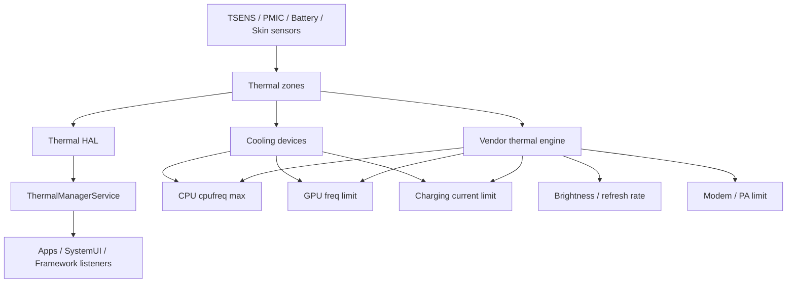
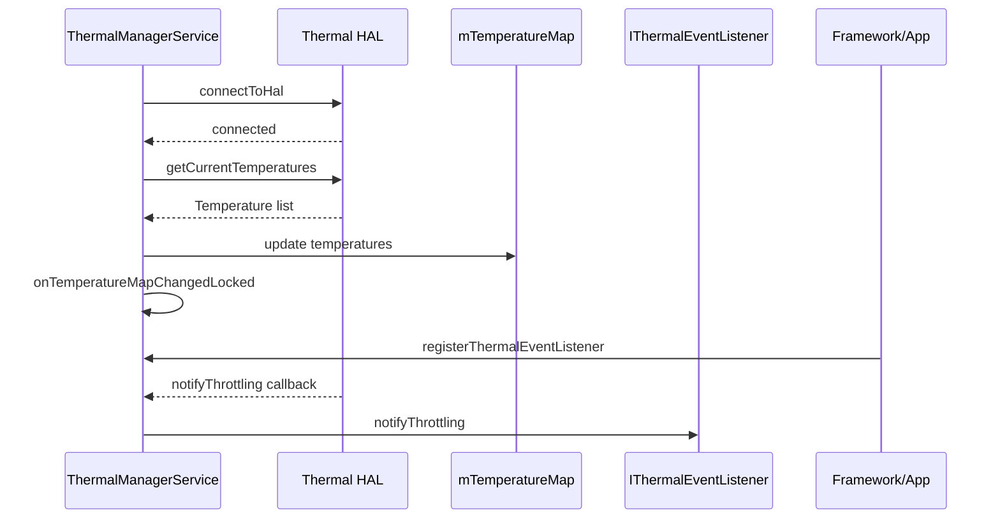
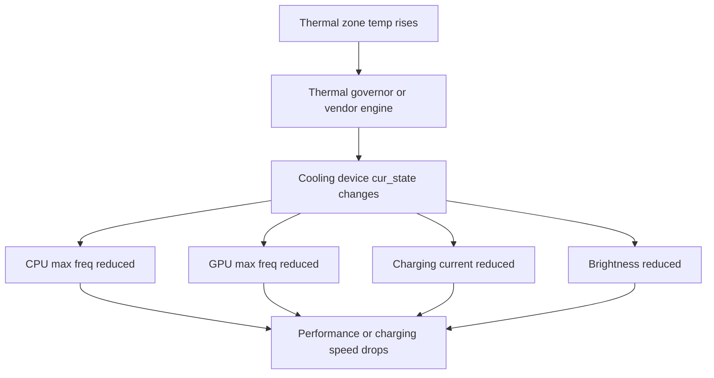

Thermal 不是一个“温度显示模块”，而是 Android 功耗闭环里的刹车系统。功耗升高会带来温升；温度到阈值后，thermal 策略会通过限频、限流、降亮度、降刷新率、关相机、限制充电等手段把功耗压下来。

所以热问题不能只写“温度高”。完整结论必须包含：

```text
温度来源 -> 触发阈值 -> 限制动作 -> 性能/体验结果 -> 修复或策略调整
```

## 总体架构



注意这张图的重点：Framework ThermalManagerService 不是唯一热策略。很多厂商平台会由 vendor thermal engine 直接监听 thermal zone 并操作 cooling device、cpufreq、charger、display 节点。`dumpsys thermalservice` 看不到，不代表没有温控。

## 源码入口

| 模块 | 源码 |
|------|------|
| ThermalManagerService | [ThermalManagerService.java line 89](vscode://file//home/suhui/workspace/aosp/los21/frameworks/base/services/core/java/com/android/server/power/ThermalManagerService.java:89:1) |
| onStart | [ThermalManagerService.java line 154](vscode://file//home/suhui/workspace/aosp/los21/frameworks/base/services/core/java/com/android/server/power/ThermalManagerService.java:154:1) |
| HAL wrapper connect | [ThermalManagerService.java line 173](vscode://file//home/suhui/workspace/aosp/los21/frameworks/base/services/core/java/com/android/server/power/ThermalManagerService.java:173:1) |
| onTemperatureMapChangedLocked | [ThermalManagerService.java line 233](vscode://file//home/suhui/workspace/aosp/los21/frameworks/base/services/core/java/com/android/server/power/ThermalManagerService.java:233:1) |
| notifyEventListenersLocked | [ThermalManagerService.java line 285](vscode://file//home/suhui/workspace/aosp/los21/frameworks/base/services/core/java/com/android/server/power/ThermalManagerService.java:285:1) |
| shutdownIfNeeded | [ThermalManagerService.java line 302](vscode://file//home/suhui/workspace/aosp/los21/frameworks/base/services/core/java/com/android/server/power/ThermalManagerService.java:302:1) |
| onTemperatureChanged | [ThermalManagerService.java line 323](vscode://file//home/suhui/workspace/aosp/los21/frameworks/base/services/core/java/com/android/server/power/ThermalManagerService.java:323:1) |
| getCurrentTemperatures | [ThermalManagerService.java line 427](vscode://file//home/suhui/workspace/aosp/los21/frameworks/base/services/core/java/com/android/server/power/ThermalManagerService.java:427:1) |
| dumpInternal | [ThermalManagerService.java line 652](vscode://file//home/suhui/workspace/aosp/los21/frameworks/base/services/core/java/com/android/server/power/ThermalManagerService.java:652:1) |
| ThermalHalAidlWrapper | [ThermalManagerService.java line 946](vscode://file//home/suhui/workspace/aosp/los21/frameworks/base/services/core/java/com/android/server/power/ThermalManagerService.java:946:1) |
| ThermalHal20Wrapper | [ThermalManagerService.java line 1404](vscode://file//home/suhui/workspace/aosp/los21/frameworks/base/services/core/java/com/android/server/power/ThermalManagerService.java:1404:1) |
| TemperatureWatcher | [ThermalManagerService.java line 1571](vscode://file//home/suhui/workspace/aosp/los21/frameworks/base/services/core/java/com/android/server/power/ThermalManagerService.java:1571:1) |

## Framework Thermal流程

`ThermalManagerService.onStart()` 会尝试连接 Thermal HAL。AOSP14 中优先级大致是：

```text
ThermalHalAidlWrapper
ThermalHal20Wrapper
ThermalHal11Wrapper
ThermalHal10Wrapper
```

连接成功后会：

```text
注册 temperature callback
读取 current temperatures
更新 mTemperatureMap
根据 TYPE_SKIN 的 status 计算全局 thermal status
更新 headroom thresholds
发布 thermalservice binder
```



`onTemperatureMapChangedLocked()` 的关键逻辑是：遍历 `mTemperatureMap`，用 `TYPE_SKIN` 的最高 status 更新全局 `mStatus`。这意味着 Framework 的 overall thermal status 更偏向皮肤温度体验，而不是 CPU/GPU 最高温。

## Temperature类型和等级

ThermalManagerService 支持的类型包括：

| 类型 | 场景 |
|------|------|
| CPU | CPU 热 |
| GPU | GPU 热 |
| BATTERY | 电池热 |
| SKIN | 外壳/体感热 |
| USB_PORT | USB 口热 |
| POWER_AMPLIFIER | PA/射频功放 |
| BCL_* | 电池电流/电压/百分比限制 |
| NPU/TPU | AI 加速器 |
| DISPLAY | 显示相关 |
| MODEM | modem |
| SOC | SoC |
| WIFI | Wi-Fi |
| CAMERA | 相机 |
| FLASHLIGHT | 闪光灯 |
| SPEAKER | 扬声器 |
| AMBIENT | 环境温度 |

Throttling status：

| 状态 | 含义 |
|------|------|
| `NONE` | 无限制 |
| `LIGHT` | 轻微限制 |
| `MODERATE` | 中等限制 |
| `SEVERE` | 严重限制 |
| `CRITICAL` | 临界 |
| `EMERGENCY` | 紧急 |
| `SHUTDOWN` | 需要关机保护 |


如果温度达到 `THROTTLING_SHUTDOWN`，`shutdownIfNeeded()` 会根据类型触发不同关机原因，例如 CPU/GPU/NPU/SKIN/BATTERY 等。

## Framework命令

```bash
adb shell dumpsys thermalservice
adb shell dumpsys thermalservice --help
```

如果输出：

```text
Thermal Status: 0
Cached temperatures:
HAL Ready: false
```

只能说明 Framework 没连上 Thermal HAL，不能说明设备没有温控。下一步必须看 kernel sysfs 和 vendor 行为。

ThermalManagerService 还支持注入温度用于测试监听逻辑。这个只用于 Framework 行为验证，不代表真实温度：

```bash
adb shell dumpsys thermalservice inject-temperature skin 42.0 moderate
```

如果设备支持命令格式，可用 `--help` 确认。

## Kernel thermal_zone

Kernel 侧入口：

```bash
adb shell 'for z in /sys/class/thermal/thermal_zone*; do echo "== $z =="; cat $z/type; cat $z/temp; done'
```

常见 thermal zone：

```text
battery
skin
cpu
gpu
pmic
pm8998_tz
pmi8998_tz
pm8005_tz
msm_therm
tsens_tz_sensor*
xo_therm
quiet_therm
pa_therm*
```

注意单位：

```text
37000 -> 37.000 C
370   -> 37.0 C
36    -> 36 C
```

不同节点单位可能不同，要结合平台习惯和实际范围判断。看到 `battery: 37000` 和 `msm_therm: 36` 并存并不奇怪。

## cooling_device

看 cooling：

```bash
adb shell 'for c in /sys/class/thermal/cooling_device*; do echo "== $c =="; cat $c/type; cat $c/cur_state; cat $c/max_state; done'
```

常见 cooling device：

| 类型 | 可能动作 |
|------|----------|
| `thermal-cpufreq-*` | 限制 CPU policy max freq |
| GPU cooling | 限制 GPU 频率 |
| charger/input current | 限制充电电流 |
| display/backlight | 降亮度 |
| modem/pa | 限制射频 |
| camera | 限制相机 |
| battery current limit | 限制放电/充电 |



结论要写成：

```text
zone 温度上升 -> cooling cur_state 变化 -> 被控对象实际受限
```

只写“温度 45C”不够。

## 限频判断

CPU 限频：

```bash
adb shell 'for p in /sys/devices/system/cpu/cpufreq/policy*; do echo "== $p =="; cat $p/cpuinfo_max_freq; cat $p/scaling_max_freq; cat $p/scaling_cur_freq; done'
```

判断：

| 现象 | 解释 |
|------|------|
| `scaling_max_freq < cpuinfo_max_freq` | policy max 被限制 |
| cooling state 非 0 | thermal 正在干预 |
| 温度升高后 max_freq 下降 | 热限频证据强 |
| 温度下降后 max_freq 恢复 | 策略闭环正常 |
| cur_freq 上不去但 max 未降 | 可能负载不够、governor、uclamp、省电 |

GPU 限频视平台：

```bash
adb shell 'find /sys/class/kgsl /sys/class/devfreq -maxdepth 3 -type f 2>/dev/null | grep -Ei "gpu|cur_freq|max_freq|min_freq|governor|busy"'
```

## 充电限流

充电热相关：

```bash
adb shell dumpsys battery
adb shell 'for d in /sys/class/power_supply/*; do echo "== $d =="; cat $d/type 2>/dev/null; cat $d/current_now 2>/dev/null; cat $d/input_current_limit 2>/dev/null; cat $d/constant_charge_current 2>/dev/null; cat $d/temp 2>/dev/null; done'
```

证据链：

```text
battery/pmic/skin temp 上升
charger cooling cur_state 变化
input_current_limit 或 current_now 下降
充电速度下降
```

## 降亮度/降刷新率

Display thermal 可能表现为：

- 最大亮度降低。
- HBM 不可用。
- 刷新率上限降低。
- 屏幕变暗。

命令：

```bash
adb shell dumpsys display | grep -Ei "brightness|throttl|thermal|hbm|refresh|DisplayModeDirector"
adb shell dumpsys SurfaceFlinger | grep -Ei "refresh|mode|fps"
adb shell dumpsys thermalservice
```

报告中要写：

```text
温度达到阈值后，DisplayModeDirector/Thermal vote 限制刷新率；
或 brightness throttling 限制最大亮度。
```

## 当前QCOM设备现象

当前外接 msm8998 设备曾观察到：

```text
dumpsys thermalservice:
    Thermal Status: 0
    Cached temperatures:
    HAL Ready: false
```

但 sysfs 可见：

```text
battery
pm8998_tz
pmi8998_tz
pm8005_tz
msm_therm
tsens_tz_sensor*
thermal-cpufreq-0
thermal-cpufreq-1
```

正确结论：

```text
Framework Thermal HAL 链路不可用，不能通过 thermalservice 判断热状态。
需要从 kernel thermal_zone 和 cooling_device 建立热分析证据。
```

## Case 1：Thermal HAL不可用

现象：

```text
dumpsys thermalservice 显示 HAL Ready=false。
```

排查：

```bash
adb shell dumpsys thermalservice
adb shell 'for z in /sys/class/thermal/thermal_zone*; do echo "$(cat $z/type) $(cat $z/temp)"; done'
adb shell 'for c in /sys/class/thermal/cooling_device*; do echo "$(cat $c/type) $(cat $c/cur_state)/$(cat $c/max_state)"; done'
```

我会这样写报告：

```text
Framework Thermal HAL 未就绪，因此 thermalservice 无 cached temperature。
但 kernel thermal_zone 和 cooling_device 正常暴露温度与限制状态。
后续热分析以 kernel sysfs 和实际频率/电流变化为准。
```

## Case 2：CPU热限频

现象：

```text
跑压测几分钟后 FPS 下降。
CPU scaling_max_freq 下降。
thermal-cpufreq cur_state 从 0 变成 2。
```

证据：

```bash
adb shell 'for p in /sys/devices/system/cpu/cpufreq/policy*; do echo $p; cat $p/cpuinfo_max_freq; cat $p/scaling_max_freq; done'
adb shell 'for c in /sys/class/thermal/cooling_device*; do cat $c/type; cat $c/cur_state; done'
```

结论：

```text
性能下降发生在温度上升后，thermal-cpufreq cooling 生效并降低 CPU policy max。
这是热限频导致的性能下降，不是单纯调度异常。
```

## Case 3：充电发热限流

现象：

```text
边充电边亮屏使用，温度上升后充电电流下降。
```

证据链：

```text
battery temp / pmic temp 上升
cooling_device cur_state 变化
current_now 或 input_current_limit 下降
```

结论：

```text
充电路径热和系统运行负载叠加，触发 thermal 充电限流。
优化方向是降低运行负载、改善散热或调整充电温控阈值。
```

## Case 4：亮屏高亮导致降亮度

现象：

```text
户外高亮或 HDR 场景，几分钟后屏幕变暗。
```

证据：

```text
display/skin/battery 温度上升
dumpsys display 中 brightness throttling 或 HBM 状态变化
thermal status 升级
```

结论：

```text
屏幕变暗不是 UI bug，而是 display thermal brightness throttling。
需要比较冷机和热机亮度上限，以及 HBM/HDR 触发条件。
```

## Case 5：温度高但没有限频

现象：

```text
某 thermal zone 温度看起来高，但 CPU/GPU/充电都没有限制。
```

可能原因：

- 该 zone 不是控制目标。
- 单位理解错误。
- 阈值未到。
- HAL/sysfs 显示的是不同传感器。
- vendor thermal engine 没绑定该 zone。

我会这样写结论：

```text
当前只观察到温度值高，未观察到 cooling state、频率、电流或亮度变化。
因此不能判定 thermal throttling 已触发，需要继续确认阈值和 cooling 绑定。
```

## 采集脚本

```bash
#!/system/bin/sh

OUT=/data/local/tmp/thermal_case_$(date +%Y%m%d_%H%M%S)
DURATION=${1:-600}
mkdir -p "$OUT"

date > "$OUT/meta.txt"
getprop ro.product.device >> "$OUT/meta.txt"
getprop ro.board.platform >> "$OUT/meta.txt"

dumpsys thermalservice > "$OUT/thermalservice_before.txt"
dumpsys battery > "$OUT/battery_before.txt"
dumpsys display > "$OUT/display_before.txt"

for z in /sys/class/thermal/thermal_zone*; do
    echo "$(basename $z) $(cat $z/type 2>/dev/null) $(cat $z/temp 2>/dev/null)" >> "$OUT/zones_before.txt"
done

for c in /sys/class/thermal/cooling_device*; do
    echo "$(basename $c) $(cat $c/type 2>/dev/null) $(cat $c/cur_state 2>/dev/null) $(cat $c/max_state 2>/dev/null)" >> "$OUT/cooling_before.txt"
done

for p in /sys/devices/system/cpu/cpufreq/policy*; do
    echo "$(basename $p) $(cat $p/scaling_cur_freq 2>/dev/null) $(cat $p/scaling_max_freq 2>/dev/null)" >> "$OUT/cpufreq_before.txt"
done

sleep "$DURATION"

dumpsys thermalservice > "$OUT/thermalservice_after.txt"
dumpsys battery > "$OUT/battery_after.txt"
dumpsys display > "$OUT/display_after.txt"

for z in /sys/class/thermal/thermal_zone*; do
    echo "$(basename $z) $(cat $z/type 2>/dev/null) $(cat $z/temp 2>/dev/null)" >> "$OUT/zones_after.txt"
done

for c in /sys/class/thermal/cooling_device*; do
    echo "$(basename $c) $(cat $c/type 2>/dev/null) $(cat $c/cur_state 2>/dev/null) $(cat $c/max_state 2>/dev/null)" >> "$OUT/cooling_after.txt"
done

for p in /sys/devices/system/cpu/cpufreq/policy*; do
    echo "$(basename $p) $(cat $p/scaling_cur_freq 2>/dev/null) $(cat $p/scaling_max_freq 2>/dev/null)" >> "$OUT/cpufreq_after.txt"
done

tar -czf "$OUT.tar.gz" -C "$(dirname "$OUT")" "$(basename "$OUT")"
echo "$OUT.tar.gz"
```

## 我会这样说明

```text
我分析热问题会把温度、限制动作和体验结果串起来。
Framework 侧先看 ThermalManagerService 和 Thermal HAL 是否可用；如果 HAL Ready=false，不能说明没有热问题，要下钻 /sys/class/thermal 的 thermal_zone 和 cooling_device。
真正判断 throttling 要看 cooling_device cur_state、CPU/GPU max freq、充电电流、亮度或刷新率是否发生变化。
只有温度升高但没有限制动作，不能说已经热限频。
```

## 复盘

Thermal 分析要避免三个误区：

- `thermalservice` 为空不等于没有温控。
- 温度高不等于已经 throttling。
- 性能下降不一定是 thermal，要有 cooling/freq/current/brightness 证据。

我的判断口径：

```text
热问题的完整证据链是：温度上升 -> thermal策略触发 -> cooling动作出现 -> 频率/电流/亮度/FPS变化。
```
