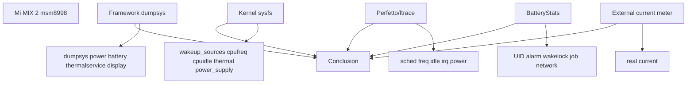
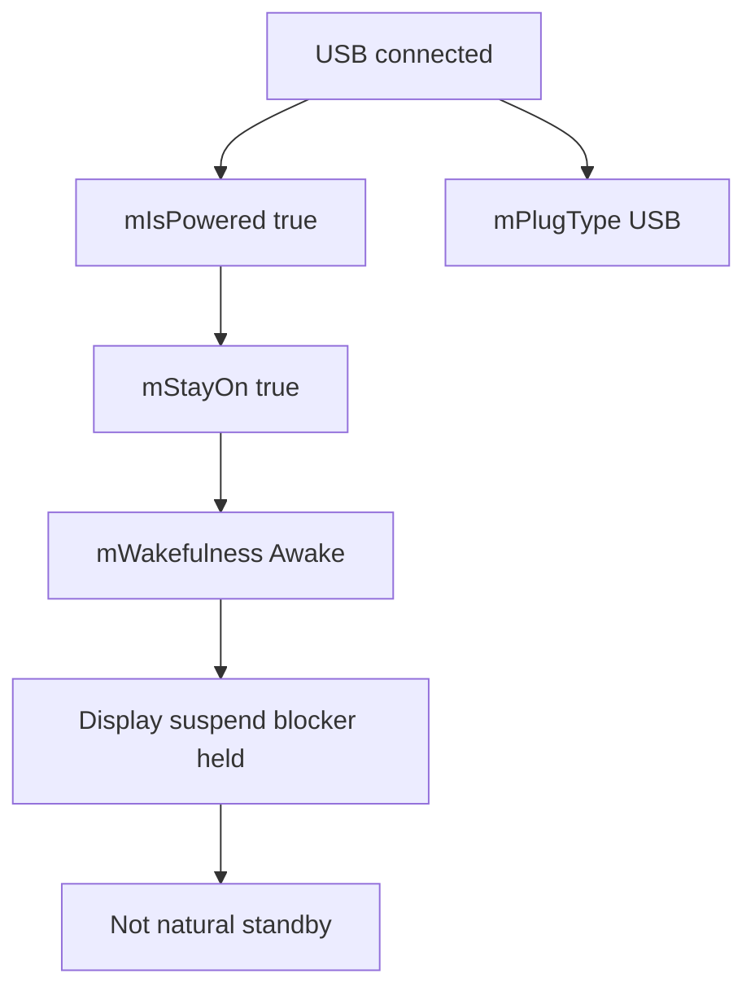
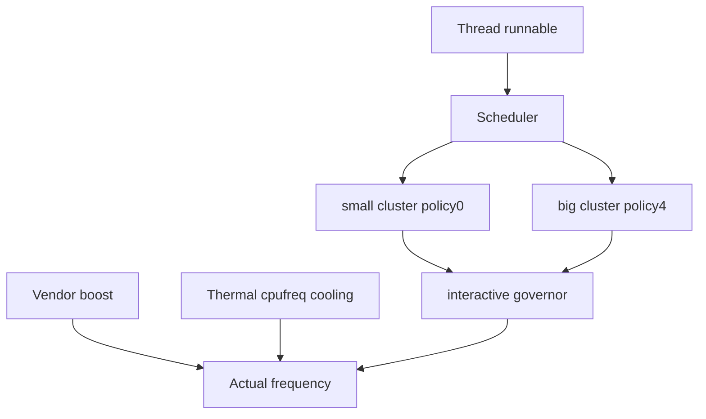

这篇记录不讲大而全的 QCOM 架构，而是围绕一台真实外接设备做功耗实战：Mi MIX 2，平台 msm8998，Android 14 / LOS21，`adb root` 可用。它是一个很适合学习的平台：节点可见度高，老 QCOM 的 interactive governor、thermal sysfs、wakeup_sources 都能看到，同时又能和现代 AOSP Framework 机制对上。

但先说结论：**插着 USB 调试的设备，不是自然待机场景。** 这台设备的第一课就是测试条件控制。

## 设备信息

```text
model: Mi MIX 2
device: chiron
hardware: qcom
board: msm8998
soc: MSM8998
Android: 14
adb: root
```

基础命令：

```bash
adb devices -l
adb shell getprop ro.product.model
adb shell getprop ro.product.device
adb shell getprop ro.hardware
adb shell getprop ro.product.board
adb shell getprop ro.soc.model
adb shell getprop ro.build.version.release
adb shell id
```

## 实战总图



实战原则：

- 每次只改一个变量。
- 所有结论都写测试条件。
- 看 delta，不看单次绝对值。
- Framework、kernel、Perfetto、电流至少两类证据能互相解释。
- 插 USB 数据只能做机制观察，不能伪装成自然待机。

## 初始基线

```bash
adb shell dumpsys battery
adb shell dumpsys power
adb shell dumpsys thermalservice
adb shell cat /sys/kernel/debug/wakeup_sources | head
```

曾观察到：

```text
dumpsys battery:
    USB powered: true
    level: 100
    status: Full
    voltage: 4282 mV
    temperature: 370 = 37.0 C
    max charging current: 500000 uA

dumpsys power:
    mWakefulness=Awake
    mIsPowered=true
    mPlugType=2
    mStayOn=true
    mHalInteractiveModeEnabled=true
    mHoldingDisplaySuspendBlocker=true

dumpsys thermalservice:
    Thermal Status: 0
    Cached temperatures:
    HAL Ready: false
```

第一结论：

```text
当前是 USB 供电 + 满电 + stay awake + 亮屏/交互态。
不能把这组数据当自然待机功耗基线。
```



## 目录地图

常用节点：

```bash
adb shell ls /sys/class/power_supply
adb shell ls /sys/class/thermal
adb shell ls /sys/devices/system/cpu/cpufreq
adb shell ls /sys/devices/system/cpu/cpu0/cpuidle
adb shell ls /sys/kernel/debug/tracing/events
adb shell ls /sys/kernel/tracing/events
```

QCOM 常见方向：

| 方向 | 节点/命令 |
|------|-----------|
| CPU 调频 | `/sys/devices/system/cpu/cpufreq/policy*` |
| CPU idle | `/sys/devices/system/cpu/cpu*/cpuidle/state*` |
| GPU | `/sys/class/kgsl/kgsl-3d0/*` |
| devfreq/DDR | `/sys/class/devfreq/*` |
| 热 | `/sys/class/thermal/thermal_zone*`、`cooling_device*` |
| 充电 | `/sys/class/power_supply/*` |
| 唤醒源 | `/sys/kernel/debug/wakeup_sources` |
| trace | `/sys/kernel/tracing/events/*` |

先发现，再分析，不要假设节点一定存在。

## CPU平台特征

观察命令：

```bash
adb shell 'for p in /sys/devices/system/cpu/cpufreq/policy*; do echo "== $p =="; cat $p/related_cpus; cat $p/scaling_governor; cat $p/scaling_min_freq; cat $p/scaling_cur_freq; cat $p/scaling_max_freq; done'
```

曾观察到：

```text
policy0: related small cores, governor=interactive, max around 1900800
policy4: related big cores, governor=interactive, max around 2361600
```

意义：

- 这不是现代 `schedutil` 路线。
- 需要关注 interactive governor 参数。
- 需要关注 QCOM vendor boost/perflock。
- 需要关注 thermal-cpufreq cooling。



## Thermal特征

Framework：

```bash
adb shell dumpsys thermalservice
```

如果是：

```text
HAL Ready: false
```

下一步看 sysfs：

```bash
adb shell 'for z in /sys/class/thermal/thermal_zone*; do echo "== $z =="; cat $z/type; cat $z/temp; done'
adb shell 'for c in /sys/class/thermal/cooling_device*; do echo "== $c =="; cat $c/type; cat $c/cur_state; cat $c/max_state; done'
```

曾观察到类型：

```text
battery
pm8998_tz
pmi8998_tz
pm8005_tz
msm_therm
tsens_tz_sensor*
thermal-cpufreq-0
thermal-cpufreq-1
```

结论：

```text
Thermal HAL 不可用时，Framework 看不到 thermal 数据；
但 kernel thermal_zone/cooling_device 仍可用于分析热和限频。
```

## wakeup_sources特征

命令：

```bash
adb shell cat /sys/kernel/debug/wakeup_sources
```

曾看到 QCOM/vendor 相关名字：

```text
hal_bluetooth_lock
Loc_hal
lowi-server
netmgrd
DataModule
qti
```

不能只看到名字就定责。正确做法是做固定窗口 delta：

```bash
adb shell cat /sys/kernel/debug/wakeup_sources > ws_before.txt
sleep 600
adb shell cat /sys/kernel/debug/wakeup_sources > ws_after.txt
```

判断：

| 字段 | 意义 |
|------|------|
| `active_since` 增长 | 当前可能挡 suspend |
| `prevent_suspend_time` 增长 | 阻止 suspend |
| `wakeup_count` 增长 | suspend 后唤醒系统 |
| `event_count` 增长 | 事件发生，不一定唤醒 |
| `total_time` 历史大 | 不代表当前问题 |

## Case 1：USB破坏待机测试

目标：证明当前 adb USB 状态不是自然待机。

采集：

```bash
adb shell dumpsys battery > battery_usb.txt
adb shell dumpsys power > power_usb.txt
adb shell settings get global stay_on_while_plugged_in
```

证据：

```text
USB powered=true
mIsPowered=true
mPlugType=2
mStayOn=true
mWakefulness=Awake
```

我会这样写结论：

```text
当前设备插 USB 后进入 powered 状态，并且 stay awake 生效。
Framework 保持 Awake/Display blocker，不能代表自然灭屏待机。
后续自然待机测试必须使用本地脚本落盘后拔 USB。
```

## Case 2：本地脚本拔线待机

脚本：

```bash
adb push collect_standby.sh /data/local/tmp/
adb shell chmod 755 /data/local/tmp/collect_standby.sh
adb shell 'nohup /data/local/tmp/collect_standby.sh 600 >/data/local/tmp/collect_standby.nohup 2>&1 &'
adb shell input keyevent 26
```

脚本内容：

```bash
#!/system/bin/sh

OUT=/data/local/tmp/standby_$(date +%Y%m%d_%H%M%S)
DURATION=${1:-600}
mkdir -p "$OUT"

dumpsys power > "$OUT/power_before.txt"
dumpsys battery > "$OUT/battery_before.txt"
dumpsys deviceidle > "$OUT/deviceidle_before.txt"
dumpsys alarm > "$OUT/alarm_before.txt"
dumpsys jobscheduler > "$OUT/jobs_before.txt"
cat /sys/kernel/debug/wakeup_sources > "$OUT/ws_before.txt"

sleep "$DURATION"

dumpsys power > "$OUT/power_after.txt"
dumpsys battery > "$OUT/battery_after.txt"
dumpsys deviceidle > "$OUT/deviceidle_after.txt"
dumpsys alarm > "$OUT/alarm_after.txt"
dumpsys jobscheduler > "$OUT/jobs_after.txt"
cat /sys/kernel/debug/wakeup_sources > "$OUT/ws_after.txt"

tar -czf "$OUT.tar.gz" -C "$(dirname "$OUT")" "$(basename "$OUT")"
echo "$OUT.tar.gz"
```

执行后拔 USB，等待结束再插回拉取。

## Case 3：Thermal HAL缺失但CPU限频

采集：

```bash
adb shell dumpsys thermalservice
adb shell 'for z in /sys/class/thermal/thermal_zone*; do echo "$(cat $z/type) $(cat $z/temp)"; done'
adb shell 'for c in /sys/class/thermal/cooling_device*; do echo "$(cat $c/type) $(cat $c/cur_state)/$(cat $c/max_state)"; done'
adb shell 'for p in /sys/devices/system/cpu/cpufreq/policy*; do echo "$p $(cat $p/scaling_max_freq) $(cat $p/scaling_cur_freq)"; done'
```

我会这样写报告：

```text
尽管 dumpsys thermalservice 显示 HAL Ready=false，kernel thermal_zone 可见 PMIC/battery/tsens 温度。
当 thermal-cpufreq cur_state 变化时，policy scaling_max_freq 同步下降。
因此该平台热限频分析应以 kernel thermal sysfs 和 cpufreq 变化为证据。
```

## Case 4：定位唤醒

AB：

| Case | Wi-Fi | Location | Mobile data |
|------|-------|----------|-------------|
| A | off | off | airplane |
| B | on | on | airplane |

采集：

```bash
adb shell cat /sys/kernel/debug/wakeup_sources > ws_before.txt
sleep 600
adb shell cat /sys/kernel/debug/wakeup_sources > ws_after.txt
adb shell dumpsys location > location.txt
```

观察目标：

```text
Loc_hal
lowi-server
wlan相关 wakeup source
```

我会这样写结论：

```text
定位开启后，Loc_hal/lowi-server 在固定窗口内 wakeup_count/event_count 增长明显高于 baseline。
结合 dumpsys location 中后台 request，可判断该场景属于定位/Wi-Fi scan 驱动的周期唤醒。
```

## Case 5：蓝牙唤醒

AB：

```bash
adb shell svc bluetooth disable
sleep 60
adb shell cat /sys/kernel/debug/wakeup_sources > bt_off.txt
adb shell svc bluetooth enable
sleep 600
adb shell cat /sys/kernel/debug/wakeup_sources > bt_on.txt
```

观察：

```text
hal_bluetooth_lock
bt/wcnss相关 IRQ 或 wakeup source
```

结论：

```text
蓝牙开启后 hal_bluetooth_lock delta 明显增长，且 Perfetto 中蓝牙相关线程周期活动。
需要继续确认是 BLE scan、设备重连还是 HAL 持锁异常。
```

## Case 6：移动网络/Modem唤醒

AB：

| Case | 移动数据 | 飞行模式 |
|------|----------|----------|
| A | off | on |
| B | on | off |

关注：

```text
netmgrd
DataModule
qti
modem相关 wakeup source
radio active
```

命令：

```bash
adb shell dumpsys telephony.registry > telephony_registry.txt
adb shell dumpsys netstats > netstats.txt
adb shell cat /sys/kernel/debug/wakeup_sources > ws.txt
```

结论：

```text
移动数据开启且弱网时，netmgrd/DataModule 相关 wakeup source 增长，同时 netstats/radio 活动增加。
该类问题需要结合信号强度和重传，不应只按流量大小判断。
```

## Case 7：亮屏静置CPU不降频

采集：

```bash
adb shell dumpsys SurfaceFlinger > sf.txt
adb shell dumpsys gfxinfo <package> > gfxinfo.txt
adb shell perfetto -o /data/misc/perfetto-traces/display_cpu.trace -t 60s sched freq idle gfx view power
adb pull /data/misc/perfetto-traces/display_cpu.trace .
```

我会这样写结论：

```text
目标页面静置但 RenderThread/SF 周期运行，policy4 频率长时间维持高位。
该问题不是纯显示亮度，而是持续刷新导致 CPU/GPU/display pipeline 活跃。
```

## Case 8：充电发热限流

采集：

```bash
adb shell dumpsys battery
adb shell 'for d in /sys/class/power_supply/*; do echo "== $d =="; cat $d/type 2>/dev/null; cat $d/current_now 2>/dev/null; cat $d/temp 2>/dev/null; done'
adb shell 'for z in /sys/class/thermal/thermal_zone*; do echo "$(cat $z/type) $(cat $z/temp)"; done'
adb shell 'for c in /sys/class/thermal/cooling_device*; do echo "$(cat $c/type) $(cat $c/cur_state)"; done'
```

我会这样写结论：

```text
充电电流下降与 battery/PMIC 温度上升同步，cooling state 出现变化。
该现象属于 thermal 保护触发充电限流，需区分正常保护和阈值/散热异常。
```

## 实战报告写法

```text
1. 设备
   model/device/board/soc/android/root状态

2. 测试条件
   USB是否连接
   屏幕状态
   亮度/刷新率
   Wi-Fi/BT/定位/移动数据
   温度起止
   电量区间

3. Framework证据
   dumpsys power
   dumpsys battery
   dumpsys thermalservice
   dumpsys alarm/jobscheduler/deviceidle

4. Kernel证据
   wakeup_sources delta
   cpufreq/cpuidle delta
   thermal_zone/cooling_device
   power_supply

5. 时间线
   Perfetto sched/freq/idle/power/irq/gfx

6. 结论
   问题类型
   根因模块
   限制条件
   下一步验证
```

## 复盘

Mi MIX 2 / msm8998 的价值在于它把很多真实问题都暴露出来：

- USB 调试会破坏待机条件。
- 老 QCOM 平台可能使用 interactive governor。
- Framework Thermal HAL 可能不可用，但 kernel thermal 仍可分析。
- wakeup_sources 里能看到 Bluetooth/Location/Network vendor 名字，但必须看 delta。
- 功耗结论必须由 Framework、kernel、Perfetto、电流/温度互相支撑。

我的判断口径：

```text
真机功耗实战不只是多跑命令，而是把每条命令放回测试条件和因果链里。
```
