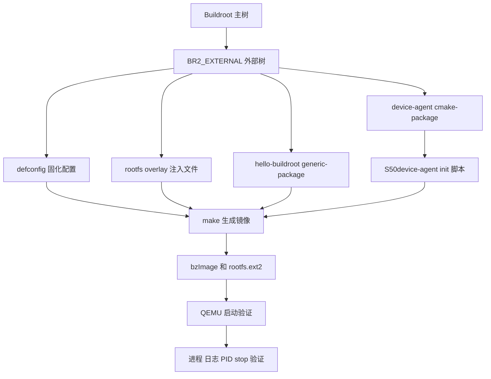

# Buildroot 实战改造：从 BR2_EXTERNAL 到 CMake 自启动服务

> 实践时间：2022-10-12  
> 实验平台：Buildroot 2022.08，`qemu_x86_64`  
> 实验目标：通过 `BR2_EXTERNAL` 管理板级配置、rootfs overlay、自定义程序包和 BusyBox init 自启动服务，并用 QEMU 完成启动验证。

这篇文章记录一次完整的 Buildroot 实战：基于 `Buildroot 2022.08` 和 `qemu_x86_64` 平台，从最小系统构建开始，逐步完成 `BR2_EXTERNAL` 外部树、自定义 rootfs overlay、手写 C 程序包、CMake 程序包、BusyBox init 开机自启动服务，以及 QEMU 启动验证。

我没有直接修改 Buildroot 上游主树，而是把所有业务相关内容放进独立的 `br2-external-lucas` 外部树中。这种做法更接近实际项目维护方式：Buildroot 主树保持干净，板级配置、业务包、overlay 和复现用 defconfig 都放在外部树里统一管理。

## 目标

本次实战目标如下：

- 使用 `Buildroot 2022.08` 构建 QEMU x86_64 镜像。
- 使用 `BR2_EXTERNAL` 管理自定义板级内容和业务包。
- 使用 rootfs overlay 注入 `/etc/motd`。
- 新增 `hello-buildroot`，演示 `generic-package` 的最小 C 程序集成。
- 新增 `device-agent`，演示 `cmake-package` 的 CMake 程序集成。
- 通过 `/etc/init.d/S50device-agent` 实现 BusyBox init 开机自启动。
- 在目标系统内确认程序、日志、PID 文件和关机 stop 流程。

<!-- more -->

## 集成路线图



## 工作区结构

工作目录：

```bash
/var/lib/lucas/mycodespace/buildroot
```

关键目录：

```text
.
├── br2-external-lucas/
├── buildroot-2022.08/
├── dl/
├── docs/
└── output-lucas/
```

外部树最终结构：

```text
br2-external-lucas/
├── Config.in
├── external.desc
├── external.mk
├── configs/lucas_qemu_x86_64_defconfig
├── board/qemu-x86_64/rootfs-overlay/etc/motd
├── package/hello-buildroot/
│   ├── Config.in
│   ├── hello-buildroot.c
│   └── hello-buildroot.mk
└── package/device-agent/
    ├── CMakeLists.txt
    ├── Config.in
    ├── S50device-agent
    ├── device-agent.c
    └── device-agent.mk
```

## 关键配置

最终项目通过 `br2-external-lucas/configs/lucas_qemu_x86_64_defconfig` 固化配置，核心配置如下：

```text
BR2_x86_64=y
BR2_PACKAGE_HOST_LINUX_HEADERS_CUSTOM_5_15=y
BR2_DL_DIR="/var/lib/lucas/mycodespace/buildroot/dl"
BR2_ROOTFS_OVERLAY="$(BR2_EXTERNAL_LUCAS_PATH)/board/qemu-x86_64/rootfs-overlay"
BR2_LINUX_KERNEL=y
BR2_LINUX_KERNEL_CUSTOM_VERSION=y
BR2_LINUX_KERNEL_CUSTOM_VERSION_VALUE="5.15"
BR2_LINUX_KERNEL_USE_CUSTOM_CONFIG=y
BR2_LINUX_KERNEL_CUSTOM_CONFIG_FILE="board/qemu/x86_64/linux.config"
BR2_TARGET_ROOTFS_EXT2=y
BR2_PACKAGE_HOST_QEMU=y
BR2_PACKAGE_HOST_QEMU_SYSTEM_MODE=y
BR2_PACKAGE_HELLO_BUILDROOT=y
BR2_PACKAGE_DEVICE_AGENT=y
```

实际输出目录中的 `.config` 也确认了这些配置已经生效：

```text
BR2_EXTERNAL_NAMES="LUCAS"
BR2_EXTERNAL_LUCAS_PATH="/var/lib/lucas/mycodespace/buildroot/br2-external-lucas"
BR2_DL_DIR="/var/lib/lucas/mycodespace/buildroot/dl"
BR2_ROOTFS_OVERLAY="/var/lib/lucas/mycodespace/buildroot/br2-external-lucas/board/qemu-x86_64/rootfs-overlay"
BR2_LINUX_KERNEL=y
BR2_LINUX_KERNEL_CUSTOM_VERSION_VALUE="5.15"
BR2_LINUX_KERNEL_VERSION="5.15"
BR2_TARGET_ROOTFS_EXT2=y
BR2_TARGET_ROOTFS_EXT2_SIZE="60M"
BR2_PACKAGE_HOST_QEMU=y
BR2_PACKAGE_HELLO_BUILDROOT=y
BR2_PACKAGE_DEVICE_AGENT=y
```

## 阶段一：BR2_EXTERNAL 和 rootfs overlay

外部树描述文件 `external.desc`：

```text
name: LUCAS
desc: Lucas Buildroot learning external tree
```

外部树统一引入自定义 package：

```make
# br2-external-lucas/external.mk
include $(sort $(wildcard $(BR2_EXTERNAL_LUCAS_PATH)/package/*/*.mk))
```

Kconfig 入口：

```kconfig
# br2-external-lucas/Config.in
source "$BR2_EXTERNAL_LUCAS_PATH/package/hello-buildroot/Config.in"
source "$BR2_EXTERNAL_LUCAS_PATH/package/device-agent/Config.in"
```

rootfs overlay 注入的 `/etc/motd`：

```text
Welcome to Lucas Buildroot learning image.
This /etc/motd comes from a br2-external rootfs overlay.
```

目标系统登录后可以直接看到这段内容，说明文件不是手工拷进 `output/target`，而是通过 Buildroot rootfs 生成流程进入镜像。

## 阶段二：hello-buildroot 的 generic-package 集成

`hello-buildroot` 是一个最小 C 程序，用来验证本地源码包、交叉编译、安装到 rootfs 这一套流程。

核心源码：

```c
#include <stdio.h>
#include <sys/utsname.h>

int main(void)
{
	struct utsname uts;

	puts("hello-buildroot: custom C program from br2-external");

	if (uname(&uts) == 0)
		printf("kernel: %s %s on %s\n", uts.sysname, uts.release, uts.machine);

	return 0;
}
```

package mk 文件：

```make
HELLO_BUILDROOT_SITE = $(BR2_EXTERNAL_LUCAS_PATH)/package/hello-buildroot
HELLO_BUILDROOT_SITE_METHOD = local

define HELLO_BUILDROOT_BUILD_CMDS
	$(TARGET_CC) $(TARGET_CFLAGS) $(TARGET_LDFLAGS) \
		-o $(@D)/hello-buildroot $(@D)/hello-buildroot.c
endef

define HELLO_BUILDROOT_INSTALL_TARGET_CMDS
	$(INSTALL) -D -m 0755 $(@D)/hello-buildroot \
		$(TARGET_DIR)/usr/bin/hello-buildroot
endef

$(eval $(generic-package))
```

这里我使用的是 `generic-package`。它适合这种非常小的本地源码包：自己定义 build 命令，自己定义 install 命令，由 Buildroot 负责源码同步、stamp 文件、目标目录管理和整体构建编排。

`hello-buildroot-rebuild` 的关键日志：

```text
>>> hello-buildroot  Syncing from source dir /var/lib/lucas/mycodespace/buildroot/br2-external-lucas/package/hello-buildroot
>>> hello-buildroot  Building
/var/lib/lucas/mycodespace/buildroot/output-lucas/host/bin/x86_64-buildroot-linux-gnu-gcc \
  -D_LARGEFILE_SOURCE -D_LARGEFILE64_SOURCE -D_FILE_OFFSET_BITS=64 -O2 -g0 -D_FORTIFY_SOURCE=1 \
  -o /var/lib/lucas/mycodespace/buildroot/output-lucas/build/hello-buildroot/hello-buildroot \
  /var/lib/lucas/mycodespace/buildroot/output-lucas/build/hello-buildroot/hello-buildroot.c
>>> hello-buildroot  Installing to target
/usr/bin/install -D -m 0755 .../hello-buildroot .../target/usr/bin/hello-buildroot
```

这段日志能说明它不是宿主机随便编译后拷进去的，而是走了 Buildroot 生成的交叉工具链：

```text
x86_64-buildroot-linux-gnu-gcc
```

## 阶段三：device-agent 的 CMake package 集成

`device-agent` 是本次更接近业务形态的程序：它可以一次性输出设备状态，也可以用 `--daemon` 常驻运行。

功能包括：

- 输出启动标记。
- 输出当前时间戳。
- 输出 hostname。
- 输出 kernel 名称和版本。
- 输出机器架构。
- 输出 uptime。
- 支持 `--daemon` 每 30 秒周期上报。

核心源码：

```c
static void print_status(void)
{
	struct utsname uts;
	struct sysinfo info;
	char hostname[128] = "unknown";
	time_t now;

	(void)gethostname(hostname, sizeof(hostname) - 1);
	hostname[sizeof(hostname) - 1] = '\0';

	now = time(NULL);

	puts("device-agent: status report");
	printf("time: %ld\n", (long)now);
	printf("hostname: %s\n", hostname);

	if (uname(&uts) == 0) {
		printf("kernel: %s %s\n", uts.sysname, uts.release);
		printf("machine: %s\n", uts.machine);
	}

	if (sysinfo(&info) == 0)
		printf("uptime: %ld seconds\n", info.uptime);

	fflush(stdout);
}
```

CMakeLists.txt：

```cmake
cmake_minimum_required(VERSION 3.16)

project(device-agent C)

add_executable(device-agent device-agent.c)

install(TARGETS device-agent DESTINATION bin)
```

注意这里写的是 `DESTINATION bin`，不是 `DESTINATION usr/bin`。Buildroot 调用 CMake 时会设置：

```text
CMAKE_INSTALL_PREFIX:PATH=/usr
CMAKE_TOOLCHAIN_FILE:FILEPATH=/var/lib/lucas/mycodespace/buildroot/output-lucas/host/share/buildroot/toolchainfile.cmake
CMAKE_BUILD_TYPE:STRING=Release
```

所以 `DESTINATION bin` 最终安装到目标系统的 `/usr/bin/device-agent`。如果写成 `DESTINATION usr/bin`，实际路径会变成 `/usr/usr/bin`，这是嵌入式根文件系统定制中很常见的路径错误。

Buildroot package mk：

```make
DEVICE_AGENT_SITE = $(BR2_EXTERNAL_LUCAS_PATH)/package/device-agent
DEVICE_AGENT_SITE_METHOD = local

define DEVICE_AGENT_INSTALL_INIT_SYSV
	$(INSTALL) -D -m 0755 $(@D)/S50device-agent \
		$(TARGET_DIR)/etc/init.d/S50device-agent
endef

$(eval $(cmake-package))
```

这里使用 `$(eval $(cmake-package))`。相比手写编译命令，CMake package 的好处是 Buildroot 会自动准备交叉编译 toolchain file、安装前缀、构建目录和安装流程，更适合真实项目里的 CMake 工程。

## BusyBox init 自启动脚本

安装到目标系统的脚本路径是：

```text
/etc/init.d/S50device-agent
```

脚本核心逻辑：

```sh
DAEMON=/usr/bin/device-agent
PIDFILE=/var/run/device-agent.pid
LOGFILE=/var/log/device-agent.log

start() {
	if [ -f "$PIDFILE" ] && kill -0 "$(cat "$PIDFILE")" 2>/dev/null; then
		echo "device-agent already running"
		return 0
	fi

	mkdir -p /var/log /var/run
	echo "Starting device-agent"
	"$DAEMON" --daemon >> "$LOGFILE" 2>&1 &
	echo "$!" > "$PIDFILE"
}
```

这个脚本通过 `DEVICE_AGENT_INSTALL_INIT_SYSV` hook 安装进目标根文件系统。Buildroot 的 BusyBox init 会按 `/etc/init.d/Sxx` 顺序启动服务，所以 `S50device-agent` 会在系统启动过程中被执行。

## Patch 记录

为了方便之后复盘，我把 `device-agent` 这部分改动保存成了 patch：

```text
docs/patches/buildroot-device-agent-cmake-init.patch
```

patch 统计：

```text
br2-external-lucas/Config.in                                  |   1
br2-external-lucas/configs/lucas_qemu_x86_64_defconfig     |  22
br2-external-lucas/package/device-agent/CMakeLists.txt        |   7
br2-external-lucas/package/device-agent/Config.in             |   4
br2-external-lucas/package/device-agent/S50device-agent        |  49
br2-external-lucas/package/device-agent/device-agent.c         |  51
br2-external-lucas/package/device-agent/device-agent.mk        |  15
docs/Buildroot开机自启动服务与CMake包实战.md                     | 415
8 files changed, 564 insertions(+)
```

关键 hunk 之一：把 `device-agent` 挂进外部树 Kconfig。

```diff
--- a/br2-external-lucas/Config.in
+++ b/br2-external-lucas/Config.in
@@ -1 +1,2 @@
 source "$BR2_EXTERNAL_LUCAS_PATH/package/hello-buildroot/Config.in"
+source "$BR2_EXTERNAL_LUCAS_PATH/package/device-agent/Config.in"
```

关键 hunk 之二：新增 CMake package。

```diff
+++ b/br2-external-lucas/package/device-agent/device-agent.mk
@@ -0,0 +1,15 @@
+DEVICE_AGENT_SITE = $(BR2_EXTERNAL_LUCAS_PATH)/package/device-agent
+DEVICE_AGENT_SITE_METHOD = local
+
+define DEVICE_AGENT_INSTALL_INIT_SYSV
+	$(INSTALL) -D -m 0755 $(@D)/S50device-agent \
+		$(TARGET_DIR)/etc/init.d/S50device-agent
+endef
+
+$(eval $(cmake-package))
```

关键 hunk 之三：固化可复现 defconfig。

```diff
+++ b/br2-external-lucas/configs/lucas_qemu_x86_64_defconfig
@@ -0,0 +1,22 @@
+BR2_x86_64=y
+BR2_PACKAGE_HOST_LINUX_HEADERS_CUSTOM_5_15=y
+BR2_DL_DIR="/var/lib/lucas/mycodespace/buildroot/dl"
+BR2_ROOTFS_OVERLAY="$(BR2_EXTERNAL_LUCAS_PATH)/board/qemu-x86_64/rootfs-overlay"
+BR2_LINUX_KERNEL=y
+BR2_LINUX_KERNEL_CUSTOM_VERSION=y
+BR2_LINUX_KERNEL_CUSTOM_VERSION_VALUE="5.15"
+BR2_TARGET_ROOTFS_EXT2=y
+BR2_PACKAGE_HOST_QEMU=y
+BR2_PACKAGE_HOST_QEMU_SYSTEM_MODE=y
+BR2_PACKAGE_HELLO_BUILDROOT=y
+BR2_PACKAGE_DEVICE_AGENT=y
```

## 构建日志

最终构建命令：

```bash
cd /var/lib/lucas/mycodespace/buildroot/buildroot-2022.08
make O=/var/lib/lucas/mycodespace/buildroot/output-lucas -j$(nproc)
```

最终镜像生成的关键日志：

```text
>>>   Finalizing target directory
>>>   Copying overlay /var/lib/lucas/mycodespace/buildroot/br2-external-lucas/board/qemu-x86_64/rootfs-overlay
>>>   Executing post-build script board/qemu/x86_64/post-build.sh
>>>   Generating root filesystems common tables
>>>   Generating filesystem image rootfs.ext2
mke2fs 1.46.5 (30-Dec-2021)
Creating regular file /var/lib/lucas/mycodespace/buildroot/output-lucas/images/rootfs.ext2
Creating filesystem with 61440 1k blocks and 15360 inodes
Copying files into the device: done
Writing superblocks and filesystem accounting information: done
>>>   Executing post-image script board/qemu/post-image.sh
```

最终产物：

```text
output-lucas/images/bzImage      6198272 bytes
output-lucas/images/rootfs.ext2  62914560 bytes
output-lucas/images/start-qemu.sh 771 bytes
```

目标根文件系统中的关键文件：

```text
-rw-r--r-- output-lucas/target/etc/motd
-rwxr-xr-x output-lucas/target/usr/bin/hello-buildroot
-rwxr-xr-x output-lucas/target/usr/bin/device-agent
-rwxr-xr-x output-lucas/target/etc/init.d/S50device-agent
```

ELF 和镜像类型确认：

```text
output-lucas/target/usr/bin/device-agent:
  ELF 64-bit LSB pie executable, x86-64, dynamically linked,
  interpreter /lib64/ld-linux-x86-64.so.2, for GNU/Linux 5.15.0, stripped

output-lucas/target/usr/bin/hello-buildroot:
  ELF 64-bit LSB pie executable, x86-64, dynamically linked,
  interpreter /lib64/ld-linux-x86-64.so.2, for GNU/Linux 5.15.0, stripped

output-lucas/images/bzImage:
  Linux kernel x86 boot executable bzImage, version 5.15.68

output-lucas/images/rootfs.ext2:
  Linux rev 1.0 ext2 filesystem data, volume name "rootfs"
```

## QEMU 启动验证

启动命令：

```bash
cd /var/lib/lucas/mycodespace/buildroot/output-lucas/images
./start-qemu.sh --serial-only
```

启动日志关键片段：

```text
Linux version 5.15.68 (lucas@ubuntu-A520I-AC)
  (x86_64-buildroot-linux-gnu-gcc.br_real (Buildroot 2022.08) 11.3.0,
  GNU ld (GNU Binutils) 2.38)
Command line: rootwait root=/dev/vda console=tty1 console=ttyS0
VFS: Mounted root (ext2 filesystem) readonly on device 254:0.
Run /sbin/init as init process
Starting syslogd: OK
Starting klogd: OK
Starting network: udhcpc: started, v1.35.0
udhcpc: lease of 10.0.2.15 obtained from 10.0.2.2, lease time 86400
Starting crond: OK
Starting device-agent
Welcome to Buildroot
buildroot login:
```

登录后首先能看到 overlay 注入的 `/etc/motd`：

```text
Welcome to Lucas Buildroot learning image.
This /etc/motd comes from a br2-external rootfs overlay.
```

执行 `hello-buildroot`：

```text
# hello-buildroot
hello-buildroot: custom C program from br2-external
kernel: Linux 5.15.68 on x86_64
```

执行一次性 `device-agent`：

```text
# /usr/bin/device-agent
device-agent: started
device-agent: status report
time: 1663601350
hostname: buildroot
kernel: Linux 5.15.68
machine: x86_64
uptime: 34 seconds
```

确认开机自启动的后台进程和 PID 文件：

```text
# cat /var/run/device-agent.pid
113

# ps | grep device-agent | grep -v grep
  113 root     /usr/bin/device-agent --daemon
```

查看服务日志：

```text
# cat /var/log/device-agent.log
device-agent: started
device-agent: status report
time: 1663601319
hostname: buildroot
kernel: Linux 5.15.68
machine: x86_64
uptime: 3 seconds
device-agent: status report
time: 1663601349
hostname: buildroot
kernel: Linux 5.15.68
machine: x86_64
uptime: 33 seconds
```

确认内核和架构：

```text
# uname -a
Linux buildroot 5.15.68 #1 SMP PREEMPT_DYNAMIC Mon Sep 19 21:12:10 CST 2022 x86_64 GNU/Linux
```

关机时也能看到 init 脚本的 stop 流程：

```text
# poweroff
Stopping device-agent
Stopping crond: OK
Stopping network: OK
Stopping klogd: OK
Stopping syslogd: OK
Requesting system poweroff
reboot: Power down
```

## 复现步骤

从外部树 defconfig 复现一个新输出目录：

```bash
cd /var/lib/lucas/mycodespace/buildroot/buildroot-2022.08

make O=/var/lib/lucas/mycodespace/buildroot/output-lucas-rebuild \
  BR2_EXTERNAL=/var/lib/lucas/mycodespace/buildroot/br2-external-lucas \
  lucas_qemu_x86_64_defconfig

make O=/var/lib/lucas/mycodespace/buildroot/output-lucas-rebuild -j$(nproc)
```

启动新镜像：

```bash
cd /var/lib/lucas/mycodespace/buildroot/output-lucas-rebuild/images
./start-qemu.sh --serial-only
```

## 踩坑与经验

第一，`BR2_EXTERNAL` 比直接改 Buildroot 主树更适合长期维护。外部树可以独立保存板级配置、业务包、overlay、patch 和 defconfig，Buildroot 升级时也更容易迁移。

第二，rootfs overlay 应该作为构建输入，而不是构建完成后手工改 `output/target`。手工改 `target` 很容易在下一次构建、清理或重新生成 rootfs 时丢失。

第三，`generic-package` 和 `cmake-package` 应该按项目复杂度选择。一个单文件 C 程序用 `generic-package` 很直接；真实 CMake 工程则用 `cmake-package`，让 Buildroot 自动处理 toolchain file 和安装前缀。

第四，CMake 安装路径要理解 `CMAKE_INSTALL_PREFIX=/usr`。在 Buildroot 中 `install(TARGETS xxx DESTINATION bin)` 才会进入 `/usr/bin`，不要写成 `usr/bin`。

第五，自启动服务不要只验证“文件存在”，还要验证启动日志、PID 文件、进程列表、服务日志和 stop 流程。这次我同时验证了：

```text
/usr/bin/device-agent
/etc/init.d/S50device-agent
/var/run/device-agent.pid
/var/log/device-agent.log
poweroff 时的 Stopping device-agent
```

## 总结

这次 Buildroot 实战从“能编出镜像”推进到了“能工程化集成业务程序并完成启动验证”。关键收获不是某一个 C 程序本身，而是完整掌握了 Buildroot 项目常用的几条主线：

- 用 `BR2_EXTERNAL` 管理项目私有内容。
- 用 `defconfig` 固化可复现配置。
- 用 rootfs overlay 注入目标系统文件。
- 用 `generic-package` 集成简单本地程序。
- 用 `cmake-package` 集成 CMake 项目。
- 用 BusyBox init 脚本实现开机自启动。
- 用 QEMU 串口日志和目标端命令验证最终结果。

对嵌入式 Linux 项目来说，这比单纯跑通一次 `make` 更有价值：它证明了配置、构建、安装、启动、运行和日志验证是闭环的。
