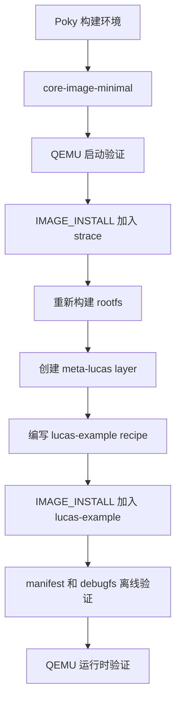

# Yocto 入门实战：从 core-image-minimal 到自定义 Layer 和启动镜像验证

> 实践时间：2022-09-18  
> 实验平台：Yocto Project / Poky 4.0.3，`MACHINE = "qemux86-64"`  
> 实验目标：从最小镜像构建开始，逐步完成镜像定制、自定义 layer、自定义 recipe，并把自定义产物装进可启动镜像中用 QEMU 验证。

这篇文章记录一次完整的 Yocto 入门实战。它不是只停留在“能 bitbake 成功”的层面，而是做了一个闭环：

1. 构建 `core-image-minimal`。
2. 使用 QEMU 启动镜像。
3. 通过 `IMAGE_INSTALL` 把 `strace` 加入镜像。
4. 创建自定义 layer：`meta-lucas`。
5. 编写自定义 recipe：`lucas-example`。
6. 把 `lucas-example` 安装进启动镜像。
7. 在 QEMU 运行时验证 `/usr/bin/lucas-hello` 和 `/etc/lucas-layer-release`。

<!-- more -->

## 实践路线图



本文中的“启动镜像”指的是 QEMU 可启动的 Yocto 产物组合：`bzImage` + `core-image-minimal-qemux86-64.rootfs.ext4`。它不是 Android AOSP 里的 `boot.img`，而是 Yocto/QEMU 场景下的 kernel 和 rootfs 启动组合。

## 1. 实验环境

本次实验工作目录：

```bash
/var/lib/lucas/mycodespace/yocto
```

核心配置：

```conf
MACHINE ??= "qemux86-64"
DISTRO ?= "poky"
```

构建日志中的配置确认如下：

```text
Build Configuration:
BB_VERSION           = "2.0.0"
BUILD_SYS            = "x86_64-linux"
TARGET_SYS           = "x86_64-poky-linux"
MACHINE              = "qemux86-64"
DISTRO               = "poky"
DISTRO_VERSION       = "4.0.3"
TUNE_FEATURES        = "m64 core2"
```

当前启用的 layer：

```text
meta
meta-poky
meta-yocto-bsp
meta-local
meta-lucas
```

`build/conf/bblayers.conf` 中可以看到 `meta-lucas` 已加入构建：

```conf
BBLAYERS ?= " \
  /var/lib/lucas/mycodespace/yocto/poky/meta \
  /var/lib/lucas/mycodespace/yocto/poky/meta-poky \
  /var/lib/lucas/mycodespace/yocto/poky/meta-yocto-bsp \
  /var/lib/lucas/mycodespace/yocto/meta-local \
  /var/lib/lucas/mycodespace/yocto/meta-lucas \
  "
```

## 2. 构建 core-image-minimal

进入 Yocto 构建环境：

```bash
cd /var/lib/lucas/mycodespace/yocto
source poky/oe-init-build-env build
```

构建最小镜像：

```bash
bitbake core-image-minimal
```

构建完成后，镜像产物位于：

```text
build/tmp/deploy/images/qemux86-64/
```

关键产物：

```text
bzImage -> bzImage--5.15.72+git0+fb30a9a1d0_8161e9a0fe-r0-qemux86-64-20220917134047.bin
core-image-minimal-qemux86-64.rootfs.ext4 -> core-image-minimal-qemux86-64.rootfs-20220917163127.ext4
```

这一步的意义是确认 Yocto 基础构建链路可以工作：BitBake 能解析 metadata，能构建 kernel、rootfs，并能输出 QEMU 可启动产物。

## 3. 把 strace 加入镜像

第一轮镜像定制，我选择加入 `strace`。这是一个很适合作为 Yocto 入门验证的软件包：它来自 OE-Core，构建链路清晰，运行时也容易验证。

这一节的目标不是只把配置写进去，而是完整证明三件事：

1. `IMAGE_INSTALL` 展开后确实包含 `strace`。
2. BitBake 构建时确实拉起了 `strace_5.16.bb` 的任务。
3. QEMU 启动后目标系统里真的可以运行 `strace`。

修改 `build/conf/local.conf`：

```conf
# Learning experiment: add strace to core-image-minimal for runtime tracing.
IMAGE_INSTALL:append = " strace"
```

这里有一个容易踩坑的点：`IMAGE_INSTALL:append` 是字符串追加，`" strace"` 前面的空格很重要。如果写成 `"strace"`，可能会和前一个包名粘在一起。

对应 patch 片段：

```diff
diff --git a/build/conf/local.conf b/build/conf/local.conf
index 35c9384..2f18369 100644
--- a/build/conf/local.conf
+++ b/build/conf/local.conf
@@ -311,3 +311,6 @@ BB_DISKMON_DIRS = "\
     HALT,${DL_DIR},5G,1K \
     HALT,${SSTATE_DIR},5G,1K \
     HALT,/tmp,1G,1K"
+
+# Learning experiment: add strace to core-image-minimal for runtime tracing.
+IMAGE_INSTALL:append = " strace"
```

这份 patch 也单独保存成了：

```text
docs/补丁/0001-添加strace到核心镜像.patch
```

修改后先不急着构建，我先用 `bitbake -e` 查看变量展开结果：

```bash
source poky/oe-init-build-env build
bitbake -e core-image-minimal | grep -E '^(IMAGE_INSTALL|MACHINE|DISTRO)='
```

输出：

```text
DISTRO="poky"
IMAGE_INSTALL="packagegroup-core-boot  strace"
MACHINE="qemux86-64"
```

这一步很关键：它证明 `strace` 已经进入 `core-image-minimal` 的安装列表，而不是只写在配置文件里看起来正确。

重新构建：

```bash
cd /var/lib/lucas/mycodespace/yocto
source poky/oe-init-build-env build
bitbake core-image-minimal
```

完整构建日志保存为：

```text
docs/bitbake构建带strace镜像-20220918.log
```

构建日志中可以看到 `strace` recipe 被纳入任务图：

```text
NOTE: Running task 1606 of 4200 (.../meta/recipes-devtools/strace/strace_5.16.bb:do_recipe_qa)
NOTE: recipe strace-5.16-r0: task do_recipe_qa: Succeeded
NOTE: Running task 1875 of 4200 (.../meta/recipes-devtools/strace/strace_5.16.bb:do_fetch)
NOTE: recipe strace-5.16-r0: task do_fetch: Succeeded
```

后续 `strace` 完成了配置、编译、安装、打包和 QA：

```text
NOTE: recipe strace-5.16-r0: task do_configure: Succeeded
NOTE: recipe strace-5.16-r0: task do_compile: Succeeded
NOTE: recipe strace-5.16-r0: task do_install: Succeeded
NOTE: recipe strace-5.16-r0: task do_package: Succeeded
NOTE: recipe strace-5.16-r0: task do_package_write_rpm: Succeeded
NOTE: recipe strace-5.16-r0: task do_package_qa: Succeeded
```

rootfs 和镜像任务也重新执行：

```text
NOTE: Running task 4188 of 4200 (.../core-image-minimal.bb:do_rootfs)
NOTE: recipe core-image-minimal-1.0-r0: task do_rootfs: Succeeded
...
NOTE: Running task 4194 of 4200 (.../core-image-minimal.bb:do_image_ext4)
NOTE: recipe core-image-minimal-1.0-r0: task do_image_ext4: Succeeded
NOTE: recipe core-image-minimal-1.0-r0: task do_image_tar: Succeeded
NOTE: Tasks Summary: Attempted 4200 tasks of which 4164 didn't need to be rerun and all succeeded.
```

对比未加入 `strace` 前的 `4179` 个 task，这次变为 `4200` 个 task。这个变化也能说明新增包带来了额外构建任务。

构建后新生成的镜像产物包括：

```text
build/tmp/deploy/images/qemux86-64/core-image-minimal-qemux86-64.rootfs-20220917161530.ext4
build/tmp/deploy/images/qemux86-64/core-image-minimal-qemux86-64.rootfs-20220917161530.tar.bz2
build/tmp/deploy/images/qemux86-64/core-image-minimal-qemux86-64.rootfs-20220917161530.manifest
build/tmp/deploy/images/qemux86-64/core-image-minimal-qemux86-64.rootfs-20220917161530.qemuboot.conf
```

`ext4` 大小从之前约 `41 MB` 增加到约 `43 MB`，符合加入调试工具后的预期。

使用 manifest 验证：

```bash
latest_manifest=$(ls -t build/tmp/deploy/images/qemux86-64/core-image-minimal-qemux86-64.rootfs-*.manifest | head -1)
echo "$latest_manifest"
grep '^strace\b' "$latest_manifest"
```

输出：

```text
build/tmp/deploy/images/qemux86-64/core-image-minimal-qemux86-64.rootfs-20220917161530.manifest
strace core2_64 5.16
```

这说明 `strace` 已进入最终 rootfs 的安装清单。

最后进入 QEMU 做运行时验证。验证日志保存为：

```text
docs/QEMU验证strace-20220918.log
```

我这里使用短生命周期 QEMU，并通过 `init=/bin/sh` 直接进入 shell：

```bash
qemu-system-x86_64 \
  -m 256 \
  -smp 2 \
  -nographic \
  -serial stdio \
  -monitor none \
  -no-reboot \
  -kernel build/tmp/deploy/images/qemux86-64/bzImage \
  -drive file=build/tmp/deploy/images/qemux86-64/core-image-minimal-qemux86-64.rootfs-20220917161530.ext4,if=virtio,format=raw \
  -append 'root=/dev/vda rw console=ttyS0 init=/bin/sh ...' \
  -net none
```

QEMU 内执行：

```sh
which strace
strace -V
strace -o /ls.trace /bin/ls /
sed -n "1,5p" /ls.trace
```

关键输出：

```text
~ # which strace
/usr/bin/strace
~ # strace -V
strace -- version 5.16
...
~ # strace -o /ls.trace /bin/ls /
bin         etc         lost+found  mnt         sbin        usr
boot        home        ls.trace    proc        sys         var
dev         lib         media       run         tmp
~ # sed -n "1,5p" /ls.trace
execve("/bin/ls", ["/bin/ls", "/"], 0x7ffe5ef83d78 /* 4 vars */) = 0
brk(NULL)                               = 0x56294eb29000
access("/etc/ld.so.preload", R_OK)      = -1 ENOENT (No such file or directory)
openat(AT_FDCWD, "/etc/ld.so.cache", O_RDONLY|O_CLOEXEC) = 3
fstat(3, {st_mode=S_IFREG|0644, st_size=1326, ...}) = 0
```

这一步证明 `strace` 不只是出现在 manifest 中，而是在启动后的目标系统里真实可执行，并且能够生成系统调用跟踪文件 `/ls.trace`。

## 4. 创建自定义 Layer：meta-lucas

下一步是创建自己的 layer。Yocto 的强大之处在于分层机制：BSP、发行版策略、应用配方、产品定制都可以拆到不同 layer 中维护。

创建 layer：

```bash
source poky/oe-init-build-env build
bitbake-layers create-layer ../meta-lucas
bitbake-layers add-layer ../meta-lucas
```

确认 layer：

```bash
bitbake-layers show-layers
```

关键输出：

```text
layer                 path                                                                    priority
========================================================================================================
core                  /var/lib/lucas/mycodespace/yocto/poky/meta                           5
yocto                 /var/lib/lucas/mycodespace/yocto/poky/meta-poky                      5
yoctobsp              /var/lib/lucas/mycodespace/yocto/poky/meta-yocto-bsp                 5
meta-local            /var/lib/lucas/mycodespace/yocto/meta-local                          6
meta-lucas            /var/lib/lucas/mycodespace/yocto/meta-lucas                          6
```

`meta-lucas/conf/layer.conf` 的关键内容：

```conf
BBPATH .= ":${LAYERDIR}"

BBFILES += "${LAYERDIR}/recipes-*/*/*.bb \
            ${LAYERDIR}/recipes-*/*/*.bbappend"

BBFILE_COLLECTIONS += "meta-lucas"
BBFILE_PATTERN_meta-lucas = "^${LAYERDIR}/"
BBFILE_PRIORITY_meta-lucas = "6"

LAYERDEPENDS_meta-lucas = "core"
LAYERSERIES_COMPAT_meta-lucas = "kirkstone"
```

这些配置的作用：

- `BBFILES` 告诉 BitBake 扫描当前 layer 下的 `.bb` 和 `.bbappend`。
- `BBFILE_COLLECTIONS` 定义当前 layer 的 collection 名称。
- `BBFILE_PRIORITY` 决定不同 layer 中同名 recipe 或 bbappend 的优先级。
- `LAYERDEPENDS` 声明依赖 OE-Core。
- `LAYERSERIES_COMPAT` 声明兼容当前 Yocto 发行系列。

## 5. 编写自定义 Recipe：lucas-example

创建 recipe：

```text
meta-lucas/recipes-lucas/lucas-example/lucas-example_0.1.bb
```

最初这个 recipe 只用于验证 BitBake 能扫描到 `meta-lucas`，后来我进一步把它改成一个真正会安装运行时文件的包。

当前 recipe 内容：

```bitbake
SUMMARY = "meta-lucas example runtime package"
DESCRIPTION = "Small runtime package used to verify the meta-lucas layer in booted images"
LICENSE = "MIT"

python do_display_banner() {
    bb.plain("***********************************************");
    bb.plain("*                                             *");
    bb.plain("*      Hello from meta-lucas layer            *");
    bb.plain("*                                             *");
    bb.plain("***********************************************");
}

addtask display_banner before do_build

do_install() {
    install -d ${D}${bindir}
    cat > ${D}${bindir}/lucas-hello <<'EOF'
#!/bin/sh
echo "Hello from meta-lucas runtime package"
echo "Layer: meta-lucas"
echo "Recipe: lucas-example"
EOF
    chmod 0755 ${D}${bindir}/lucas-hello

    install -d ${D}${sysconfdir}
    cat > ${D}${sysconfdir}/lucas-layer-release <<'EOF'
layer=meta-lucas
recipe=lucas-example
message=Hello from meta-lucas runtime package
EOF
}
```

这个 recipe 做了两件事：

- 安装 `/usr/bin/lucas-hello`。
- 安装 `/etc/lucas-layer-release`。

单独构建 recipe：

```bash
bitbake lucas-example
```

构建日志中的自定义 banner：

```text
NOTE: Running task 805 of 823 (/var/lib/lucas/mycodespace/yocto/meta-lucas/recipes-lucas/lucas-example/lucas-example_0.1.bb:do_display_banner)
***********************************************
*                                             *
*      Hello from meta-lucas layer            *
*                                             *
***********************************************
NOTE: Tasks Summary: Attempted 823 tasks of which 803 didn't need to be rerun and all succeeded.
```

这里可以确认两件事：

1. `meta-lucas` 已经被 BitBake 正确扫描。
2. `lucas-example_0.1.bb` 已经进入 BitBake 任务系统。

## 6. 把 lucas-example 装进启动镜像

只构建 recipe 还不够。Yocto 里 recipe 构建成功，并不代表它会自动进入某个 image。要让它出现在 `core-image-minimal` 的 rootfs 中，需要把包名加入 `IMAGE_INSTALL`。

修改 `build/conf/local.conf`：

```conf
# Learning experiment: install the meta-lucas example runtime package.
IMAGE_INSTALL:append = " lucas-example"
```

完整 patch 片段：

```diff
diff --git a/build/conf/local.conf b/build/conf/local.conf
index 2f18369..7929137 100644
--- a/build/conf/local.conf
+++ b/build/conf/local.conf
@@ -314,3 +314,6 @@ BB_DISKMON_DIRS = "\
 
 # Learning experiment: add strace to core-image-minimal for runtime tracing.
 IMAGE_INSTALL:append = " strace"
+
+# Learning experiment: install the meta-lucas example runtime package.
+IMAGE_INSTALL:append = " lucas-example"
```

recipe 从“只输出 banner”升级为“安装运行时文件”的 patch：

```diff
diff --git a/meta-lucas/recipes-lucas/lucas-example/lucas-example_0.1.bb b/meta-lucas/recipes-lucas/lucas-example/lucas-example_0.1.bb
index 32936e9..4d3732e 100644
--- a/meta-lucas/recipes-lucas/lucas-example/lucas-example_0.1.bb
+++ b/meta-lucas/recipes-lucas/lucas-example/lucas-example_0.1.bb
@@ -1,5 +1,5 @@
-SUMMARY = "meta-lucas example recipe"
-DESCRIPTION = "Small example recipe used to verify the meta-lucas layer"
+SUMMARY = "meta-lucas example runtime package"
+DESCRIPTION = "Small runtime package used to verify the meta-lucas layer in booted images"
 LICENSE = "MIT"
 
 python do_display_banner() {
@@ -11,3 +11,21 @@ python do_display_banner() {
 }
 
 addtask display_banner before do_build
+
+do_install() {
+    install -d ${D}${bindir}
+    cat > ${D}${bindir}/lucas-hello <<'EOF'
+#!/bin/sh
+echo "Hello from meta-lucas runtime package"
+echo "Layer: meta-lucas"
+echo "Recipe: lucas-example"
+EOF
+    chmod 0755 ${D}${bindir}/lucas-hello
+
+    install -d ${D}${sysconfdir}
+    cat > ${D}${sysconfdir}/lucas-layer-release <<'EOF'
+layer=meta-lucas
+recipe=lucas-example
+message=Hello from meta-lucas runtime package
+EOF
+}
```

重新构建镜像：

```bash
source poky/oe-init-build-env build
bitbake core-image-minimal
```

构建日志：

```text
Loading cache...done.
Loaded 1886 entries from dependency cache.
NOTE: Resolving any missing task queue dependencies

Build Configuration:
BB_VERSION           = "2.0.0"
BUILD_SYS            = "x86_64-linux"
TARGET_SYS           = "x86_64-poky-linux"
MACHINE              = "qemux86-64"
DISTRO               = "poky"
DISTRO_VERSION       = "4.0.3"
meta-lucas           = "master:3b4dcf38ee395d898a260ab10450a073f12b7b9a"

Initialising tasks...Sstate summary: Wanted 0 Local 0 Mirrors 0 Missed 0 Current 1980 (0% match, 100% complete)
done.
NOTE: Executing Tasks
NOTE: Tasks Summary: Attempted 4218 tasks of which 4218 didn't need to be rerun and all succeeded.
```

这次任务数从加入 `strace` 时的 `4200` 增加到了 `4218`，说明自定义包也进入了镜像构建依赖图。

## 7. Manifest 和 ext4 离线验证

先查 manifest：

```bash
grep -E '^(strace|lucas-example)\b' \
  build/tmp/deploy/images/qemux86-64/core-image-minimal-qemux86-64.rootfs.manifest
```

输出：

```text
strace core2_64 5.16
lucas-example core2_64 0.1
```

这说明最终 rootfs 安装清单里同时包含了 `strace` 和 `lucas-example`。

再用 `debugfs` 直接检查 ext4 文件系统：

```bash
debugfs -R 'stat /usr/bin/lucas-hello' \
  build/tmp/deploy/images/qemux86-64/core-image-minimal-qemux86-64.rootfs.ext4

debugfs -R 'cat /etc/lucas-layer-release' \
  build/tmp/deploy/images/qemux86-64/core-image-minimal-qemux86-64.rootfs.ext4
```

关键输出：

```text
Inode: 457   Type: regular    Mode:  0755
User:     0   Group:     0   Size: 109
```

```text
layer=meta-lucas
recipe=lucas-example
message=Hello from meta-lucas runtime package
```

这一步很有价值：它不依赖 QEMU 运行时，直接证明目标文件已经被写入 ext4 rootfs。

## 8. QEMU 启动验证

最后进行运行时验证。启动命令：

```bash
qemu-system-x86_64 \
  -m 256 \
  -smp 2 \
  -nographic \
  -serial stdio \
  -monitor none \
  -no-reboot \
  -kernel build/tmp/deploy/images/qemux86-64/bzImage \
  -drive file=build/tmp/deploy/images/qemux86-64/core-image-minimal-qemux86-64.rootfs.ext4,if=virtio,format=raw \
  -append 'root=/dev/vda rw console=ttyS0 init=/bin/sh panic=1' \
  -net none
```

这里使用 `init=/bin/sh` 是为了缩短验证路径：不走完整 init 登录流程，直接进入 shell 执行检查命令。

QEMU 启动后可以看到 rootfs 被挂载：

```text
EXT4-fs (vda): mounted filesystem ab0e7a55-0d91-4867-86c4-27f3a494d10a r/w with ordered data mode.
VFS: Mounted root (ext4 filesystem) on device 253:0.
Run /bin/sh as init process
/bin/sh: can't access tty; job control turned off
```

运行时验证命令：

```sh
echo '--- lucas-example runtime verification ---'
which lucas-hello
lucas-hello
cat /etc/lucas-layer-release

echo '--- strace runtime verification ---'
which strace
strace -V
```

QEMU 中的实际输出：

```text
--- lucas-example runtime verification ---
~ # which lucas-hello
/usr/bin/lucas-hello
~ # lucas-hello
Hello from meta-lucas runtime package
Layer: meta-lucas
Recipe: lucas-example
~ # cat /etc/lucas-layer-release
layer=meta-lucas
recipe=lucas-example
message=Hello from meta-lucas runtime package

--- strace runtime verification ---
~ # which strace
/usr/bin/strace
~ # strace -V
strace -- version 5.16
Copyright (c) 1991-2022 The strace developers <https://strace.io>.
This is free software; see the source for copying conditions.  There is NO
warranty; not even for MERCHANTABILITY or FITNESS FOR A PARTICULAR PURPOSE.

Optional features enabled: no-m32-mpers no-mx32-mpers
```

到这里，验证闭环完成：

- `local.conf` 决定 image 安装哪些包。
- `meta-lucas` 提供自定义 layer。
- `lucas-example_0.1.bb` 提供自定义 recipe。
- `do_install()` 把脚本和配置文件安装进 package。
- `bitbake core-image-minimal` 把 package 装进 rootfs。
- manifest、debugfs、QEMU 运行时三层验证都通过。

## 9. 本次实践中的几个关键理解

### 9.1 recipe 构建成功不等于进入镜像

`bitbake lucas-example` 只能说明 recipe 能构建成功。要让它出现在某个 image 中，需要通过 `IMAGE_INSTALL`、packagegroup 或 image recipe 显式加入。

本次使用的是：

```conf
IMAGE_INSTALL:append = " lucas-example"
```

### 9.2 do_install 决定包里有什么

`do_install()` 安装到的是 `${D}` 目录，也就是打包前的目标根目录。比如：

```bitbake
install -d ${D}${bindir}
install -d ${D}${sysconfdir}
```

这里的 `${bindir}` 通常对应 `/usr/bin`，`${sysconfdir}` 通常对应 `/etc`。

### 9.3 manifest 是检查 image 内容的第一证据

manifest 能快速回答：“这个包是否进入最终镜像？”

```text
lucas-example core2_64 0.1
strace core2_64 5.16
```

### 9.4 debugfs 可以离线检查 rootfs

即使不启动 QEMU，也可以检查 ext4 中的文件是否存在：

```bash
debugfs -R 'stat /usr/bin/lucas-hello' core-image-minimal-qemux86-64.rootfs.ext4
```

这对于 CI 或远程构建环境很实用。

### 9.5 QEMU 运行时验证是最后闭环

构建成功、manifest 有记录、文件系统里有文件，还不如最终启动后跑一下更有说服力：

```text
~ # lucas-hello
Hello from meta-lucas runtime package
Layer: meta-lucas
Recipe: lucas-example
```

这一步证明的不是“文件存在”，而是“目标系统中可以执行”。

## 10. 原始日志和 patch 记录

本次实验保留了原始日志，方便后续复盘：

```text
docs/bitbake构建lucas-example-20220918.log
docs/bitbake构建带strace镜像-20220918.log
docs/bitbake构建带lucas-example镜像-20220918.log
docs/bitbake构建带lucas-example启动镜像-20220918.log
docs/QEMU验证strace-20220918.log
docs/QEMU验证lucas-example-clean-20220918.log
```

patch 文件：

```text
docs/补丁/meta-lucas层-20220918.patch
docs/补丁/0001-新增meta-lucas学习层.patch
docs/补丁/0001-添加strace到核心镜像.patch
```

当前工作区中和本次“装进启动镜像”最相关的 diff：

```diff
diff --git a/build/conf/local.conf b/build/conf/local.conf
index 2f18369..7929137 100644
--- a/build/conf/local.conf
+++ b/build/conf/local.conf
@@ -314,3 +314,6 @@ BB_DISKMON_DIRS = "\
 
 # Learning experiment: add strace to core-image-minimal for runtime tracing.
 IMAGE_INSTALL:append = " strace"
+
+# Learning experiment: install the meta-lucas example runtime package.
+IMAGE_INSTALL:append = " lucas-example"
```

```diff
diff --git a/meta-lucas/recipes-lucas/lucas-example/lucas-example_0.1.bb b/meta-lucas/recipes-lucas/lucas-example/lucas-example_0.1.bb
index 32936e9..4d3732e 100644
--- a/meta-lucas/recipes-lucas/lucas-example/lucas-example_0.1.bb
+++ b/meta-lucas/recipes-lucas/lucas-example/lucas-example_0.1.bb
@@ -11,3 +11,21 @@ python do_display_banner() {
 }
 
 addtask display_banner before do_build
+
+do_install() {
+    install -d ${D}${bindir}
+    cat > ${D}${bindir}/lucas-hello <<'EOF'
+#!/bin/sh
+echo "Hello from meta-lucas runtime package"
+echo "Layer: meta-lucas"
+echo "Recipe: lucas-example"
+EOF
+    chmod 0755 ${D}${bindir}/lucas-hello
+
+    install -d ${D}${sysconfdir}
+    cat > ${D}${sysconfdir}/lucas-layer-release <<'EOF'
+layer=meta-lucas
+recipe=lucas-example
+message=Hello from meta-lucas runtime package
+EOF
+}
```

## 11. 总结

这次实战从 Yocto 最基础的 `core-image-minimal` 开始，逐步走到了自定义 layer、自定义 recipe、安装进 image、QEMU 启动验证。整个过程对我最重要的收获是：Yocto 的“构建一个包”和“把包放进镜像”是两个不同层次的问题。

最终验证结果：

```text
strace core2_64 5.16
lucas-example core2_64 0.1
```

QEMU 运行时：

```text
/usr/bin/lucas-hello
Hello from meta-lucas runtime package
Layer: meta-lucas
Recipe: lucas-example
```

这说明自定义 layer 和自定义 recipe 不只是被 BitBake 识别，也确实进入了最终可启动系统。
