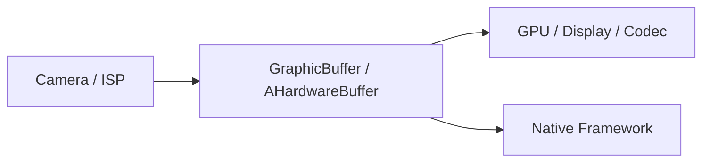
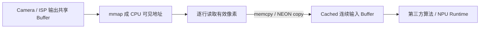

## 背景

这篇文章记录一次 ARM64 平台上算法接入阶段的内存拷贝优化。

问题最开始不是从 NEON 开始的，而是从一次端到端耗时异常开始的：Camera 到显示、预览、编码这些链路本身基本都在走 Android 的共享 Buffer 体系，真正明显的 CPU copy 主要出现在算法接入、送入 NPU 之前。

这里需要先把前提说清楚：AOSP / Android 图像链路里，并不是每经过一个模块就 `memcpy` 一次。Camera、GPU、Codec、Display 之间大量依赖 `GraphicBuffer`、`AHardwareBuffer`、dma-buf、buffer handle 这类共享 Buffer 机制。如果文章写成“Camera 到 NPU 前一路 copy 很多次”，很容易被 challenge。

实际更常见的问题是：**Android 体系内共享 Buffer 没问题，但是一旦接入第三方算法或者跨平台 AI SDK，共享 Buffer 在算法 API 边界处破功。**

用 `perf top` 看热点时，`memcpy` 或业务侧的逐行 copy 函数占比靠前。这个时候不能马上下结论说“Android 图像链路有很多 copy”，也不能直接认定“换成 NEON 就能解决”。`perf top` 只能说明 CPU 时间花在拷贝上，还没有回答这次拷贝为什么存在。

所以这篇文章的重点不是单独介绍 NEON intrinsic，而是围绕 NPU 输入前这一次 copy 展开：先解释它为什么会出现，再分析它为什么经常是逐行去 padding，最后再看 NEON 在这个位置能优化多少。

这次优化要回答三个问题：

1. 为什么共享 Buffer 不能直接传给算法；
2. 为什么 NPU 前这一次 copy 很难完全消掉；
3. 如果必须 copy，应该优化单次整帧搬运，还是优化逐行去 padding 的 copy。

## 业务链路

Android 内部比较理想的链路是共享 Buffer 传递：



算法接入之后，链路通常会变成：



也就是说，关键 copy 通常只有一次：**从硬件输出的共享 Buffer，整理成算法或 NPU Runtime 能接受的连续输入 Buffer。**

以 1920 x 1080 的 NV12 输入为例：

```text
Y  plane = 1920 x 1080
UV plane = 1920 x 1080 / 2
总大小约为 3MB
```

30FPS 下，这一次 copy 的有效数据量就是：

```text
3MB x 30 = 90MB/s
```

如果只是 90MB/s，看起来并不夸张。但实际耗时不只由有效数据量决定，还和源 Buffer 的内存属性、stride、padding、cache 命中、CPU 读路径有关。

所以这里的核心问题不是“NEON 能不能写”，而是：

```text
为什么这一次 copy 不能消掉？
源 Buffer 是 cached、uncached，还是 write-combine？
copy 是整块连续搬运，还是逐行剔除 padding？
优化点是在 memcpy 本身，还是在 stride / cache 属性处理上？
```

## 为什么共享 Buffer 到算法侧会破功

### 1. 第三方算法 API 不认 Android Buffer 体系

很多第三方算法 SDK 或公司内部通用 AI SDK，为了同时支持 Android、iOS、Linux、Windows，接口会设计得非常朴素：

```cpp
// 跨平台算法接口通常只接收普通 CPU 指针和图像参数。
int process_frame(uint8_t* y_data,
                  uint8_t* uv_data,
                  int width,
                  int height,
                  int stride);
```

这类 API 不会直接接收 Android 特有的 `AHardwareBuffer`、`GraphicBuffer`、`buffer_handle_t`，也不会理解 dma-buf fence、usage flag、cache maintenance 这些平台细节。

工程上为了把 Camera 输出送给算法，只能先把底层共享 Buffer `mmap` 成 CPU 可见地址，再把裸指针传给算法。问题就出在这一步之后。

### 2. 共享 Buffer 的 CPU 访问属性不一定适合算法读取

Camera / ISP 输出 Buffer 首先是给硬件写的。为了硬件访问效率和一致性，这类 Buffer 映射给 CPU 时可能不是普通 cached 内存，常见情况包括 uncached 或 write-combine。

如果算法直接拿这个指针做大量像素读取，例如滤波、插值、resize、normalize，CPU 可能无法有效利用 L1 / L2 cache。表现就是：

```text
硬件写共享 Buffer
  -> CPU mmap 得到地址
  -> 算法直接频繁读 uncached / WC 内存
  -> L1 / L2 利用不上
  -> 单像素访问成本非常高
```

这时一次 `memcpy` 反而变成工程上更稳定的方案：先把共享 Buffer 中的有效图像数据搬到一块普通 malloc 分配的 cached 内存，再交给算法处理。

```text
Uncached / WC 共享 Buffer
  -> memcpy
  -> Cached heap Buffer
  -> 算法 / NPU Runtime
```

这不是因为开发者不知道共享 Buffer，而是因为算法 API 和 CPU cache 访问模式决定了这次 copy 很难完全避免。

### 3. stride 和 padding 需要在输入前剔除

硬件输出图像通常有 stride。比如图像宽度是 1080，但底层 stride 可能按 64B 或 128B 对齐到 1152。

很多算法模型或 NPU 输入 Tensor 只接受紧凑排列的数据，不接受每行尾部 padding。于是这次 copy 往往不是一个简单的大块 `memcpy`，而是逐行搬运有效区域：

```cpp
// 逐行剔除硬件 stride padding，并整理成连续输入 Buffer。
void copy_plane_without_padding(uint8_t* dst,
                                const uint8_t* src,
                                int width,
                                int height,
                                int stride) {
    for (int i = 0; i < height; i++) {
        memcpy(dst, src, width);
        src += stride;
        dst += width;
    }
}
```

这就是 NEON 优化容易介入的地方：热点不是 AOSP 中到处 copy，而是算法输入前这个“逐行去 padding + 搬到 cached buffer”的步骤。

## 第一阶段：先把这一次 copy 的形态打清楚

`perf top` 只能说明热点在 copy 上，但不能说明 copy 是整块连续 copy，还是逐行 copy。  
所以第一步不是改 `memcpy`，而是把 NPU 前输入整理的几个参数打清楚。

统计维度至少包括：

```text
format
width
height
stride
plane_count
src_memory_type
copy_bytes
copy_elapsed_us
```

重点看三个问题：

1. `width == stride` 是否成立；
2. 源 Buffer 的 CPU 映射属性是否适合频繁读取；
3. copy 后是否直接进入算法或 NPU Runtime。

更接近真实问题的表应该是：

| copy 点 | 来源 | 目标 | 形态 | 是否可消除 |
|---|---|---|---|---|
| input_copy_y | mmap 后的 Y plane | cached input Y | 逐行去 padding | 通常不可完全消除 |
| input_copy_uv | mmap 后的 UV plane | cached input UV | 逐行去 padding | 通常不可完全消除 |

这张表比“链路中有很多 memcpy”更准确。它明确说明：Android 内部尽量共享 Buffer，真正的 copy 集中在算法输入边界。

## 第二阶段：确认是不是业务自己的慢 copy

有些项目里会存在这种代码：

```cpp
// 逐字节复制内存，用作性能对比基线。
void* byte_copy(void* dst, const void* src, size_t size) {
    uint8_t* d = static_cast<uint8_t*>(dst);
    const uint8_t* s = static_cast<const uint8_t*>(src);

    while (size > 0) {
        *d++ = *s++;
        size--;
    }

    return dst;
}
```

如果热点落在这种逐字节循环上，优化空间会非常明显。  
但如果热点已经落在 `__memcpy_aarch64`，说明系统 libc 已经介入了，不能再拿“逐字节循环 vs NEON”来证明优化有效。

正确的对比应该至少包括：

```text
byte loop
compiler optimized C loop
custom NEON
system libc memcpy
```

这一步很重要。AArch64 上的 libc `memcpy` 通常已经按不同 size 做了分支优化，例如短 copy、中等 copy、长 copy 走不同路径。自定义 NEON 版本如果只比逐字节循环快，没有太大说服力。

## 第三阶段：做一个可控的 NEON 行拷贝版本

这里的 NEON 版本不是为了替换系统 libc，而是为了回答一个问题：

```text
在逐行去 padding 的场景下，SIMD 对每行有效数据搬运到底有没有帮助？
```

### NEON row copy

主循环每次处理 64B。每轮用 4 次 128-bit load 和 4 次 128-bit store，并对后续源地址做预取。这个函数只负责复制一行中的有效像素，不处理 stride 跳转。

```cpp
#include <arm_neon.h>
#include <stddef.h>
#include <stdint.h>

// 使用 NEON 按 64B 粒度复制一行有效像素，只适用于不重叠的 memcpy 场景。
void neon_copy_row_64b(uint8_t* dst, const uint8_t* src, size_t width) {
    uint8_t* d = static_cast<uint8_t*>(dst);
    const uint8_t* s = static_cast<const uint8_t*>(src);
    size_t size = width;

    while (size >= 64) {
        __builtin_prefetch(s + 128);

        uint8x16_t v0 = vld1q_u8(s);
        uint8x16_t v1 = vld1q_u8(s + 16);
        uint8x16_t v2 = vld1q_u8(s + 32);
        uint8x16_t v3 = vld1q_u8(s + 48);

        vst1q_u8(d, v0);
        vst1q_u8(d + 16, v1);
        vst1q_u8(d + 32, v2);
        vst1q_u8(d + 48, v3);

        s += 64;
        d += 64;
        size -= 64;
    }

    while (size >= 16) {
        uint8x16_t v = vld1q_u8(s);
        vst1q_u8(d, v);
        s += 16;
        d += 16;
        size -= 16;
    }

    while (size > 0) {
        *d++ = *s++;
        size--;
    }
}
```

这个实现有几个边界：

1. 不处理内存重叠，不能替代 `memmove`；
2. 没有针对极小 size 做特殊分支；
3. 预取距离不是固定答案，`s + 64`、`s + 128`、`s + 256` 都需要实测；
4. 非对齐 load/store 在 ARMv8-A 上一般可用，但不代表所有地址组合性能一样。

实际项目里，如果每行有效宽度只有几十字节，直接进入这段 NEON 主路径未必划算。小 width 需要单独处理，否则函数分支和尾部逻辑就会吃掉 SIMD 收益。

### 去 padding 的平面拷贝

```cpp
// 将带 stride 的图像平面逐行拷贝成连续紧凑布局。
void neon_copy_plane_without_padding(uint8_t* dst,
                                     const uint8_t* src,
                                     int width,
                                     int height,
                                     int stride) {
    for (int y = 0; y < height; y++) {
        neon_copy_row_64b(dst, src, static_cast<size_t>(width));
        src += stride;
        dst += width;
    }
}
```

这里的优化对象非常明确：不是整条图像链路到处 copy，而是输入 NPU 前把 `stride` 布局转换成紧凑布局的那一次逐行搬运。

## 第四阶段：benchmark 怎么设计

这类 benchmark 最容易犯的错误是只测一个 size。  
比如只测 1MB，可能会把 cache 和 DDR 的影响混在一起；只测 64B，又无法说明大图处理的真实表现。

建议至少扫这些 size：

```text
16B
32B
64B
128B
256B
1KB
4KB
16KB
64KB
256KB
1MB
4MB
16MB
64MB
```

测试时固定 CPU，减少调度噪声：

```bash
taskset -c 2 ./mem_bench --op rowcopy --impl neon64 --width 1920 --height 1080 --stride 2048 --loops 1000
```

配合 `perf stat` 看事件：

```bash
taskset -c 2 perf stat -r 5 \
  -e cycles \
  -e instructions \
  -e cache-references \
  -e cache-misses \
  -e branches \
  -e branch-misses \
  -- ./mem_bench --op rowcopy --impl neon64 --width 1920 --height 1080 --stride 2048 --loops 1000
```

看数据时不要只看耗时，至少要算：

```text
cycles_per_byte       = cycles / total_bytes
instructions_per_byte = instructions / total_bytes
```

判断方式如下：

| 现象 | 可能原因 |
|---|---|
| `instructions_per_byte` 降低，`cycles_per_byte` 也降低 | SIMD 有效，瓶颈还在指令侧 |
| `instructions_per_byte` 降低，`cycles_per_byte` 下降不明显 | 可能开始受 cache / store buffer / DDR 影响 |
| 小 size 收益明显，大 size 收益变小 | 大概率进入内存层级瓶颈 |
| NEON 和 libc 差距很小 | libc 已经足够好，继续自研 copy 意义不大 |
| `cache-misses` 随 size 增大明显变化 | 需要结合 cache 层级和平台 PMU 继续分析 |

`cache-misses` 不能直接等价成 L1 miss。不同 ARM SoC 的 PMU 事件定义并不完全一样，通用事件背后映射到什么层级，需要结合 `perf list` 和平台手册确认。

## 第五阶段：看汇编确认有没有真的向量化

只写了 NEON intrinsic，不代表最终二进制一定符合预期。需要反汇编确认。

```bash
aarch64-linux-android-objdump -d -C libxxx.so | less
```

重点看函数里是否出现类似指令：

```asm
ldr     q0, [x1]
ldr     q1, [x1, #16]
str     q0, [x0]
str     q1, [x0, #16]
```

如果是编译器自动向量化的 C 循环，也可以用下面的方式看优化报告：

```bash
clang++ -O3 -Rpass=loop-vectorize -Rpass-missed=loop-vectorize xxx.cpp
```

这一步主要是防止两类误判：

1. 以为自己测的是 NEON，实际编译条件没打开；
2. 以为普通 C 循环很慢，实际编译器已经自动向量化。

## 第六阶段：回到算法接入边界

单点 NEON benchmark 通过后，不能马上认为端到端一定会改善。因为真实链路里还有源 Buffer 内存属性、cache 污染、其他硬件模块抢 DDR、线程调度、buffer 生命周期等问题。

最终优化要围绕这一次输入整理做收敛。

### 1. 先确认这次 copy 是否真的必须存在

如果算法或 NPU Runtime 能直接消费 `AHardwareBuffer` / dma-buf，并且能正确处理 stride、format、cache 同步，那么这次 copy 可以尝试消掉。

但很多第三方算法接口只接收 `uint8_t*`，并且默认输入是普通 cached 内存和紧凑布局。这种情况下，直接把 mmap 后的共享 Buffer 指针传进去，可能会因为 uncached 读取和 stride padding 导致更差的性能或错误结果。

所以更现实的判断是：

```text
能直接接收共享 Buffer：优先零拷贝。
只能接收 CPU 指针 + 紧凑输入：保留一次输入整理 copy。
```

### 2. 把 copy 和格式整理合并

如果算法输入需要 NV12 紧凑布局，就在逐行 copy 时顺便剔除 padding。  
如果算法输入需要 RGB / BGR / normalized tensor，可以考虑在拷贝过程中融合格式转换，避免先生成一份中间图再二次处理。

这个方向比单纯优化 `memcpy` 更有价值，因为它把“搬运”和“整理输入格式”合并到一次遍历里。

### 3. 按 plane 分开优化

NV12 至少有 Y 和 UV 两个 plane。Y plane 数据量更大，UV plane 行数通常是 Y 的一半，二者的 stride、对齐和访问模式可能不同。不要只测整帧平均耗时，最好分别看：

```text
Y plane copy cost
UV plane copy cost
total input pack cost
```

这样才能判断热点到底在亮度平面，还是在 UV 交织数据处理上。

### 4. 大块 copy 看带宽和源内存属性

逐行 copy 的总量虽然接近一帧大小，但源地址如果是 uncached / WC 映射，CPU 读取成本和普通 cached 内存差异会非常大。  
这时要看的是 DDR PMU、LLC miss、总线带宽，以及 ISP / GPU / NPU 是否在同一时间段大量访问内存。

端侧 SoC 上经常出现这种情况：CPU 侧 copy 函数已经不差，但系统里其他模块也在抢 DDR，最后表现为端到端尾延迟变差。

## 正确性验证

内存函数优化必须先保证正确性。至少要覆盖：

1. 不同 size，包括 0、1、15、16、17、63、64、65；
2. 不同 src / dst 对齐组合；
3. 大小跨 cache line、page boundary 的场景；
4. 随机数据校验；
5. `memcpy` 和 `memmove` 语义区分。

其中第 5 点很容易被忽略。自定义 `neon_copy_row_64b` 不能处理重叠内存，如果业务调用点实际有 overlap 风险，就不能替换。

可以用这种方式做基础校验：

```cpp
// 校验自定义行拷贝与 libc memcpy 在非重叠场景下的结果一致性。
bool verify_copy_result(const uint8_t* a, const uint8_t* b, size_t size) {
    for (size_t i = 0; i < size; i++) {
        if (a[i] != b[i]) {
            return false;
        }
    }
    return true;
}
```

## 总结

这次优化最后形成的判断是：

```text
Android 内部图像链路：优先依赖共享 Buffer，不要假设每个模块都 memcpy。
算法接入边界：第三方 API 往往只认 CPU 指针，容易出现一次被迫 copy。
源 Buffer 属性：uncached / WC 直接给算法读，可能比先 copy 到 cached 内存更慢。
stride / padding：NPU 输入通常需要紧凑布局，逐行去 padding 是 NEON 优化重点。
NEON 优化目标：优化 NPU 前这一次输入整理，而不是虚构链路里有很多 copy。
```

NEON 在这个 case 里的价值，不是证明 Android 链路里有大量 copy，而是把算法输入边界这一次不可避免的拷贝做快，并且解释清楚为什么它存在：跨平台算法 API、不适合 CPU 随机读的共享 Buffer 映射属性，以及 stride / padding 到紧凑 Tensor 的转换。

一个比较完整的排查路径应该是：

```text
perf top 找热点
  -> perf record 找调用来源
  -> 确认热点集中在 NPU 前输入整理
  -> 打印 width / height / stride / format / memory type
  -> benchmark 扫不同 width 和 stride
  -> perf stat 看 cycles / byte 和 instructions / byte
  -> NEON 与 libc 对比
  -> 回到算法 API 判断能否支持共享 Buffer 或融合格式转换
```

只会把逐字节循环改成 `vld1q_u8()` / `vst1q_u8()`，只能说明了解 NEON intrinsic。能解释清楚为什么 Android 共享 Buffer 到算法边界会破功，为什么只剩 NPU 前这一次 copy，以及这一次 copy 该怎么验证和优化，才更像真正做过这个问题。
